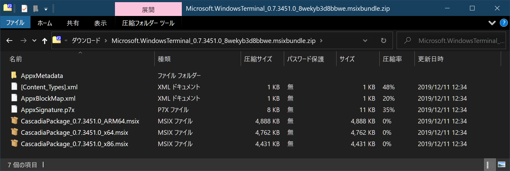

# .msixbundle ってなんだ？

[Microsoft の GitHub から Windows Terminal のプレリリース版を入手する](https://github.com/microsoft/terminal/releases)と、インストーラとして `.msixbundle` 形式のファイルが提供されていることがわかります。この見慣れない[^0] 拡張子はいったい何者なのでしょうか？

[^0]: 主観です

## MSIX パッケージ

前段として、MSIX パッケージに触れなければなりません。MSIX パッケージは Windows 10 v1809 から利用可能になった新しいインストーラ形式です。[^2]

[^2]: v1709 および v1803でもサポートされていますが、ダブルクリックからのインストールができない等の制約があります。また、`.msixbundle` 形式がサポートされていません。

以下にMicrosoft公式の説明を引用します：

> あらゆる Windows アプリに最新のパッケージ化エクスペリエンスを提供する Windows アプリ パッケージ形式です。 MSIX パッケージ形式では、Win32、WPF、および WinForm の各アプリに対して新たな、最新のパッケージ化および展開機能が有効になるだけでなく、既存のアプリ パッケージとインストール ファイルの機能が維持されます。 [^3]

[^3]: https://docs.microsoft.com/ja-jp/windows/msix/overview

具体的には、[MSIX Packaging Tool](https://www.microsoft.com/p/msix-packaging-tool/9n5lw3jbcxkf) を利用することで、 従来型の各種インストーラ( `.msi` 形式だけではなく、任意の実行形式ファイルやインストール用バッチファイルも含みます) を MSIX パッケージとして出力できます。

MSIX パッケージは Web 等を通じて自由に配布を行うことができるほか、Microsoft Store での配布が可能となります。適当な自家製インストールバッチにも電子署名を追加できたり、良い感じの GUI を付け加えたりできるのは嬉しいですね。[^0]

## MSIX パッケージのバンドル

`.msixbundle` は複数アーキテクチャ向けの MSIX パッケージを1つのファイルにバンドルしたものです。[^1] 

[^1]: 見た目からも明らかではありますが。

Windows 10 は複数のアーキテクチャ（x86、 x64 そして ARM）上で動作します。各アーキテクチャ向けのインストーラは別々の MSIX パッケージを用意しなければなりませんが、それらを MSIX パッケージバンドルにまとめることができます。`.msixbundle` の作成には Windows 10 SDK の [`MakeAppx.exe`](https://docs.microsoft.com/ja-jp/windows/msix/packaging-tool/bundle-msix-packages) を利用します。

`.msixbundle` ファイルの実態は Zip 形式のアーカイブであり、Zip ファイルとして取り扱うことでファイルの抽出を行うことができます。[^4]

[^4]: ただし暗号化が行われている場合、この限りではありません。

Windows Terminal の場合、3 アーキテクチャ向けの MSIX パッケージが 1 つの `.msixbundle` ファイルにバンドルされていたことがわかります。`.msixbundle` ファイルをダブルクリックして実行すると、環境に応じた `.msix` ファイルが呼び出されます。Microsoft Store に登録するファイルの数を減らすことができるほか、Web 上の配布についても、ユーザにアーキテクチャの違いを意識させないで済むメリットがあります。

## 参考リンク

* [MSIX ドキュメント](https://docs.microsoft.com/ja-jp/windows/msix/)
* [[DesktopBridge] 非UWP(WPF等)をパッケージする方法のまとめ](https://qiita.com/tera1707/items/78cdd03419b1f3cf707e)
