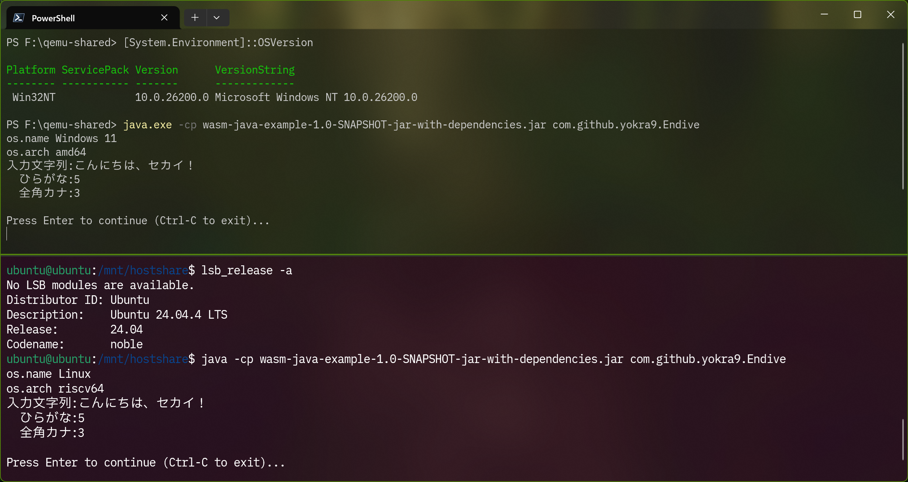
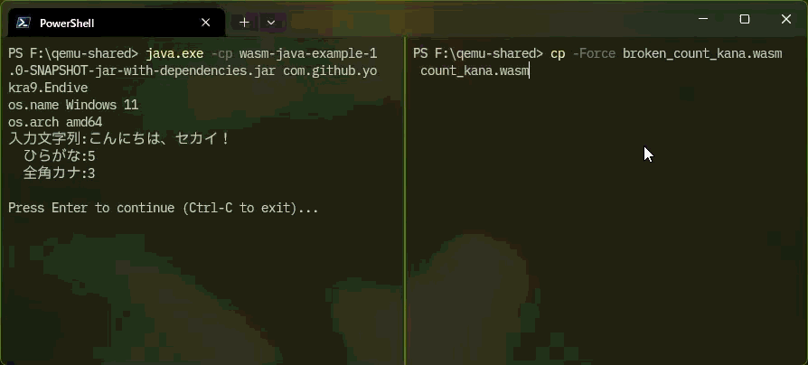
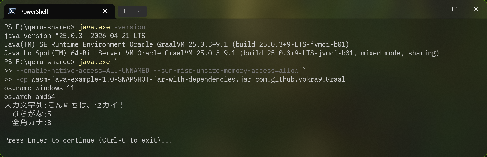
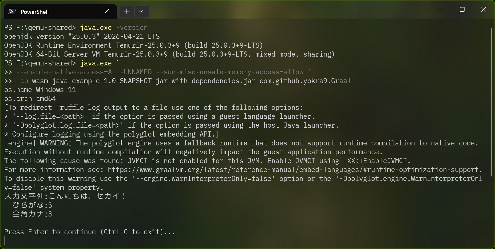
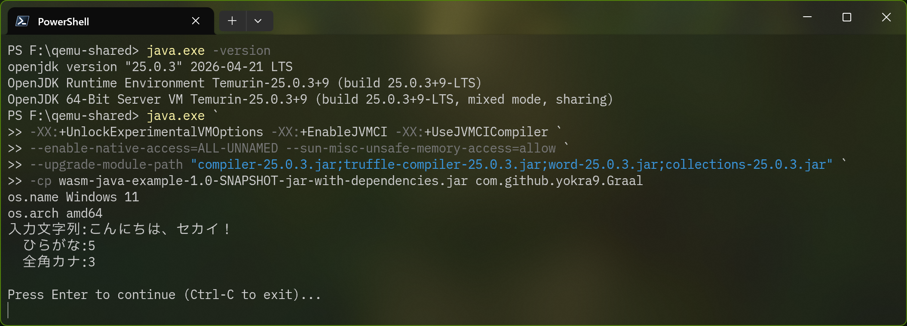
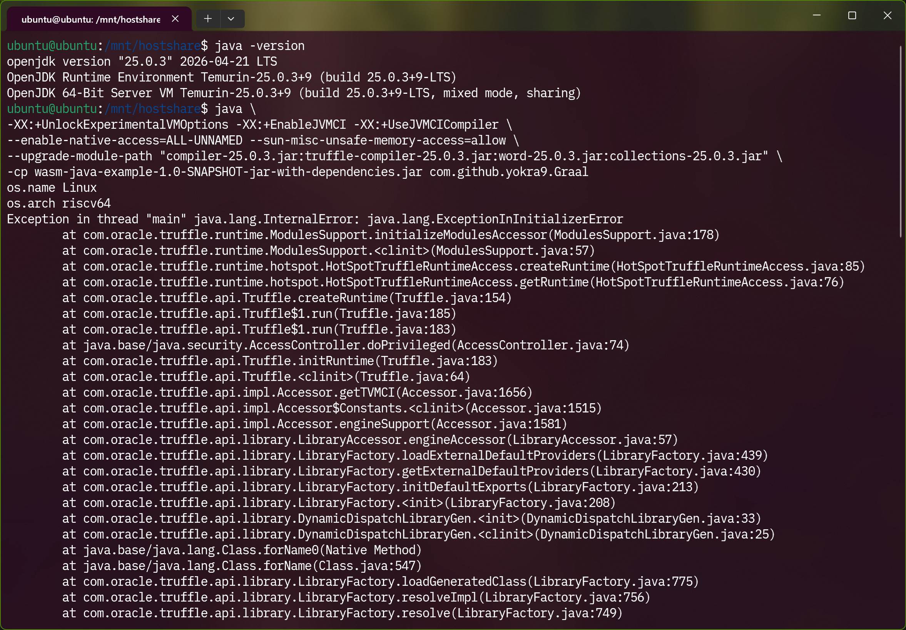
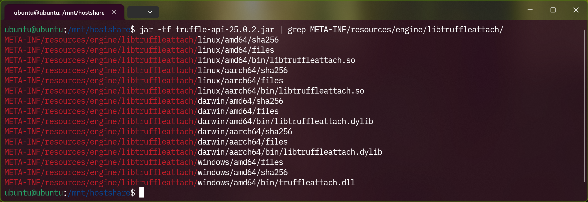

# 30 億のデバイスで走る JVM で WebAssembly も走らせる on RISC-V

以前の誰得記事キャンペーンで、私は [JVM on Ubuntu on QEMU for RISC-V on Ubuntu on WSL2 をやってみました](https://qiita.com/yokra9/items/46856d211e258a9244be) 。今回のテーマはさらにニッチに、**WebAssembly on JVM on Ubuntu on QEMU for RISC-V on Ubuntu on WSL2** をやってみる、です。

## WebAssembly on JVM の可能性

[WebAssembly](https://webassembly.org/) はその名に反して、Web（ブラウザ）のためだけの技術ではありません。[WASI](https://wasi.dev/) を代表として、WebAssembly をブラウザの外で活かす場所は様々あります。

有望な試みの 1 つは、プラグイン（ユーザー拡張）機能を持たせる際の実行エンジンとしての役割です。WebAssembly が持つ以下の特長はプラグインにぴったりです。

* マルチプラットフォーム対応
* メモリ安全でサンドボックス化された実行環境を持つ
* WebAssembly をサポートするあらゆる言語で記述可能

Java (JVM) のメリットとして「30 億のデバイスで走る」ポータビリティの高さがありますが、WebAssembly ならポータビリティを保ったまま安全にユーザのコードを実行できます。OpenJDK や Temurin は RISC-V をサポートしているので、うまくすれば WebAssembly 製のプラグインは JVM on RISC-V でも動くことになります。

さて、WebAssembly on JVM を実現する手段は大きく 2 種あります。Endive / Chicory と GraalWasm です。

## Endive / Chicory で WebAssembly on JVM

2026 年 5 月 26 日、Bytecode Alliance に [Endive](https://endive.run/) プロジェクトが参加しました。6 月 26 日に 1.0.0 がリリースされたばかりですが、フォーク元の [Chicory](https://github.com/dylibso/chicory) は 2024 年末には v1.0.0 に到達しており、最新は v1.7.5 です。

Java 関係のプロジェクト名はコーヒー関係を由来に持つものが多くありますが、[チコリー](https://ja.wikipedia.org/wiki/%E3%83%81%E3%82%B3%E3%83%AA%E3%83%BC)は代用コーヒーの原料として知られるキク科の野菜で、[エンダイブ](https://ja.wikipedia.org/wiki/%E3%82%A8%E3%83%B3%E3%83%80%E3%82%A4%E3%83%96)はその近縁種です。チコリーを混ぜたカフェオレはニューオーリンズ・スタイルとして人気ですから、Java に WebAssembly を混ぜるプロジェクトを Chicory と名付けるのはお洒落な発想ですよね。[^0]

[^0]: ちなみに私は[えらんで参加！アウトプット大会](https://qiita.com/tech-festa/2026#output-party)では`シャキッとコーヒー派`チームに参加しています。

Endive / Chicory は JVM 上でネイティブ依存なしに WebAssembly を実行できます。[実行モード](https://endive.run/docs/core/execution-modes)にもよりますが、動的なモジュール差し替えも可能でプラグイン用途に向いています。

導入は簡単で、Endive なら [run.endive:runtime](https://mvnrepository.com/artifact/run.endive/runtime) を依存に追加するだけです。

```xml:pom.xml
<dependency>
    <groupId>run.endive</groupId>
    <artifactId>runtime</artifactId>
    <version>${endive.version}</version>
</dependency>
```

実際に以下の Rust コードからコンパイルした WebAssembly を呼び出してみましょう。なお、サンプルコードの全文は[こちらのリポジトリ](https://github.com/yokra9/wasm-java-example)に掲載しています。

```rust:lib.rs
/// 文字種別のカウント結果を格納する構造体
/// # Fields
/// * `hiragana` - ひらがなの数
/// * `katakana` - 全角カナの数
#[repr(C)]
pub struct CharTypeCount {
    pub hiragana: i32,
    pub katakana: i32,
}

/// メモリを割り当てる関数
/// # Arguments
/// * `len` - 割り当てるメモリの長さ
/// # Returns
/// 割り当てたメモリのポインタ
#[unsafe(no_mangle)]
pub extern "C" fn alloc(len: i32) -> *mut u8 {
    let mut buf = Vec::with_capacity(len as usize);
    let ptr = buf.as_mut_ptr();
    // Rust にクリーンアップしないように指示する
    mem::forget(buf);
    ptr
}

/// メモリを解放する関数
/// # Arguments
/// * `ptr` - 解放するメモリのポインタ
/// * `len` - 解放するメモリの長さ
#[unsafe(no_mangle)]
pub extern "C" fn dealloc(ptr: *mut u8, len: i32) {
    // メモリを解放する
    let _ = unsafe { Vec::from_raw_parts(ptr, 0, len as usize) };
}

/// count_kana が返した CharTypeCount を解放する関数
/// # Arguments
/// * `ptr` - count_kana が返した CharTypeCount ポインタ
#[unsafe(no_mangle)]
pub extern "C" fn free_result(ptr: i32) {
    if ptr == 0 {
        return;
    }
    let _ = unsafe { Box::from_raw(ptr as *mut CharTypeCount) };
}

/// 文字列の文字種別をカウント
/// # Arguments
/// * `ptr` - 文字列データのメモリアドレス
/// * `len` - 文字列データのバイト数
/// # Returns
/// CharTypeCount 構造体へのポインタ（メモリ割り当て済み）
#[unsafe(no_mangle)]
pub extern "C" fn count_kana(ptr: i32, len: i32) -> i32 {
    let bytes = unsafe { slice::from_raw_parts(ptr as *const u8, len as usize) };
    let s = str::from_utf8(bytes).unwrap();

    let mut result = CharTypeCount {
        hiragana: 0,
        katakana: 0,
    };

    for ch in s.chars() {
        match ch as u32 {
            0x3040..=0x309F => result.hiragana += 1,
            0x30A0..=0x30FF => result.katakana += 1,
            _ => {}
        }
    }

    // 構造体をメモリに割り当て、ポインタを返す
    let boxed = Box::new(result);
    let ptr = Box::into_raw(boxed) as i32;
    ptr
}
```

```java:Endive.java
public class Endive {
    public static void main(String[] args) {
        System.out.println("os.name\t" + System.getProperty("os.name"));
        System.out.println("os.arch\t" + System.getProperty("os.arch"));

        try (Scanner scanner = new Scanner(System.in)) {
            while (true) {
                executeWasm();
                System.out.println("\nPress Enter to continue (Ctrl-C to exit)...");
                scanner.nextLine();
            }
        }
    }

    private static void executeWasm() {
        Instance instance = Instance.builder(Parser.parse(new File("count_kana.wasm"))).build();

        ExportFunction alloc = instance.export("alloc");
        ExportFunction dealloc = instance.export("dealloc");
        ExportFunction freeResult = instance.export("free_result");
        ExportFunction countCharTypes = instance.export("count_kana");

        Memory memory = instance.memory();

        String message = "こんにちは、セカイ！";
        byte[] messageBytes = message.getBytes(java.nio.charset.StandardCharsets.UTF_8);
        int len = messageBytes.length;

        // 文字列データをメモリに書き込む
        int ptr = (int) alloc.apply(len)[0];
        memory.write(ptr, messageBytes);

        // count_kana を呼び出し、結果の構造体ポインタを取得
        int resultPtr = (int) countCharTypes.apply(ptr, len)[0];

        // メモリから CharTypeCount 構造体のデータを読み取る
        // 構造体レイアウト：i32 x 2 (各フィールド 4 バイト)
        int hiragana = memory.readInt(resultPtr);
        int katakana = memory.readInt(resultPtr + 4);

        // 結果を表示
        System.out.println("入力文字列:" + message);
        System.out.println("  ひらがな:" + hiragana);
        System.out.println("  全角カナ:" + katakana);

        // メモリを解放
        dealloc.apply(ptr, len);
        freeResult.apply(resultPtr);
    }
}
```

この通り、Windows 11 on x64 と Ubuntu on RISC-V で同じ JAR + WebAssembly が動作します。



なるほど、30 億のデバイスで走ってくれそうですね。

なお、 `Press Enter to continue (Ctrl-C to exit)...` の表示中に WebAssembly を置換することで動的なモジュール差し替えを体験できます。



## GraalWasm で WebAssembly on JVM

[GraalWasm](https://www.graalvm.org/webassembly/) も JVM 上で WebAssembly を実行する手段です。言語実装フレームワークの [Truffle](https://www.graalvm.org/latest/graalvm-as-a-platform/language-implementation-framework/) で実装されており、[Polyglot API](https://www.graalvm.org/latest/reference-manual/polyglot-programming/) 経由で Java コードと相互運用できます。[^1]

[^1]: 他にも [JavaScript](https://www.graalvm.org/javascript/)、[Python](https://graalpy.org/)、[R](https://github.com/oracle/fastr)、[Ruby](https://truffleruby.dev/)、そして [Java 自身](https://www.graalvm.org/latest/reference-manual/espresso/) までもが Truffle 上で動きます。

こちらは [org.graalvm.polyglot:polyglot](https://mvnrepository.com/artifact/org.graalvm.polyglot/polyglot) と [org.graalvm.polyglot:wasm](https://mvnrepository.com/artifact/org.graalvm.polyglot/wasm) を依存に追加することで導入できます。

```xml:pom.xml
<dependency>
    <groupId>org.graalvm.polyglot</groupId>
    <artifactId>polyglot</artifactId>
    <version>${graalvm.version}</version>
</dependency>
<dependency>
    <groupId>org.graalvm.polyglot</groupId>
    <artifactId>wasm</artifactId>
    <version>${graalvm.version}</version>
    <type>pom</type>
</dependency>
```

GraalWasm では前掲の `count_kana.wasm` を以下のコードで呼び出せます。

```java:Graal.java
public class Graal {
    public static void main(String[] args) {
        System.out.println("os.name\t" + System.getProperty("os.name"));
        System.out.println("os.arch\t" + System.getProperty("os.arch"));
        try (Scanner scanner = new Scanner(System.in)) {
            while (true) {
                executeWasm();
                System.out.println("\nPress Enter to continue (Ctrl-C to exit)...");
                scanner.nextLine();
            }
        }
    }

    private static void executeWasm() {
        try (Context context = Context.create()) {
            File wasmFile = new File("count_kana.wasm");
            Value module = context.eval(Source.newBuilder("wasm", wasmFile).build());
            Value instance = module.newInstance();
            Value exports = instance.getMember("exports");

            Value alloc = exports.getMember("alloc");
            Value dealloc = exports.getMember("dealloc");
            Value countKana = exports.getMember("count_kana");
            Value freeResult = exports.getMember("free_result");
            Value memory = exports.getMember("memory");

            String message = "こんにちは、セカイ！";
            byte[] messageBytes = message.getBytes(java.nio.charset.StandardCharsets.UTF_8);
            int len = messageBytes.length;
            int ptr = alloc.execute(len).asInt();

            // メモリに文字列データを書き込む
            for (int i = 0; i < len; i++) {
                memory.setArrayElement((long) ptr + i, (int) messageBytes[i]);
            }

            int resultPtr = countKana.execute(ptr, len).asInt();

            // メモリから CharTypeCount 構造体のデータを読み取る
            // 構造体レイアウト：i32 x 2 (各フィールド 4 バイト)
            ByteBuffer buffer = ByteBuffer.allocate(8);
            buffer.order(ByteOrder.LITTLE_ENDIAN);

            for (int i = 0; i < 8; i++) {
                Value byteVal = memory.getArrayElement((long) resultPtr + i);
                buffer.put(i, (byte) byteVal.asInt());
            }

            int hiragana = buffer.getInt(0);
            int katakana = buffer.getInt(4);

            // 結果を表示
            System.out.println("入力文字列:" + message);
            System.out.println("  ひらがな:" + hiragana);
            System.out.println("  全角カナ:" + katakana);

            // メモリを解放
            dealloc.execute(ptr, len);
            freeResult.execute(resultPtr);
        } catch (Exception e) {
            e.printStackTrace();
        }
    }
}
```

GraalWasm はその名の通り [Oracle GraalVM](https://www.graalvm.org/) の関連プロジェクトですから、GraalVM 上で実行するのが素直です。



こちらも動的なモジュール差し替えが可能です。


GraalWasm は OpenJDK でも動作しますが、警告が表示されます。



[JEP 243: Java-Level JVM Compiler Interface](https://openjdk.org/jeps/243) で Graal コンパイラを指定しないと遅くなるぞ、という内容ですね。`-XX:+EnableJVMCI -XX:+UseJVMCICompiler` を付与し、`--upgrade-module-path` で Graal コンパイラと依存関係を指定するとなくなります。



RISC-V では GraalVM がサポートされていないので、Temurin で試してみましょう。



上記のオプションを指定した状態でも起動に失敗します。ここで、依存関係に含まれる [org.graalvm.truffle:truffle-api](https://mvnrepository.com/artifact/org.graalvm.truffle/truffle-api) を確認してみると、RISC-V 用のネイティブコードが含まれていないことがわかります。



## 比較とまとめ

ここまでに言及していない観点を含め、Endive / Chicory と GraalWasm を比較してみます。[^2]

| 項目 | Endive / Chicory | GraalWasm |
| --- | --- | --- |
| 開発開始 | 2023 年 9 月（Chicoryとして） | 2019 年 12 月（初公開） |
| ステータス | v1.0.0 到達（2026 年 6 月） | 安定版到達（2024 年 9 月、v24.1.0）[^4] |
| ライセンス | Apache License 2.0 | Universal Permissive License 1.0 [^5] |
| 主導 | Bytecode Alliance | Oracle |
| マルチプラットフォーム | 〇（ネイティブ依存なし、JVMのサポート範囲で動作） | △（GraalVMのサポート範囲で動作） |
| 動的なモジュール差し替え | △（実行モードによる） | 〇 |
| Java 関数の呼び出し | 〇 | △（GraalJS 経由[^6] [^7]） |
| Wasm GC | 〇[^3] | △（Experimental[^8]） |
| Exception Handling | 〇[^3] | △（Experimental[^8]） |
| Memory64 | 〇 | △（Experimental[^8]） |
| Multiple Memories | 〇[^3] | 〇[^8] |
| Threads | 〇[^3] | △（Experimental） |
| Fixed-width SIMD | 〇 | 〇 |
| Relaxed SIMD | × | 〇[^8] |
| Tail Call | 〇 | × |

[^2]: [Feature Status - WebAssembly](https://webassembly.org/features/?categories=standalones) に基づきますが、新たにサポートされた機能を修正しています。

[^3]: <https://github.com/bytecodealliance/endive#completed>

[^4]: <https://www.graalvm.org/release-notes/JDK_23/#graalwasm>

[^5]: Graal コンパイラは [GPLv2+CE](https://github.com/oracle/graal/blob/master/LICENSE) です。

[^6]: <https://2025.wasm.io/slides/the-future-of-write-once-run-anywhere-from-java-to-webassembly-wasmio25.pdf>

[^7]: <https://github.com/oracle/graal/blob/master/wasm/docs/user/GraalWasmAPIMigration.md#importing-host-functions>

[^8]: <https://github.com/oracle/graal/blob/master/wasm/CHANGELOG.md>

こうしてみると一長一短といったところでしょうか。ライセンスや対応プラットフォームの観点では Endive / Chicory の使い勝手が良さそうですが、GraalWasm の歴史の長さや Polyglot のエコシステムも魅力的です。

というわけで、`on RISC-V` こそニッチでしたが、2 系統の OSS が積極的に開発されるホットなジャンル、`JVM で WebAssembly も走らせる` をご紹介する記事でした。

## 参考リンク

* [Bytecode Alliance — Endive and the Next Chapter of WebAssembly on the JVM](https://bytecodealliance.org/articles/endive-and-the-next-chapter-of-webassembly-on-the-jvm)
* [Endive 1.0: WebAssembly on the JVM, Now a Bytecode Alliance Project | Endive](https://endive.run/blog/endive-1.0)
* [JVM native WebAssembly runtime | Endive](https://endive.run/)
* [bytecodealliance/endive: A JVM native WebAssembly runtime](https://github.com/bytecodealliance/endive)
* [dylibso/chicory: Native JVM WebAssembly runtime](https://github.com/dylibso/chicory)
* [Hello from Chicory | Chicory](https://chicory.dev/)
* [Graal/Truffleについて軽く | κeenのHappy Hacκing Blog](https://keens.github.io/blog/2017/12/13/graal_trufflenitsuitekaruku/)
* [GraalでJITコンパイルする - Fight the Future](https://www.sakatakoichi.com/entry/2017/11/24/193000)
* [Run GraalVM JavaScript on a Stock JDK](https://www.graalvm.org/22.3/reference-manual/js/RunOnJDK/)
* [Whether there are plans for risc-v architecture support？ · oracle/graal · Discussion #8657](https://github.com/oracle/graal/discussions/8657)
* [プラグイン実行エンジンとしてのWasm](https://qiita.com/inajob/items/2390a57ac83de8a342b4)
* [今さら聞けないMaven – Java24にしたら警告がでる | 豆蔵デベロッパーサイト](https://developer.mamezou-tech.com/blogs/2025/03/30/maven-java24-warning/)
