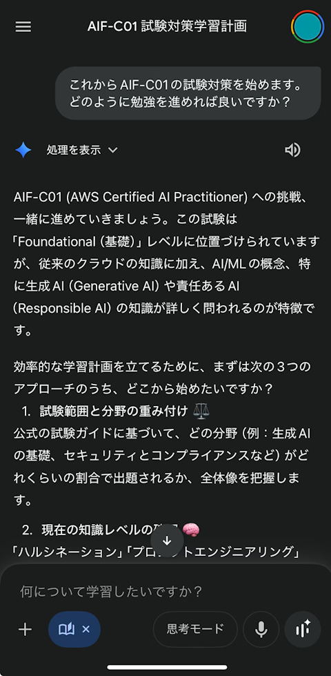
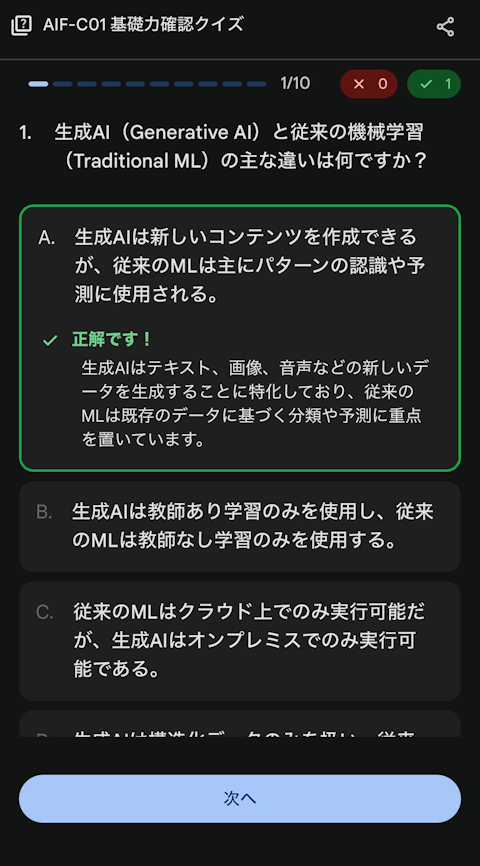

# AWS Certified AI Practitioner (AIF-C01) 合格体験記

AWS Certified AI Practitioner (AIF-C01) の合格体験記です。得点は 935 点でした。

## 所持資格と実務経験

メガクラウドそれぞれのアソシエイト資格ないしプロフェッショナル資格を所持しています：

* Google Cloud Certified: Associate Cloud Engineer
* Microsoft Certified: Azure Developer Associate (AZ-204)
* AWS Certified Solutions Architect - Professional (SAP-C02)
  * [合格体験記](https://qiita.com/yokra9/items/164299706d2a20b4b699)

実務で AWS は頻繁に触っていますが、AI 関連サービスを利活用する立場ではありません。受験対象者について[試験ガイド](https://d1.awsstatic.com/onedam/marketing-channels/website/aws/ja_JP/certification/approved/pdfs/docs-ai-practitioner/AWS-Certified-AI-Practitioner_Exam-Guide.pdf)はこう述べています：

> AWSの AI/MLテクノロジーに最大 6 か月間携わった経験を持つ方を対象としています。

そのため私は対象者の範囲外と言えますが、AWS の外では日常的に AI を活用していますので、まぁ AI Practitioner（AI 実践者）ではあると言ってもよいでしょう。[^1]

[^1]: [practitioner](https://en.wiktionary.org/wiki/practitioner) / [Practitioner](https://en.wikipedia.org/wiki/Practitioner) は「（法律や医療等の専門技術を要する事柄を）実践する人」であって、けして「初心者」という意味ではありません。

## 学習教材

筆者は Google AI Pro プランを契約しているため、2025 年 8 月 7 日より [Gemini の「ガイド付き学習」（Guided Learning）](https://blog.google/outreach-initiatives/education/guided-learning/) が利用できるようになりました。ちょうど AIF-C01 の取得を検討している時期でしたので、ものは試しと「ガイド付き学習」で学習を開始しました。せっかくこれから AI 実践者を名乗ろうとしているのですから、ね。

[^2]

[^2]: 画像は本記事を執筆する段階で参考のため取得したもので、8 月当時のものではありません。

このように、「ガイド付き学習」は自然言語を用いた対話で学びを深められるほか、必要に応じてインタラクティブなクイズまでその場で生成してくれます。正直に言うと、はじめて見た時には「ここまで勝手にできてしまうのか！」という感動がありました。これから勉強のスタイルも AI 活用如何で大きく変わっていくのだろうな、と思わされる機会となりました。

Gemini 先生の講義である程度の知識は身に付けられましたが、この分野の初心者である以上、その応答や設問が間違えていてもハルシネーションに気づくことができません。もっとオーガニックな問題集で対策を深めるべきと考え、別途模擬試験を受験することにしました。

## 模擬試験

試験には採点対象外の設問が 10 問含まれていることを踏まえ、模擬試験では 8 割以上取れるまで勉強を続けましたが、結果から見るとオーバーコミットでした。[^3]

[^3]: SAP-C02 のときも同じことを書いているので、筆者の性格であると考えられます。

### AWS 公式

* [Official Practice Question Set: AWS Certified AI Practitioner (AIF-C01 - 日本語)](https://skillbuilder.aws/learn/4URFGY63KV/official-practice-question-set-aws-certified-ai-practitioner--aifc01--/WEEPD3Z1VF)（￥0）
  * 20 問
  * 後述のサードパーティの模擬試験で知識を付けた後の最終確認として利用しました。

### サードパーティ

SAP-C02 の時と異なり、日本語の問題集が充実していたため助かりました。解説が不十分に感じたり、疑問を覚えた際は、適宜 Gemini 先生のお世話になり理解を深めていきました。

* [【AIF-C01】AWSトップ講師によるAWS認定AIプラクティショナー模擬試験問題集（4回分260問） | Udemy](https://www.udemy.com/course/aif-c01awsaws-certified-ai-practitioner/)（￥4,200）
  * 65 問 * 4
  * 最初に取り組んだ問題集です。難易度としても丁度よく、まずはここからトライでよいでしょう。
  * どの資格に取り組む時もそうですが、最初は難しく感じた問題集に帰ってきた時にサクサク回答できると、成長を実感しますよね。
* [AWS認定AI プラクティショナー (AIF-C01) 演習テスト（詳説付き） | Udemy](https://www.udemy.com/course/aws-ai-practitioner-aif-c01/)（￥2,600）
  * 65 問 * 4
* [AIF-C01 / AWS Certified AI Practitioner 対策テスト4回＋補足問題 | Udemy](https://www.udemy.com/course/aws-certified-ai-practitioner-certification-55-4)（￥2,600）
  * 65 問 * 4 + 40 問 + 39 問
* [演習テスト:AWS認定AIプラクティショナー (AIF-C01) | Udemy](https://www.udemy.com/course/practice-exams-aws-certified-ai-practitioner-jp/)（￥4,200）
  * 65 問 * 4
  * おなじみ Stephane Maarek 氏 による [[Practice Exams] AWS Certified AI Practitioner - AIF-C01](https://www.udemy.com/course/practice-exams-aws-certified-ai-practitioner/) の日本語版です。
  * 翻訳によるタイムラグのためかは不明ですが、やや情報が古い点も見受けられました。

いずれの問題集にも共通する「おすすめしたい理由」として、やはり**人間が商品として提供している教材である**、という点が挙げられます。前述したように、Gemini の「ガイド付き学習」や、他社サービスの類似機能を利用すれば問題集のようなものを生成してくれます。しかし、そこに「商品として教材を提供している」ことに対する人的な責任感はありません。普段のライトな調べもの等であれば生成 AI サービスのハルシネーション混じりな回答で事足りても、こと合否に関わる勉強となると、やはり人間の手によるものの方が安心できるのではないでしょうか。

## まとめ

以上、私が実践した学習方法や利用教材のご紹介でした。Gemini の「ガイド付き学習」はもちろん、Udemy 模擬試験も知識の定着と試験対策に役立ちました。これから AIF-C01 の取得を目指す方の参考になれば幸いです。

## 参考リンク

* [AWS Certified AI Practitioner (AIF-C01) 試験ガイド](https://d1.awsstatic.com/onedam/marketing-channels/website/aws/ja_JP/certification/approved/pdfs/docs-ai-practitioner/AWS-Certified-AI-Practitioner_Exam-Guide.pdf)
* [Guided Learning in Gemini: From answers to understanding](https://blog.google/outreach-initiatives/education/guided-learning/)