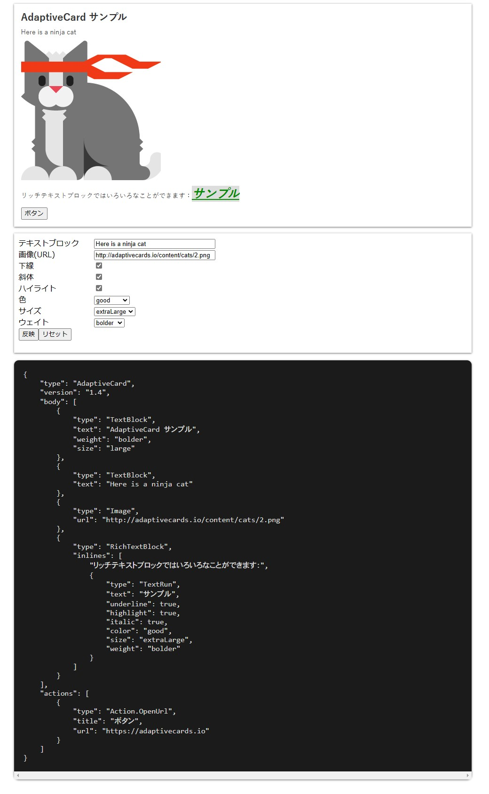

# Adaptive Cards を React で表示する

[Adaptive Cards](https://adaptivecards.io/) は JSON 形式でカード状の UI コンテンツを取り扱う仕様です。マイナーなフォーマットではありますが、[Microsoft Teams の WebHook](https://learn.microsoft.com/ja-jp/microsoftteams/platform/webhooks-and-connectors/how-to/connectors-using?tabs=cURL#send-adaptive-cards-using-an-incoming-webhook) でも採用されているので見覚えがある方もいらっしゃるのではないでしょうか。[^1]

[^1]: その他 Outlook の[アクション可能メッセージ](https://learn.microsoft.com/ja-jp/outlook/actionable-messages/)や Cortana さん、Windows タイムラインなどで利用可能ですが、いずれもメジャーになりきれなかったり廃止されたりしています。

Adaptive Cards は Microsoft が主導してはいますがオープンな仕様であり、各種プラットフォームにもライブラリが提供されています。本稿では React 向けのポートである [adaptivecards-react](https://www.npmjs.com/package/adaptivecards-react) をご紹介します。[^2]

[^2]: この他にはバニラ JS 用の [adaptivecards](https://www.npmjs.com/package/adaptivecards) や、サードパーティ製の Vue 2/3 向けポートである [adaptivecards-vue](https://www.npmjs.com/package/@madewithcards/adaptivecards-vue) が存在します。

## デモページ

実際に `adaptivecards-react` を利用したサンプルプロジェクトを用意してみました（React + TypeScript + Vite + SWC）。[^3]

[^3]: 完全に余談ですが、このデモの制作で Vite + SWC パターンを初体験しました。小規模プロジェクトとはいえ噂に違わぬ爆速さ！　で驚いてしまいました。また、GitHub Actions を利用した GitHub Pages へのデプロイもほぼコピー&ペーストで済むよう整備されており、開発者体験の良さが感じられました。今後のプロジェクトでも積極的に採用したいですね。



* [デモページ](https://yokra9.github.io/adaptivecards-react-example/)
* [レポジトリ](https://github.com/yokra9/adaptivecards-react-example)

見ていただければ分かるように、`adaptivecards-react` は React 上に要素を出力するところまでを担当しており、[Fluent UI](https://developer.microsoft.com/ja-jp/fluentui) に則ったデザインが適用されている訳ではありません。Adaptive Cards は配信先のアプリで周囲の環境に適応した UI へ変換されることを期待していますので、React プロジェクト側のスタイルに合わせれば良いでしょう。

## `adaptivecards-react` の使用方法

使用方法は非常に単純で、Adaptive Cards の JSON を `payload` 属性に、フォント等のコンフィグを `hostConfig` 属性に設定するだけです：

```html
<AdaptiveCard payload={card} hostConfig={hostConfig} />
```

注意点として、v1.1.1 時点で `peerDependencies` として `"react": "^17.0.2"` が指定されており、React 18 プロジェクトにはうまく導入できません。本稿の執筆動機は「Adaptive Cards ってオープンな仕様っぽいけど他にはどこで使われてるんだろ～？　おっ React でも使えるじゃん！　試してみよう」くらいのノリです。正式リリースが約一年前の React 18 に非対応となると、実プロジェクトでは採用を迷うべきでしょう。なお、本流の [adaptivecards](https://www.npmjs.com/package/adaptivecards) は継続的にメンテナンスされているようですので、Adaptive Cards を利用したい場合はこちらを使用できます。

## 参考リンク

* [Adaptive Cards](https://adaptivecards.io/)
* [パートナー](https://learn.microsoft.com/ja-jp/adaptive-cards/resources/partners)
* [Schema Explorer](https://adaptivecards.io/explorer/)
* [adaptivecards-react](https://www.npmjs.com/package/adaptivecards-react)
* [npm v7で`ERESOLVE unable to resolve dependency tree Could not resolve dependency:`](https://qiita.com/masato_makino/items/06011fcecc91be583636)
* [他人の Outlook に Adaprive Cards （Actionable Email）を送信する方法](https://qiita.com/MiyakeMito/items/5ffdf4224d179ba98556)
