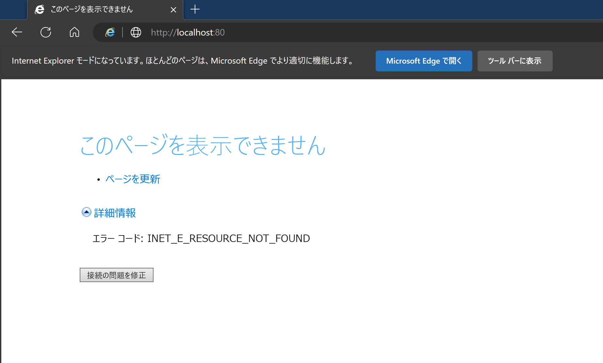
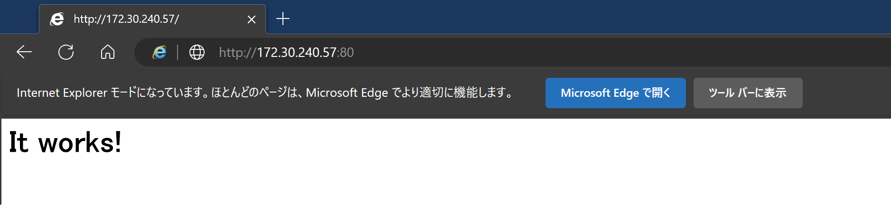

# Edge の IE モードで INET_E_RESOURCE_NOT_FOUND が発生して WSL2 上の Docker コンテナなどにアクセスできない時に読むページ

Edge の IE モードで WSL2（含 Docker コンテナ）にアクセスしようとすると、以下エラーとなってアクセスできないケースがあります。

```plaintext
エラー コード: INET_E_RESOURCE_NOT_FOUND
```

 [^1]

[^1]: 画像はイメージです。

Chrome や Firefox はもちろん IE モードでない Edge でも問題なくアクセスできるため、IE モードと WSL2、あるいは筆者の環境も合わせた複合要因で発生すると考えられます。[WSL 2 の GitHub レポジトリ](https://github.com/microsoft/WSL/issues?q=INET_E_RESOURCE_NOT_FOUND)にも Issue が見つからなかったので相当レアな状況の可能性もありますが、ワークアラウンドを発見できたので記事としました。[^2]

[^2]: 自分でも別環境では事象を再現できていないため情報不足と判断し、Issue は立てていません。

## WSL2 に IP アドレスで直接アクセスする

何やら名前解決に失敗しているらしいので、IP アドレスで直接アクセスしてしまえば解決です。

```powershell
# 既定のディストリビューションからIPアドレスを取得する
bash -c "ip -4 a show eth0 | grep -oP '(?<=inet\s)[0-9]{1,3}\.[0-9]{1,3}\.[0-9]{1,3}\.[0-9]{1,3}'"
```



同様の問題に関する情報が見つからない理由は、回避法が単純すぎたからでしょうか。とはいえ、誰かの役に立つ可能性に賭けてメモを残しておくことにします。

## 参考リンク

* [WSL2 上のアプリケーションに別ホストからアクセスする方法（管理者権限なし）](https://qiita.com/yokra9/items/cc81b2869ec1e9bda950)
* [grepの-oオプションと-Pオプションの組み合わせが便利](https://greymd.hatenablog.com/entry/2014/09/27/154305)
