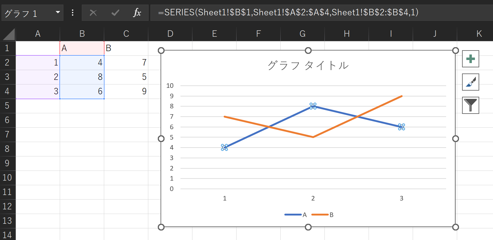

# Excel でグラフ範囲を自動的に更新する方法、あるいは SERIES は関数なのか

Excel でグラフ範囲を自動的に更新したいことってありますよね。ここでグラフの系列を選択すると、数式バーに `=SERIES()` という数式が表示されています。



この `=SERIES()` に対し動的に値を設定してあげたいということになります。しかし、`=SERIES()` のカッコ内に `OFFSET` などの関数をセットしても `その関数は正しくありません。` というエラーになってしまいます。


結論としては、[Microsoft Learn](https://learn.microsoft.com/ja-jp/office/troubleshoot/excel/defined-names-to-update-chart-range) の記事にある通り`名前の定義` 機能で参照範囲に名前を付け、それを `=SERIES()` に設定する必要があります。


## `=SERIES()` は Excel 関数なのか

ところで、この妙な制約がある `=SERIES()` は Excel 関数の一種なのでしょうか。少なくとも公式の [Excel 関数の一覧](https://support.microsoft.com/ja-jp/office/excel-%E9%96%A2%E6%95%B0-%E3%82%A2%E3%83%AB%E3%83%95%E3%82%A1%E3%83%99%E3%83%83%E3%83%88%E9%A0%86-b3944572-255d-4efb-bb96-c6d90033e188) には載っていません。もちろん、Excel VBA の [WorksheetFunction オブジェクト](https://learn.microsoft.com/ja-jp/office/vba/api/excel.worksheetfunction)から呼び出せるワークシート関数の一覧にもありません。

一方、Excel VBA のドキュメントには `Series オブジェクト` および関連する `SeriesCollection オブジェクト` が登場します。これらはグラフの系列を操作するときに参照するオブジェクトです。

```VisualBasic
Sub Change_Series()

    ActiveChart.SeriesCollection(1).Formula = "=SERIES(Sheet1!$B$1,Sheet1!$A$2:$A$4,Sheet1!$B$2:$B$4,1)"

End Sub
```

従って、系列の数式（Series Formula）が数式バーで表示・編集できるようになっているだけで、通常の関数とは異なるものという理解が良さそうです。ただ Microsoft の公式ドキュメントで明確にそう述べている箇所を見つけることはできず、[同様の解釈](https://peltiertech.com/chart-series-formula/)が [Microsoft Support Community](https://answers.microsoft.com/en-us/msoffice/forum/all/series-function/7cf3db58-c1da-427f-a2d2-9d8fadd43033) で紹介されていた程度です。もし真相をご存知の方がいらっしゃれば、コメント欄等でご教授いただけますと幸いです。

## 参考リンク

* [定義済みの名前を使用してグラフ範囲を自動的に更新する - Microsoft 365 Apps | Microsoft Learn](https://learn.microsoft.com/ja-jp/office/troubleshoot/excel/defined-names-to-update-chart-range)
* [グラフの参照範囲を自動的に変更する](http://www.officetanaka.net/excel/function/tips/tips71.htm)
* [Excel 関数 (アルファベット順) - Microsoft サポート](https://support.microsoft.com/ja-jp/office/excel-%E9%96%A2%E6%95%B0-%E3%82%A2%E3%83%AB%E3%83%95%E3%82%A1%E3%83%99%E3%83%83%E3%83%88%E9%A0%86-b3944572-255d-4efb-bb96-c6d90033e188)
* [WorksheetFunction オブジェクト (Excel) | Microsoft Learn](https://learn.microsoft.com/ja-jp/office/vba/api/excel.worksheetfunction)
* [How to use a macro to add labels to data points in an xy scatter chart or in a bubble chart in Excel - Microsoft Support](http://support.microsoft.com/en-us/kb/213750)
* [Series オブジェクト (Excel) | Microsoft Learn](https://learn.microsoft.com/ja-jp/office/vba/api/excel.series(object))
* [SeriesCollection オブジェクト (Excel) | Microsoft Learn](https://learn.microsoft.com/ja-jp/office/vba/api/excel.seriescollection)
* [The Excel Chart SERIES Formula - Peltier Tech](https://peltiertech.com/chart-series-formula/)
