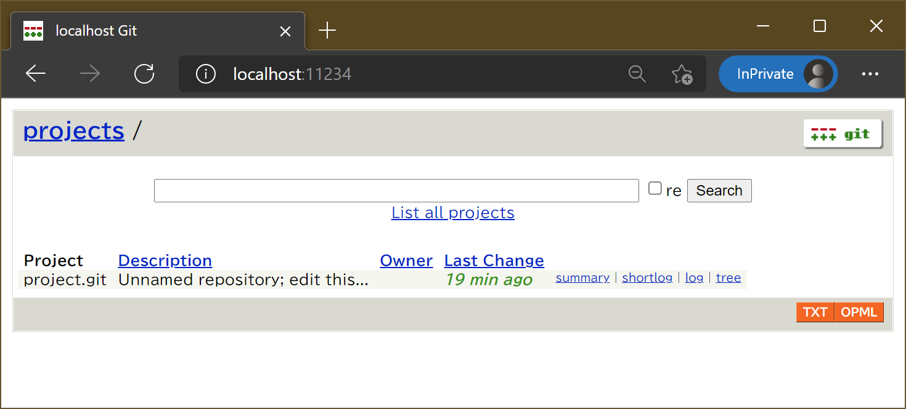

# Git packaged by Bitnami を使って Docker で Git サーバを立ててみる

多くの開発者がバージョン管理のために GitHub や GitLab などの Git ホスティングサービスを利用しています。何らかの事情でサービスを利用出来ない場合は、GitLab をセルフホストする方も多いでしょう。

とはいえ「うまく動いている既製品があるから」といって生の Git サーバに触らないまま大切なコードを預けているのも変な話なので、[Pro Git book](https://git-scm.com/book/ja/v2/Git%E3%82%B5%E3%83%BC%E3%83%90%E3%83%BC-%E3%83%97%E3%83%AD%E3%83%88%E3%82%B3%E3%83%AB) を読みながら構築してみることにしました。

## `Git packaged by Bitnami` とは

[Git packaged by Bitnami](https://bitnami.com/stack/git) は Git を Bitnami がパッケージ化したものです。Docker イメージの形式で提供されているので、依存関係を気にせず手軽に使い始めることができますね。

```bash
docker run --name git bitnami/git:latest git --version
```

Dockerfile のある Git リポジトリは[こちら](https://github.com/bitnami/bitnami-docker-git)です。

## コンテナを Git サーバに仕立てる

Pro Git book を見ながらインタラクティブに操作していきましょう。コンテナを立ち上げ、bash を起動します。このとき、SSH 接続用のポートと、Web UI 用のポートをフォワードしておきます。コンテナ外にデータを保持したい場合は、ボリュームやマウントの設定も追加してください。また、 bash が終了してもコンテナを稼働させたい場合は、コマンドを`tail -f /dev/null` に変更するなどしてください。

```bash
docker run -it --name git -p 10022:22 -p 11234:1234 bitnami/git:latest bash
```

続いて、[サーバーのセットアップ](https://git-scm.com/book/ja/v2/Git%E3%82%B5%E3%83%BC%E3%83%90%E3%83%BC-%E3%82%B5%E3%83%BC%E3%83%90%E3%83%BC%E3%81%AE%E3%82%BB%E3%83%83%E3%83%88%E3%82%A2%E3%83%83%E3%83%97)を行います。まず、`git` ユーザを作成します。

```bash
useradd -m git -s /bin/bash
```

`git` ユーザに SSH 経由で接続できるように設定します。

```bash
su git
cd ~
mkdir .ssh
chmod 700 .ssh
touch .ssh/authorized_keys
chmod 600 .ssh/authorized_keys
exit

# SSH デーモンを開始
/etc/init.d/ssh start
```

`/home/git/.ssh/authorized_keys` に公開鍵の情報を追記してください。Docker ホストから `ssh -p 10022 git@localhost` で接続できたら成功です。

次に、Git リポジトリを作成します。

```bash
su git
cd ~
mkdir <リポジトリ名>
cd <リポジトリ名>
git init --bare
exit
```

最後に、`git` ユーザのログインシェルを `git-shell` に変更します。SSH で好き勝手いじれないように制限する都合もありますが、Git 関連コマンドにパスを通す意味もあります。

```bash
chsh git -s /opt/bitnami/git/bin/git-shell

# git ユーザで bash 操作が必要なときは sudo で立ち上げる
sudo -u git bash
```

あとはお手元のリポジトリで remote として追加するだけで使い始めることができます！ `git` コマンドに SSH 用のポートを指定するには、以下のように設定します：

```bash
git remote add <リモート名> ssh://git@localhost:10022/~/<リポジトリ名>
```

## GitWeb (Web UI) を表示する

[GitWeb](https://git-scm.com/book/ja/v2/Git%E3%82%B5%E3%83%BC%E3%83%90%E3%83%BC-GitWeb) は Git に標準で付属する Web UI です。Git サーバとして使うなら最低限ほしいところなので、表示できるようにしておきましょう。

```bash
# instaweb の依存を追加します
apt update
apt install -y lighttpd libcgi-pm-perl gamin
# ゴミ掃除（任意）
apt clean -y
rm -rf /var/lib/apt/lists/*

cd /home/git/<リポジトリ名>
sudo -u git git instaweb
```

Port 1234 のフォワード先にアクセスすると、GitWebが表示されます。



## 参考リンク

* [Pro Git book](https://git-scm.com/book/ja/v2/)
* [git instaweb fails with "500 - Internal Server Error" #4871](https://github.com/microsoft/WSL/issues/4871)
