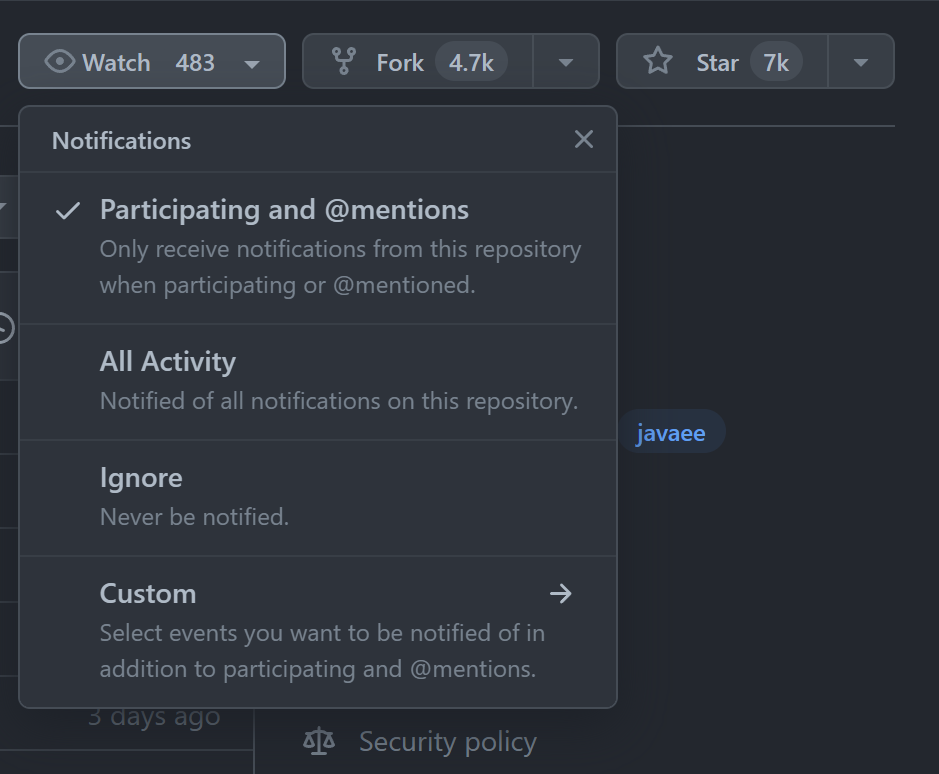
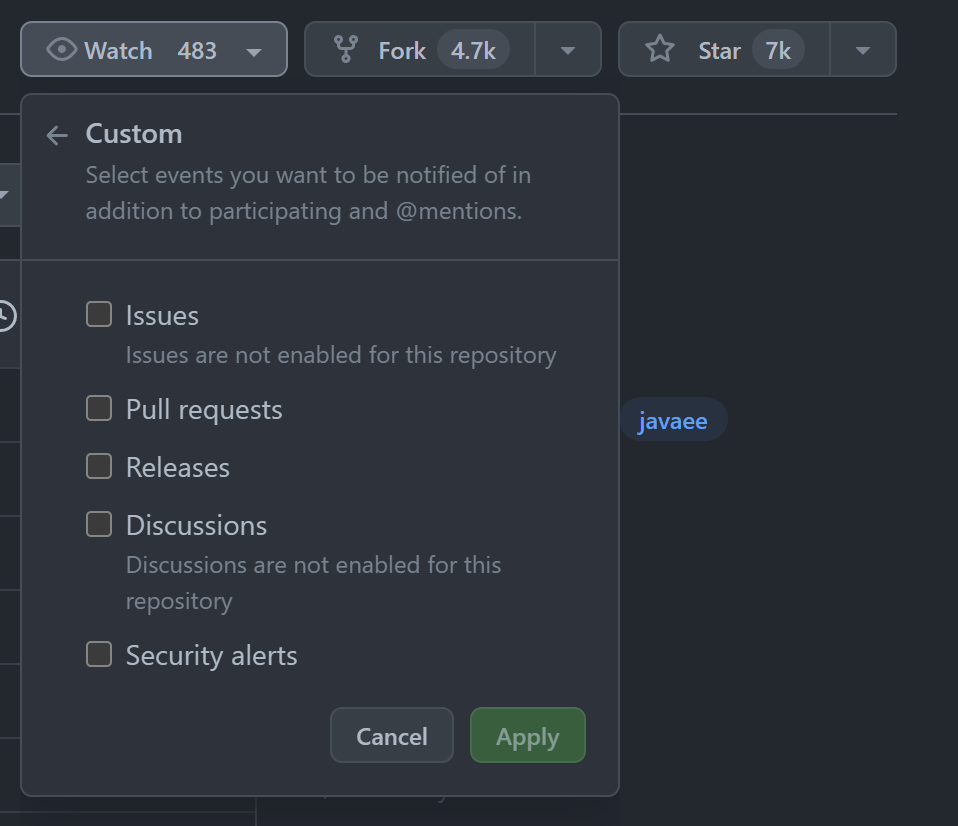

# GitHub の Watch 機能ではタグの更新をウォッチできないので RSS フィードを購読してみる

GitHub の [Watch 機能](https://docs.github.com/ja/account-and-profile/managing-subscriptions-and-notifications-on-github/setting-up-notifications/configuring-notifications)、便利ですよね。関心のあるリポジトリを Watch しておくと、Issue や PR、Release が作成された際などに GitHub から通知を受け取れます。





私は GitHub 上でホストされている各種 OSS のリリース通知を受け取るため Release の Watch を活用しています。GitHub の Notifications にリリース情報を集約できてスッキリしますし、プッシュ通知を受け取れるので巡回の手間も省けます。

しかし、全てのプロジェクトで Release が活用されているわけではありません。例えば、[Apache Tomcat の Git レポジトリ](https://github.com/apache/tomcat) は GitHub 上でホストされていますが、[Release](https://github.com/apache/tomcat/releases) ページには内容がありません。一方、リリースごとにタグは切られているため、[Tags](https://github.com/apache/tomcat/tags) ページを見ると新着リリースを確認できます。[^1] そうなると Watch 機能でタグが切られたことを通知させたいところですが、2023 年 10 月現在では設定できないようです。どうにか手間をかけずにタグ作成を通知させられないものか。

[^1]: もちろん [Tomcat 公式サイト](https://tomcat.apache.org/)のニュースが一番の情報源です。

## Tags の RSS フィードを購読する

かつて更新情報の取得といえば RSS フィードがメジャーでしたよね。SNS の普及で RSS フィードの影は薄くなる一方の感がありましたが、X(旧 Twitter)の雲行きが怪しくなるにつけ、昔ながらの方式に注目が集まりつつある気がします。[^2]

[^2]: 個人の感想です。

実は GitHub 上にリポジトリがあるなら、特別なことをしなくても Atom 形式でタグの更新情報が配信されています。`apache/tomcat` リポジトリなら、フィードの URL は <https://github.com/apache/tomcat/tags.atom> となります：

```xml:tags.atom
<?xml version="1.0" encoding="UTF-8"?>
<feed xmlns="http://www.w3.org/2005/Atom" xmlns:media="http://search.yahoo.com/mrss/" xml:lang="en-US">
  <id>tag:github.com,2008:https://github.com/apache/tomcat/releases</id>
  <link type="text/html" rel="alternate" href="https://github.com/apache/tomcat/releases"/>
  <link type="application/atom+xml" rel="self" href="https://github.com/apache/tomcat/releases.atom"/>
  <title>Tags from tomcat</title>
  <updated>2023-10-12T09:21:18+09:00</updated>
  <entry>
    <id>tag:github.com,2008:Repository/2493904/10.1.15</id>
    <updated>2023-10-12T09:21:18+09:00</updated>
    <link rel="alternate" type="text/html" href="https://github.com/apache/tomcat/releases/tag/10.1.15"/>
    <title>10.1.15</title>
    <content></content>
  </entry>
  ...
</feed>
```

同様にリリース情報のフィード( <https://github.com/apache/tomcat/releases.atom> )も購読可能です：

```xml:releases.atom
<?xml version="1.0" encoding="UTF-8"?>
<feed xmlns="http://www.w3.org/2005/Atom" xmlns:media="http://search.yahoo.com/mrss/" xml:lang="en-US">
  <id>tag:github.com,2008:https://github.com/apache/tomcat/releases</id>
  <link type="text/html" rel="alternate" href="https://github.com/apache/tomcat/releases"/>
  <link type="application/atom+xml" rel="self" href="https://github.com/apache/tomcat/releases.atom"/>
  <title>Release notes from tomcat</title>
  <updated>2023-10-12T09:21:18+09:00</updated>
  <entry>
    <id>tag:github.com,2008:Repository/2493904/10.1.15</id>
    <updated>2023-10-12T09:21:18+09:00</updated>
    <link rel="alternate" type="text/html" href="https://github.com/apache/tomcat/releases/tag/10.1.15"/>
    <title>10.1.15</title>
    <content type="html">&lt;p&gt;Tag 10.1.15&lt;/p&gt;</content>
    <author><name>unknown</name></author>
  </entry>
  ...
</feed>
```

あとは RSS フィードからプッシュ通知を受け取れるように環境を整備するだけです。 [Slack に RSS フィードを追加](https://slack.com/intl/ja-jp/help/articles/218688467-Slack-%E3%81%AB-RSS-%E3%83%95%E3%82%A3%E3%83%BC%E3%83%89%E3%82%92%E8%BF%BD%E5%8A%A0%E3%81%99%E3%82%8B)したり [Outlook から RSS フィード を購読したり](https://support.microsoft.com/ja-jp/office/rss-%E3%83%95%E3%82%A3%E3%83%BC%E3%83%89%E3%82%92%E8%B3%BC%E8%AA%AD%E3%81%99%E3%82%8B-73c6e717-7815-4594-98e5-81fa369e951c)お好みの方法を選びましょう。

## 参考リンク

* [通知を設定する - GitHub Docs](https://docs.github.com/ja/account-and-profile/managing-subscriptions-and-notifications-on-github/setting-up-notifications/configuring-notifications)
* [Github上のリリースを見逃さない](https://qiita.com/takecy/items/690cf140ce2eddacee56)
* [Slack に RSS フィードを追加する](https://slack.com/intl/ja-jp/help/articles/218688467-Slack-%E3%81%AB-RSS-%E3%83%95%E3%82%A3%E3%83%BC%E3%83%89%E3%82%92%E8%BF%BD%E5%8A%A0%E3%81%99%E3%82%8B)
* [RSS フィードを購読する - Microsoft サポート](https://support.microsoft.com/ja-jp/office/rss-%E3%83%95%E3%82%A3%E3%83%BC%E3%83%89%E3%82%92%E8%B3%BC%E8%AA%AD%E3%81%99%E3%82%8B-73c6e717-7815-4594-98e5-81fa369e951c)
