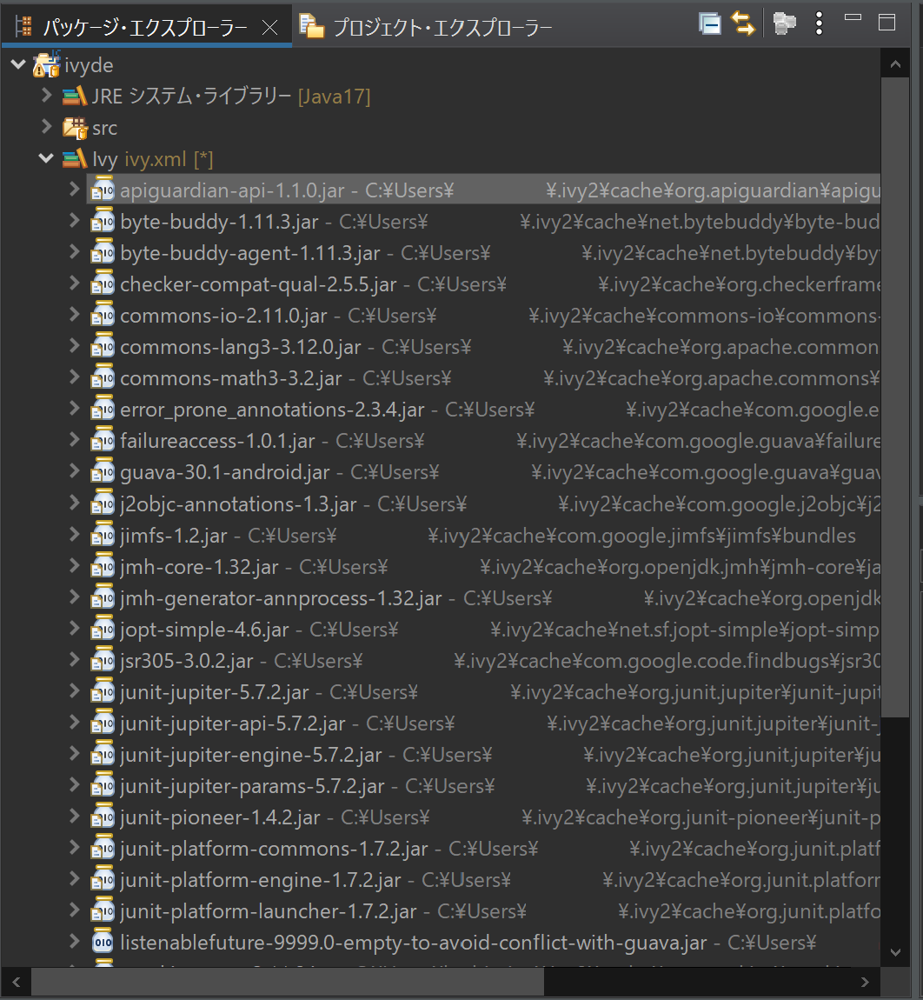
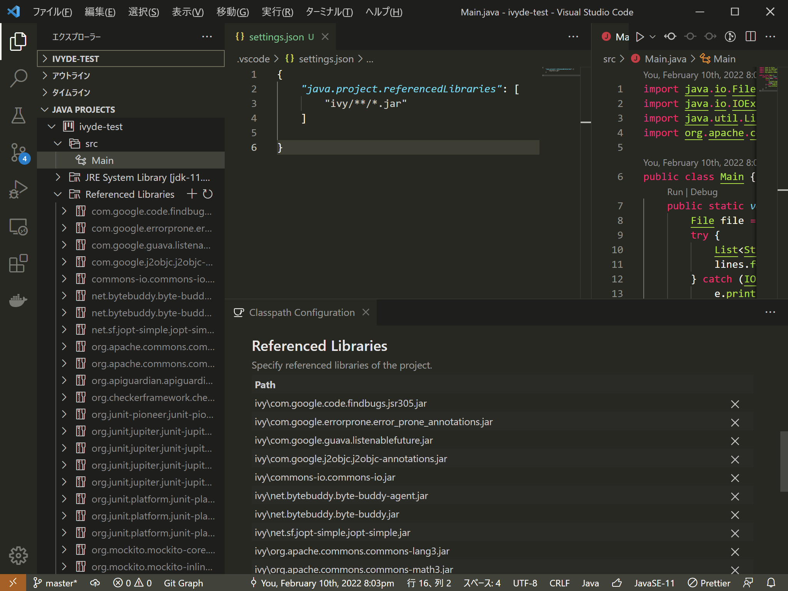

# IvyDE で追加したライブラリが VSCode の Project Manager for Java に認識されない

[IvyDE](https://ant.apache.org/ivy/ivyde/) は Eclipse 用の拡張機能で、[Apache Ivy](https://ant.apache.org/ivy/) で管理している依存ライブラリを Eclipse のクラスパス管理に統合します。Ivy 管理下の JAR ファイルへのパスを `.classpath` に直接記載していると、ライブラリの更新等でファイル名が変わった際にエラーが発生します。しかし、IvyDE でクラスパスコンテナを作成している場合、自動的にクラスパスの情報が変更されるためエラーになりません。



一方、[Extension Pack for Java](https://github.com/Microsoft/vscode-java-pack) は VSCode 用の拡張機能パックです。
VSCode 上で Java コードに対する IntelliSense、デバッグ、テストが実行できるほか、プロジェクトの管理（Maven / Gradle / アンマネージド）も可能です。[^1]

[^1]: 実体としては[Project Manager for Java](https://github.com/Microsoft/vscode-java-dependency)がプロジェクトの管理を担当しています。

 [^2]

[^2]: https://github.com/Microsoft/vscode-java-dependency

IvyDE でライブラリを追加したプロジェクトを VSCode で開くと、それらのライブラリを認識せずエラーが表示されます。IvyDE は Eclipse 用の拡張機能ですから、当然といえば当然です。

## IvyDE で追加したライブラリが Extension Pack for Java に認識されない理由

`.classpath` ファイルを確認するとわかります。`java.configuration.checkProjectSettingsExclusions` が `true` の場合（デフォルト）、左ペインでは見つからないため、エクスプローラから開いてください。以下のような記載があるはずです：

```xml
<classpathentry kind="con" path="org.apache.ivyde.eclipse.cpcontainer.IVYDE_CONTAINER/?project=ivyde-test&amp;ivyXmlPath=ivy.xml&amp;confs=*"/>
```

通常の JAR ファイルをクラスパスに追加するには `kind="lib"` として記載しますが、IvyDE で追加した依存は `kind="con"` 、すなわち[クラスパスコンテナ](https://help.eclipse.org/latest/index.jsp?topic=/org.eclipse.jdt.doc.isv/reference/api/org/eclipse/jdt/core/IClasspathContainer.html)として記載されています。いまのところ、Extension Pack for Java は IvyDE クラスパスコンテナ内の JAR を参照してくれないようです。

## 対処法

シンプルに `.classpath` を編集する方法もありますが、あまり便利ではないのでお勧めできません。せっかくなので、Extension Pack for Java の機能を活用しましょう。

Extension Pack for Java は、現在開いているプロジェクトがアンマネージドであると認識した場合、`settings.json` でクラスパスを通すことができます：

```jsonc
"java.project.referencedLibraries": [
    "ivy/**/*.jar", // デフォルト値は "lib/**/*.jar" です
]
```



`Referenced Libraries` 右隣の + マークからは JAR を個別に追加できます。しかし、 `settings.json` では [glob パターン](https://ja.wikipedia.org/wiki/%E3%82%B0%E3%83%AD%E3%83%96)が使えますので、 `ivy:retrieve` の `pattern` とすり合わせることで IvyDE の使い勝手に寄せられます。

`.project` があるとマネージドであると認識されてしまいますが、一時的に削除やリネームすればアンマネージド扱いになります。引き続きエラーが表示される場合は、`Clean Workspace` とファイルの開きなおしで解決する場合があります。

## 参考リンク

* [How to add referenced library JAR files using relative path for eclipse Java project in vscode](https://stackoverflow.com/questions/69216059/how-to-add-referenced-library-jar-files-using-relative-path-for-eclipse-java-pro)
* [Add java.project.referencedLibraries setting #1196](https://github.com/redhat-developer/vscode-java/pull/1196)
