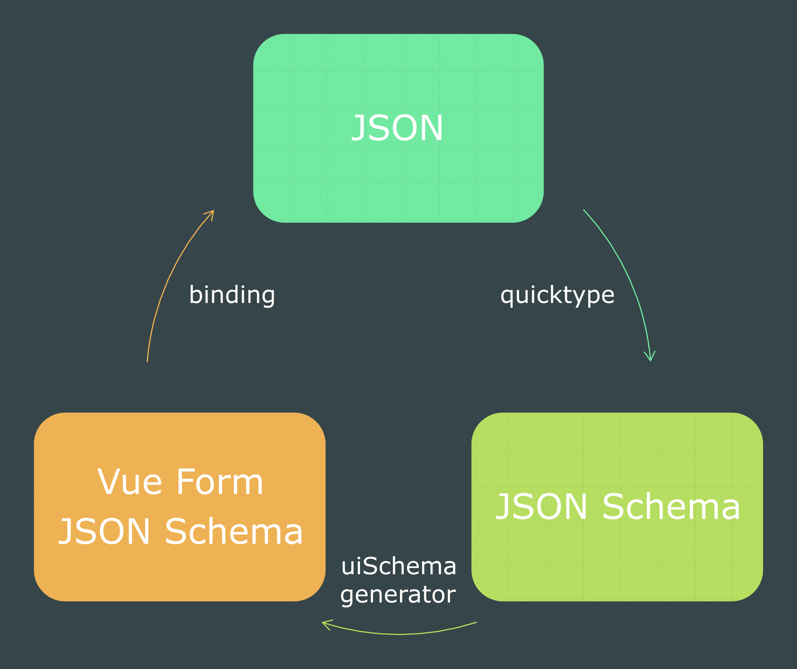
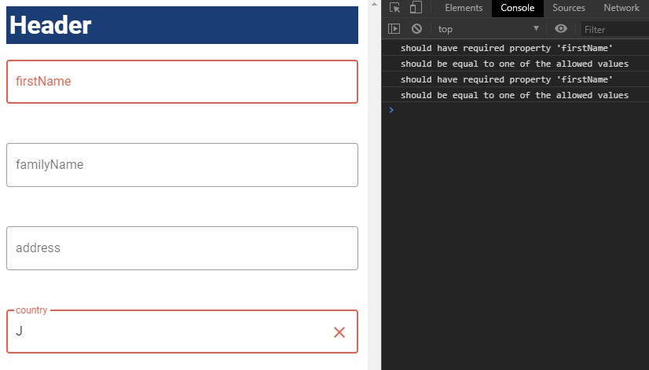
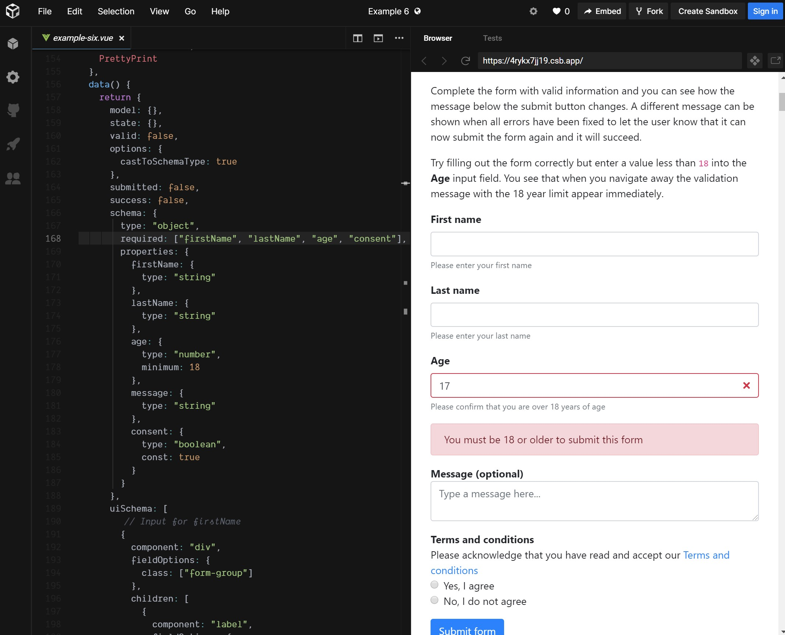

# JSON Schema で楽して良い感じの設定画面を作ろう！　～ Vue.js 編 ～

## TL;DR

モデルとなる JSON から JSON Schema を半自動的に生成し、JSON Schema から Vue.js のフォームを半自動的に生成し、Vue.js のフォームのモデルとモデルの JSON が等価な状態をめざせるようになります。



加えて、JSON Schema を元にしたフォームバリデーションも行えるようになります。



## はじめよう！　JSON Schema

[JSON Schema](https://json-schema.org/) は JSON 形式のドキュメントにアノテーションとバリデーションの仕組みを与えるスキーマ言語です。近年では設定ファイルなどで利用されることも多い JSON ですが、[JSON にはコメントを書くことができません。](https://qiita.com/yokra9/items/1ac03876415d7fd47a65) そのため、JSON Schema による補完が魅力的な選択肢になりえます。

[LoopBack 3](https://loopback.io/doc/en/lb3/index.html) を例に考えてみましょう。LoopBack は IBM の提供する Node.js フレームワークで、JSON ファイルで定義することで REST API を手軽に構築できます。ここでは、[簡単なモデル定義の例](https://loopback.io/doc/en/lb3/Model-definition-JSON-file.html)を表します：

```json:customer.json
{
    "name": "Customer",
    "idInjection": false,
    "http": {
        "path": "/foo/bar"
    }
}
```

LoopBack ではこのように JSON ファイルを利用してモデル定義を記述します。JSON による記述はわかりやすくていいですよね。しかし、コメントがないため、どのように設定を記述すればいいのかわかりません。たとえば、どのようなプロパティが利用可能なのか、型が何であるのか、必須項目はあるのか、といった情報がないのです。もちろんリファレンスを参照すればいいのですが、できれば入力画面そのものが教えてくれたほうがありがたいですよね。そこで、[LoopBack 3 JSON Schemas](https://github.com/Sequoia/loopback-json-schemas) という JSON Schema が提供されているので試してみましょう。JSON Schema を利用したい場合、以下のような記述を行います：

```json:customer.json
{
    "$schema": "https://raw.githubusercontent.com/Sequoia/loopback-json-schemas/master/dist/loopback-model-definition.json"
}
```

`$schema` プロパティの値として、JSON Schema ファイルの場所を指定します。これは URL でもローカルファイルでも構いません。JSON Schema に対応したエディタを利用している場合、編集中の文書に機能が動作します。Visual Stadio Code[^1] で編集してみましょう：


[^1]: [Palenight](https://marketplace.visualstudio.com/items?itemName=whizkydee.material-palenight-theme) テーマを利用しています🦄かわいいね

キー名のサジェストやバリデーション（型、必須）などの機能が働いていることがわかります。これで設定ミスを未然に防ぐことができますね！

自分で JSON Schema を作成する場合は、[Quicktype](https://github.com/quicktype/quicktype)を利用して JSON から半自動生成する手法が大変便利です。Quicktype については[QuicktypeでJSON Schemaを簡単に生成し、型安全な最高の開発体験を得た話](https://qiita.com/kentrino/items/a7ab8b56c8dbcf963ba4)が参考になります。

## Vue Form JSON Schema で設定インタフェースを作る

本題です。せっかく設定ファイルのスキーマを用意したなら、それをフロントエンドの設定インタフェース設計にも流用したくなることもあるでしょう。つまり、JSON Schema を元に HTML 等で設定インタフェースを生成し、その画面で入力された設定を JSON として返却してほしい、というアイデアです。 著名なものとして [JSON Editor](https://github.com/json-editor/json-editor) というライブラリがあります。[こちらのデモページ](https://json-editor.github.io/json-editor/)がその強力さをよく表しています。コードの記述量を減らすことができ、とても素敵ですね！


（出典：https://github.com/json-editor/json-editor）

さて、JSON Editor は生の DOM を操作するので Vue.js を利用したアプリケーションとは相性がよくありません。また、フォーム部品として [Vuetify](https://vuetifyjs.com/) のような Vue コンポーネントを利用したい場合もあるでしょう。そのため、[Vue Form JSON Schema](https://github.com/jarvelov/vue-form-json-schema) という専用のライブラリ（Vue コンポーネント）を利用します。


（出典：https://codesandbox.io/s/4rykx7jj19）

Vue Form JSON Schema は[公式リファレンス](https://jarvelov.gitbook.io/vue-form-json-schema/)と[デモページ](https://github.com/jarvelov/vue-form-json-schema#demo)が大変充実しています。そのため本記事で詳しい説明は避けますが、触りとして Readme 付属の使用例の参考訳を示します：

```vue
<template>
    <vue-form-json-schema
      v-model="model"
      :schema="schema"
      :ui-schema="uiSchema"
    >
  </vue-form-json-schema>
</template>

<script>
  export default {
    data() {
      return {
        // フォームの値を保持するオブジェクト
        model: {},
        // JSON Schema として正しいオブジェクト
        // 訳注）一般に #/definitions/Schema に記述する箇所を抜き出します。
        schema: {
          type: 'object',
          properties: {
            firstName: {
              type: 'string',
            },
          },
        },
        // HTML 要素、または Vue Component の配列
        uiSchema: [{
          component: 'input',
          model: 'firstName',
          // Vue.js の[描画関数](https://jp.vuejs.org/v2/guide/render-function.html) と同じ API
          // 訳注）createElement() の引数 Object と同形式（データオブジェクト）であることを表しています。
          fieldOptions: {
            class: ['form-control'],
            on: ['input'],
            attrs: {
              placeholder: 'Please enter your first name',
            },
          },
        }],
      };
    }
  };
</script>
```

JSON Schema のほかに uiSchema という画面定義用のスキーマを持つのが特徴です。コンポーネントと JSON Schema のプロパティを **1:1** で対応させることで、クラスやスタイルなどを柔軟に適用することが可能になっています。また、[ajv](https://github.com/epoberezkin/ajv) を利用した高度なバリデーション機能を備えているほか、[ajv-i18n](https://github.com/epoberezkin/ajv-i18n) による国際化対応も可能です。

## ui-schema-generator のご紹介

Vue Form JSON Schema は非常に便利なライブラリですが、コンポーネントと JSON Schema のプロパティを **1:1** で対応させなければならないという仕様上、設定項目が増えれば増えるほど uiSchema の記述が冗長になってしまうという欠点があります。たとえば、上記スクリーンショットの画面を構成している uiSchema は以下のようになっています：

<details><summary>サンプルコード（出典：https://4rykx7jj19.codesandbox.io/）</summary><div>

```
[
  {
    "component": "div",
    "fieldOptions": {
      "class": [
        "form-group"
      ]
    },
    "children": [
      {
        "component": "label",
        "fieldOptions": {
          "attrs": {
            "for": "first-name"
          },
          "class": [
            "font-weight-bold"
          ],
          "domProps": {
            "innerHTML": "First name"
          }
        }
      },
      {
        "component": "input",
        "model": "firstName",
        "errorOptions": {
          "class": [
            "is-invalid"
          ]
        },
        "fieldOptions": {
          "attrs": {
            "id": "first-name"
          },
          "class": [
            "form-control"
          ],
          "on": [
            "input"
          ]
        }
      },
      {
        "component": "small",
        "fieldOptions": {
          "class": [
            "text-muted"
          ],
          "domProps": {
            "innerHTML": "Please enter your first name"
          }
        }
      }
    ]
  },
  {
    "component": "transition",
    "fieldOptions": {
      "props": {
        "name": "fade"
      }
    },
    "children": [
      {
        "component": "div",
        "model": "firstName",
        "errorHandler": true,
        "displayOptions": {
          "model": "firstName",
          "schema": {
            "not": {
              "type": "string"
            }
          }
        },
        "fieldOptions": {
          "class": [
            "alert alert-danger"
          ]
        },
        "children": [
          {
            "component": "div",
            "fieldOptions": {
              "domProps": {
                "innerHTML": "This field is required"
              }
            }
          }
        ]
      }
    ]
  },
  {
    "component": "div",
    "fieldOptions": {
      "class": [
        "form-group"
      ]
    },
    "children": [
      {
        "component": "label",
        "fieldOptions": {
          "attrs": {
            "for": "last-name"
          },
          "class": [
            "font-weight-bold"
          ],
          "domProps": {
            "innerHTML": "Last name"
          }
        }
      },
      {
        "component": "input",
        "model": "lastName",
        "errorOptions": {
          "class": [
            "is-invalid"
          ]
        },
        "fieldOptions": {
          "attrs": {
            "id": "last-name"
          },
          "class": [
            "form-control"
          ],
          "on": [
            "input"
          ]
        }
      },
      {
        "component": "small",
        "fieldOptions": {
          "class": [
            "text-muted"
          ],
          "domProps": {
            "innerHTML": "Please enter your last name"
          }
        }
      }
    ]
  },
  {
    "component": "transition",
    "fieldOptions": {
      "props": {
        "name": "fade"
      }
    },
    "children": [
      {
        "component": "div",
        "model": "lastName",
        "errorHandler": true,
        "displayOptions": {
          "model": "lastName",
          "schema": {
            "not": {
              "type": "string"
            }
          }
        },
        "fieldOptions": {
          "class": [
            "alert alert-danger"
          ]
        },
        "children": [
          {
            "component": "div",
            "fieldOptions": {
              "domProps": {
                "innerHTML": "This field is required"
              }
            }
          }
        ]
      }
    ]
  },
  {
    "component": "div",
    "fieldOptions": {
      "class": [
        "form-group"
      ]
    },
    "children": [
      {
        "component": "label",
        "fieldOptions": {
          "attrs": {
            "for": "age"
          },
          "class": [
            "font-weight-bold"
          ],
          "domProps": {
            "innerHTML": "Age"
          }
        }
      },
      {
        "component": "input",
        "model": "age",
        "errorOptions": {
          "class": [
            "is-invalid"
          ]
        },
        "fieldOptions": {
          "attrs": {
            "id": "age",
            "type": "number",
            "min": 0
          },
          "class": [
            "form-control"
          ],
          "on": [
            "input"
          ]
        }
      },
      {
        "component": "small",
        "fieldOptions": {
          "class": [
            "text-muted"
          ],
          "domProps": {
            "innerHTML": "Please confirm that you are over 18 years of age"
          }
        }
      }
    ]
  },
  {
    "component": "transition",
    "fieldOptions": {
      "props": {
        "name": "fade",
        "mode": "out-in"
      }
    },
    "children": [
      {
        "component": "div",
        "model": "age",
        "errorHandler": true,
        "displayOptions": {
          "model": "age",
          "schema": {
            "not": {
              "type": "number"
            }
          }
        },
        "fieldOptions": {
          "class": [
            "alert alert-danger"
          ]
        },
        "children": [
          {
            "component": "div",
            "fieldOptions": {
              "domProps": {
                "innerHTML": "This field is required"
              }
            }
          }
        ]
      },
      {
        "component": "div",
        "model": "age",
        "errorHandler": true,
        "displayOptions": {
          "model": "age",
          "schema": {
            "type": "number",
            "not": {
              "minimum": 18
            }
          }
        },
        "fieldOptions": {
          "class": [
            "alert alert-danger"
          ]
        },
        "children": [
          {
            "component": "div",
            "fieldOptions": {
              "domProps": {
                "innerHTML": "You must be 18 or older to submit this form"
              }
            }
          }
        ]
      }
    ]
  },
  {
    "component": "div",
    "fieldOptions": {
      "class": [
        "form-group"
      ]
    },
    "children": [
      {
        "component": "div",
        "fieldOptions": {
          "class": [
            "font-weight-bold"
          ],
          "domProps": {
            "innerHTML": "Message (optional)"
          }
        }
      },
      {
        "component": "textarea",
        "model": "message",
        "fieldOptions": {
          "attrs": {
            "placeholder": "Type a message here..."
          },
          "class": [
            "form-control"
          ],
          "on": [
            "input"
          ]
        }
      }
    ]
  },
  {
    "component": "div",
    "fieldOptions": {
      "class": [
        "form-group"
      ]
    },
    "children": [
      {
        "component": "div",
        "fieldOptions": {
          "class": [
            "font-weight-bold"
          ],
          "domProps": {
            "innerHTML": "Terms and conditions"
          }
        }
      },
      {
        "component": "div",
        "children": [
          {
            "component": "span",
            "fieldOptions": {
              "domProps": {
                "innerHTML": "Please acknowledge that you have read and accept our "
              }
            }
          },
          {
            "component": "a",
            "fieldOptions": {
              "attrs": {
                "href": "#"
              },
              "domProps": {
                "innerHTML": "Terms and conditions"
              }
            }
          }
        ]
      },
      {
        "component": "div",
        "fieldOptions": {
          "class": [
            "form-check"
          ]
        },
        "children": [
          {
            "component": "input",
            "model": "consent",
            "errorOptions": {
              "class": [
                "is-invalid"
              ]
            },
            "valueProp": "checked",
            "fieldOptions": {
              "class": [
                "form-check-input"
              ],
              "on": "change",
              "attrs": {
                "id": "consent-yes",
                "name": "name",
                "type": "radio"
              },
              "domProps": {
                "value": true
              }
            }
          },
          {
            "component": "label",
            "fieldOptions": {
              "attrs": {
                "for": "consent-yes"
              },
              "class": [
                "form-check-label"
              ],
              "domProps": {
                "innerHTML": "Yes, I agree"
              }
            }
          }
        ]
      },
      {
        "component": "div",
        "fieldOptions": {
          "class": [
            "form-check"
          ]
        },
        "children": [
          {
            "component": "input",
            "model": "consent",
            "errorOptions": {
              "class": [
                "is-invalid"
              ]
            },
            "valueProp": "checked",
            "fieldOptions": {
              "class": [
                "form-check-input"
              ],
              "on": "change",
              "attrs": {
                "id": "consent-no",
                "name": "name",
                "type": "radio"
              },
              "domProps": {
                "value": false
              }
            }
          },
          {
            "component": "label",
            "fieldOptions": {
              "attrs": {
                "for": "consent-no"
              },
              "class": [
                "form-check-label"
              ],
              "domProps": {
                "innerHTML": "No, I do not agree"
              }
            }
          }
        ]
      }
    ]
  },
  {
    "component": "transition",
    "fieldOptions": {
      "props": {
        "name": "fade",
        "mode": "out-in"
      }
    },
    "children": [
      {
        "component": "div",
        "model": "consent",
        "errorHandler": true,
        "displayOptions": {
          "model": "consent",
          "schema": {
            "not": {
              "type": "boolean"
            }
          }
        },
        "fieldOptions": {
          "class": [
            "alert alert-danger"
          ]
        },
        "children": [
          {
            "component": "div",
            "fieldOptions": {
              "domProps": {
                "innerHTML": "This field is required"
              }
            }
          }
        ]
      },
      {
        "component": "div",
        "model": "consent",
        "errorHandler": true,
        "displayOptions": {
          "model": "consent",
          "schema": {
            "const": false
          }
        },
        "fieldOptions": {
          "class": [
            "alert alert-danger"
          ]
        },
        "children": [
          {
            "component": "div",
            "fieldOptions": {
              "domProps": {
                "innerHTML": "You must consent to our terms and conditions to submit this form."
              }
            }
          }
        ]
      }
    ]
  }
]
```
</div></details>

同じような記述が重複してしまっていることがわかります。モデルの型とコンポーネントは完全に 1:1 の関係にあるわけではありませんが、ある程度はまとめて記述してしまいたいですよね。そこで、手前味噌はありますが、uiSchema の記述を楽にするヘルパーライブラリ [ui-schema-generator](https://github.com/yokra9/ui-schema-generator) を [GitHub](https://github.com/yokra9/ui-schema-generator) と [NPM](https://www.npmjs.com/package/ui-schema-generator) 上で公開しています。利用例です：

```vue
<template>
  <v-app>
    <v-container>
      <vue-form-json-schema v-model="model" :schema="schema" :ui-schema="uiSchema" />
    </v-container>
  </v-app>
</template>

<script>
import VueFormJsonSchema from "vue-form-json-schema";
import generator from "ui-schema-generator";

import jsonSchema from "./schema.json";
const Schema = jsonSchema.definitions.Schema;

import "vuetify/dist/vuetify.min.css";
import Vue from "vue"
import vuetify from "vuetify"
Vue.use(vuetify)

export default {
  components: {
    VueFormJsonSchema
  },
  data() {
    return {
      model: {},
      schema: Schema,
      uiSchema: new generator(Schema)
        // データオブジェクトのデフォルト値をセット
        .setDefaultFieldOptions({
          attrs: {
            outlined: true,
            // 値として function(model) を取ることもできる。
            label: model => model,
            hint: model => Schema.properties[model].description
          },
          class: "mt-5"
        })
        // エラーオプションのデフォルト値をセット
        .setDefaultErrorOptions({
          attrs: {
            error: true
          }
        })
        // uiSchema を生成
        .generate(
          "div", // HTML タグ名
          undefined, // 要素と紐付けるモデル。未定義の場合は紐付けない
          // データオブジェクト
          {
            style: { backgroundColor: "#043c78", color: "white" },
            class: "pl-1"
          },
          // 子要素。UiSchemaGenerator のネストも可能
          new generator(Schema)
            .generate("h1", [], { domProps: { innerHTML: "見出し" } })
            .toArray()
        )
        // 同じような uiSchema はまとめて生成することも可能
        .generate("v-text-field", ["firstName","familyName","address","country"], {
          on: "input",
          attrs: {
            clearable: true
          }
        })
        .toArray()
    };
  }
};
</script>
```

データオブジェクトのデフォルト値を設定できたり、uiSchema をまとめて出力できるようになったので、コードの記述量を大きく削減できるようになりました。よろしければ使ってみてくださいね。

## 参考リンク

* [JSON Schema](https://json-schema.org/) 
* [Understanding JSON Schema](https://json-schema.org/understanding-json-schema/)
* [LoopBack 3 JSON Schemas](https://github.com/Sequoia/loopback-json-schemas)
* [QuicktypeでJSON Schemaを簡単に生成し、型安全な最高の開発体験を得た話](https://qiita.com/kentrino/items/a7ab8b56c8dbcf963ba4)
* [JSON Editor](https://github.com/json-editor/json-editor)
* [vue-form-json-schema](https://github.com/jarvelov/vue-form-json-schema)
* [JSON にもコメントを書きたい](https://qiita.com/yokra9/items/1ac03876415d7fd47a65)
