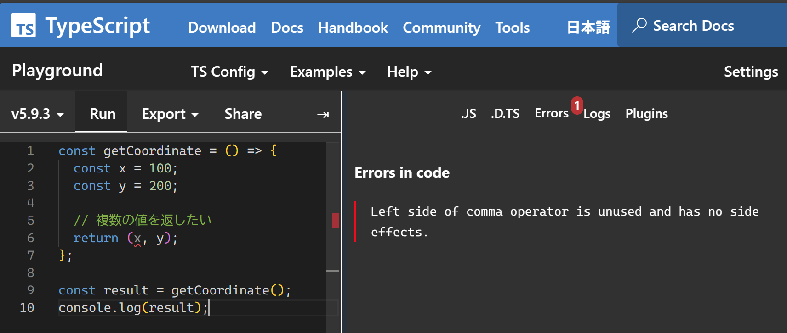
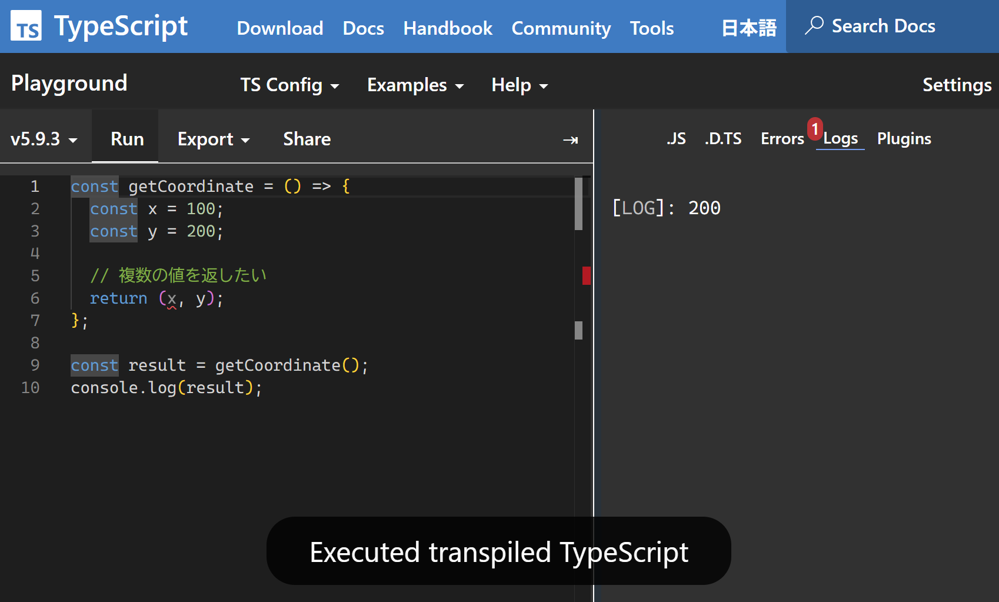

# JavaScript で return (x, y) してもタプルは返らない（がエラーにもならない）

まずは以下の TypeScript (JavaScript) コードをご覧ください。

```typescript
const getCoordinate = () => {
  const x = 100;
  const y = 200;
  
  // 複数の値を返したい
  return (x, y);
};

const result = getCoordinate();
console.log(result);
```

ぱっと見だと座標が[「タプル」](https://ja.wikipedia.org/wiki/%E3%82%BF%E3%83%97%E3%83%AB)で返却されそうな気がしますよね。[^1]

[^1]: 個人の感想です。

しかし、VS Code 上では `x` の部分に赤い波線が表示され、以下のエラーとなります。

> コンマ演算子の左側が使用されていないため、副作用はありません。ts(2695)

[TypeScript Playground](https://www.typescriptlang.org/play) でも同様のエラーとなります。



この状態で実行すると、`200`、すなわちコンマの右側にある `y` の値だけが返却されています。



コンマの左側にあった `x` はどこへ消えたのでしょうか？ その答えはエラーに登場する「コンマ演算子」が握っていそうです。

## TypeScript では `return (x, y)` でタプルは返らない

冒頭の記述で一見問題ない気がしてしまう[^1] のは、Python や Rust などの言語では実際そう書けるからです。

Python では `(x, y)` を return するとタプルが返されます。[^2]

[^2]: 実際の所 Python ではコンマで区切った値を記述するだけでもタプルとして扱われますので、`()` は無くてもかまいません。

```python:Python
def get_coordinate():
    x = 100
    y = 200
    return (x, y)

print(get_coordinate())

# (100, 200)
```

Rust でも同様です。

```rust:Rust
fn get_coordinate() -> (i32, i32) {
    let x = 100;
    let y = 200;
    (x, y)
}

fn main() {
   println!("{:?}", get_coordinate());
}

// (100, 200)
```

しかし、TypeScript の世界において、`()` はタプルの生成を意味しません。TypeScript でタプルを定義する場合、使用すべき記号は `[]` です。

```typescript
// 戻り値としてタプルを返す関数を定義
const getCoordinate = (): [number, number] => {
  const x = 100;
  const y = 200;
  
  // 配列と同じ書き方
  return [x, y];
};
```

TypeScript のタプルはあくまで「要素数と型が固定された配列」であり、JavaScript にコンパイルしてしまえばただの配列にすぎません。

## JavaScript では `return (x, y)` を実行してもエラーにならない

では、冒頭の `return (x, y)` はなぜ実行できてしまったのでしょうか？

実行時エラーにならなかったということは、JavaScript の文法として「正しい」ことを意味します。ここで登場するのが [コンマ演算子（`,`）](https://developer.mozilla.org/ja/docs/Web/JavaScript/Reference/Operators/Comma_operator) です。

> カンマ演算子 (,) は、それぞれの演算対象を（左から右に）評価し、最後のオペランドの値を返します。

つまり、`return (x, y)` という記述は、以下のように解釈されていたのです。

1. `x` を評価する（値は `100` だが、副作用がない記述なので虚空に消えるだけ）
2. `y` を評価する（値は `200`）
3. 最後のオペランド `y` の値 `200` を返す

結果として、この関数は単なる `200` を返す形で正しく機能してしまいました。

```typescript
// 型推論の結果は () => number となる
const getCoordinate = () => {
    return (100, 200); 
};
```

## コンマ演算子の用途と他の言語での実装

実用的な意味では、JavaScript を圧縮・難読化する際に活用されています。著名な Minifier である Terser には [sequences](https://terser.org/docs/options/#compress-options) という圧縮オプションがありますが、これは複数の文をコンマ演算子によって 1 つの式にまとめるものです。たとえば `if` で複数行の内容を実行したい場合、通常は `{}` を使用する必要がありますが、コンマ演算子で連結すれば省略できます。

```typescript
if (condition) {
  statements1;
  statements2;
}

// コンマ演算子で連結して {} を省略
if(condition)statements1,statements2

// if を && に置き換えても同じ文字数だが…
condition&&(statements1,statements2)

// statements2 の戻り値を拾いたいならこちらが便利
const result=condition&&(statements1,statements2)
```

ヒューマンリーダブルな場面でも、for ループで複数の変数を扱う場合には便利に活用できます。

```typescript
for (let i = 0, j = 2; i <= 2; i++, j--) {
  console.log(i, j);
}
```


なお、コンマ演算子は JavaScript のほか [C / C++](https://learn.microsoft.com/ja-jp/cpp/cpp/comma-operator?view=msvc-180) や [Perl](https://perldoc.perl.org/perlop#Comma-Operator) でも実装されていますが、Java や C# などの C 系後発言語には実装されていません。その代わり、上記の用途には（演算子ではない）コンマで足りる設計になっているようです。

```csharp:C#
public class Main
{
 public static void Main()
 {
  for (int i = 0, j = 2; i <= 2; i++, j--) {
    System.Console.WriteLine("{0:D},{1:D}", i, j);
  }
 }
}
```

```java:Java
public class Main {
  public static void main(String[] args) {
    for (int i = 0, j = 2; i <= 2; i++, j--) {
      System.out.printf("%d,%d\n", i, j);
    }
  }
}
```

## 参考リンク

* [タプル (tuple) | サバイバルTypeScript](https://typescriptbook.jp/reference/values-types-variables/tuple)
* [カンマ演算子 - JavaScript | MDN](https://developer.mozilla.org/ja/docs/Web/JavaScript/Reference/Operators/Comma_operator)
* [コンマ演算子 - Wikipedia](https://ja.wikipedia.org/wiki/%E3%82%B3%E3%83%B3%E3%83%9E%E6%BC%94%E7%AE%97%E5%AD%90)
* [君はあのコンマ演算子を知っているか？ - ドキュメントを見たほうが早い](https://benevolent0505.hatenablog.com/entry/2019/12/23/205243)
* [コンマ演算子の使い道の話](https://qiita.com/Nabetani/items/fa84c8eb817fe6f18a5a)
* [Comma operator can change flow of execution · Issue #2434 · evanw/esbuild](https://github.com/evanw/esbuild/issues/2434)
* [javascript - When is the comma operator useful? - Stack Overflow](https://stackoverflow.com/questions/9579546/when-is-the-comma-operator-useful)
