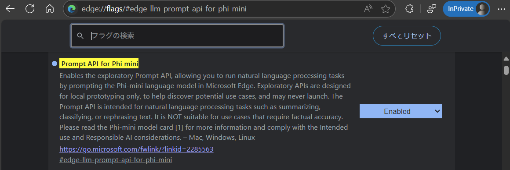
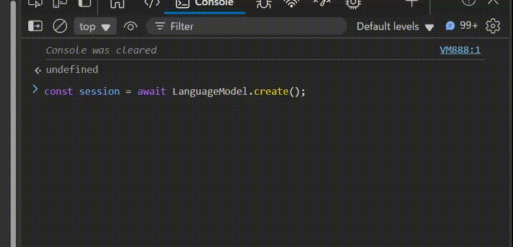
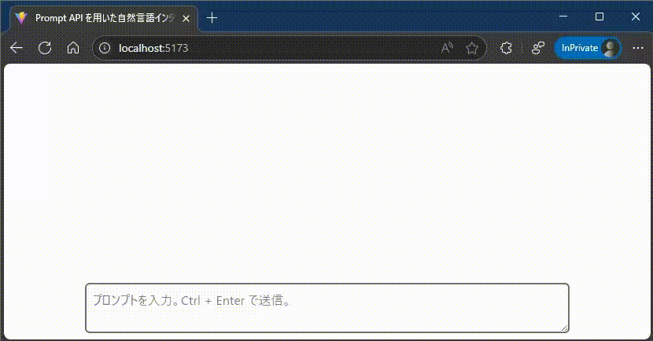

# Microsoft Edge に内蔵された生成 AI を React + Typescript から呼び出してみる

今年 2 月、[ブラウザ上でも DeepSeek-R1 を動かしたい](https://qiita.com/yokra9/items/6d245b3460e5bfa13130)という記事を投稿しました。[huggingface/transformers.js](https://github.com/huggingface/transformers.js) 経由で WebAssembly や WebGPU、WebNN を活用し JavaScript から言語モデルを呼び出す方法をご紹介しています。

さて、5 月になって [Microsoft Edge が小規模言語モデル Phi-4-mini へアクセスするための API を試験導入すると発表](https://blogs.windows.com/msedgedev/2025/05/19/introducing-the-prompt-and-writing-assistance-apis/)しました。具体的には Edge の Canary / Dev チャネルで [W3C Web Machine Learning WG](https://webmachinelearning.github.io/) の提案する新たな Web API 群が使用可能になっています。これにより、フロントエンドの JavaScript からライブラリ等に依存せず言語モデルを活用できるようになりました。`Prompt API for Phi mini` と銘打たれた [Prompt API](https://github.com/webmachinelearning/prompt-api) 実装もその 1 つです。Chrome の `Prompt API for Gemini Nano` が現状[拡張機能をソースからビルドして追加する必要がある](https://developer.chrome.com/docs/extensions/ai/prompt-api?hl=ja)のと比較すると、気軽にブラウザ組込の言語モデルを試すことができますね。

## Prompt API for Phi mini を使ってみる

Microsoft Learn にて詳細なガイド（[Prompt API を使用して組み込みの言語モデルをプロンプト表示する](https://learn.microsoft.com/ja-jp/microsoft-edge/web-platform/prompt-api)）が公開されています。手順を要約すると以下の通りです：

1. [Microsoft Edge Insider](https://www.microsoft.com/ja-jp/edge/download/insider) から Microsoft Edge Canary または Dev (>=138.0.3309.2) を導入する。
2. <edge://flags/#edge-llm-prompt-api-for-phi-mini> を開き、`Prompt API for Phi mini` を有効化する。
  
3. [Built-in AI Playground](https://microsoftedge.github.io/Demos/built-in-ai/playgrounds/prompt-api/) にアクセスし、Prompt API が利用できることを確認する。

続いて、開発者ツールで Prompt API (`LanguageModel`) を試してみましょう。

```javascript
// セションを開始する
const session = await LanguageModel.create();

// 言語モデルにプロンプトを与え、文字列を取得する
await session.prompt(<プロンプト>);
```

 [^1]

できました！ 非常にシンプルかつ直感的なコードで Phi-4-mini を呼び出せていますね。

[^1]: 本稿の GIF 動画は [ブラウザ上でも画面録画 ＆ GIF 動画化してみたい 2025](https://qiita.com/yokra9/items/7999a387dbe715375d20) の成果物 [giffy-screen-wasm](https://yokra9.github.io/giffy-screen-wasm/) で撮影しました。

## TypeScript でも Prompt API for Phi mini  を使ってみたい

上記のコードのまま TypeScript プロジェクトに組み込むと、`TS2304: Cannot find name 'LanguageModel'` と怒られコンパイルできません。これは、TypeScript に `LanguageModel` の型定義が含まれていないためです。この型定義情報を補うものとして、[@types/dom-chromium-ai](https://www.npmjs.com/package/@types/dom-chromium-ai) が公開されています。至れり尽くせりですね。

## Prompt API と React + TypeScript で簡単なチャットボットを作成してみる

せっかくなので、React + TypeScript 製のチャットボット風フロントエンドから Prompt API 経由で Phi-4-mini と会話できるサンプルを作成してみました。



<https://yokra9.github.io/prompt-api-sample/>

生成中の応答をストリーミング表示するため、`session.prompt()` の代わりに `session.promptStreaming()` メソッドを使用しています。

```tsx:App.tsx
import { useCallback, useRef, useState, type KeyboardEvent } from "react";

const App = () => {
  /**
   * 会話履歴の配列
   */
  const [messages, setMessages] = useState<string[]>([]);

  /**
   * 現在の出力先となる吹出への参照
   */
  const currentBubbleRef = useRef<HTMLDivElement>(null);

  /**
   * LanguageModel オブジェクトの参照
   */
  const sessionRef = useRef<LanguageModel>(null);

  /**
   * 吹出の内容をクリアする関数
   */
  const clearBubble = useCallback(() => {
    if (
      currentBubbleRef.current === null ||
      currentBubbleRef.current.textContent === null
    )
      return;

    currentBubbleRef.current.textContent = "";
  }, []);

  /**
   * 吹出に文字列を追記する関数
   *
   * @param chunk 追記する文字列
   */
  const addChunk2Bubble = useCallback((chunk: string) => {
    if (
      currentBubbleRef.current === null ||
      currentBubbleRef.current.textContent === null
    )
      return;

    currentBubbleRef.current.textContent += chunk;
  }, []);

  /**
   * ReadableStreamDefaultReader の内容を読み取る関数
   *
   * @param reader 読み取る ReadableStreamDefaultReader
   */
  const readChunk = useCallback(
    async (reader: ReadableStreamDefaultReader<string>) => {
      const { done, value } = await reader.read();

      if (value !== undefined) addChunk2Bubble(value);

      if (!done) await readChunk(reader);
    },
    [addChunk2Bubble]
  );

  /**
   * プロンプトを元に応答を生成する関数
   *
   * @param prompt
   */
  const generate = useCallback(
    async (prompt: string) => {
      // eslint-disable-next-line @typescript-eslint/no-unnecessary-condition
      if (LanguageModel === undefined) {
        console.error("Prompt API が利用できません。");
        return;
      }

      const availability = await LanguageModel.availability();

      switch (availability) {
        case "unavailable":
          console.error("言語モデルが利用できません。");
          break;

        case "downloadable":
        case "downloading":
          console.error(
            "言語モデルは利用できますが、まずダウンロードの必要があります",
            availability
          );
          break;

        case "available": {
          // セションを開始する
          if (sessionRef.current === null)
            sessionRef.current = await LanguageModel.create();

          // 言語モデルにプロンプトを与え、ストリームを取得する
          const stream = sessionRef.current.promptStreaming(prompt);

          // ストリームからチャンクを読み取る
          const reader = stream.getReader();
          await readChunk(reader);
          break;
        }

        default:
          availability satisfies never;
      }
    },
    [readChunk]
  );

  /**
   * テキストエリアでキーボードを押下したときのイベントハンドラ
   */
  const onkeydownHandler = useCallback(
    ({
      currentTarget: { value },
      ctrlKey,
      metaKey,
      code,
    }: KeyboardEvent<HTMLTextAreaElement>) => {
      if ([ctrlKey, metaKey].includes(true) && code === "Enter") {
        if (currentBubbleRef.current?.textContent === undefined) {
          setMessages([...messages, value]);
        } else {
          setMessages([
            ...messages,
            currentBubbleRef.current.textContent ?? "",
            value,
          ]);
        }

        clearBubble();
        void generate(value);
      }
    },
    [clearBubble, generate, messages]
  );

  return (
    <>
      <main className="grid grid-rows-[auto_1fr_80px] h-dvh">
        <div className="grid grid-cols-2 gap-4 p-4">
          {messages.map((message) => (
            <div
              className="rounded-md shadow-md p-2 first:invisible odd:bg-blue-200 even:bg-gray-200 odd:mb-10 even:mt-10"
              key={message}
            >
              {message}
            </div>
          ))}

          <div
            className="rounded-md shadow-md p-2 first:invisible odd:bg-blue-200 even:bg-gray-200 odd:mb-10 even:mt-10"
            ref={currentBubbleRef}
          ></div>
        </div>

        <div />

        <div className="flex justify-center w-full">
          <textarea
            className="border-2 m-2 p-2 border-gray-500 rounded-md w-3/4"
            placeholder="プロンプトを入力。Ctrl + Enter で送信。"
            onKeyDown={onkeydownHandler}
          />
        </div>
      </main>
    </>
  );
};

export default App;
```

なお、ソースコード全文は[こちらのリポジトリ](https://github.com/yokra9/prompt-api-sample)で公開中です。

## まとめ

以前ご紹介した `transformers.js` も汎用性の観点で非常に良いものでしたが、コードの簡潔さにおいては Prompt API に軍配があがるかな、というのが所感です。わずか 2 行で言語モデルと対話できるお手軽さには驚きました。

Prompt API の Web 標準化が進めば、自然言語インタフェースの採用ハードルは大きく下がり、Web UI の新たなブレークスルーに繋がる可能性があります。ブラウザ上（クライアントサイド）で動作する言語モデルであればサーバサイドで計算資源を調達しなくてよいので、低コストで生成 AI を活用した Web アプリケーションを提供できます。また、プライバシーやレイテンシーの観点からサーバサイドに情報を送信したくない箇所に採用できるのも大きな利点です。前述のシンプルさと合わせて、大きなポテンシャルを秘めていると言えるでしょう。引き続き動向にも注目したいです。

## 参考リンク

* [「Edge」内蔵ローカル小規模言語モデル（SLM）「Phi-4-mini」のためのAPIが試験実装 - 窓の杜](https://forest.watch.impress.co.jp/docs/news/2017479.html)
* [Simplified access to AI in Microsoft Edge: Introducing the Prompt and Writing Assistance APIs - Microsoft Edge Blog](https://blogs.windows.com/msedgedev/2025/05/19/introducing-the-prompt-and-writing-assistance-apis/)
* [Prompt API を使用して組み込みの言語モデルをプロンプト表示する - Microsoft Edge Developer documentation | Microsoft Learn](https://learn.microsoft.com/ja-jp/microsoft-edge/web-platform/prompt-api)
* [Web Machine Learning | Making Machine Learning a first-class web citizen](https://webmachinelearning.github.io/)
* [webmachinelearning/prompt-api: 💬 A proposal for a web API for prompting browser-provided language models](https://github.com/webmachinelearning/prompt-api)
* [組み込みの AI を使ってみる  |  AI on Chrome  |  Chrome for Developers](https://developer.chrome.com/docs/ai/get-started?hl=ja)
* [Prompt API を使用してローカルおよびオフライン対応の chatbot を作成する  |  web.dev](https://web.dev/articles/ai-chatbot-promptapi?hl=ja)
