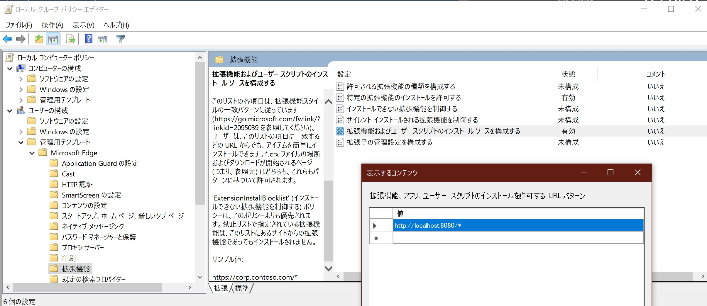
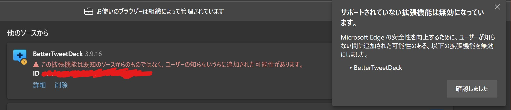
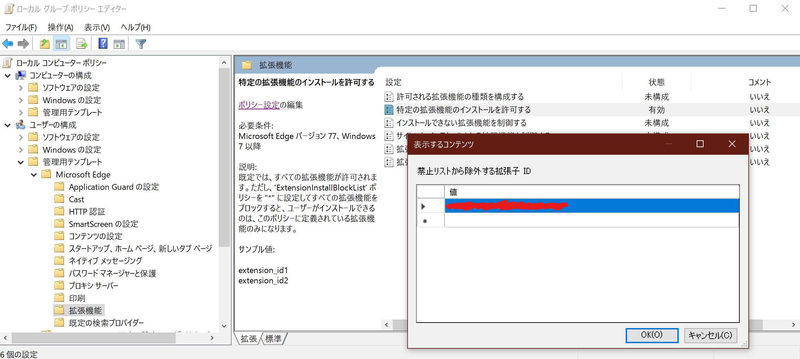

# Microsoft Edge（Chromium 版）で「デベロッパーモードの拡張機能を無効にする」を表示しないようにする

Chromium 版 Edge に開発者モードで読み込んだ拡張機能があると、`デベロッパーモードの拡張機能を無効にする` という警告が表示され、拡張機能が無効化されます。セキュリティ対策を意図した機能と考えますが、ストアに提出していない自作拡張機能のサイドロードが制限されてしまうため不便です。どうにかしたい。

## ローカルグループポリシーで特定の拡張機能のインストールを許可する

Chromium 版 Edge は [Google Chrome の場合](https://cloud.google.com/docs/chrome-enterprise/policies)と同様、`edge://settings/` にはない設定をポリシーから指定できるようになっています。なお、ローカルグループポリシーを設定するには Windows 10 が Pro Edition 以上である必要があります。

まず、Microsoft の[ビジネス向け Edge](https://www.microsoft.com/ja-jp/edge/business/download) のページからポリシーテンプレートを取得します。チャンネル/バージョンとビルドを指定すると、ダウンロードのリンクが有効化されます。

ダウンロードしたポリシーテンプレートを所定のディレクトリに配置します。

* `msedge.admx`
  * From: `windows\admx\`
  * To  : `C:\Windows\PolicyDefinitions\`
* `msedge.adml`
  * From: `windows\admx\ja-JP`
  * To  : `C:\Windows\PolicyDefinitions\ja-JP\`

次に、グループポリシーエディタを起動し、`管理用テンプレート\Microsoft Edge\拡張機能\拡張機能およびユーザースクリプトのインストールソースを構成する` を開きます。

`拡張機能、アプリ、ユーザースクリプトのインストールを許可するURL パターン` としてローカルホストの URL パターン（例: `http://localhost:8080/*`）を追加します。ポリシーを設定した後、Edge の再起動を忘れないでください。

こうして、ローカルホストに設置した拡張機能(`.crx` 形式)をインストールできるようになりました。しかし `edge://extensions/` を確認すると `この拡張機能は既知のソースからのものではなく、ユーザーの知らないうちに追加された可能性があります。` と表示され、無効化されてしまいました。個別に許可する必要がありますので、開発者モードに切り替えて拡張機能 ID を控え、削除しましょう。

グループポリシーエディタに戻り、`管理用テンプレート\Microsoft Edge\拡張機能\特定の拡張機能のインストールを許可する` を開きます。

`禁止リストから除外する拡張子 ID`[^1] にインストールを許可したい拡張機能の IDを指定します。

[^1]: 拡張機能 ID (`extention_id`)の誤訳と思われます。

Edge の再起動後、ローカルホストからのインストールを再試行してください。今度は成功するはずです！

## ちなみに

Google Chrome における該当の事象について調べている最中、ポリシー名の表記ゆれがあることに気が付きました。どうやら、BLM 運動に関連して名称の変更が行われたようです。

* `ExtensionInstallBlacklist` => `ExtensionInstallBlocklist`
* `ExtensionInstallWhitelist` => `ExtensionInstallAllowlist`

[そろそろ本格的にプログラミング用語を置き換える時期なのかも](https://qiita.com/Daara_y/items/c7caf39dba0e6a61e7da)しれません。

## 参考リンク

* [「デベロッパーモードの拡張機能を無効にする」の警告の対処法！](https://aprico-media.com/posts/4131)
* [ビジネスに適した新しい Microsoft Edge をダウンロードして展開する](https://www.microsoft.com/ja-jp/edge/business/download)
* [ExtensionInstallAllowlist（Edge）](https://docs.microsoft.com/en-us/DeployEdge/microsoft-edge-policies#extensioninstallallowlist)
* [ExtensionInstallAllowlist（Chrome）](https://cloud.google.com/docs/chrome-enterprise/policies?policy=ExtensionInstallAllowlist)
