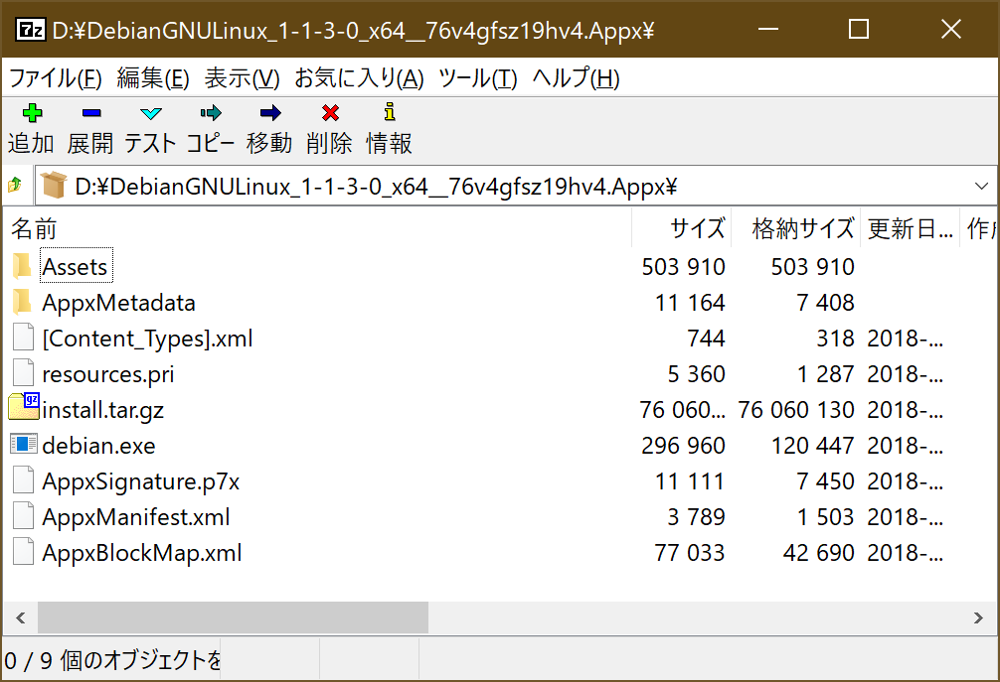

# Microsoft Store に繋がらない環境でも WSL2 で Linux ディストリビューションを利用したい

WSL2、便利ですよね。任意の Linux ディストリビューションパッケージを Microsoft Store からインストールするだけで、気軽に「本物」の Linux 環境を構築できます。

一方、Microsoft Store に接続できなかったり、アプリの購入・インストール処理が塞がれていると上記の手順では利用できなくなってしまいます。せっかくの便利さをそんな事情で諦めたくないので、回避策を探してみました。

## ディストリビューション パッケージを手動でダウンロードする

今回のようなケースを見越して、Microsoft はオフィシャルにページを用意しています：

[Linux 用 Windows サブシステム ディストリビューション パッケージを手動でダウンロードする](https://docs.microsoft.com/ja-jp/windows/wsl/install-manual)

上記のページから任意の Linux ディストリビューションパッケージをダウンロードし、`Add-AppxPackage` コマンドレットでインストールします。

```powershell
Add-AppxPackage <ファイル名>.appx
```

## `Add-AppxPackage` を使わず、任意の場所にディストリビューションをインストールする

上記の手順でインストールに失敗した場合は、手動でのインストールに挑戦してみましょう。`.appx` 形式のインストーラは [`.msix` などと同様](https://qiita.com/yokra9/items/b5d1318f5474e0812c16) 実態としては Zip 形式のアーカイブであり、適当な圧縮解凍ソフトで内容物を抽出できます。



内容物を任意の場所に設置し、`<ディストリビューション>.exe` を実行すると WSL2 でディストリビューションが起動します。このタイミングでディストリビューションの設置場所が WSL2 に登録されます。

## 「指定されたパスが見つかせん」エラーが発生した場合

このエラーは WSL2 に登録されているパスにディストリビューションが見つからないときに発生します。上記手順で試しに起動してから設置場所を変更したときなどに起こりえます。

このような場合は、手動で WSL2 から前回の登録を解除します：

```powershell
# 登録されているディストリビューションを一覧表示します。
PS> wslconfig /l
Linux 用 Windows サブシステム ディストリビューション:
docker-desktop-data (既定)
docker-desktop
debian

# ディストリビューションの登録を解除します。
PS> wslconfig /u <ディストリビューション名>
```

## インストールしたディストリビューションからインターネットに接続できない

ファイアウォールに邪魔されている可能性がありますので、一時的にオフにしてみましょう。特に Microsoft Store への接続を防ぐようなガチガチの環境だと第一に原因として疑った方が良いです。

## 参考リンク

* [Linux 用 Windows サブシステム ディストリビューション パッケージを手動でダウンロードする](https://docs.microsoft.com/ja-jp/windows/wsl/install-manual)
* [Can't launch Debian after downloading with curl - error 0x800704cf](https://www.reddit.com/r/bashonubuntuonwindows/comments/eng56k/cant_launch_debian_after_downloading_with_curl/)
* [Add symantec to the list of firewalls which blocks WSL #1046](https://github.com/MicrosoftDocs/WSL/pull/1046)