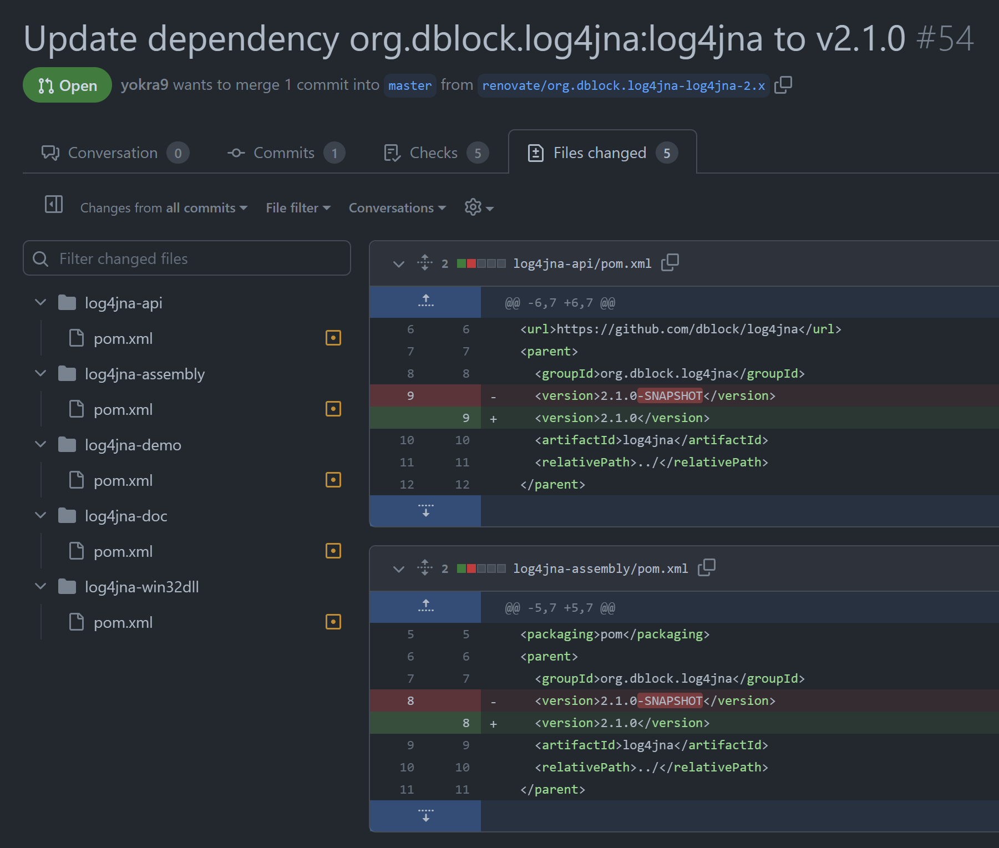

# Monorepo に Dependabot を導入したら PR に埋もれたので Renovate に移行した話

以前 [CI の壊れていた OSS を GitHub Actions に移行した話](https://qiita.com/yokra9/items/fff4f2d141d5ebe88bd3)を書きましたが、その後日談です。

CI を GitHub Actions へ移行するついでに Dependabot を導入しました。しばらく Dependabot で運用を続けていたのですが、 ある日リポジトリオーナの方が [Replace dependabot with renovate](https://github.com/dblock/log4jna/issues/157) という Issue を立てられます。

> Dependabot opens 10+ PRs for maven dependencies given the number of config files in this repo.  
> Replace with <https://github.com/renovatebot/renovate> that can do this in one go.  
>  
> 

見ての通り、1 つの依存関係につき 5 件の PR が作成されてしまっています。Renovate ならこれを 1 件にまとめられるので置き換えたいという Issue です。

Dependabot が PR を連投した理由は、プロジェクトが Monorepo な構成を取っており、Maven プロジェクトそれぞれに `update-configs` を設定しているためです：

```yml:.github/dependabot.yml
version: 2
updates:
  - package-ecosystem: "maven"
    directory: "/"
    schedule:
      interval: "daily"

  - package-ecosystem: "maven"
    directory: "/log4jna-api/"
    schedule:
      interval: "daily"

  - package-ecosystem: "maven"
    directory: "/log4jna-assembly/"
    schedule:
      interval: "daily"

  - package-ecosystem: "maven"
    directory: "/log4jna-demo/"
    schedule:
      interval: "daily"

  - package-ecosystem: "maven"
    directory: "/log4jna-doc/"
    schedule:
      interval: "daily"

  - package-ecosystem: "maven"
    directory: "/log4jna-win32dll/"
    schedule:
      interval: "daily"
```

何も Renovate に移行しなくとも Dependabot で PR を減らせれば済む話に思えます。実際 [Dependabot Grouped Update](https://github.com/github/roadmap/issues/148) なる新機能が [GitHub Public Roadmap](https://github.com/orgs/github/projects/4247) の 2023 年 2Q ( 4-6 月) にあったので、当初は状況を伺っていました。しかし[実装された Grouped version updates](https://github.blog/changelog/2023-08-24-grouped-version-updates-for-dependabot-are-generally-available/) は「複数の依存関係をグループ化する」ものであって、「プロジェクトを跨って PR を作成する」ものではありませんでした。Issue でも [Add grouped updates](https://github.com/dependabot/dependabot-core/issues/1190) はクローズですが、[Create 1 PR for the same update across update configs](https://github.com/dependabot/dependabot-core/issues/1595) はオープンです。[フィードバックを募集](https://github.com/dependabot/dependabot-core/issues/1190#issuecomment-1623832701)していたので Senior Product Manager の方にメールで確認してみましたが、当時の段階で実装時期は未定とのことでした。本稿執筆時点では下記のコメントもあり、実装に向けて動いてもらえているようです[^1]：

[^1]: <https://github.com/dependabot/dependabot-core/issues/1595#issuecomment-1753855353>

> Following up; we've started doing some exploration to allow multiple directories to be grouped together.

## Dependabot を Renovate Bot GitHub Action に置き換える

とはいえ待っていても仕方がないので Dependabot を [Renovate Bot GitHub Action](https://github.com/renovatebot/github-action) に置き換えます。`dependabot.yml` を削除して、代わりに Renovate 用の設定ファイルを追加しました[^2]：

[^2]: リポジトリの `RENOVATE_TOKEN` に設定するトークンは [Personal Access Token (classic)](https://github.com/settings/tokens) である必要があります。Renovate Bot GitHub Action は [Fine-grained Personal Access Tokens](https://github.com/settings/tokens?type=beta) には未対応であるためです。

```yml:.github/workflows/Renovate.yml
name: Log4JNA Dependency Update

on:
  schedule:
    # The "*" (#42, asterisk) character has special semantics in YAML, so this
    # string has to be quoted.
    - cron: '0 0 * * *'

  workflow_dispatch:

jobs:
  build:
    runs-on: ubuntu-latest

    name: renovate
    steps:
      # Checks-out your repository under $GITHUB_WORKSPACE, so your job can access it
      - uses: actions/checkout@v3

      # GitHub Action to run self-hosted Renovate
      - name: Renovate Bot GitHub Action
        uses: renovatebot/github-action@v36.0.0
        with:
          configurationFile: .github/renovate.json
          token: ${{ secrets.RENOVATE_TOKEN }}
        env:
          RENOVATE_REPOSITORIES: yokra9/log4jna
```

```json:.github/renovate.json
{
    "$schema": "https://docs.renovatebot.com/renovate-schema.json",
    "packageRules": []
}
```

期待通り、Renovate は特に設定しなくてもプロジェクト横断で PR を作成してくれます。Monorepo で依存のアップデートを自動生成したい場合は、（今のところ）Dependabot より Renovate が適当なようです：



Renovate は[非常に多彩な設定項目](https://docs.renovatebot.com/configuration-options/)を持っており、Monorepo に限らずとも、要件が複雑なケースでは Dependabot より使い勝手が良さそうです。Dependabot にも GitHub 上での導入がお手軽というメリットがありますので、状況に合わせて適当な手段を選んでいきたいですね。

## 参考リンク

* [DependabotとRenovateってどっちがいいの？](https://qiita.com/takiga/items/6ec7b9c9613ec8bf7d51)
* [Add grouped updates #1190](https://github.com/dependabot/dependabot-core/issues/1190)
* [Create 1 PR for the same update across update configs #1595](https://github.com/dependabot/dependabot-core/issues/1595)
* [Scala でも Dependabot のように依存ライブラリをアップデートする PR を自動で作成してほしい（GitHub Actions）](https://qiita.com/yokra9/items/5d80a9397951091ed637)
