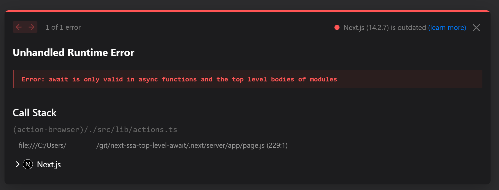
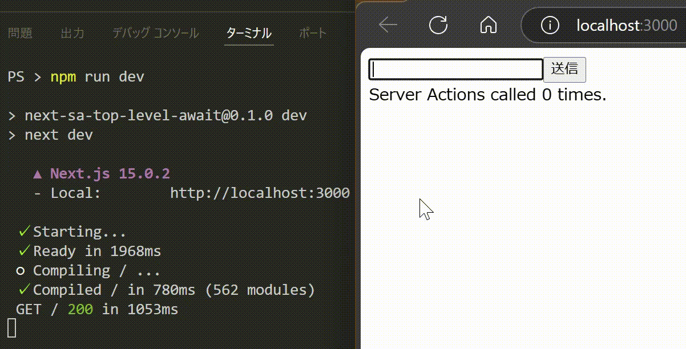

# Next.js 15（あるいは 14.2.8）から Server Actions で Top-level await が使えるようになっていた

ES2022 から ECMAScript 仕様に [Top-level await](https://github.com/tc39/proposal-top-level-await) が導入されました。これは従来 `async` な関数の中でしか呼べなかった `await` を、モジュールのトップレベルでも利用可能にしたものです。これまで [IIFE](https://developer.mozilla.org/ja/docs/Glossary/IIFE) パターン等で解決していたものをずいぶんスマートに書けるようになりました。

```javascript
import { xxx } from "xxx";

...

// async 関数の外でも await を使用できる
const yyy = await xxx();
```

Next.js も [13.4.5 から Top-level await をサポート](https://github.com/vercel/next.js/issues/43382#issuecomment-2058619267)しています。[^1] コンポーネントのトップレベルで行いたい処理が Promise なケースでは便利に使えそうです。

[^1]: ただし TypeScript プロジェクトでは `tsconfig.json` でターゲットを ES2022 にする必要があります。

一方、Next.js 14.2.7 の [Server Actions](https://nextjs.org/docs/app/building-your-application/data-fetching/server-actions-and-mutations) 内で Top-level Await を使うとこのようなエラーになってしまいました。



これは残念な結果です。Server Actions のトップレベル（関数外）で定義された変数の初期化処理を考えてみましょう。たとえば、データベースへの接続処理などです。非同期コードが必要な場合、冗長な回避策を講じることになります。

```typescript
// 再代入するため let で宣言することになるし、
// conn が null であるパターンの考慮も必要になる
let conn: Connection | null = null;

// しかも IIFE は冗長
(async () => conn = await xxx())();
```

一方、Top-level await が使用できれば静的でスマートな記述ができるはずです。

```typescript
const conn: Connection = await xxx();
```

同感の人は多かったのか、2023 年の 8 月には [Issue #54282](https://github.com/vercel/next.js/issues/54282) として起票されていました。

## Next.js 15 でやってみる

去る 2024 年 10 月 24 日の Next.js Conf にて、[Next.js 15 がリリース](https://nextjs.org/blog/next-15)されました。

[Next.js 15 のリリース内容](https://github.com/vercel/next.js/releases/tag/v15.0.0)を確認すると、[#64508 Improve top level await coverage](https://github.com/vercel/next.js/pull/64508) という PR が見られます。Webpack の出力ターゲットを ES2015 に変更して async function を出力可能にしたという内容です。Server Actions でもうまくいくか、試してみましょう。

```tsx:page.tsx
"use client";

import { useActionState, JSX } from "react";
import { action } from "../lib/actions";

export default function Home(): JSX.Element {
  const [state, dispatch] = useActionState(action, 0);

  return (
    <div>
      <form action={dispatch}>
        <input type="text" name="input1" />
        <input type="submit" />
      </form>
      Server Actions called {state} times.
    </div>
  );
}

```

```typescript:actions.ts
"use server";

const sleep = (ms: number): Promise<string> => new Promise(resolve => setTimeout(() => { resolve("sleeped") }, ms));

// Top-level Await
const data = await sleep(1000);

export async function action(state: Readonly<number>, formData: Readonly<FormData>) {
    console.log("Server Actions!", state, formData.get("input1"));

    console.log(data);

    return state + 1;
}
```



やりました！　なお、サンプルコードの全文は[こちらのレポジトリ](https://github.com/yokra9/next-sa-top-level-await)に格納しています。

## 実は Next.js 14 にもバックポートされていた

本稿を書くために改めて検証したところ、[Next.js 14.2.8](https://github.com/vercel/next.js/releases/tag/v14.2.8) から Server Actions で Top-level await が使えるようになっていました。どうやら Next.js 15 からのバックポートが行われたようです。

とはいえ、Next.js v15 には [Server Actions のセキュリティ強化](https://nextjs.org/blog/next-15-rc2#enhanced-security-for-server-actions)も含まれますから、Server Actions ユーザはこれに関わらず早期の対応を予定するとよいでしょう。

## 参考リンク

* [tc39/proposal-top-level-await: top-level `await` proposal for ECMAScript (stage 4)](https://github.com/tc39/proposal-top-level-await)
* [await - JavaScript | MDN](https://developer.mozilla.org/ja/docs/Web/JavaScript/Reference/Operators/await#browser_compatibility)
* [とほほのES2022入門 - とほほのWWW入門](https://www.tohoho-web.com/ex/es2022.html#top-level-await)
* [Top level await (experimental) not working with Server Actions called from Client Components · Issue #54282 · vercel/next.js](https://github.com/vercel/next.js/issues/54282)
