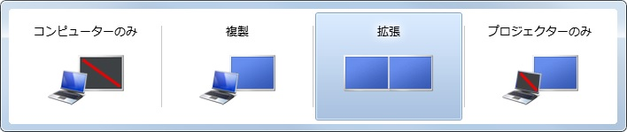

# PowerShell でもマルチディスプレイの出力モードを切り替えたい（複製・拡張）

[`[Win]` + `[P]` でマルチディスプレイの出力モードを切り替えられる](https://support.microsoft.com/ja-jp/windows/%E3%83%97%E3%83%AD%E3%82%B8%E3%82%A7%E3%82%AF%E3%82%BF%E3%83%BC%E3%81%BE%E3%81%9F%E3%81%AF-pc-%E3%81%AB%E6%8E%A5%E7%B6%9A%E3%81%99%E3%82%8B-7e170c39-58dc-c866-7d55-be2372632892)ことは有名ですよね。Windows 11 の場合、下図のクイック設定が表示されます：


一方、クイック設定を開かずにコマンドラインから切り替えたいケースもあるでしょう。そんなときのために、 PowerShell でマルチディスプレイの構成を変更できるコマンドレットを作成してみました。

## `Switch-DisplayMode` コマンドレット

Win32API の [`SetDisplayConfig` 関数](https://learn.microsoft.com/ja-jp/windows-hardware/drivers/display/connecting-and-configuring-displays)でマルチディスプレイの構成を変更する PowerShell スクリプトです。なお、コード全文は[こちら](https://github.com/yokra9/Switch-DisplayMode)で公開しています。

```powershell:Switch-DisplayMode.ps1
# Win32API の SetDisplayConfig 関数を読み込む
$cscode = @"
    [DllImport("user32.dll")]
    public static extern UInt32 SetDisplayConfig(
        UInt32 numPathArrayElements, 
        IntPtr pathArray, 
        UInt32 numModeInfoArrayElements, 
        IntPtr modeInfoArray, 
        UInt32 flags
    );
"@
$Win32Functions = Add-Type -Name Win32SetDisplayConfig -MemberDefinition $cscode -PassThru

# 引数 flags で使用するビット値。
$SDC_APPLY = 0x00000080
$SDC_TOPOLOGY_CLONE = 0x00000002
$SDC_TOPOLOGY_EXTEND = 0x00000004
$SDC_TOPOLOGY_INTERNAL = 0x00000001
$SDC_TOPOLOGY_EXTERNAL = 0x00000008

# システムエラーコード
$ERROR_SUCCESS = 0x0
$ERROR_ACCESS_DENIED = 0x5
$ERROR_GEN_FAILURE = 0x1F
$ERROR_NOT_SUPPORTED = 0x32
$ERROR_INVALID_PARAMETER = 0x57
$ERROR_BAD_CONFIGURATION = 0x64A 

# 引数を元にビット値を計算する
$action = switch ($Args[0]) {
    # 永続化データベースから最後の複製構成を設定する
    "clone" { $SDC_TOPOLOGY_CLONE }
    # 永続化データベースから最後の拡張構成を設定する
    "extend" { $SDC_TOPOLOGY_EXTEND }
    # 現在接続されているモニターの最後の既知の表示構成を設定する
    default { $SDC_TOPOLOGY_INTERNAL -bor $SDC_TOPOLOGY_CLONE -bor $SDC_TOPOLOGY_EXTEND -bor $SDC_TOPOLOGY_EXTERNAL }
}

# SetDisplayConfig 関数を実行する
$result = $Win32Functions::SetDisplayConfig(0, [IntPtr]::Zero, 0, [IntPtr]::Zero, $action -bor $SDC_APPLY)

# エラーハンドリング
$err = switch ($result) {
    $ERROR_SUCCESS { return }
    $ERROR_ACCESS_DENIED { "現在のデスクトップにアクセスできないか、リモートセッションで実行されている可能性があります。" }
    $ERROR_GEN_FAILURE { "未指定のエラーが発生しました。" }
    $ERROR_NOT_SUPPORTED { "Windows ディスプレイドライバーモデル (WDDM) に従って記述されたグラフィックスドライバーが実行されていません。" }
    $ERROR_INVALID_PARAMETER { "指定されたパラメーターとフラグの組み合わせが無効です。" } 
    $ERROR_BAD_CONFIGURATION { "呼び出し元が指定しなかったソースモードとターゲットモードの実行可能なソリューションを見つけることができませんでした。" }
    default { "未知のエラーが発生しました。エラーコード: $result" }
}
throw $err
```

```powershell:使用方法
# Switch-DisplayMode コマンドレットをインポートする
. .\Switch-DisplayMode.ps1

# 永続化データベースから最後の拡張構成を設定する
Switch-DisplayMode -DisplayMode extend

# 永続化データベースから最後の複製構成を設定する
Switch-DisplayMode -DisplayMode clone
```

## 余談、あるいは Windows 7 の発売が 15 年前という信じがたい現実

今回利用した `SetDisplayConfig` 関数は Windows 7 以降で使用できます。これは [Connecting and Configuring Displays (CCD) API](https://learn.microsoft.com/ja-jp/windows-hardware/drivers/display/ccd-apis) が Windows 7 以降に搭載された機能であるためです。一方、[以前ご紹介](https://qiita.com/yokra9/items/fd9caaa666a9de5b0545)した [ScreenResolutionChangerEx](https://github.com/timmui/ScreenResolutionChanger) が使う [`ChangeDisplaySettingsEx` 関数](https://learn.microsoft.com/ja-jp/windows/win32/api/winuser/nf-winuser-changedisplaysettingsexw)は Windows 2000 以降とより長い歴史を持ちます。

そもそも [`[Win]` + `[P]` でディスプレイスイッチャを表示するショートカットが実装されたのも Windows 7 から](https://atmarkit.itmedia.co.jp/ait/articles/0910/23/news111.html)です。



Windows Vista 以前の場合、直接ディスプレイのプロパティを変更する必要がありました。そのため、[Windows XP 用に C# でディスプレイスイッチャを作成する方法](https://www.codeproject.com/articles/178027/how-to-create-a-display-switcher-for-windows-xp)を紹介する記事が書かれていたりしました。当該記事では ChangeDisplaySettingsEx 関数を利用していますが、SetDisplayConfig 関数と比べ冗長なコードが必要だったようです。

本稿執筆の参考として Windows 7 発売直後のブログ記事等を漁っていたのですが、なんだか懐かしい気持ちになってしまいました。15 年前といえば 1.5 むかしに相当しますから、ずいぶんと時間が経ってしまいました。当時は Windows Aero が格好良く見えたものだけどなぁ…。

## 参考リンク

* [プロジェクターまたは PC に接続する - Microsoft サポート](https://support.microsoft.com/ja-jp/windows/%E3%83%97%E3%83%AD%E3%82%B8%E3%82%A7%E3%82%AF%E3%82%BF%E3%83%BC%E3%81%BE%E3%81%9F%E3%81%AF-pc-%E3%81%AB%E6%8E%A5%E7%B6%9A%E3%81%99%E3%82%8B-7e170c39-58dc-c866-7d55-be2372632892)
* [Windows で複数のモニターを使用する方法 - Microsoft サポート](https://support.microsoft.com/ja-jp/windows/windows-%E3%81%A7%E8%A4%87%E6%95%B0%E3%81%AE%E3%83%A2%E3%83%8B%E3%82%BF%E3%83%BC%E3%82%92%E4%BD%BF%E7%94%A8%E3%81%99%E3%82%8B%E6%96%B9%E6%B3%95-329c6962-5a4d-b481-7baa-bec9671f728a)
* [ディスプレイの接続と構成 - Windows drivers | Microsoft Learn](https://learn.microsoft.com/ja-jp/windows-hardware/drivers/display/connecting-and-configuring-displays)
* [SetDisplayConfig の概要とシナリオ - Windows drivers | Microsoft Learn](https://learn.microsoft.com/ja-jp/windows-hardware/drivers/display/setdisplayconfig-summary-and-scenarios)
* [SetDisplayConfig 関数 (winuser.h) - Win32 apps | Microsoft Learn](https://learn.microsoft.com/ja-jp/windows/win32/api/winuser/nf-winuser-setdisplayconfig)
* [powershellでWin32 APIを利用する（powershell 2.0以上）](https://qiita.com/y-takano/items/cb752ad6a10e550ec92f)
* [マルチディスプレイの表示方法を変更する](https://qiita.com/skuromaku/items/0736fb5505eab05fb8a9)
* [Windows 7で画面表示をプロジェクタへ素早く切り替える](https://atmarkit.itmedia.co.jp/ait/articles/0910/23/news111.html)
* [How to create a display switcher for Windows XP - CodeProject](https://www.codeproject.com/articles/178027/how-to-create-a-display-switcher-for-windows-xp)
* [PowerShell で強制的に画面の解像度を変更する](https://qiita.com/yokra9/items/fd9caaa666a9de5b0545)
