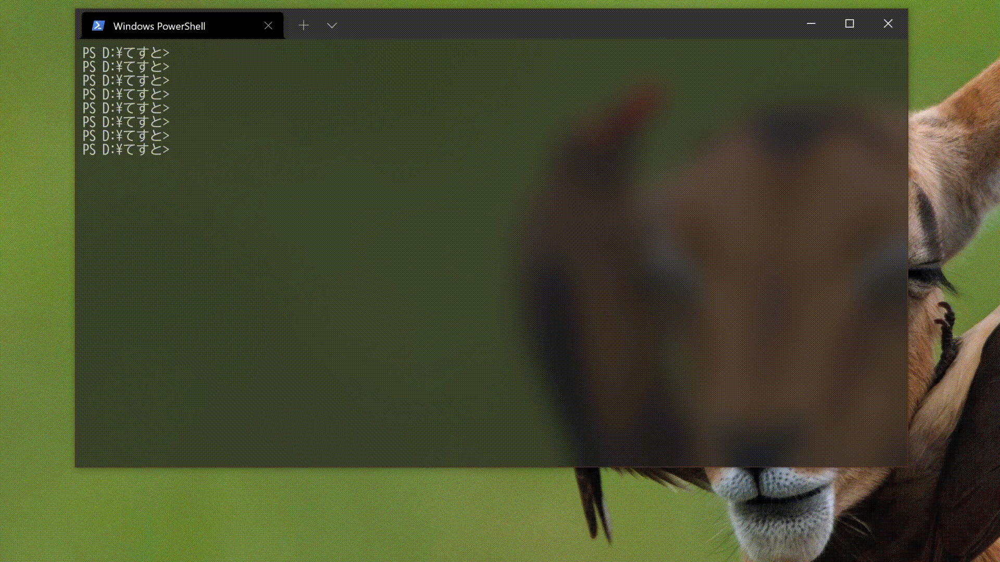

# PowerShell で sbt を実行したときに日本語を文字化けさせない方法

PowerShell で [sbt](https://www.scala-sbt.org/) を起動した際、出力（ファイルパス等）の日本語部分が文字化けしてしまうことがあります。
これは、PowerShell のシステムコンソールの出力エンコーディング設定が Shift JIS (CP932) であるのに対し、sbt の出力エンコーディングが UTF-8 であるためです。

有名な解決法として、`chcp` コマンドを前もって実行しておき、コンソールのコードページを `932` から `65001` (=UTF-8) に変更する方法が挙げられます。

```powershell
chcp 65001
sbt
```

さて、この方法でも問題はないのですが、`chcp` でコードページを変更するとコンソールの表示がクリアされてしまいます。



これが気になる場合は、PowerShell ネイティブな方法でコンソールの出力エンコーディング設定を変更することで回避できます：

```powershell
[Console]::OutputEncoding = [Text.Encoding]::GetEncoding('utf-8')
sbt
```

この設定は現在の PowerShell セッションの間だけ持続します。同セッション内で Shift JIS に戻したい場合は、以下のコマンドを実行します：

```powershell
[Console]::OutputEncoding = [Text.Encoding]::GetEncoding('shift_jis')
```


## 参考リンク

* [chcp](https://docs.microsoft.com/ja-jp/windows-server/administration/windows-commands/chcp)
* [PowerShell 7をインタラクティブシェルとして使う - 文字化けを解消](https://news.mynavi.jp/itsearch/article/hardware/5170)
* [Encoding.GetEncoding メソッド](https://docs.microsoft.com/ja-jp/dotnet/api/system.text.encoding.getencoding?view=net-5.0)
* [各種処理の入出力文字コード設定方法](https://satob.hatenablog.com/entry/20140729/p1)
