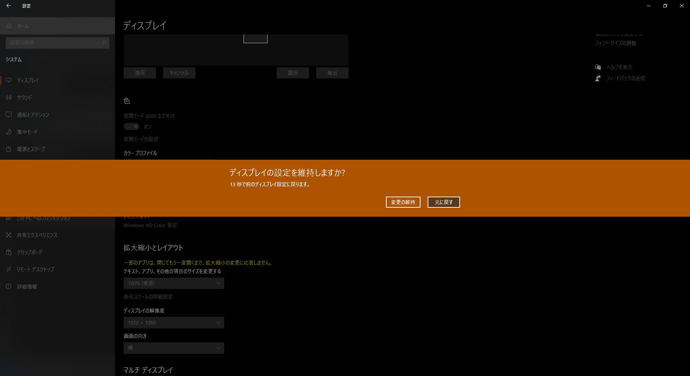

# PowerShell で強制的に画面の解像度を変更する

Windows 10 でディスプレイ解像度設定を変更しようとすると、以下のような確認が表示されます：



意図しない変更による失敗を防ぐ機能と思われますが、頻繁に解像度設定を変更する場合には不便です。

コマンドラインから強制的に変更したいところですが、PowerShell には標準で解像度を制御するコマンドレットがありません。直接 Win32API をコールしてもよいですが、ここは先人の知恵をお借りして楽をしましょう。

## ScreenResolutionChangerEx を利用する

[ScreenResolutionChangerEx](https://github.com/timmui/ScreenResolutionChanger) とは、[Timothy Mui](https://github.com/timmui) 氏が公開している解像度変更ツールで、PowerShell 関数も含まれています。[^1]

[^1]: 大本となる ScreenResolutionChanger は Andy Schneider 氏が [TechNet ギャラリー](https://gallery.technet.microsoft.com/ScriptCenter/2a631d72-206d-4036-a3f2-2e150f297515/)で配布していたものですが、現在は入手できなくなっているようです。

利用方法は簡単で、該当の PowerShell モジュールをインポートし、`Set-ScreenResolutionEx` 関数を呼び出すだけです。

```powershell
# Set-ScreenResolutionEx 関数をインポートする
. ".\\Set-ScreenResolutionEx.ps1"

# Set-ScreenResolutionEx -Width <横幅> -Height <縦幅> -DeviceID <ディスプレイ番号（0ベース）>
Set-ScreenResolutionEx -Width 1920 -Height 1080 -DeviceID 0
```

## 参考リンク

* [PowerShellを使って、画面解像度をワンタッチで切り替えるアイコンをデスクトップに作成する](https://qiita.com/zamaezaaa/items/c4482fed9b391e3cb54a)
* [How to do a Powershell (or other) script to change screen resolution?](https://superuser.com/questions/29450/how-to-do-a-powershell-or-other-script-to-change-screen-resolution)
