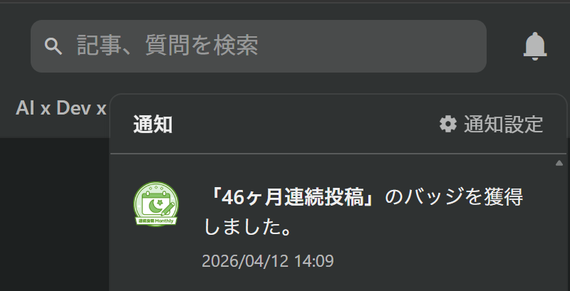
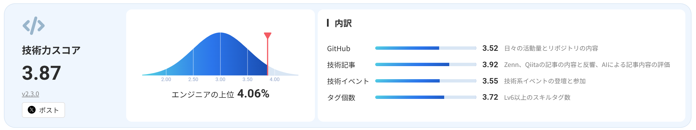

# Qiita に 100 記事書いて気づいた「いいね」が伸びなくても技術ブログを続ける理由と方法

私は 2019 年にエンジニアとしてのキャリアをスタートして以来、ほぼ毎月 Qiita に記事を投稿しています。本稿でちょうど 100 記事となることに因み、私なりの「技術ブログを継続的に執筆できた理由と工夫」を[「新人プログラマ応援 - みんなで新人を育てよう！」](https://qiita.com/official-events/fedb44eff4b119730a79)キャンペーンへ寄せることにしました。新人エンジニアの皆様のご参考になれば幸いです。

以下、執筆の流れに合わせて次の順で紹介していきます。

1. 情報収集の工夫：[ネタの収集習慣をつける](#ネタの収集習慣をつける)
2. 構成検討の工夫：[ネタを記事に仕立てる](#ネタを記事に仕立てる)
3. 自己検証の工夫：[レビューは複数の AI にしてもらう](#レビューは複数の-ai-にしてもらう)
4. 継続できた理由：[モチベーションを保つコツ](#モチベーションを保つコツ)

## ネタの収集習慣をつける

継続的なアウトプットを行うには、継続的なインプットが必要です。業務を通じて学びを得られる機会は自分でコントロールしきれないので、業務外でも主体的に学びを深める必要があります。この必要性こそ継続的なアウトプットのメリットであるとも言えるでしょう。

私は以下の媒体から情報を収集しています。

* [TechFeed](https://techfeed.io/): フォロー中の分野について、SNS 等で話題になっている記事を確認できます。
* テックニュース各紙のメールマガジン: 昔ながらですが、受動的に主要トピックを抑えられる優れた手段です。
  * [ITmedia NEWS アンカーデスクマガジン](https://mailmag.itmedia.co.jp/news/backnumber.html)
  * [＠IT通信](https://atmarkit.itmedia.co.jp/ait/subtop/info/lp/ait_new.html)
  * [CodeZine News](https://codezine.jp/ml/backnumber)
  * [gihyo.jp UPDATES](https://gihyo.jp/about/information)
  * [Think IT Weekly](https://thinkit.co.jp/member)
  * [テクノエッジニュースレター](https://www.techno-edge.net/article/2023/07/26/1650.html)
  * [MIT テクノロジーレビュー ニュースレター](https://www.technologyreview.jp/insider/pricing/)
  * [CNET Japan Newsletter](https://japan.cnet.com/info/newsletter/)
  * [IEEE Spectrum Tech Alert](https://spectrum.ieee.org/newsletters/)
* テック生態系の俯瞰
  * [Thoughtworks Technology Radar](https://www.thoughtworks.com/radar)
  * [RedMonk tecosystems](https://redmonk.com/sogrady/)
* 関心のある OSS のリリース情報
  * GitHub の Watch 機能
  * [GitHub の Tags RSS フィード](https://qiita.com/yokra9/items/c146ca514afffec3a87f)

私の場合、情報収集過程において**敢えて AI による効率化を行っていません**。興味が薄い領域の情報も含め自身の目に入れておくことで、より広い視野を持てると考えているからです。特に新人のうちは記事を読んでもわからないことは多いでしょうが、それでも目を通しておけば徐々に身になっていくものです。

### キャンペーンに便乗する

いいネタがないときは、開催中の[記事投稿キャンペーン](https://qiita.com/official-events)（11-12 月なら[アドベントカレンダー](https://qiita.com/advent-calendar/)も）を確認し、興味を惹かれるものがあればぜひ参加してみましょう。何なら、これを機に新たに興味を持ってもよいのです。趣味の技術ブログとは本来それくらい気軽で良いものなのですから。

キャンペーンの中にはプレゼント企画を行っているものもありますので、これをモチベーションにするのもよいでしょう。

## ネタを記事に仕立てる

書くネタを決めたら、いよいよ記事の執筆に移ります。

本文を書き始める前に、仮タイトルと見出し、コード・ログ等を並べて構成案を作ることをお勧めします。[^1] 続いて本文を書き、最後に正タイトルを決めます。

[^1]: この段階で筆が乗らないようなら、他のネタを検討するのも一手です。

慣れないうちは構成案を考えるのにも時間がかかることでしょう。心配せずとも、継続的にアウトプットしているうちに自分の「型」ができ、徐々にスムーズに進むようになります。ここでは参考までに私のものをご紹介します。

### 「やってみた」系[^2]や「新機能紹介」系[^3]の場合

[^2]: [Windows Hello 用赤外線カメラに見えている世界を見てみたい](https://qiita.com/yokra9/items/d564d3c99393a0d04b9d)、[WebAssembly ファーストな関数型言語「Grain」で FizzBuzz やってみる](https://qiita.com/yokra9/items/a12024d96bce6bd5f074) ほか

[^3]: [Windows 11 では 7z をコマンドラインでも圧縮・解凍できるようになっていた](https://qiita.com/yokra9/items/b1b2e92e534f5d39990a)、[Edge に内蔵された生成 AI を React + TypeScript から呼び出してみる](https://qiita.com/yokra9/items/a14e67cdee800b5e1611) ほか

本当にただの「やってみましたレポ」だと内容が薄くなってしまいますし、先行する記事との差別化もできません。私の場合、「やってみたい」と思った内容にトライアルしながら、同時に記事として書けそうな事柄がないか探しています。

* 素直に「やってみた」だけだと失敗したポイントを共有する
  * 公式ドキュメント通りに動かなかった点、環境依存で詰まった箇所は、それ自体が記事のミソになります。成功談より失敗談の方が、何かとタメになるものです。
* 「やってみた」結果をサンプルとして GitHub に公開し、それを紹介する記事にする
  * 実際に動くリポジトリが添えられていると、記事の実用性と信頼感が一段上がります。

### 「困りごと + 解決策」系[^4]の場合

[^4]: [Scala Steward を ubuntu-latest な GitHub Actions で使っていたら何もしていないのにコケるようになった](https://qiita.com/yokra9/items/21c94c9775368b9d704b) ほか

困りごとだけだと記事にならないので、まず解決策が見つかるまで追い込みます。逆に言えば、解決策が見つかっていない困りごとは、まだ取り上げる時期ではありません。

* GitHub の Issue や英語圏コミュニティで見つけたワークアラウンドを共有する
  * 英語圏にしか情報がないネタを取り上げると、日本語話者にとって価値が出ます。
  * それでも単なる翻訳記事にはせず、自分の環境で再現した手順に落とし込みましょう。日本語環境に起因するバグを引き当てる可能性もあったりします。
* 自分で Issue を立てたり PR を作成した場合は、それを紹介する記事にする
  * 少しハードルは高いですが、PR がマージされて Release に名前が載った時は嬉しいものです。

### 「まとめてみた」系[^5]の場合

[^5]: [Jakarta EE 10 で API と実装が分離された Specification の一覧](https://qiita.com/yokra9/items/f27484dda853092ed9eb) ほか

自分が調査過程で「この情報がまとまっていたら楽だったのに！」と感じた事柄は、ほぼ確実に他の誰かも同じ不満を抱いています。

* 公式ドキュメントが複数ページに散っている内容を 1 記事に集約する
  * 単なる整理と侮るなかれ。過程で学びを得ることもあれば、「やってみたい」や「困りごと」に繋がることもあります。

## レビューは複数の AI にしてもらう

記事が書けたら、投稿前に見直しましょう。下書きを一晩寝かせて見返すだけでも不思議と問題点は見つかるものです。

…というテクニックも今は昔。現代では AI による第三者視点のレビュー結果を即座に受け取れます。特にお勧めしたいのが複数のモデルに同時にレビューしてもらうことです。より公平かつ広い観点の指摘を得られます。この用途で便利なのが、[天秤 AI](https://tenbin.ai/) や [OpenRouter](https://openrouter.ai) などの複数モデルのレスポンスを比較できるサービスです。

記事の品質を高めるには AI に遠慮のない指摘をさせることも大切ですが、こと継続に重きを置けば心を折られない工夫も必須です。そこで、私は次のプロンプトを使用して飴と鞭のバランスを取っています。

```plaintext
あなたは敏腕編集者です。この技術ブログについて辛口でレビューをしつつ、見どころがあれば褒めてください。

---

以下本文...
```

あえて観点を固定化していないことで、モデルごと・試行ごとに多様な指摘をしてくれる点もお気に入りです。

レビュー結果を踏まえ修正を済ませたら、いよいよ投稿です。お疲れ様でした！

## モチベーションを保つコツ

…と言っているうちにも、来月末へのカウントダウンは始まっています。公私ともに忙しい中、継続のモチベーションはどのように維持していけばよいのでしょうか。

### 「いいね」をモチベーションにしていたら続かなかった

これは、本稿執筆にあたり現況を分析していて気づいた重要な点です。

私は稼いだ「いいね」の数より「広大なネットの中から辿り着いた誰かの助けになること」に価値を置いています。そうでなければ、とっくに投げ出してしまっていたことでしょう。

ここで、「いいね」数が上位の記事を振り返ってみましょう。

* [JSON にもコメントを書きたい](https://qiita.com/yokra9/items/1ac03876415d7fd47a65): 478 いいね
* [Windows Terminal で Git Bash を表示する](https://qiita.com/yokra9/items/bdd0882268b308cf22ca): 206 いいね
* [文系卒のクソザコ WEB 系エンジニアが関数型言語に入門した結果をまとめた](https://qiita.com/yokra9/items/76a9265e03bf6f4d6810): 74 いいね
* [オフライン環境でも yum / dnf で依存関係を解決しながらパッケージを導入したい](https://qiita.com/yokra9/items/e8842dee2c42fc479931) : 55 いいね
* [Docker コンテナの監視ツールについて](https://qiita.com/yokra9/items/1e48ea2492ed00c2c38f): 44 いいね

投稿時点で累計 1,416 の「いいね」をいただいていますから、上位 5 記事で半分以上を稼いでいることがわかります。一般的なお困りごとを題材とした記事に集中して「いいね」を押下される傾向が顕著ですね。

しかし、近頃の私はネット上に日本語情報が少ないニッチなネタを優先して選びがちです。これは上述の価値基準に照らし、新規性を重視したネタ選びをしているためです。結果「いいね」数は伸び悩んでいますが、引き続き「誰かが困った時に頼れる情報を書き残しておきたい」という気持ちを大切にしたいものです。そうして Web における知の蓄積にわずかながらでも貢献しないと、AI を使って粗製乱造された記事で押し流されてしまいそうですから。

…と内発的動機づけの重要性を説きつつも、外部からの誘因もなければ実際に継続していくことは難しいでしょう。ここから先は「いいね」以外の方法で自分をハックし、モチベーションに繋げる実践的なテクニックをご紹介します。

### 転職サイトにアカウントを連携する

Lapras や Forkwell、Findy といったエンジニア向け転職サイトでは Qiita 等の技術ブログサービスとアカウントを連携でき、記事のレビューや技術力の評価をしてくれます。実際には転職をする気がなかったとしても、自身のアウトプットがポートフォリオ的に掲載されるのは嬉しいものです。継続的なアウトプットを評価してスカウトを送る採用担当者も少なくないので、これがモチベーションに繋がるという人もいるでしょう。

また、これらのサービスが開催する勉強会等の会員向けコンテンツが執筆のネタに繋がるケースもあり得ます。コロナ禍以降はオンライン配信・レコーディングありの勉強会も増えていますので、気軽に参加していきましょう。

### 最初はとにかく毎月投稿する

最初は無理をしてでも毎月投稿を続けてみましょう。すると、Qiita の通知欄にこのような通知が現れるはずです。



Qiita の[バッジ機能](https://help.qiita.com/ja/articles/qiita-badge)では連続投稿の達成（週次・月次・年次）などによりでバッジを取得できます。

「もし今月投稿しなかったら、次に新しい『〇ヶ月連続投稿』バッジを手に入れられるのはいつになるだろう」と考えれば、これも 1 つの大きなモチベーションになるはずです（[埋没費用効果](https://ja.wikipedia.org/wiki/%E5%9F%8B%E6%B2%A1%E8%B2%BB%E7%94%A8)）。

## 新人エンジニアこそ技術ブログを書こう

というわけで、私なりに新人エンジニアに送る「技術ブログを継続的に執筆する工夫」は以上です。新人の頃はとかく業務内外で学びを得る機会が特に多い時期です。せっかく得た知見ですから、インターネットに放流して「広大なネットから辿り着いてくれた誰かの助け」にしてみましょう。あなたの書いた記事は、いずれ次の新人を助けてくれるはずです。この記事があなたの助けになることを願います。

## 参考情報

モチベーションに繋がるかどうか、私の Contribution と記事投稿数を [Qiita のいろいろランキング](https://qiita.com/Qiita/items/67f7fc1c79173c9a6c44)と比較したものをおまけとして記載しておきます。興味のある方は、1つの事例として見ていただければ。

<!-- markdownlint-disable-next-line MD033 -->
<details><summary>クリックして展開…</summary>

### Contribution

投稿時点で累計 2096 Contributions でした。ランキングでは年間 Contributions の増分の分布が公開されているので、振り返りレポートのある過去 3 年について比較します。

* [2025](https://qiita.com/yokra9/yearly-summary/2025) : +117 Contributions (上位 2.7 ％)
* [2024](https://qiita.com/yokra9/yearly-summary/2024) : +234 Contributions (上位 1.3 ％)
* 2023 : +146 Contributions (上位 3.6 ％)

おおよそ上位 5 ％程度のラインには載っているようです。面白いことに、[Lapras](https://lapras.com/public/YLHUELF) の技術力スコアでも近い数字が出ていました。Zenn や GitHub、Connpass を含めた総合評価でもこうなるというのは、なかなか興味深いものがあります。



正規分布なら偏差値 66 あたりでしょうか。高いとみるか低いとみるかはあなた次第です。

### 記事投稿数

同様に記事投稿数も見てみましょう。ここ 3 年はペースを崩さず月一投稿でしたが、Qiita 全体の勢いにより微妙に位置は異なります。

* [2025](https://qiita.com/yokra9/yearly-summary/2025) : +12 記事 (上位 9.4 ％)
* [2024](https://qiita.com/yokra9/yearly-summary/2024) : +12 記事 (上位 20.4 ％)
* 2023 : +12 記事 (上位 8.2 ％)

AI で生成したと思しき記事が大量に投稿される昨今、記事投稿数（およびそれを計算式に含む Contribution）の分布傾向には変動が予測されます。2026 年はいったい上位何％になっているのでしょうね。

</details>
