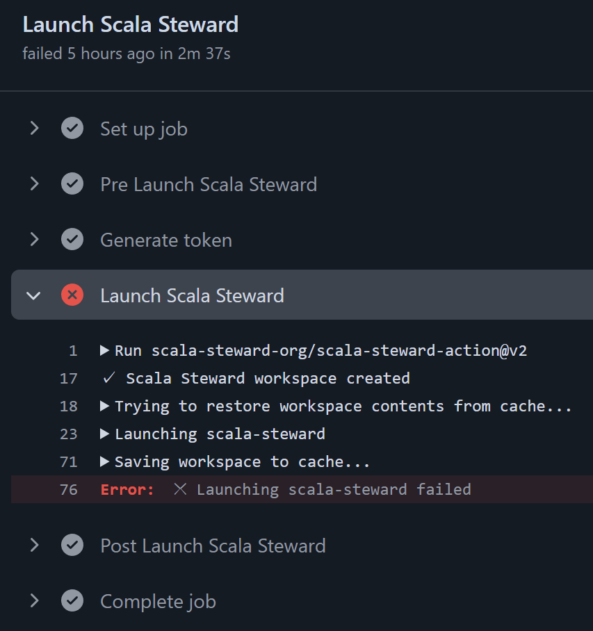

# Scala Steward を Ubuntu-latest な GitHub Actions で使っていたら何もしていないのにコケるようになった

[以前の記事](https://qiita.com/yokra9/items/5d80a9397951091ed637) で [Scala Steward を GitHub Actions で使う方法](https://qiita.com/yokra9/items/5d80a9397951091ed637#scala-steward-%E3%82%92-github-actions-%E3%81%A7%E4%BD%BF%E3%81%86)をご紹介しました。Scala でも Dependabot のように依存ライブラリをアップデートする PR を自動で作成してくれて便利です。

そのため、 自身のプロジェクトでも当然 `scala-steward-action` を使用していたのですが、2024 年 9 月 28 日の実行で突然コケるようになりました。



ログを確認してみると、[sbt](https://www.scala-sbt.org/) がインストールされていないと怒っています。

```log
  2024-09-28 00:33:55,676 INFO   
    ____            _         ____  _                             _
   / ___|  ___ __ _| | __ _  / ___|| |_ _____      ____ _ _ __ __| |
   \___ \ / __/ _` | |/ _` | \___ \| __/ _ \ \ /\ / / _` | '__/ _` |
    ___) | (_| (_| | | (_| |  ___) | ||  __/\ V  V / (_| | | | (_| |
   |____/ \___\__,_|_|\__,_| |____/ \__\___| \_/\_/ \__,_|_|  \__,_|
   v0.30.2
   
  2024-09-28 00:33:57,972 INFO  Loaded 279 artifact migration(s)
  2024-09-28 00:33:58,072 INFO  Loaded 35 Scalafix migration(s)
  2024-09-28 00:33:58,179 INFO  Loaded 1 repo config(s)
  2024-09-28 00:33:58,400 INFO  Run self checks
  2024-09-28 00:33:58,692 INFO  Using git version 2.46.1
  2024-09-28 00:33:59,212 INFO  Using scalafix 0.13.0
  2024-09-28 00:33:59,709 INFO  Using scalafmt 3.8.3
  2024-09-28 00:34:00,490 INFO  Removing any run-specific files
  2024-09-28 00:34:00,502 INFO  ──────────── Steward yokra9/akka-http-example ────────────
  2024-09-28 00:34:00,503 INFO  Check cache of yokra9/akka-http-example
  2024-09-28 00:34:00,933 INFO  Clone yokra9/akka-http-example
  2024-09-28 00:34:01,143 INFO  Refresh cache of yokra9/akka-http-example
  2024-09-28 00:34:01,233 INFO  Get dependencies in . from sbt
  2024-09-28 00:34:01,298 ERROR Steward yokra9/akka-http-example failed
  java.io.IOException: Cannot run program "sbt" (in directory "/home/runner/scala-steward/workspace/repos/yokra9/akka-http-example"): error=2, No such file or directory
    at java.base/java.lang.ProcessBuilder.start(ProcessBuilder.java:1143)
    at java.base/java.lang.ProcessBuilder.start(ProcessBuilder.java:1073)
    at org.scalasteward.core.io.process$.$anonfun$createProcess$2(process.scala:106)
    at flatMap @ org.scalasteward.core.io.process$.createProcess(process.scala:104)
    at flatMap @ org.scalasteward.core.io.process$.slurp(process.scala:62)
    at delay @ org.typelevel.log4cats.slf4j.internal.Slf4jLoggerInternal$Slf4jLogger.isDebugEnabled(Slf4jLoggerInternal.scala:73)
    at ifM$extension @ org.typelevel.log4cats.slf4j.internal.Slf4jLoggerInternal$Slf4jLogger.info(Slf4jLoggerInternal.scala:99)
    at >>$extension @ org.scalasteward.core.update.artifact.ArtifactMigrationsLoader.loadMigrations(ArtifactMigrationsLoader.scala:45)
    at main$ @ org.scalasteward.core.Main$.main(Main.scala:23)
    at main$ @ org.scalasteward.core.Main$.main(Main.scala:23)
  Caused by: java.io.IOException: error=2, No such file or directory
    at java.base/java.lang.ProcessImpl.forkAndExec(Native Method)
    at java.base/java.lang.ProcessImpl.<init>(ProcessImpl.java:314)
    at java.base/java.lang.ProcessImpl.start(ProcessImpl.java:244)
    at java.base/java.lang.ProcessBuilder.start(ProcessBuilder.java:1110)
    at java.base/java.lang.ProcessBuilder.start(ProcessBuilder.java:1073)
    at org.scalasteward.core.io.process$.$anonfun$createProcess$2(process.scala:106)
    at cats.effect.IOFiber.runLoop(IOFiber.scala:1004)
    at cats.effect.IOFiber.asyncContinueSuccessfulR(IOFiber.scala:1368)
    at cats.effect.IOFiber.run(IOFiber.scala:113)
    at cats.effect.unsafe.WorkerThread.run(WorkerThread.scala:743)
  2024-09-28 00:34:01,301 INFO  ──────────── Total time: Steward yokra9/akka-http-example: 798ms ────────────
  2024-09-28 00:34:01,308 INFO  ──────────── Total time: run: 2s 908ms ────────────
```

## `ubuntu-latest` から sbt が消えていた

2024 年 9 月 25 日から 2024 年 10 月 30 日にかけて、[`ubuntu-latest` ランナーの指すバージョンが 22.04 から 24.04 に変更されます](https://github.com/actions/runner-images/issues/10636)。アナウンスの Issue では言及されていませんが、この変更によって sbt がプリインストールされなくなったようです。該当のプロジェクトでは `ubuntu-latest` を指定していたため、28 日時点で変更が適用されたことになります。

```yml:.github/workflows/DependencyUpdate.yml
jobs:
  scala-steward:
    runs-on: ubuntu-latest
    name: Launch Scala Steward
```

これは[当時のドキュメント](https://github.com/scala-steward-org/scala-steward-action/blob/8f8b9946a3d5639fc2c09ccf1cf6395ceb003e98/README.md)を参考とした設定でしたが、[現在のドキュメント](https://github.com/scala-steward-org/scala-steward-action/blob/29f3605dc74127ab3a2c984253e767e841c240fa/README.md)では `ubuntu-22.04` 決め打ちとなっています。これは [`ubuntu-20.04` 環境で発生するエラー](https://github.com/scala-steward-org/scala-steward-action/issues/442#issuecomment-1361062303)のワークアラウンドだったようですが、幸運にも今回の事象も回避する結果になっています。[^1]

[^1]: 不幸にも発見が遅れた、という見方もできます。

せっかく `ubuntu-latest` を使用しているなら、できればこのまま最新版を追いかけたいところです。解決法はシンプルで、[公式ガイド](https://www.scala-sbt.org/download/)を参考に sbt のインストール手順を追加するだけです：

```yml:.github/workflows/DependencyUpdate.yml
name: Launch Scala Steward

on:
  schedule:
    - cron: '0 0 * * *'
  workflow_dispatch:

jobs:
  scala-steward:
    runs-on: ubuntu-latest
    name: Launch Scala Steward
    steps:
      - name: Generate token
        id: generate-token
        uses: tibdex/github-app-token@v1
        with:
          app_id: ${{ secrets.APP_ID }}
          private_key: ${{ secrets.APP_PRIVATE_KEY }}

      - name: Install sbt
        run: |
          echo "deb https://repo.scala-sbt.org/scalasbt/debian all main" | sudo tee /etc/apt/sources.list.d/sbt.list
          echo "deb https://repo.scala-sbt.org/scalasbt/debian /" | sudo tee /etc/apt/sources.list.d/sbt_old.list
          curl -sL "https://keyserver.ubuntu.com/pks/lookup?op=get&search=0x2EE0EA64E40A89B84B2DF73499E82A75642AC823" | sudo apt-key add
          sudo apt-get update
          sudo apt-get install sbt

      - name: Launch Scala Steward
        uses: scala-steward-org/scala-steward-action@v2
        with:
          github-token: ${{ steps.generate-token.outputs.token }}
          author-email: 41898282+github-actions[bot]@users.noreply.github.com
          author-name: github-actions[bot]
```

## 参考リンク

* [Ubuntu-latest workflows will use Ubuntu-24.04 image · Issue #10636 · actions/runner-images](https://github.com/actions/runner-images/issues/10636)
* [Runner error: version `GLIBC_2.32' not found · Issue #442 · scala-steward-org/scala-steward-action](https://github.com/scala-steward-org/scala-steward-action/issues/442)
* [Scala でも Dependabot のように依存ライブラリをアップデートする PR を自動で作成してほしい（GitHub Actions）](https://qiita.com/yokra9/items/5d80a9397951091ed637)
