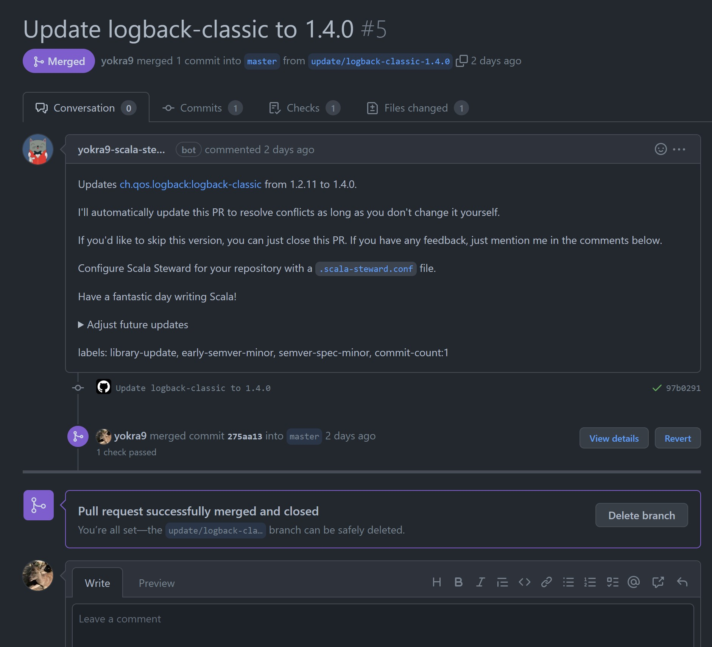

# Scala でも Dependabot のように依存ライブラリのアップデート PR を自動で作成してほしい（Github Actions）

## TL;DR

[Scala Steward Github Action](https://github.com/scala-steward-org/scala-steward-action) を使いましょう。

## Scala では Dependabot が使えない

以前 [Scala で作った Web アプリを Dockerize して動かす(令和最新版)](https://qiita.com/yokra9/items/dd560305ccb5fc8cd6e1) という記事を書いたのですが、執筆から1年以上がすぎ紹介している各ライブラリのバージョンが古くなっていました。これでは令和最新版じゃありません。当該記事ではサンプルリポジトリを作っていましたので、そこで依存ライブラリのアップデート検証をすることにしました。

まずは[検証が楽なように ScalaTest で自動テストを書き、GitHub Actions で走らせました](https://github.com/yokra9/akka-http-example/actions/runs/3007863574)。せっかくなので [sbt-scoverage](https://github.com/scoverage/sbt-scoverage) で生成したカバレッジレポートを [upload-artifact](https://github.com/actions/upload-artifact) で Actions の完了画面にアップロードさせてみるなどしました。

さぁ次は依存ライブラリのアップデートだ、`dependabot.yml` を書くぞ、というところでハタと気づきます。他の Scala プロジェクトで Dependabot が動いているところを見たことがありません。[GitHub のドキュメント](https://docs.github.com/en/code-security/dependabot/dependabot-version-updates/configuration-options-for-the-dependabot.yml-file#package-ecosystem)でも、サポート対象のパッケージマネージャとして記載されていません。

## Scala Steward について

[Scala Steward](https://github.com/scala-steward-org/scala-steward) は依存ライブラリ、sbt プラグイン、および Scala と sbt のバージョンアップを行う PR を自動作成してくれる OSS です。おおよそ Dependabot と同じ事をしてくれますね。Akka や Play Framework Slick といった著名な Scala プロジェクトでも採用されていますから、それらの PR やコミットログで動きを確認できます。[Scala Steward が紹介された Scala Blog の記事](https://www.scala-lang.org/blog/2019/07/10/announcing-scala-steward.html)が2019年7月で、[Dependabot が GitHub に買収されて無料で使えるようになった](https://web.archive.org/web/20190523085003/https://dependabot.com/blog/hello-github/)のが2019年の5月です。このあたりで依存アップデート自動化の波が来ていたことがわかります[^1]。

[^1]: ちなみに [dependabot-core の初期リリース](https://github.com/dependabot/dependabot-core/releases/tag/v0.1.0)は2017年4月で、そのベースとなった [gocardless/bump の Initial commit](https://github.com/gocardless/bump/commit/5d64acab5471049b01386f13d5e5af7382d7f97c) は2015年10月です。[scala-steward の初期リリース](https://github.com/scala-steward-org/scala-steward/releases/tag/v0.1.0)が2019年2月なので、dependabot のほうが歴史あるプロジェクトとなります。

Scala Steward 自体はサービスではなくソフトウェアなので実行するためのホストが必要です。かつては[開発者でもある @fthomas さんが無償利用できる環境を提供していました](https://github.com/scala-steward-org/repos)が、現在は [VirtusLab 社がその役割を引き継いでいます](https://github.com/VirtusLab/scala-steward-repos)。

## Scala Steward を Github Actions で使う

[Scala Steward Github Action](https://github.com/scala-steward-org/scala-steward-action) はそんな Scala Steward を Github Actions で走らせるための Action です。VirtusLab 社の環境を使わせてもらってもいいのですが、GitHub Actions なら独自の環境をお手軽に用意できるメリットがあります。

セットアップ方法については、[README.md にかなり詳細なチュートリアルが掲載されている](https://github.com/scala-steward-org/scala-steward-action#usage)ので、そう迷うことはないはずです（私が試した際に迷ったポイントは [PR を投げて修正させてもらいました](https://github.com/scala-steward-org/scala-steward-action/pull/400)）[^2]。

[^2]: GitHub の仕様変更がない限り。

セットアップに成功すると、このように[かなり詳細な PR](https://github.com/yokra9/akka-http-example/pull/5) を作成してくれます。ネコちゃん執事のアイコンが可愛いですね。

## 参考リンク

* [Scala Steward](https://github.com/scala-steward-org/scala-steward)
* [Scala Steward Github Action](https://github.com/scala-steward-org/scala-steward-action)
* [KEEP YOUR PROJECTS UP-TO-DATE WITH SCALA STEWARD](https://www.scala-lang.org/blog/2019/07/10/announcing-scala-steward.html)
* [My public Scala Steward instance is not running anymore. I've turned it off to focus my attention and energy on other matters.](https://twitter.com/fst9000/status/1532088018084978689)
* [Configuration options for the dependabot.yml file](https://docs.github.com/en/code-security/dependabot/dependabot-version-updates/configuration-options-for-the-dependabot.yml-file#package-ecosystem)
