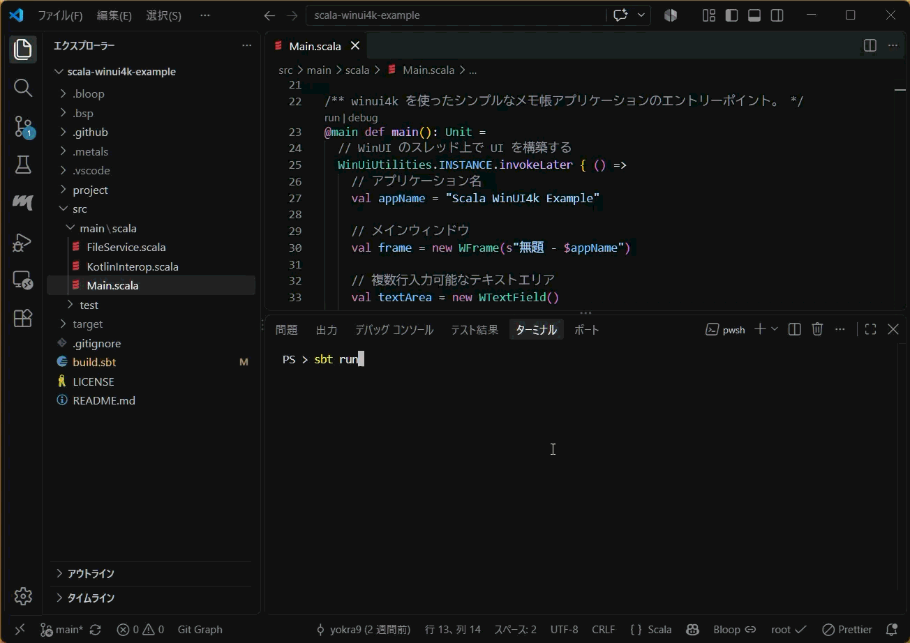

# Scala でも WinUI 3 なデスクトップアプリを開発したい with WinUI4K

[WinUI 3](https://learn.microsoft.com/ja-jp/windows/apps/winui/winui3/) は [Windows App SDK](https://learn.microsoft.com/ja-jp/windows/apps/windows-app-sdk/) の一部として提供されるネイティブ UI フレームワークです。.NET だけでなく、C++ Win32 や WinRT ABI からも使用可能で、[Fluent Design](https://fluent2.microsoft.design/) に対応したモダンなデスクトップ体験を実現できます。

NTTレゾナントテクノロジーは 7 月 23 日、WinUI 3 を Kotlin / Java から呼び出せるライブラリ [WinUI4K](https://github.com/nttr-tech/winui4k) をリリースしました。

> WinUI4K を使うと、ブリッジ DLL も C# も Visual Studio も使わずに、Kotlin や Java だけで WinUI を使った Windows ネイティブアプリを作れます。 WinUI4K は Java の FFI (Panama / JNA / JNR) から WinRT ABI (バイナリレベルの呼び出し規約) を直接呼び出すため、言語とランタイムの間の橋渡し用ネイティブ DLL を同梱する必要がありません。
> NTTレゾナントテクノロジーが提供する、インターネット経由でスマートフォン実機を借りられるサービス「Remote TestKit」の PC クライアント向けに活かすことを一つの目的として試作したライブラリです。 Apache License 2.0 で公開しており、商用か非商用かを問わず自由に利用できます。[^1]

[^1]: <https://github.com/nttr-tech/winui4k/blob/master/README.ja.md>

素晴らしい試みです！ [JavaFX](https://openjfx.io/) に [JMetro](https://www.pixelduke.com/java-javafx-theme-jmetro/) や [Transit](https://www.pixelduke.com/transit-java-javafx-theme/) などのテーマを適用してもそれっぽい UI は実現できますが、Fluent Design そのものなネイティブ UI が使えるというのは魅力的です。なにより、日本企業が公開した OSS は応援したいところですからね。

というわけで、本記事は WinUI4K を Kotlin でも Java でもなく、Scala から呼び出してデスクトップアプリケーションを構築する方法をご紹介するものです。なお、サンプルコードの全文は[こちらのリポジトリ](https://github.com/yokra9/scala-winui4k-example/)に掲載しています。

## とりあえずサンプルを実行してみる

WinUI4K でビルドしたアプリの実行には Windows App SDK 2.4 ランタイムのインストールが必要です。[最新の Windows アプリ SDK ダウンロード](https://learn.microsoft.com/ja-jp/windows/apps/windows-app-sdk/downloads) のページからダウンロードしてください。

あとはリポジトリをクローンし、以下のコマンドを実行すれば、Scala 製の WinUI 3 なメモ帳アプリが起動するはずです。

```powershell
sbt run
```



見た目は完全にネイティブですが、ソースは Scala で書かれているのが面白いところですね。

また、以下のコマンドで Fat JAR の生成・実行も可能です。

```powershell
sbt assembly
java -jar .\scala-winui4k-example-assembly.jar
```

## Scala で WinUI4K を利用する際のポイント

WinUI4K の導入自体に難しいところはなく、`libraryDependencies` に追加してあげるだけです。

```sbt:build.sbt
val scala3Version = "3.9.0"

lazy val root = project
  .in(file("."))
  .settings(
    name := "scala-winui4k-example",
    version := "0.1.0-SNAPSHOT",
    scalaVersion := scala3Version,
    fork := true,
    Compile / run / javaOptions ++= Seq("--enable-native-access=ALL-UNNAMED"),
    assembly / mainClass := Some("main"),
    assembly / assemblyJarName := "scala-winui4k-example-assembly.jar",
    assembly / target := baseDirectory.value,
    assembly / assemblyMergeStrategy := {
      case PathList(ps @ _*) if ps.last.endsWith("module-info.class") =>
        MergeStrategy.discard
      case x =>
        val oldStrategy = (assembly / assemblyMergeStrategy).value
        oldStrategy(x)
    },
    libraryDependencies ++= Seq(
      "com.appkitbox.winui4k" % "winui4k-all" % "0.1.0",
    )
  )
```

ただし、Kotlin 用のライブラリなのでそのままではうまく動きません。具体的には、Kotlin のユニットと Scala のユニットは違う型なので、そのままだと型エラーになります。ここで、[暗黙の型変換](https://docs.scala-lang.org/ja/tour/implicit-conversions.html)を用意してあげるとスマートに書けます。

```Scala:KotlinInterop.scala
import scala.language.implicitConversions

/** Scala の `Unit` と Kotlin の `Unit` を相互運用するためのユーティリティ. */
object KotlinInterop:

  /** Scala の `Unit` から Kotlin の `Unit` への暗黙的な変換.
    *
    * `import KotlinInterop.given` でスコープに入れることで, Kotlin の `Unit` を返す API に対して通常の
    * Scala の `Unit` ブロックをそのまま渡せる.
    *
    * @return
    *   `kotlin.Unit.INSTANCE`
    */
  given Conversion[Unit, kotlin.Unit] with
    def apply(x: Unit): kotlin.Unit =
      kotlin.Unit.INSTANCE

  /** Scala の `() => Unit` から Kotlin の `Function0<Unit>` への暗黙的な変換.
    *
    * `import KotlinInterop.given` でスコープに入れることで, Kotlin の `Function0<Unit>`
    * を要求するコールバック API に対して, 通常の引数なし Scala 関数をそのまま渡せる.
    *
    * @return
    *   `kotlin.Unit` を返す Kotlin の `Function0`
    */
  given Conversion[() => Unit, kotlin.jvm.functions.Function0[kotlin.Unit]] with
    def apply(f: () => Unit): kotlin.jvm.functions.Function0[kotlin.Unit] =
      () =>
        f()
        kotlin.Unit.INSTANCE
```

続けて、アプリの本文です。Metals を有効化していれば補完ベースで直感的に記述できる程度にはわかりやすい API になっているのが嬉しいところです。Kotlin の companion object へのアクセスに `.Companion` を経由した冗長な書き方が必要なのは致し方ないところでしょう。

```Scala:Main.scala
import com.appkitbox.winui4k.{WFrame, WGrid, WMenuBar, WMenuBarItem, WMenuFlyoutItem, WTextField, WLabel,  WContentDialog, ContentDialogResult, ContentDialogButton, WinUiUtilities, WDimension, GridLength, VirtualKey, VirtualKeyModifier}
import java.nio.file.{Path, Paths}
import file.FileService
import KotlinInterop.given

/** winui4k を使ったシンプルなメモ帳アプリケーションのエントリーポイント. */
@main def main(): Unit =
  // WinUI のスレッド上で UI を構築する
  WinUiUtilities.INSTANCE.invokeLater { () =>
    // アプリケーション名
    val appName = "Scala WinUI4k Example"

    // メインウィンドウ
    val frame = new WFrame(s"無題 - $appName")

    // 複数行入力可能なテキストエリア
    val textArea = new WTextField()

    // 現在編集中のファイルパス。None の場合は未保存の新規ドキュメント
    var currentFile: Option[Path] = None

    // 改行を受け付けるようにして、プレースホルダーを設定
    textArea.setAcceptsReturn(true)
    textArea.setPlaceholderText("ここに入力してください...")

    // 中略...
    // [ファイル] メニューの各項目を構築
    val openItem = new WMenuFlyoutItem("開く", null)
    openItem.setKeyboardAcceleratorText("Ctrl+O")
    openItem.addActionListener { () =>
      showOpenDialog()
    }

    /** 「開く」ダイアログを表示する。 winui4k の WContentDialog を使用し、相対パスを手入力してファイルを開く。 */
    def showOpenDialog(): Unit =
      val fileNameInput = new WTextField()
      fileNameInput.setPlaceholderText("メモ.txt")

      val label = new WLabel("ファイル名：")

      val dialogContent = new WGrid()
      dialogContent.addColumn(GridLength.Companion.star(1.0))
      dialogContent.addRow(GridLength.Companion.getAUTO())
      dialogContent.addRow(GridLength.Companion.getAUTO())
      dialogContent.add(label, 0, 0, 1, 1)
      dialogContent.add(fileNameInput, 1, 0, 1, 1)

      val dialog = new WContentDialog("開く", dialogContent)
      dialog.setPrimaryButtonText("開く")
      dialog.setCloseButtonText("キャンセル")
      dialog.setDefaultButton(ContentDialogButton.PRIMARY)
      dialog.show(
        textArea,
        result =>
          if result == ContentDialogResult.PRIMARY then
            val input = fileNameInput.getText()
            if input != null && input.trim.nonEmpty then
              try openFrom(Paths.get(input.trim))
              catch
                case e: Exception =>
                  showErrorDialog(s"ファイル名が無効です。\n${e.getMessage}")
      )

 
    // [ファイル] メニューを組み立てる
    val fileMenu = new WMenuBarItem("ファイル")
    fileMenu.add(newItem)
    fileMenu.add(openItem)
    fileMenu.add(saveItem)
    fileMenu.add(saveAsItem)

    val menuBar = new WMenuBar()
    menuBar.add(fileMenu)

    // メニュー行とテキストエリア行を縦に配置
    val grid = new WGrid()
    grid.addColumn(GridLength.Companion.star(1.0))
    grid.addRow(GridLength.Companion.getAUTO()) // メニューバー
    grid.addRow(GridLength.Companion.star(1.0)) // テキストエリア（残り全体）
    grid.add(menuBar, 0, 0, 1, 1)
    grid.add(textArea, 1, 0, 1, 1)

    // ウィンドウの内容を設定して表示
    frame.setContentPane(grid)
    frame.getAppWindow().setSize(new WDimension(800, 600))
    frame.setVisible(true)

    System.out.println("App Started")
  }
```

Scala の書き味でネイティブ UI が構成されるのはなかなか斬新な体験です。30 億のデバイスで走る必要がない、Windows 専用ツールを Scala で書く機会があれば、ぜひ参考にしてみてください。

## 余談

2025 年末、私は[「マイナーなフレームワークを選定すると生成 AI の成果は明らかに劣化する」](https://qiita.com/yokra9/items/559ebbb3ffdfe1ddfa15#%E3%81%BE%E3%81%A8%E3%82%81%E3%81%A8%E3%83%9D%E3%82%A8%E3%83%A02025-%E5%B9%B4%E6%9C%AB%E3%81%AB%E3%81%8A%E3%81%91%E3%82%8B%E6%9C%AA%E6%9D%A5%E5%B1%95%E6%9C%9B)という旨を記事で述べました。しかし 2026 年 10 月現在、ここに「MCP などを経由して解析手段が提供される場合は、その限りではない」という点を付け加えます。

今回用意したサンプルアプリは、大部分を `Kimi-K2.7-Code` に作成してもらっています。WinUI4K 自体がまだマイナーなフレームワークということもあり、GitHub 上のドキュメントを渡すだけでは上手くコーディングしてくれませんでした。しかし、[Metals の MCP サーバ](https://scalameta.org/metals/docs/features/mcp/) を有効化したうえで、`compile-file` 等のツールを使用するよう指示を出すと、かなり手直しの箇所を減らすことができました。

マイナーなフレームワークでも言語側の MCP サーバを設定してやれば効率が上がることを体験できたのは、技術選択の幅を広く保つという意味で僥倖です。まだメジャーになれていない技術にも面白いものはあるはずですし、それを生成 AI の力で気軽に試せるというのは現代ならではの醍醐味と言えそうです。

## 参考リンク

* [A deep-dive into WinUI 3 in desktop apps - Windows Developer Blog](https://blogs.windows.com/windowsdeveloper/2020/07/07/a-deep-dive-into-winui-3-in-desktop-apps/)
* [Kotlin/JavaでモダンなWinUIアプリを開発できるライブラリ「WinUI4K」が登場 - 窓の杜](https://forest.watch.impress.co.jp/docs/news/2130040.html)
* [WinUI の歴史とアーキテクチャ](https://qiita.com/0x5bfa/items/a699fded976c56c744fd)
* [C++/WinRT と ABI の間の相互運用 - Windows apps | Microsoft Learn](https://learn.microsoft.com/ja-jp/windows/apps/develop/cpp-winrt/interop-winrt-abi)
