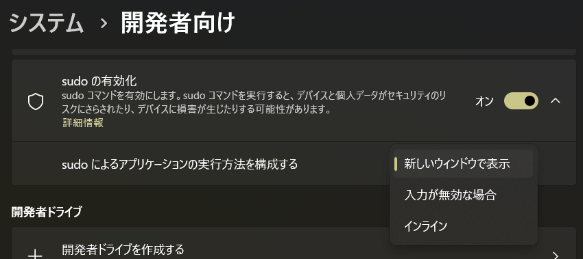
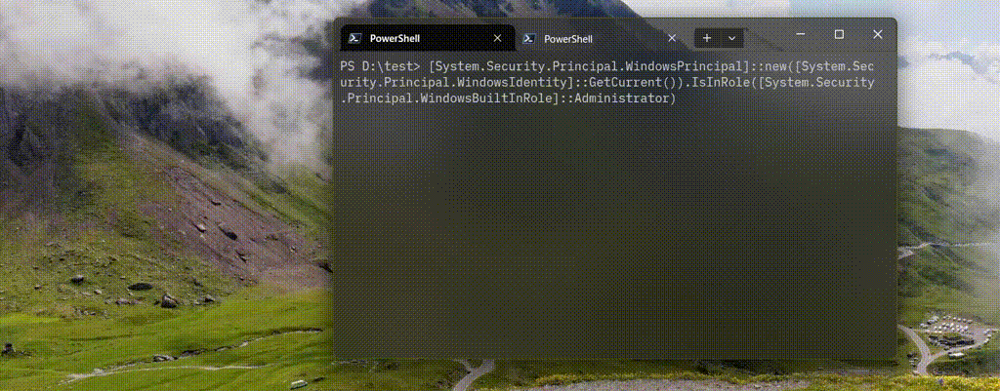
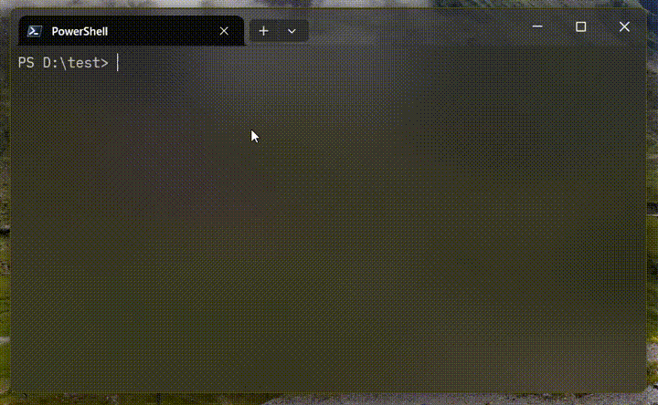
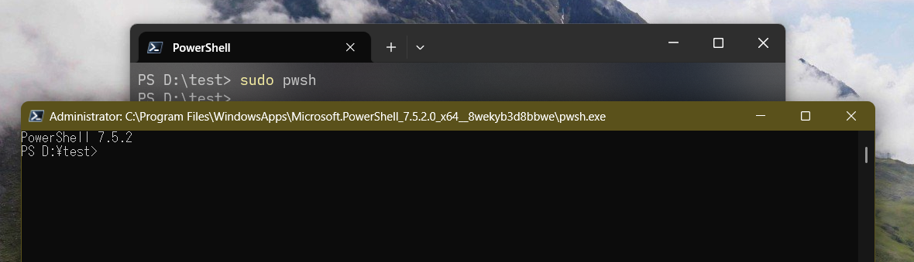
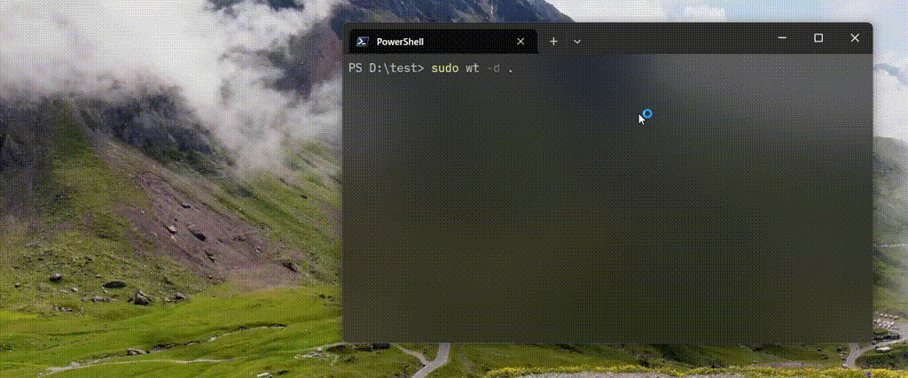

# Sudo for Windows でカレントディレクトリを維持したまま新しい Windows Terminal を開きたい

6 年前に投稿した [PowerShell でも su とか sudo っぽいことをする](https://qiita.com/yokra9/items/6a783e4288f9f16deea9) という記事で sudo ライクなことをするための方法をご紹介しました。時は流れ 2024 年 10 月、Windows 11 24H2 にてついに公式で [Sudo for Windows](https://learn.microsoft.com/ja-jp/windows/advanced-settings/sudo/) が搭載されました。設定アプリの [システム] - [開発者向け] から有効化することで利用可能になります。



Sudo for Windows 標準の挙動としては、`sudo <コマンド>` を実行すると、新しいコンソールウィンドウが開いて、そのウィンドウで `<コマンド>` が実行される形になります。また、`<コマンド>` には PowerShell コマンドレットを直接指定できず、`pwsh -Command` で渡してあげる必要があります。

```powershell
# 管理者権限で実行されているか確認する。
[System.Security.Principal.WindowsPrincipal]::new([System.Security.Principal.WindowsIdentity]::GetCurrent()).IsInRole([System.Security.Principal.WindowsBuiltInRole]::Administrator)

# sudo をつけて実行する。末尾の Read-Host コマンドレットで実行を一時停止している。
sudo pwsh -Command "[System.Security.Principal.WindowsPrincipal]::new([System.Security.Principal.WindowsIdentity]::GetCurrent()).IsInRole([System.Security.Principal.WindowsBuiltInRole]::Administrator);Read-Host"
```



## 新しいウィンドウを開かずに特権を取得した PowerShell に切り替えたい

設定画面で `インライン` を選択するか、下記コマンドを実行することで `sudo` のモードを切り替えることができます。

```powershell
sudo config --enable normal
```

この状態で以下コマンドを入力すると、Linux における `sudo su -` と似た使用感で特権を取得したシェルに切り替えられます。

```powershell
sudo pwsh
```



PowerShell コマンドレットも直接実行できていていい感じですね。ただし、ドキュメントではこのオプションを常用することのセキュリティリスクが説明されています：

> 昇格されていない sudo.exe プロセスと昇格された sudo.exe プロセスによって確立された接続を、悪意のあるプロセスが使用して、管理者権限でプロセスを動作させようとする可能性があります。  
> inline 構成オプションでは、昇格されたプロセスが現在のウィンドウで実行され、プロセスが現在のコンソールセッションから入力を受け取ることができます。 この構成では、昇格されていないプロセスが、昇格されたプロセスに同じコンソールウィンドウ内で入力を送信することも、現在のウィンドウで出力から情報を取得することもできます。 [^1]

[^1]: <https://learn.microsoft.com/ja-jp/windows/advanced-settings/sudo/#security-considerations>

とはいえ、標準設定のまま `sudo pwsh` すると、古めかしいコンソールウィンドウが表示されてしまい嬉しくありません。どうせなら Windows Terminal で表示したいのが 2025 年の開発者体験というものです。どうしたものか。



## カレントディレクトリを維持したまま新しい Windows Terminal を開きたい

ただ `sudo wt` すると、カレントディレクトリが元ウィンドウから引き継がれません。そこで、以下のようにオプションを指定すると、特権を持ったウィンドウでもカレントディレクトリを維持したまま作業を継続できます。

```powershell
sudo wt -d .
```



というわけで、結論としては[エクスプローラーや VSCode のカレントディレクトリを開く方法](https://qiita.com/yokra9/items/8b771583fe4404646841)と同じ手をご紹介する記事になりました。よい PowerShell / Windows Terminal ライフを。

## 参考リンク

* [Sudo for Windows | Microsoft Learn](https://learn.microsoft.com/ja-jp/windows/advanced-settings/sudo/)
* [microsoft/sudo: It's sudo, for Windows](https://github.com/microsoft/sudo)
* [PowerShell でも su とか sudo っぽいことをする](https://qiita.com/yokra9/items/6a783e4288f9f16deea9)
* [管理者権限でターミナルを実行しなくてもコマンドを実行できるWindows 11版sudoコマンドの使い方：Tech TIPS - ＠IT](https://atmarkit.itmedia.co.jp/ait/articles/2506/16/news017.html)
* [PowerShellでスクリプトが管理者で実行されているか確認する](https://qiita.com/SAITO_Keita/items/e8d781c242d0d1979dd0)
* [Windows ターミナルに対するコマンド ライン引数を使用する](https://learn.microsoft.com/ja-jp/windows/terminal/command-line-arguments?tabs=windows#new-tab-command)
