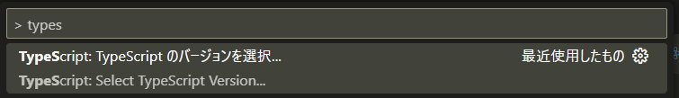
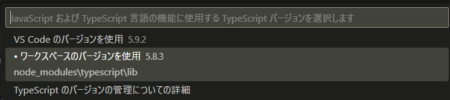

# TypeScript 5.9 で Blob に Uint8Array を渡すと型エラーになった話

先日 Dependabot が TypeScript を 5.9 にバージョンアップする PR を作成したという通知を受け取ったのですが、間もなく CI 失敗の通知も受け取ることになってしまいました。パイプラインのログを確認すると、どうやら以下のメッセージでビルドエラーが発生しています。

```log
src/App.tsx:84:42 - error TS2322: Type 'Uint8Array<ArrayBufferLike>' is not assignable to type 'BlobPart'.
    Type 'Uint8Array<ArrayBufferLike>' is not assignable to type 'ArrayBufferView<ArrayBuffer>'.
      Types of property 'buffer' are incompatible.
        Type 'ArrayBufferLike' is not assignable to type 'ArrayBuffer'.
          Type 'SharedArrayBuffer' is missing the following properties from type 'ArrayBuffer': resizable, resize, detached, transfer, transferToFixedLength

84     new Blob([buffer], { type: "image/gif" });
                 ~~~~~~

Found 1 error.
```

なにやら Blob のコンストラクタで型エラーが発生しているようです。

## TypeScript 5.9 では ArrayBuffer が Uint8Array のスーパータイプではなくなっていた

こんな時にはリリースノートを確認しましょう。案の定、[Announcing TypeScript 5.9](https://devblogs.microsoft.com/typescript/announcing-typescript-5-9/#lib.d.ts-changes) で `Notable Behavioral Change` として本件が触れられています。

<details>
<summary>型付き配列は <code>ArrayBufferLike</code> を基底型とするジェネリック型になりました（抄訳）</summary>

ECMAScript 2024 では、`SharedArrayBuffer` と `ArrayBuffer` の型がわずかに異なります。

```typescript:es2024.arraybuffer.d.ts
interface ArrayBuffer {
    get maxByteLength(): number;
    get resizable(): boolean;
    get detached(): boolean;
    resize(newByteLength?: number): void;
    transfer(newByteLength?: number): ArrayBuffer;
    transferToFixedLength(newByteLength?: number): ArrayBuffer;
}
```

```typescript:es2024.sharedmemory.d.ts
interface SharedArrayBuffer {
    get maxByteLength(): number;
    get growable(): number;
    grow(newByteLength?: number): void;
}
```

この差異を埋め、基盤となるバッファ型を維持するため、すべての型付き配列（`Uint8Array` など）も[ジェネリック型になりました。](https://github.com/microsoft/TypeScript/pull/59417)

```typescript
type ArrayBufferLike = ArrayBuffer | SharedArrayBuffer

interface Uint8Array<TArrayBuffer extends ArrayBufferLike = ArrayBufferLike> {
    // ...
}
```

各 `TypedArray` は `TArrayBuffer` という型パラメータを含むようになりました。ただし、この型パラメータにはデフォルトの型引数が設定されているため、ユーザーは明示的に `Int32Array<ArrayBufferLike>` と記述せずに `Int32Array` を参照し続けることができます。

この更新に関連して、以下のような問題が発生した場合 `@types/node` の更新が必要になる可能性があります。

```log
error TS2322: Type 'Buffer' is not assignable to type 'Uint8Array<ArrayBufferLike>'.
error TS2345: Argument of type 'Buffer' is not assignable to parameter of type 'Uint8Array<ArrayBufferLike>'.
error TS2345: Argument of type 'ArrayBufferLike' is not assignable to parameter of type 'ArrayBuffer'.
error TS2345: Argument of type 'Buffer' is not assignable to parameter of type 'string | ArrayBufferView | Stream | Iterable<string | ArrayBufferView> | AsyncIterable<string | ArrayBufferView>'.
```

この変更の詳細については、[GitHub](https://github.com/microsoft/TypeScript/pull/59417) で確認できます。
<hr>
</details>

というわけで、明示的な型指定のない `Uint8Array` は `Uint8Array<ArrayBufferLike>` として扱われます。これが Blob のコンストラクタが求める `ArrayBufferView<ArrayBuffer>` には代入できない理由でした。

```typescript
declare var Blob: {
    prototype: Blob;
    new(blobParts?: BlobPart[], options?: BlobPropertyBag): Blob;
};

type BlobPart = BufferSource | Blob | string;

type BufferSource = ArrayBufferView<ArrayBuffer> | ArrayBuffer;
```

## 解決方法

`Uint8Array` を生成している箇所で、以下のように型パラメータを指定するのが良いでしょう：

```typescript
const buffer: Uint8Array<ArrayBuffer> = new Uint8Array([/* ... */]);
```

別の `ArrayBuffer` にデータを移し替える方法もありますが、このために余計にメモリを浪費するのは好ましくありません：

```typescript
const anotherBuffer = new ArrayBuffer(buffer.length);
const anotherBufferView = new Uint8Array(anotherBuffer);
anotherBufferView.set(buffer);

new Blob([anotherBuffer], { type: "image/gif" })
```

一番シンプルかつ強力すぎる解決法は、型アサーションで `Uint8Array<ArrayBuffer>` にしてしまうことです：

```typescript
new Blob([buffer as Uint8Array<ArrayBuffer>], { type: "image/gif" })
```

私は `as` を極力使いたくない派なのですが、今回こちらを選択しました。というのは、`buffer` には外部ライブラリが返す値を格納しており、こちらで型パラメータを指定できなかったからです。時には柔軟に考えることも必要ですね。

ただし `as` を使って問題ないのは、本当に `ArrayBuffer` のビューとして使用する場合のみです。たとえば WebAssembly の共有メモリーとして使用する場合は `SharedArrayBuffer` になるので、きちんと `ArrayBuffer` にコピーしてあげるべきでしょう。

## VSCode で使用する TypeScript をワークスペースのバージョンと一致させる

今回の記事を書くにあたり知ったことですが、[VSCode の IntelliSense が使用する TypeScript はデフォルトで VSCode に同梱されたものが使用されます](https://code.visualstudio.com/docs/typescript/typescript-compiling#_using-newer-typescript-versions)。今回のようなケースだと「エディタ上で警告は表示されていないのにビルドするとエラーになる」、またはその逆となる可能性もあります。コマンドパレット（`[Ctrl]`+`[P]`）に以下を入力することでワークスペースのバージョン（`node_modules` 内のもの）を使用するように切り替えられますので、必要に応じて設定しましょう。





## 参考リンク

* [Announcing TypeScript 5.9 - TypeScript](https://devblogs.microsoft.com/typescript/announcing-typescript-5-9/#lib.d.ts-changes)
* [SharedArrayBuffer - JavaScript | MDN](https://developer.mozilla.org/ja/docs/Web/JavaScript/Reference/Global_Objects/SharedArrayBuffer)
* [Uint8Array - JavaScript | MDN](https://developer.mozilla.org/ja/docs/Web/JavaScript/Reference/Global_Objects/Uint8Array)
* [TS 5.7 から ArrayBufferView（各 TypedArray と DataView）の型がジェネリクスになりました](https://zenn.dev/pixiv/articles/b241ee3d046740)
* [Make typed arrays generic over `ArrayBufferLike` by rbuckton · Pull Request #59417 · microsoft/TypeScript · GitHub](https://github.com/microsoft/TypeScript/pull/59417)
* [Fix to use string literal type in ArrayBuffer's `Symbol.toStringTag` by petamoriken · Pull Request #60150 · microsoft/TypeScript](https://github.com/microsoft/TypeScript/pull/60150)
* [Using newer TypeScript versions | Compiling TypeScript](https://code.visualstudio.com/docs/typescript/typescript-compiling#_using-newer-typescript-versions)
