# VRCSDK3 でバーチャル早着替え with VRoid

みなさん、VRChat 楽しんでいますか？　私はとても楽しんでいます。

さて、先日 VRCSDK3-AVATAR がリリースされました。その特徴は、なんといってもカスタマイズ性の高さです。もとよりプレイヤー自身がアバターやワールドを制作することが VRChat の醍醐味ではありますが、 その長所がより突き詰められた形です。

本記事では、従前のマテリアルアニメーションと**アクションメニューのカスタマイズ**を組み合わせることで、アバターを切り替えることなく衣装をチェンジする**バーチャル早着替え**を実装します。

## STEP0: VRM 素材の準備

VRoid で普通にアバターを作成します。

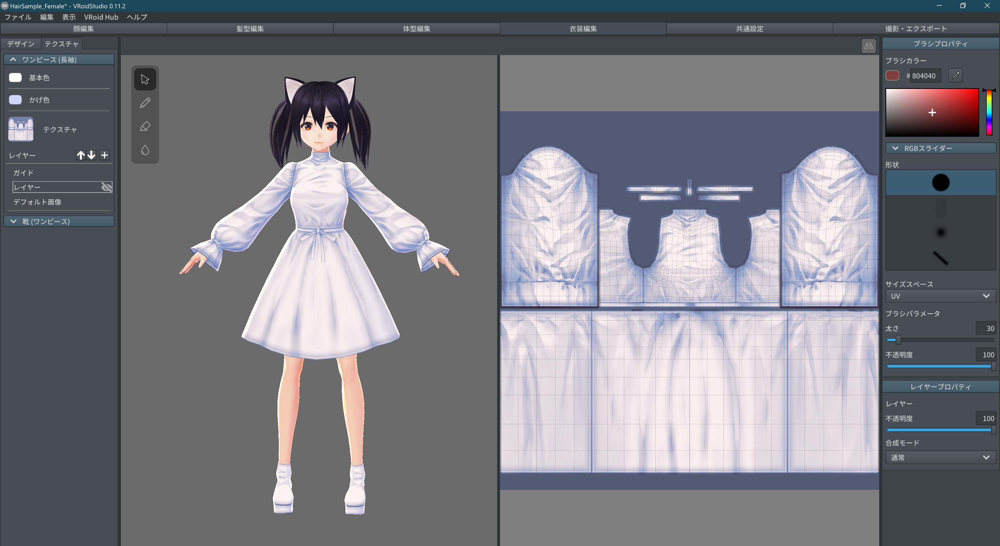

次に、着替える衣装を用意します。着替える前の服と後の服はモデルの切り替えではなく、テスクチャのレイヤー切り替えで表現してください。今回はマテリアル（＝テクスチャ+シェーダ）を差し替えることで早着替えを行うためです。[^1]

[^1]: Blender等を利用しVRoid製モデルを素体+衣装で分割する場合は、マテリアル切り替えではなくオブジェクトの表示・非表示を利用した着替えが可能ですが、本記事の範囲外とします。

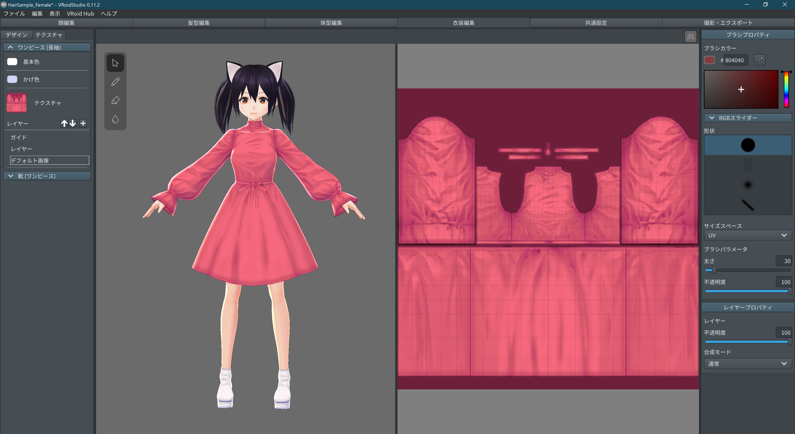

衣装が定まったら、着替え前・後で2つの VRM ファイルを出力してください。VRoid での作業は終了です。

## STEP1: Unity プロジェクトへのインポート

Unity プロジェクトに [VRCSDK3-AVATAR](https://vrchat.com/home/download) と [VRM Converter for VRChat](https://pokemori.booth.pm/items/1025226) をインポートします。

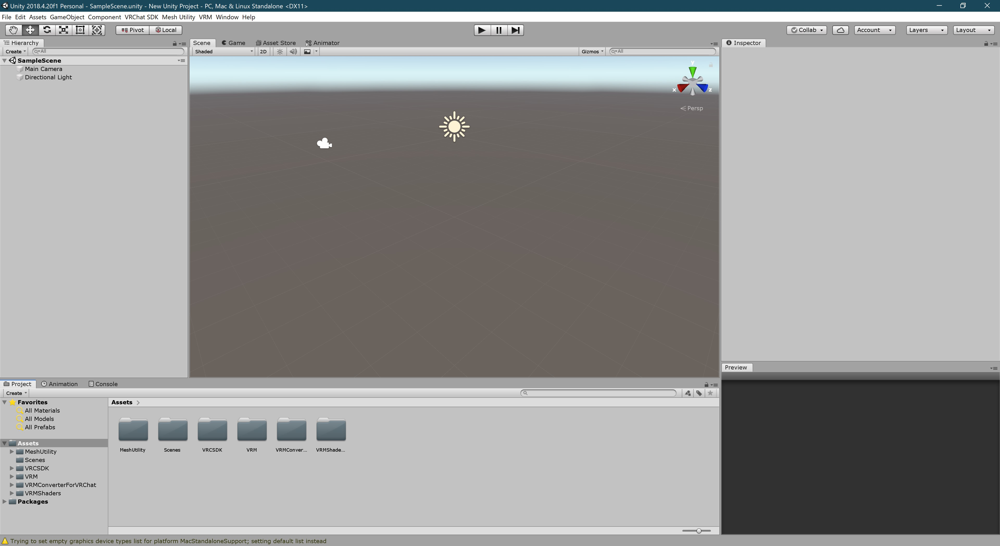

2つの VRM ファイルをインポートします。続いて、VRM Converter 所定の手順に従い、**着替え前のモデルだけ** VRChat 用に変換します。

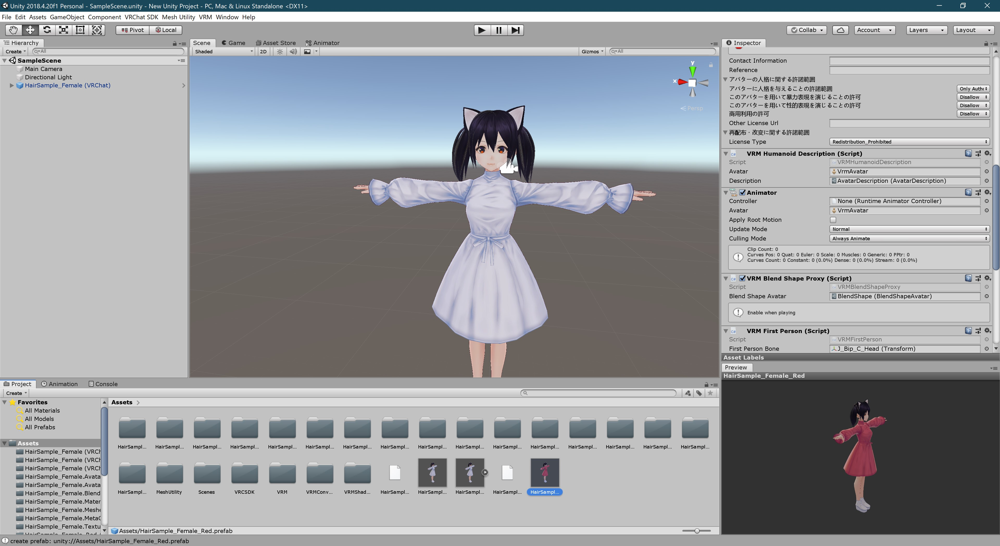

シーン中にある VRChat 用モデルを複製します。[^2]

[^2]: この後アニメーションを作成する際に地面に埋まってしまうと直すのが面倒なので、複製しておくことがおすすめです。

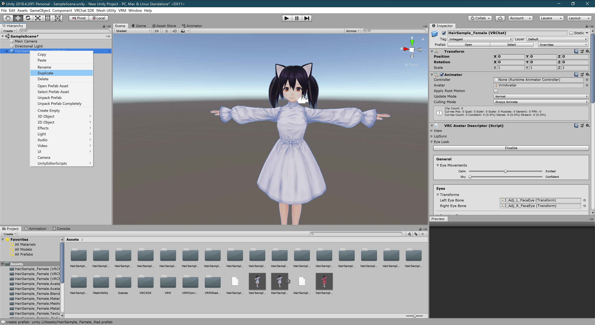

## STEP3: アニメーションの作成

Animationウィンドウ（タブ）で [Create] をクリックし、新しいアニメーションクリップを作成します。名前は何でもよいですが、ここでは `kigae` としました。

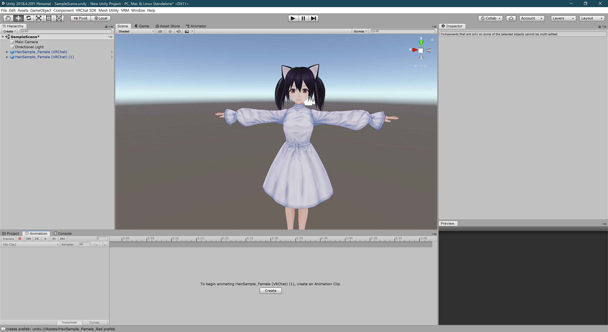

Animationウィンドウ（タブ）の左上にある記録ボタン（赤丸）を押し、アニメーションの記録を開始します。

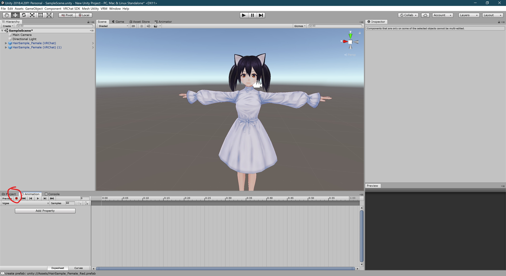

足元に複製したモデルが埋まっているので、ヒエラルキーから [Body] を選択しインスペクタを開きます。[Skined Mesh Renderer]-[Materials]で任意のマテリアルを着替え後のマテリアルに差し替えます。ワンピースの場合はトップスのみなので、`F00_002_01_Tops_01_CLOTH` を変更すれば OK です。

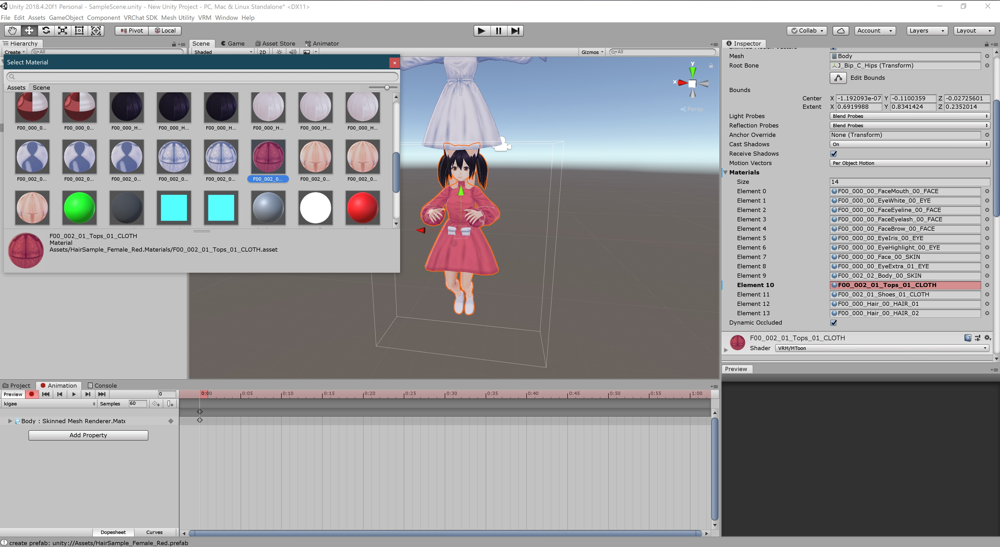

変更ができたら、再度記録ボタンを押してアニメーションの作成を終了します。複製したモデルは削除しておきましょう。

## STEP4: FX の変更

FX はモデルの状態遷移図のようなものです。VRM Converter で変換したモデルでは、あらかじめカスタマイズされた FX が作成されています。

モデルのインスペクタで [VRC Avatar Descriptor]-[Playable Layers]-[FX] に設定されている FX をダブルクリックで開きましょう。

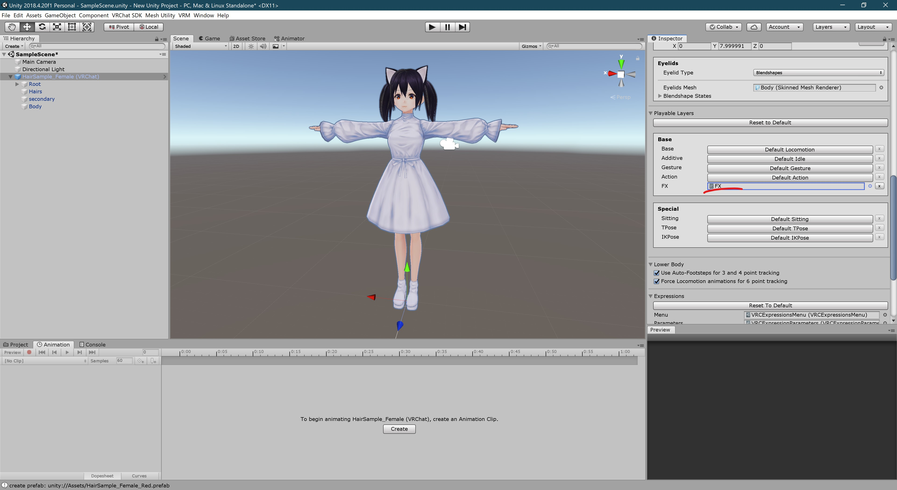

[Parameters] に int 型変数 `Kigae` を追加します。この変数はアクションメニューとの連携に利用します。アクションメニューでの操作が変数に反映されるので、FX では `Kigae` の変化で服装が変化するようにしましょう。

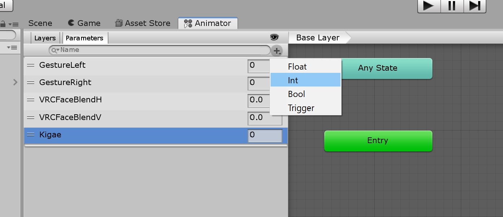

FX は複数の状態遷移図をレイヤーで重ねたような構造になっています。[Layers] タブで `Kigae` レイヤーを追加し、**オプションで Weight を 1 に変更します**。デフォルトでは Weight が 0 ですが、そのままではモデルにアニメーションが反映されません。

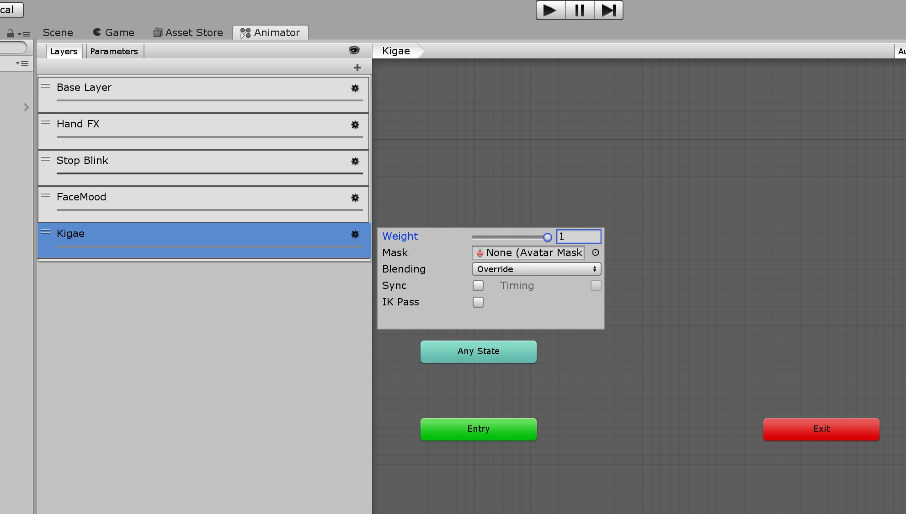

状態遷移を作図していきます。右クリックで [Create State]-[Empty] から新たな状態を、状態を右クリックし [Make Transition] から新たな遷移を作成できます。下図のように「着替え前の状態」と「着替え後の状態」を作り、「Entry」から「Exit」がつながるようにしてください。

そして、「着替え後の状態」の [Motion] に先ほど作成したアニメーションを設定します。

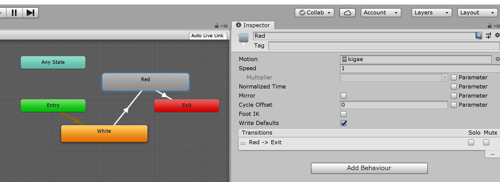

Transition を選択し、遷移の条件を設定します。[Conditions] で `Kigae equals 0` で「着替え前の状態」に、`Kigae equals 1` で「着替え後の状態」へ遷移するようにします。

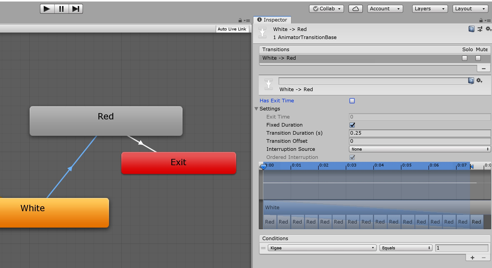

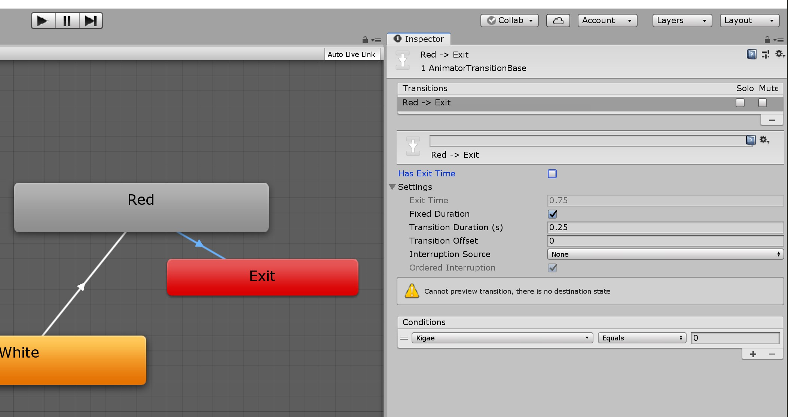

これで FX の設定は完了です。

## STEP4: アクションメニュー の変更

最後に、設定したアニメーションをアクションメニューから呼び出せるようにしましょう。インスペクタで [VRC Avatar Descriptor]-[Expressions]-[VRCExpressionParameters] を開きます。

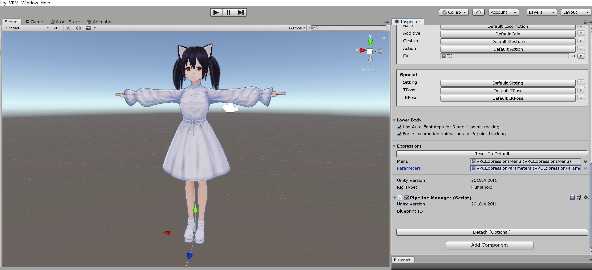

ここで、先ほど設定した変数 `Kigae` との紐付けを行います。変数名と型を設定します。

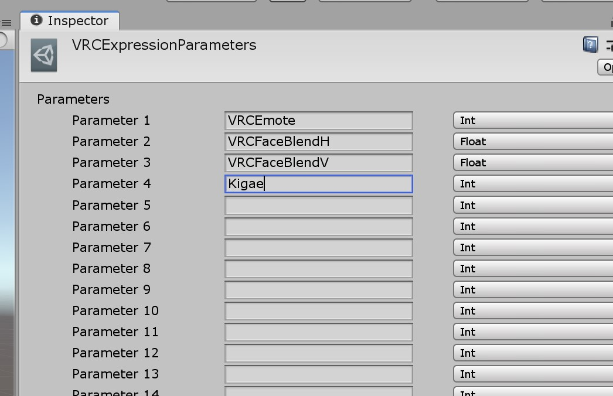

[VRC Avatar Descriptor]-[Expressions]-[VRCExpressionsMenu] を開きます。

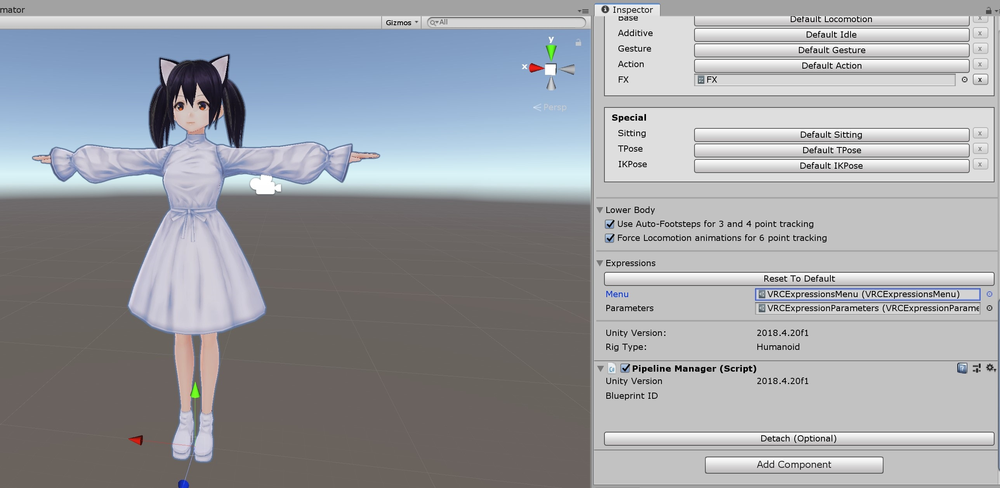

[Add Components] からアクションメニューの項目を追加します。

[Parameter]で `Kigae, Int` を選択し、[Value] を `1` にします。

[Type] で `toggle` を指定すると、次にボタンを押すまで着替えっぱなしになります。

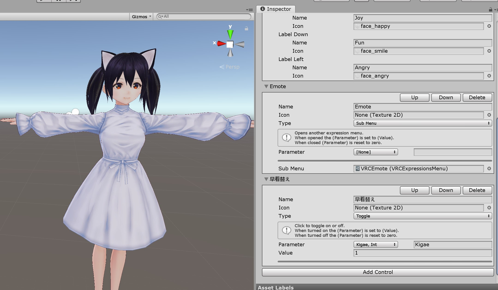

ビルド＆テストしてみましょう。

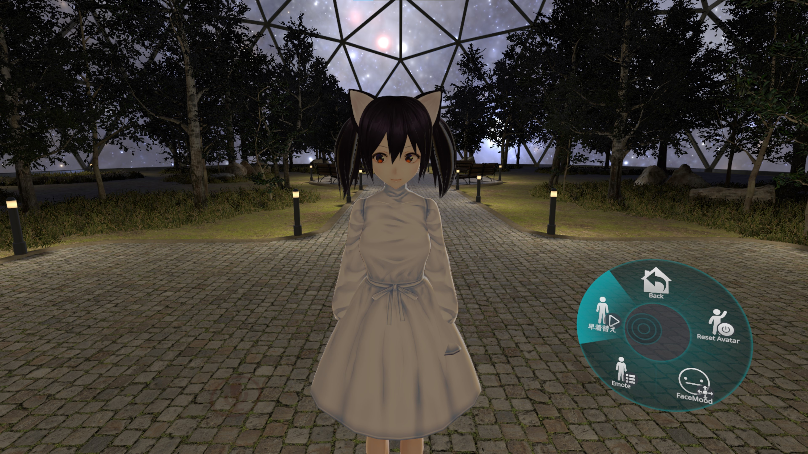

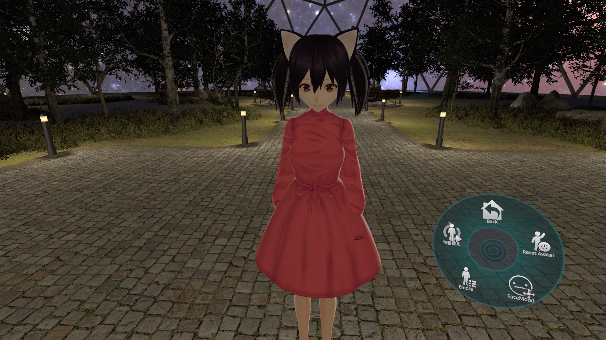

アクションメニューに項目が追加され、早着替えを行うことができました！
