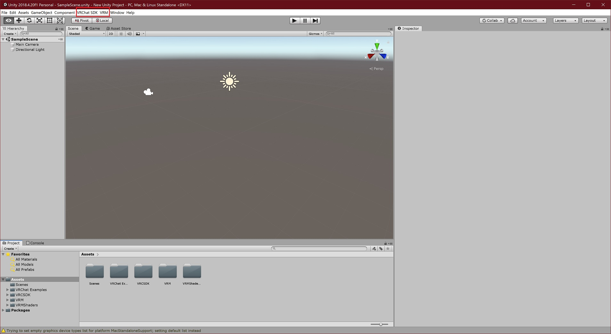
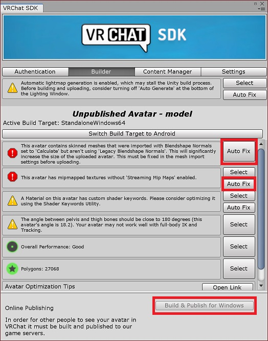

# VRoid で生成したモデルを Blender で編集して VRChat にアップロードする

VRoid から VRChat にモデルをアップロードする最も簡単な手順は [VRMConverterForVRChat](https://github.com/esperecyan/VRMConverterForVRChat) を利用することです。しかし、ボーンの修正やアクセサリの追加など、Blender での編集が必要とされる場面もあります。本記事は Blender を介したアバターアップロードの手順を記載するものです。

## STEP0: 環境構築

VRChat SDK が対応しているバージョンの Unity [^1] と Blender 2.8 をインストールします。

[^1]: https://docs.vrchat.com/docs/current-unity-version

任意のバージョンの Unity を切り替えながら使用したい場合は、Unity Hub で管理する方法が便利です。

## STEP1: VRoid からのエクスポート

VRoid から VRM 形式でエクスポートします。このときマテリアル数を削減しておくと後の工程が楽になります。

## STEP2: Unity プロジェクトの準備

Unity で新規プロジェクトを作成します。

以下の拡張機能を Unity に導入します。

* [VRCHAT SDK2](https://vrchat.com/home/download)
* [UniVRM](https://github.com/vrm-c/UniVRM/releases)

`.unitypackage` 形式のファイルを画面の下部にある Assets 欄へドラッグ&ドロップし、インポートします。

メニューバーに `VRChat SDK` と `VRM` が追加されました。

VRM ファイルを画面の下部にある Assets 欄へドラッグ&ドロップし、インポートします。

## STEP3: Blender でモデルを編集する

[VRM_IMPORTER_for_Blender2_8](https://github.com/saturday06/VRM_IMPORTER_for_Blender2_8) を入手します。

アドオンをインストールするには、`編集` - `プリファレンス` - `アドオン` - `インストール` からダウンロードした zip ファイルを選択します。

インストールした直後は有効化されていないので、チェックボックスをクリックしてください。

デフォルトで設置されている立方体とカメラ、ライトを削除します。

`ファイル` - `インポート` - `VRM` から VRM ファイルをインポートします。

初期状態ではテクスチャは表示されていませんが、`マテリアルプレビューモード`に切り替えることで表示できます。

続いて、モデルを編集します。たとえばボーンの修正が必要な場合は、Tab キーを押下して編集モードに移り、任意のボーンを選択します。

編集が完了したら、ファイルに名前をつけて保存します。このとき、Unity プロジェクト内の Assets フォルダ下に配置することで、Blender で更新したデータを自動的に取り込んでくれるようになります。

## STEP4: Unity から VRChat へアップロードする

Blender で保存したファイルを確認すると、テクスチャがはがれてしまっています。

インスペクタのマテリアルタブからテクスチャをセットできます。Unity へ VRM をインポートしたときに抽出されたテクスチャを選択しましょう。

Rig タブでアニメーションタイプに Humanoid を指定します。

モデルを Hierarchy にドラッグ&ドロップしてシーンに設置します。続いて、インスペクタで `Add Component` から `VRC_Avatar Descriptor` を追加します。

`View Position` の数値を変更し、ちょうど眉間のあたりに視線が来るように調整します。また、`Default Animation Set` で `female` を選択します。[^2]

[^2]: デフォルトアニメーションの性別を変更できますが、VRoid モデルで `male` を選択すると膝関節が破綻してダブルクロス状態になってしまう事例が報告されています。そのため、男性モデルでも `female` を選択しアニメーションオーバライドで個性を出したほうがよいでしょう。

既存のアバターを更新したい場合は次の手順で VRChat にログインした後、`Pipeline Manager` でアバターの Blueprint ID を attach してください。

`VRChat SDK` - `Show Control-Panel` からコントロールパネルを表示し、ログインします。`Avatar Creator Status` が `Allowed to publish avatars` でないときは trust level が足りていません。

`Builder` タブでビルドを実行します。エラーが表示されている場合は `Auto Fix` で修復を試みましょう。

ビルドが終了すると `Game` タブに切り替わりますので、表記に従って VRChat へアップロードします。

## 参考リンク

* [Setting up the SDK](https://docs.vrchat.com/docs/current-unity-version)
* [VRMからVRChatへアップロードする流れ](https://qiita.com/100/items/7315fe3a7eb75732ae43)
* [Blenderで変更したVRMモデルをUnityで変更反映してVRMファイルを書き出す ②Blenderファイル編](https://styly.cc/ja/tips/blender-vrm-export2/)
