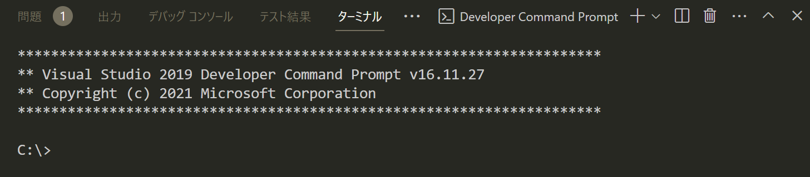
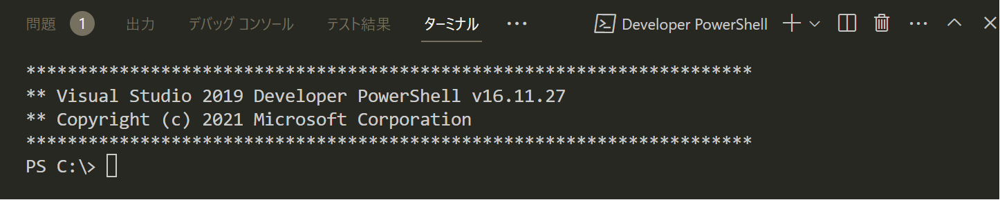
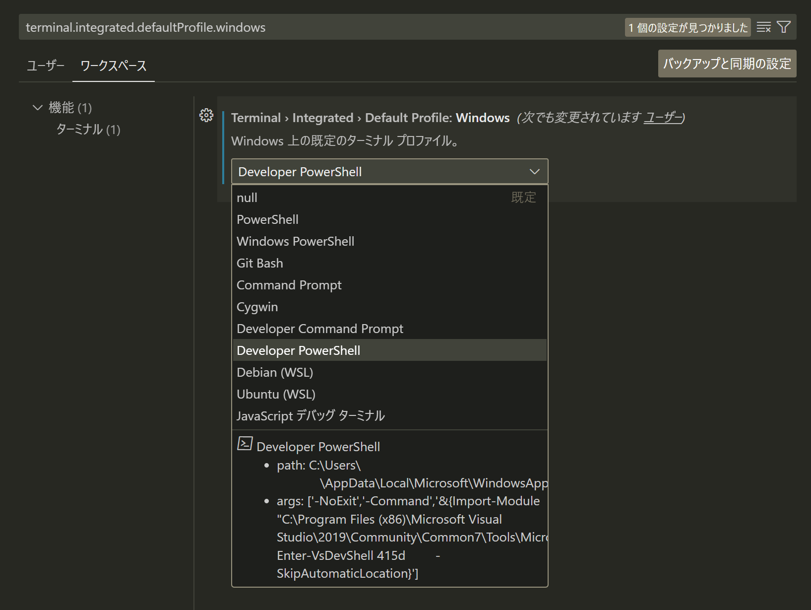

# VSCode の統合ターミナルで VS の開発者コマンドプロンプトや開発者用 PowerShell を実行する

Visual Studio の「開発者コマンドプロンプト」（Developer Command Prompt）は `cl.exe` 等のツールを使用できるよう環境変数が設定されたコマンドプロンプトです。スタートメニューから立ち上げるのが基本ですが、[VS の統合ターミナルから実行できる](https://learn.microsoft.com/ja-jp/visualstudio/ide/reference/command-prompt-powershell?view=vs-2022#start-in-visual-studio)ほか、[Windows Terminal のプロファイルにも自動で取り込まれます](https://github.com/microsoft/terminal/pull/7774)。VS を立ち上げるまでもない作業や、環境変数設定が必要な時（CI から `cl.exe` 等を呼び出すケース等）に便利です[^1]。

[^1]: ちなみに GitHub Actions から開発者コマンドプロンプトを実行したい場合は [Enable Developer Command Prompt](https://github.com/marketplace/actions/enable-developer-command-prompt) アクションを使用します。

一方、Microsoft 公式で [C/C++ for Visual Studio Code](https://marketplace.visualstudio.com/items?itemName=ms-vscode.cpptools) が提供されるなど、VSCode に開発環境を集約させることも現実的になってきました。そうなると VSCode の統合ターミナルで開発者コマンドプロンプトが必要な作業も終えてしまいたいところですが、[公式ガイド](https://code.visualstudio.com/docs/cpp/config-msvc)では別ウィンドウでの起動やタスク設定をする方法しか紹介されていません。どうして。

## ターミナル設定を編集して開発者コマンドプロンプトを追加する

仕方がないのでターミナル設定を編集して手動で開発者コマンドプロンプトを追加してみましょう。

`[ファイル]`-`[ユーザー設定]`-`[設定]`を開き、`terminal.integrated.profiles.windows` と検索します。GUI 上からは変更できない項目なので、`settings.json で編集` を押下します。


既に設定済みのプロファイル設定があるので、下記の `Developer Command Prompt` 以下を追記します：

```jsonc:settings.json
"terminal.integrated.profiles.windows": {
    // 追加
    "Developer Command Prompt": {
        "path": [
            "${env:windir}\\Sysnative\\cmd.exe",
            "${env:windir}\\System32\\cmd.exe"
        ],
        "args": [
            "/k",
            "C:\\Program Files (x86)\\Microsoft Visual Studio\\2022\\Community\\Common7\\Tools\\VsDevCmd.bat"
        ],
        "overrideName": true
    }
}
```



デフォルトで設定されているコマンドプロンプト用のプロファイルをベースに、引数として `VsDevCmd.bat` へのパスを渡してあげたものになります。プロファイルでは他にも[アイコンやテーマカラーが設定可能](https://qiita.com/take_me/items/47f192a126d75a9264a9)ですので、必要に応じて変更してください。

## ターミナル設定を編集して開発者用 PowerShell を追加する

イマドキだと開発者コマンドプロンプトより開発者用 PowerShell の方がお好みの方もいらっしゃるでしょう。その場合も同様に `settings.json` で設定できます：

```jsonc:settings.json
"terminal.integrated.profiles.windows": {
    // 追加
    "Developer PowerShell": {
        "source": "PowerShell",
        "args": [
            "-NoExit",
            "-Command",
            "&{Import-Module \"C:\\Program Files (x86)\\Microsoft Visual Studio\\2022\\Community\\Common7\\Tools\\Microsoft.VisualStudio.DevShell.dll\"; Enter-VsDevShell <instanceId> -SkipAutomaticLocation"
        ],
        "overrideName": true
    },
}
```



こちらは `Microsoft.VisualStudio.DevShell.dll` に含まれる `Enter-VsDevShell` コマンドレットを呼び出したものです。注意事項として、`<instanceId>` は環境で固有のインスタンス ID に置き換える必要があります。インスタンス ID は以下の Powershell スクリプトで取得可能です：

```powershell
& "${env:ProgramFiles(x86)}\Microsoft Visual Studio\Installer\vswhere.exe" -format json | ConvertFrom-Json | Format-Table -Property instanceId,displayName
```

```log
instanceId displayName
---------- -----------
415d****   Visual Studio Community 2022
7e9a****   Visual Studio Community 2019
```

このように標準出力の JSON を [ConvertFrom-Json](https://learn.microsoft.com/ja-jp/powershell/module/microsoft.powershell.utility/convertfrom-json) コマンドレットでオブジェクト化すると、PowerShell の強力な機能を使用できます。せっかく PowerShell を選ぶならコマンドプロンプトにはないメリットも享受したいですね。

## 統合ターミナルのデフォルトプロファイルを変更する

ついでなので統合ターミナルのデフォルトプロファイルも変更してみましょう。`terminal.integrated.defaultProfile.windows` で追加したプロファイル名を指定するだけです。この項目は GUI 上からも変更可能です[^2]：

[^2]: プロファイル名に半角スペースを含むとデフォルトプロファイルに指定できないという情報もありますが、手元の環境では再現しませんでした。



```jsonc:settings.json
{
    "terminal.integrated.defaultProfile.windows": "Developer PowerShell"
}
```

このとき、グローバル設定を変更してもいいですが、個人的には特定ワークスペース（開発者向けのコマンドラインシェルを使用したいプロジェクト）の設定を変更しておく使い方がおすすめです。

なおデフォルトプロファイルとして設定すると、左ナビゲーションのエクスプローラから「統合ターミナルで開く」をした場合にも当該プロファイルで開いてくれるので便利です。

## 参考リンク

* [Visual Studio 開発者コマンド プロンプトと開発者用 PowerShell](https://learn.microsoft.com/ja-jp/visualstudio/ide/reference/command-prompt-powershell?view=vs-2022)
* [VS Code use VS Developer prompt as integrated Shell](https://stackoverflow.com/questions/68838403/vs-code-use-vs-developer-prompt-as-integrated-shell)
* [Add profile generators for Visual Studio #7774](https://github.com/microsoft/terminal/pull/7774)
* [Configure VS Code for Microsoft C++](https://code.visualstudio.com/docs/cpp/config-msvc)
* [cmd | Microsoft Learn](https://learn.microsoft.com/ja-jp/windows-server/administration/windows-commands/cmd)
* [VSCodeのターミナル/プロファイルの設定の詳細](https://qiita.com/take_me/items/47f192a126d75a9264a9)
* [Terminal Profiles](https://code.visualstudio.com/docs/terminal/profiles)
* [Developer Powershell for VS 2019をWindows Terminalから開く](https://zenn.dev/shiena/articles/developer-pwsh-terminal)
* [Visual Studio インスタンスの検出および管理用のツール](https://learn.microsoft.com/ja-jp/visualstudio/install/tools-for-managing-visual-studio-instances?view=vs-2022)
