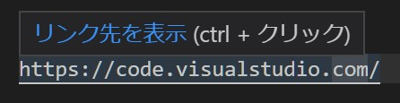

# Visual Studio Codeで選択したパス（ファイル、ディレクトリ）をデフォルトのアプリで開く（Windows編）

VS Code のエディター画面で編集中のテキストに URL を貼り付けると、

このようにリンク先をデフォルトのブラウザで表示させることができます。

ローカルファイルやディレクトリへのパスはハイライトされませんが、いちいちエクスプローラーやブラウザにコピー&ペーストするのも面倒です。`file:///C:/~` という表記で無理矢理リンクにすることはできますが、バイナリファイルやディレクトリを表示しようとするとエラーになってしまいます。[^1] どうにかしたい。

[^1]: バイナリファイルをデフォルトのアプリで開きたい時には [Open](https://marketplace.visualstudio.com/items?itemName=sandcastle.vscode-open) 拡張機能がおすすめです。バイナリファイルを開くと「このファイルはバイナリか、サポートされていないテキストエンコードを使用しているため、エディターに表示できません。**このまま開きますか？**」と表示されます。強制的に表示した後、コマンドパレットからこの拡張機能を呼ぶとデフォルトのアプリで表示させることができます。

## 選択したパス（ファイル、ディレクトリ）をデフォルトのアプリで開くタスクを構成する

というわけで [Integrate with External Tools via Tasks](https://code.visualstudio.com/docs/editor/tasks) を参考にタスクを構成してみます。

.vscode ディレクトリに `tasks.json` を作成して、次のように記載してください：

```tasks.json
{
    "version": "2.0.0",
    "tasks": [
        {
            "label": "選択したリンクを既定のアプリで開く",
            "type": "shell",
            "command": "explorer ${selectedText}",
            "group": "none",
            "presentation": {
                "reveal": "never"
            },
            "problemMatcher": []
        }
    ]
}
```

このタスクを実行するとエディタで選択した中のテキストを `explorer.exe`に渡すので、デフォルトのアプリで開いてくれます。カレントディレクトリはVS Codeのワーキングディレクトリになるので、プロジェクト内の相対パスでも開くことができますね。[^2]

[^2]: たとえば `.vscode\tasks.json` を選択してタスクを実行すると上記のファイルが開きます。便利！

## 参考リンク

* [【VSCode tips】VSCode で go buildする設定 【#1】](https://qiita.com/necomeshi/items/676ccb669d6e6102117b)
