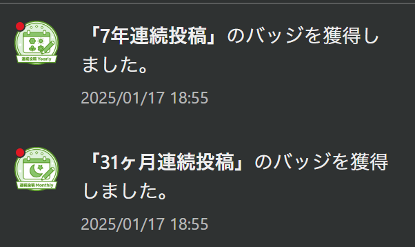

# WSL2 上のアプリケーションを HTTPS 化して別ホストからアクセスする方法

（2025 年）初投稿です。[^0] 3 年ほど前に [WSL2 上のアプリケーションに別ホストからアクセスする方法（管理者権限なし）](https://qiita.com/yokra9/items/cc81b2869ec1e9bda950) という記事を投稿しました。その間 [Chrome 94 以降で HTTPS ファーストが推進され](https://developers-jp.googleblog.com/2023/09/https.html)たり、[Safari 18.2 以降も同様だったりで](https://webkit.org/blog/16301/webkit-features-in-safari-18-2/#security-and-privacy)、開発時に別ホストからアクセスする際もセキュア化を求められる機運はありそうです。

[^0]: 7 年連続投稿かつ 31 ヶ月連続投稿でもあります：

実は、上記の記事でご紹介した [stone](https://www.gcd.org/sengoku/stone/Welcome.ja.html) には HTTPS 化機能が備わっています。便利そうですよね。

```powershell
stone localhost:http 443/ssl
```

ところが、[Windows 版バイナリ](https://www.gcd.org/sengoku/stone/stone64-2.3e-2.3.3.20.zip)で実行しても以下のエラーが発生し HTTPS 化できません。

```log
Jan 16 22:34:26.171000 46656 start (2.3e) [47036]
Jan 16 22:34:26.187000 46656 SSL_CTX_use_PrivateKey_file(/usr/local/ssl/certs/stone.pem) error:02001003:system library:fopen:No such process
```

フォーク版（[takuya_ono/stone](https://github.com/takuya-o/stone)）で [TLS 1.2 に対応した Windows 版 stone のコンパイル方法](https://github.com/takuya-o/stone/blob/master/MEMO.md#windows%E3%81%A7%E3%81%AEstone-24-tlsv12%E5%AF%BE%E5%BF%9C)が共有されていますが、バイナリ配布がないためお手軽ではありません。そんな時は [mkcert](https://github.com/FiloSottile/mkcert) と [local-ssl-proxy](https://github.com/cameronhunter/local-ssl-proxy) を stone に組み合わせると便利です。

なお、この 3 年の間に [WSL2 のミラーモードネットワーク](https://learn.microsoft.com/ja-jp/windows/wsl/networking#mirrored-mode-networking)が実装されました。これを有効にしている場合、stone を介さず別ホストから直接アクセス可能になっています。しかし、ファイアウォールの構成によっては引き続き Windows 側のプロセスを踏み台にすると便利なケースがあります。[^1]

[^1]: プロセス名単位で許可リスト・禁止リストが制御されている場合など。local-ssl-proxy は実体として `node.exe` であるため、許可対象としては広範すぎる可能性があります。stone を含む多段プロキシ構成であれば、許可対象は `stone.exe` に絞られます。

## mkcert で証明書を作成・インストールする

mkcert は、ローカルで信頼された証明書を作成するツールです。51.7k Star の超有名 OSS で、例えば Next.js の `next dev --experimental-https` でも内部的に利用されています。

```powershell
# インストール
choco install mkcert

# ローカル CA のインストール
mkcert -install

# ルート証明書のあるディレクトリを表示
mkcert -CAROOT

# 証明書の作成
mkcert -key-file key.pem -cert-file cert.pem <Windows側のIPもしくはホスト名>
```

本来はローカル検証用の証明書ではありますが、`$(mkcert -CAROOT)\rootCA.pem` をインストールすることで他端末からもエラーなく HTTPS 接続可能となります。[^2]

[^2]: mkcert はあくまで開発用途であり、本番用途に適さないことには注意が必要です。

## local-ssl-proxy と stone で別ホストからアクセス可能にする

local-ssl-proxy はローカルで信頼された開発証明書を使用したシンプルな HTTPS プロキシです。mkcert で作成した証明書を使用し、HTTP 通信を HTTPS にアップグレードできます。

```powershell
# インストール
npm install -g local-ssl-proxy

# 実行
local-ssl-proxy --key key.pem --cert cert.pem --source <HTTPS 用のポート> --target <WSL2 側のポート>
```

このとき、`--source` が HTTPS 用のポート、`--target` が WSL2 側のポート(HTTP)なのがポイントです。

最後に、local-ssl-proxy がリッスンする HTTPS 用のポートを stone でポートフォワードすれば別ホストからアクセス可能となります。

```powershell
# stone でポートフォワード
stone <HTTPS 用のポート> <ファイアウォールで解放されたポート>
```

## 参考リンク

* [Google Developers Japan: HTTPS のデフォルト化に向けて](https://developers-jp.googleblog.com/2023/09/https.html)
* [すべての「Chrome」をHTTPSファーストに、Googleが本腰を入れる - 窓の杜](https://forest.watch.impress.co.jp/docs/news/1524675.html)
* [WebKit Features in Safari 18.2 | WebKit](https://webkit.org/blog/16301/webkit-features-in-safari-18-2/#security-and-privacy)
* [LOCAL環境でHTTPSが必要なときはlocal-ssl-proxyが便利](https://qiita.com/cress_cc/items/ba3d7112d36035f88749)
* [開発環境をhttps化するmkcertの仕組み](https://qiita.com/k_kind/items/b87777efa3d29dcc4467)
* [Next.js の dev サーバーが HTTPS で立ち上がる仕組み](https://zenn.dev/ikuma/articles/how-next-do-https-at-local)
* [mkcert(オレオレ証明書)を使ってローカル環境へiPhoneからhttps接続する](https://zenn.dev/takumiabe21/articles/645a38c0c18389)
