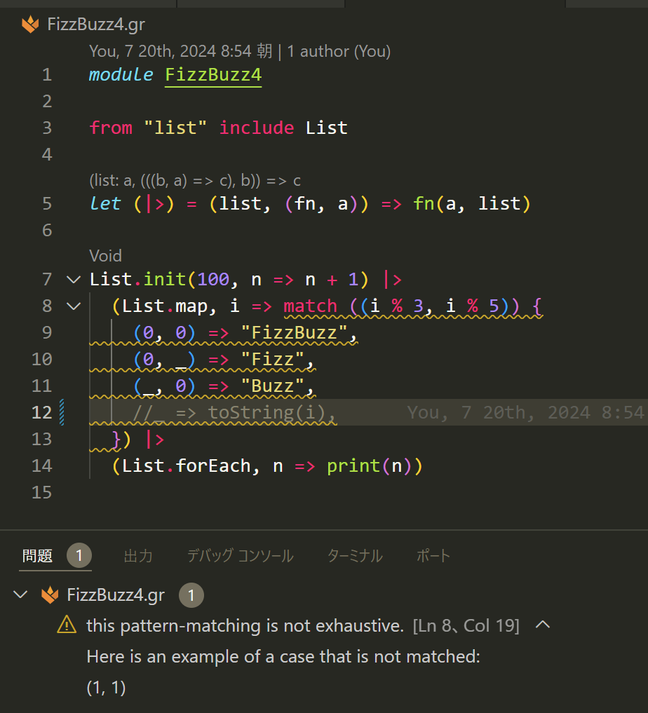

# WebAssembly ファーストな関数型言語「Grain」で FizzBuzz やってみる

[RedMonk Programming Language Rankings: Jan 2024](https://redmonk.com/sogrady/2024/03/08/language-rankings-1-24/) [^1]を眺めていて、[Zig](https://ziglang.org/) 等と並んで [Grain](https://grain-lang.org/) が言及されていることに気が付きました。[^2]

[^1]: GitHub と Stack Overflow での人気度から算出するプログラミング言語の人気度ランキング。開発者に焦点を当てたアナリストファームの RedMonk が [2012 年から公開して](https://redmonk.com/sogrady/2012/09/12/language-rankings-9-12/)います。


> Bicep (86), Grain, Moonbit, Zig (97): as with the Dart/Kotlin/Rust grouping above, these languages are grouped here not because they’re all technically similar but rather because they are on the languages of interest list mentioned above. They are included here for a variety of reasons: Zig is on here because it has attempted to learn from the languages that preceded it from C++ to Rust. Grain and Moonbit are on here, meanwhile, because they are optimized for WebAssembly. Bicep is on here because it comes up with surprising frequency – and a mildly surprising ranking – for a cloud DSL. Only two of these languages are currently ranked, but we’re watching all of them to see if these or any other new languages begin to emerge.
<!-- markdownlint-disable -->

> Bicep (86)、Grain、Moonbit、Zig (97)：上記の Dart/Kotlin/Rust のグループ分けと同様に、これらの言語がここにグループ分けされているのは、技術的にすべて似ているからではなく、むしろ上記の興味のある言語リストに含まれているからだ。これらはさまざまな理由でここに含まれている： Zig は、C++ から Rust まで、先行する言語から学ぼうとしている。一方、Grain と Moonbit は WebAssembly に最適化されているため、ここに含まれている。Bicep は、クラウド DSL としては意外な頻度で、そして少し意外な順位でランクインしている。現在ランクインしているのはこれらの言語のうち2つだけだが、これらの言語やその他の新しい言語が出現し始めるかどうか、すべての言語をウォッチしている。（DeepL 訳を元に修正）

Grain は WebAssembly ファーストな関数型プログラミング言語です。OCaml に影響を受けているというか、Grain 自体が [Reason というOCaml な AltJS](https://reasonml.github.io/)[^3]で書かれています。

[^2]: [Stack Overflow Developer Survey 2023](https://survey.stackoverflow.co/2023/) には登場しませんし、[TIOBE Index では集計対象外](https://www.tiobe.com/tiobe-index/programminglanguages_definition/#instances)です。

[^3]: [Melange](https://reasonml.github.io/docs/en/compiling-to-js-with-melange) で JavaScript にコンパイルできるほか、OCaml コンパイラでネイティブにもコンパイル可能です。

[Grain の作者である Oscar Spencer 氏が WasmCon に登壇されていた](https://thinkit.co.jp/article/22528)記事等で認識は持っていましたが、Qiita や Zenn のようなコミュニティで記事を見た覚えはありません。せっかくなので、ここに触ってみた情報を記録することにします。

## 導入と開発環境の構築

公式の [Getting Grain](https://grain-lang.org/docs/getting_grain) を参照します。といっても、Grain ツールチェイン (CLI、コンパイラ、ランタイム、標準ライブラリを含む) は 1 バイナリなので導入は簡単です。[^4]

[^4]: 公式ガイドと異なり、バイナリ URL として[最新リリース資産のダウンロードリンク](https://docs.github.com/ja/repositories/releasing-projects-on-github/linking-to-releases#linking-to-the-latest-release)を指定しています。

```bash
sudo curl -L --output /usr/local/bin/grain https://github.com/grain-lang/grain/releases/latest/download/grain-linux-x64
sudo chmod +x /usr/local/bin/grain

grain --help
```

```log
Usage: grain [options] <file>

Compile and run Grain programs. 🌾

Options:
  -I, --include-dirs <dirs>      add additional dependency include directories (default: [])
  -S, --stdlib <path>            override the standard library with your own (default: "/snapshot/grain/stdlib")
  --initial-memory-pages <size>  initial number of WebAssembly memory pages
  --maximum-memory-pages <size>  maximum number of WebAssembly memory pages
  --import-memory                import the memory from `env.memory`
  --dir <dir...>                 directory to preopen
  --env <env...>                 WASI environment variables
  --elide-type-info              don't include runtime type information used by toString/print
  --release                      compile using the release profile (production mode)
  --no-wasm-tail-call            disables tail-call optimization
  --debug                        compile with debugging information
  --wat                          additionally produce a WebAssembly Text (.wat) file
  --hide-locs                    hide locations from intermediate trees. Only has an effect with `--verbose`
  --no-color                     disable colored output
  --no-gc                        turn off reference counting garbage collection
  --no-bulk-memory               polyfill WebAssembly bulk memory instructions
  --wasi-polyfill <filename>     path to custom WASI implementation
  --no-pervasives                don't automatically import the Grain Pervasives module
  --memory-base <addr>           set the base address for the Grain heap
  --source-map                   generate source maps
  --strict-sequence              enable strict sequencing
  --verbose                      print critical information at various stages of compilation
  -v, --version                  output the current version
  -o <filename>                  output filename
  -h, --help                     display help for command

Commands:
  compile [options] <file>       compile a grain program into wasm
  run [options] <file>           run a wasm file via grain's WASI runner
  lsp [options]                  start the Grain LSP server
  doc [options] <file|dir>       generate documentation for a grain file
  format [options] <file|dir>    format a grain file
```

適用できるオプションからも WebAssembly ファーストであることがわかりますね。

開発環境としては VSCode 向けの公式拡張機能 [vscode-grain](https://marketplace.visualstudio.com/items?itemName=grain-lang.vscode-grain) が利用可能です。Grain ツールチェイン、vscode-grain、および各種 WASM ランタイムを導入できる DevContainer 定義を作りましたので、ご自由にお使いください：

```jsonc:devcontainer.json
{
    // Docker Image for WasmEdge
    "image": "wasmedge/wasmedge:ubuntu-build-gcc",
    "features": {
        // Install a set of common command line utilities, and set up a non-root user.
        "ghcr.io/devcontainers/features/common-utils:2": {
            "installZsh": "false",
            "username": "vscode",
            "userUid": "1000",
            "userGid": "1000",
            "upgradePackages": "true"
        },
        // Install an up-to-date version of Git, built from source as needed.
        "ghcr.io/devcontainers/features/git:1": {
            "version": "latest",
            "ppa": "false"
        }
    },
    "remoteUser": "vscode",
    "remoteEnv": {
        // Latest release of Grain: https://github.com/grain-lang/grain/releases/latest
        "GRAIN_BIN_URL": "https://github.com/grain-lang/grain/releases/latest/download/grain-linux-x64"
    },
    "onCreateCommand": {
        // Install Grain: https://grain-lang.org/docs/getting_grain
        "grain": "mkdir -p ~/.grain/bin/ && cd ~/.grain/bin/ && curl -sSL ${GRAIN_BIN_URL} -o ./grain  && chmod +x grain && echo 'export PATH=\"$HOME/.grain/bin/:$PATH\"' >> ~/.bashrc",
        // Install latest WasmEdge: https://wasmedge.org/docs/start/install
        "WasmEdge": "curl -sSf https://raw.githubusercontent.com/WasmEdge/WasmEdge/master/utils/install.sh | bash",
        // Install latest Wasmtime: https://docs.wasmtime.dev/cli-install.html
        "wasmtime": "curl https://wasmtime.dev/install.sh -sSf | bash",
        // Install latest Wasmer: https://docs.wasmer.io/install
        "wasmer": "curl https://get.wasmer.io -sSfL | bash",

    },
    "customizations": {
        "vscode": {
            "extensions": [
                // Grain support for Visual Studio Code.
                "grain-lang.vscode-grain"
            ]
        }
    }
}
```

## コンパイルと実行

公式の [Hello World](https://grain-lang.org/docs/guide/hello_world) を参考にコンパイル＆実行してみましょう：

```grain:Hello.gr
module Hello

print("Hello, world!")
```

```bash
grain Hello.gr
```

```log
Hello, world!
```

無事実行できましたね。この時、`Hello.gr.wasm` が生成されていることに気が付くことでしょう。生成された WASM は各種 WASM ランタイムで実行可能なはずです。

```log
vscode ➜ /workspaces/grain-fizz-buzz (master) $ wasmtime Hello.gr.wasm 
Hello, world!

vscode ➜ /workspaces/grain-fizz-buzz (master) $ wasmedge Hello.gr.wasm 
[2024-07-09 14:22:15.249] [error] loading failed: illegal opcode, Code: 0x117
[2024-07-09 14:22:15.250] [error]     This instruction or syntax requires enabling Tail Call proposal
[2024-07-09 14:22:15.250] [error]     Bytecode offset: 0x000026b7
[2024-07-09 14:22:15.251] [error]     At AST node: instruction
[2024-07-09 14:22:15.251] [error]     At AST node: expression
[2024-07-09 14:22:15.251] [error]     At AST node: code segment
[2024-07-09 14:22:15.251] [error]     At AST node: code section
[2024-07-09 14:22:15.251] [error]     At AST node: module
[2024-07-09 14:22:15.251] [error]     File name: "/workspaces/grain-fizz-buzz/Hello.gr.wasm"

vscode ➜ /workspaces/grain-fizz-buzz (master) $ wasmer Hello.gr.wasm 
error: Unable to compile "Hello.gr.wasm"
╰─▶ 1: compile error

vscode ➜ /workspaces/grain-fizz-buzz (master) $ wasmer validate Hello.gr.wasm 
error: failed to validate `Hello.gr.wasm`
╰─▶ 1: Validation error: tail calls support is not enabled (at offset 0x26b7)
```

[Wasmtime](https://wasmtime.dev/) では実行できましたが、[WasmEdge](https://wasmedge.org/) と [Wasmer](https://wasmer.io/) では失敗してしまいました。Grain では [Tail Call Proposal for WebAssembly](https://github.com/WebAssembly/tail-call/blob/main/proposals/tail-call/Overview.md) を[デフォルトで有効](https://github.com/grain-lang/grain/pull/1589)としていることが原因です。ランタイム側のサポートを有効にするか、Grain で Tail Call を無効にすると解決します：

```
# wasmedge は v0.14.0 現在デフォルトで無効
vscode ➜ /workspaces/grain-fizz-buzz (master) $ wasmedge --enable-tail-call Hello.gr.wasm 
Hello, world!

# wasmer は v4.3.4 現在非対応のため、Grain で Tail Call を無効にする
vscode ➜ /workspaces/grain-fizz-buzz (master) $ grain compile --no-wasm-tail-call Hello.gr
vscode ➜ /workspaces/grain-fizz-buzz (master) $ wasmer Hello.gr.wasm 
Hello, world!
```

## Grain で FizzBuzz やってみる

これから掲載するコードは[こちらのレポジトリ](https://github.com/yokra9/grain-fizz-buzz)にも格納しています。

### まずは素直に [`for` ループ](https://grain-lang.org/docs/guide/loops)と [`if` 式](https://grain-lang.org/docs/guide/conditionals)で書いてみる

```grain:FizzBuzz1.gr
module FizzBuzz1

for (let mut i = 1; i < 101; i += 1) {
  let result = if (i % 3 == 0 && i % 5 == 0) {
    "FizzBuzz"
  } else if (i % 3 == 0) {
    "Fizz"
  } else if (i % 5 == 0) {
    "Buzz"
  } else {
    toString(i)
  }

  print(result)
}
```

Grain の変数代入（値バインディング）はデフォルトで不変（イミュータブル）です。変更可能な変数を宣言したい場合は [`mut` キーワード](https://grain-lang.org/docs/guide/mutation)を使用します。少し Rust に近いものを感じますが、これは [Rust もまた OCaml に影響を受けた言語の 1 つである](https://doc.rust-lang.org/reference/influences.html)ためでしょう。

### [標準ライブラリの `List` モジュール](https://grain-lang.org/docs/stdlib/list)を使ってみる

```grain:FizzBuzz2.gr
module FizzBuzz2

from "list" include List

let list = List.init(100, n => n + 1)
let list = List.map(
  i =>
    if (i % 3 == 0 && i % 5 == 0) {
      "FizzBuzz"
    } else if (i % 3 == 0) {
      "Fizz"
    } else if (i % 5 == 0) {
      "Buzz"
    } else {
      toString(i)
    },
  list
)
List.forEach(n => print(n), list)
```

メソッドをチェインできない（`list.map(fn).forEach(fn)` のような書き方はできない）のでこのような形になります。変数 `list` が複数回宣言されているのは[シャドーイング](https://grain-lang.org/docs/guide/mutation#Shadowing)の仕組みによるものです。

### カスタム中置演算子でパイプライン演算子を作ってみる

Grain では[カスタム中置演算子(Custom Infix Operators)](https://grain-lang.org/docs/guide/functions#Infix-Operators)を定義できます。カスタム中置演算子の作り方は単純で、関数名を `()` で囲ってあげるだけです：

```grain:FizzBuzz3.gr
module FizzBuzz3

from "list" include List

let (|>) = (list, (fn, a)) => fn(a, list)

List.init(100, n => n + 1) |>
  (
    List.map,
    i =>
      if (i % 3 == 0 && i % 5 == 0) {
        "FizzBuzz"
      } else if (i % 3 == 0) {
        "Fizz"
      } else if (i % 5 == 0) {
        "Buzz"
      } else {
        toString(i)
      },
  ) |>
  (List.forEach, n => print(n))
```

パイプラインっぽくなりました。先ほどのコードより幾分エレガントです。

`List.map` や `List.forEach` は `fn(a, list)` の形をとるため、`|>` 関数で `list |> (fn, a)` に変形できます。`|>` 関数は右側にある引数の 1 要素目に関数そのものを取りますが、これは Grain が関数が第一級市民の言語であることを表します。

なおカスタム中置演算子は Haskell や Scala など他の関数型言語にもみられる機能ですが、Python や Kotlin でも使用できるため専売特許というわけではありません。

### [match 式](https://grain-lang.org/docs/guide/pattern_matching)でもっとエレガントにしてみる

これまでのコードだと、1 イテレーションにつき `i % 3 == 0` と `i % 5 == 0` を最悪 2 回ずつ計算することになり美しくありません。せっかくなのでもっとエレガントにしてあげましょう：

```grain:FizzBuzz4.gr
module FizzBuzz4

from "list" include List

let (|>) = (list, (fn, a)) => fn(a, list)

List.init(100, n => n + 1) |>
  (List.map, i => match ((i % 3, i % 5)) {
    (0, 0) => "FizzBuzz",
    (0, _) => "Fizz",
    (_, 0) => "Buzz",
    _ => toString(i),
  }) |>
  (List.forEach, n => print(n))
```

Grain では（先行する言語たちと同様に）match 式がパターンマッチングと網羅性検査の仕組みを提供します。以下は公式拡張機能を導入した VSCode でパターンを網羅できていないコードを表示したところです：



ちゃんとコンパイラが怒ってくれています。網羅できていないケースの例示など、エラーメッセージがわかりやすい点に好感が持てますね。

## まとめ

というわけで Grain でいくつかの FizzBuzz をやってみましたが、なかなか書き味の良い言語だと感じました。[「違うものにふれると、より『そのもの』のことがわかる」と言います](https://speakerdeck.com/snoozer05/a-ruby-programming-episode-ruby-is-my-glasses-my-stationery-and-my-language?slide=84)し、普段は他の言語を愛好する皆様もニッチな言語とふれあってみてはいかがでしょうか。

## 参考リンク

* [Introduction - Grain Docs](https://grain-lang.org/docs/intro)
* [The RedMonk Programming Language Rankings: January 2024](https://redmonk.com/sogrady/2024/03/08/language-rankings-1-24/)
* [知らない言語を使ってみたい - ReasonML編 (OCaml な AltJS)](https://qiita.com/kikuchi_kentaro/items/f078bd3ad0b2c2308251)
* [初めてのWasmCon開催。キーノートからコンポーネントモデルを解説するFastlyのセッションを紹介 | Think IT（シンクイット）](https://thinkit.co.jp/article/22528)
* [WASMを実行するためのランタイム、wasmCloudがCNCFのサンドボックスに | Think IT（シンクイット）](https://thinkit.co.jp/article/18714)
* [KubeCon Europe 2023共催のWasm Dayから、AdobeのWASMユースケースを紹介 | Think IT（シンクイット）](https://thinkit.co.jp/article/22221)
* [Rustに影響を与えた言語たち](https://qiita.com/hinastory/items/e97d5459b9cda45758db)
* [シャドイングの嬉しさ | κeenのHappy Hacκing Blog](https://keens.github.io/blog/2020/06/20/shadoingunoureshisa/)
* [中置記法 - Wikipedia](https://ja.wikipedia.org/wiki/%E4%B8%AD%E7%BD%AE%E8%A8%98%E6%B3%95)
* [演算子定義 | とほほのHaskell入門 - とほほのWWW入門](https://www.tohoho-web.com/ex/haskell.html#define-operators)
* [Operators | Tour of Scala | Scala Documentation](https://docs.scala-lang.org/tour/operators.html)
* [Infix notation | Functions | Kotlin Documentation](https://kotlinlang.org/docs/functions.html#infix-notation)
* [Python: pipe を使った Infix プログラミング - CUBE SUGAR CONTAINER](https://blog.amedama.jp/entry/2016/02/16/215744)
* [文系卒のクソザコWEB系エンジニアが関数型言語に入門した結果をまとめた](https://qiita.com/yokra9/items/76a9265e03bf6f4d6810)
