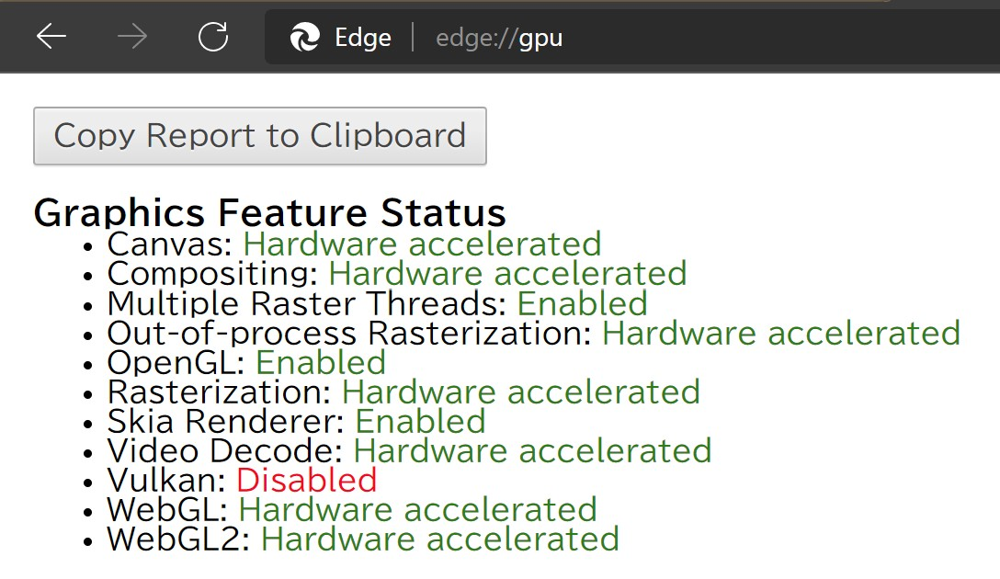
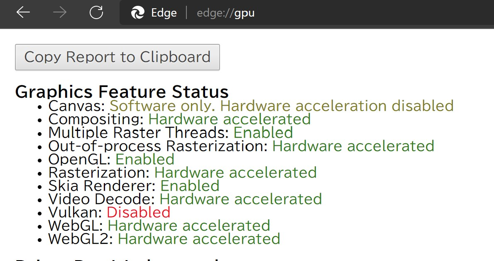

# WebAssembly で画像のリサイズ処理をやってみたら JavaScript + Canvas API より遅かった話

WebAssembly(WASM) は JavaScript より計算処理が速いという話題がしばしば聞かれます。

では、単純な数値計算ではないけれど、JavaScript を利用した通常のフロントエンド開発だと時間がかかる処理を移植するとどうなるのでしょうか[^1]。本記事ではその一例として、巨大画像（4K～）を指定したピクセル数までリサイズする処理を書いてみました。

[^1]: ブラウザ上で利用可能な各種Web_API([CanvasAPI](https://developer.mozilla.org/ja/docs/Web/API/Canvas_API)等)は利用するものとします。従って、JavaScriptの計算処理によって画像のデコード・エンコード処理やリサイズ処理を行うという意味ではありません。

リポジトリ: <https://github.com/yokra9/wasm-image-resizer>

## JavaScript + Canvas API でリサイズしてみる

まず、比較のため JavaScript でリサイズ処理を書いておきましょう。とはいえ、TypeScript からコンパイルして生成します。

```typescript
const url = "./img/sample.jpg";
const resp = await fetch(url);

const b = await resp.blob();

// JavaScript でリサイズ
const blob = await resizeImageLegacy(b, 512, 512);

// 画面上に処理結果を表示する
describeImageFromBlob(blob, "sample");

/**
 * resize image(JS-native)
 * @param {Blob} file image
 * @param {number} width width
 * @param {number} height height
 * @returns {Promise<Blob>} image
 */
function resizeImageLegacy(file: Blob, width: number, height: number): Promise<Blob> {
  return new Promise((resolve, reject) => {
    const image = new Image();
    console.log(`Original: ${file.size} Bytes`);

    const objectURL = URL.createObjectURL(file);
    
    image.onload = () => {

      const canvas = document.createElement('canvas');
      canvas.width = width;
      canvas.height = height;

      const ctx = canvas.getContext('2d');
      if (ctx == null) {
        reject('cannot get context.');
        return;
      }

      ctx.drawImage(
        image,
        0,
        0,
        image.naturalWidth,
        image.naturalHeight,
        0,
        0,
        canvas.width,
        canvas.height
      );

      canvas.toBlob((blob) => {
        if (blob == null) {
          reject('cannot convert canvas to blob.');
          return;
        }
        console.log(`Resized: ${blob.size} Bytes`);
        resolve(blob);
      }, "image/jpeg", 0.8);
    };

    image.src = objectURL;
  });
}
```

流れとしては以下の通りです：

1. リサイズ後の大きさで Canvas を作成する
2. `Blob` を `URL.createObjectURL()` で ObjectURL に変換する
3. 作成した ObjectURL を image にセットする
4. Canvas に画像を描画する
5. `HTMLCanvasElement.toBlob()` で `Blob` にして返却する

Canvas API を利用しているので、画像のデコード・エンコード処理やリサイズ処理はブラウザの実装任せで、JavaScript として書いているわけではありません[^2]

[^2]: ちなみにCanvasのSpecはECMAScriptではなく[HTML_Living_Standard](https://html.spec.whatwg.org/multipage/canvas.html)にあります。

### 実行結果(JS)

| 試行     | サンプル1      (17446953 Bytes) | サンプル2      (14725447 Bytes) | サンプル3      ( 6985698 Bytes) |
|----------|---------------------------------|---------------------------------|---------------------------------|
| 1        | 467.768                         | 425.427                         | 267.401                         |
| 2        | 475.222                         | 430.402                         | 267.401                         |
| 3        | 484.113                         | 424.918                         | 243.935                         |
| 4        | 484.113                         | 424.918                         | 243.935                         |
| 5        | 484.113                         | 438.421                         | 248.328                         |
| 平均(ms) | 479.066                         | 428.817                         | 254.200                         |

16MB の画像を処理するのに 0.5 秒かかっています。メインスレッドがブロックされる秒数として微妙なところですね。`console.time()` を仕掛けてボトルネックになっている箇所を調べてみます：

```plaintext:実行時間
URL.createObjectURL(): 0.117919921875 ms
load image from ObjectURL: 29.1630859375 ms
Document.createElement(): 0.05419921875 ms
HTMLCanvasElement.getContext(): 0.070068359375 ms
CanvasRenderingContext2D.drawImage(): 222.634033203125 ms
HTMLCanvasElement.toBlob(): 212.616943359375 ms
##### resizeImageLegacy #####: 465.1611328125 ms
```

Canvas に対する操作に要する時間が大きいようです。ところで、この計測は Microsoft Edge 上で実施しており、Canvas に対するハードウェアアクセラレーションが有効になっています。



この後作成する WASM 版のコードだとハードウェアアクセラレーションが働かないので、ハードウェアアクセラレーションを切って測定してみます。



Canvas がボトルネックになっているのであれば明確に遅くなっていそうなものですが、実際はどうでしょうか：

| 試行     | サンプル1 (17446953 Bytes) | サンプル2 (14725447 Bytes) | サンプル3 ( 6985698 Bytes) |
|----------|----------------------------|----------------------------|----------------------------|
| 1        | 367.937                    | 331.860                    | 189.027                    |
| 2        | 371.219                    | 347.422                    | 186.721                    |
| 3        | 375.982                    | 351.710                    | 185.914                    |
| 4        | 389.980                    | 356.300                    | 187.158                    |
| 5        | 379.367                    | 348.955                    | 175.298                    |
| 平均(ms) | 376.897                    | 347.249                    | 184.824                    |

```plaintext:実行時間
URL.createObjectURL(): 0.11572265625 ms
load image from ObjectURL: 29.06494140625 ms
Document.createElement(): 0.072998046875 ms
HTMLCanvasElement.getContext(): 0.137939453125 ms
CanvasRenderingContext2D.drawImage(): 161.45703125 ms
HTMLCanvasElement.toBlob(): 181.51513671875 ms
##### resizeImageLegacy #####: 379.366943359375 ms
```

…なぜか速くなってしまいましたが、やはり Canvas に対する操作に要する時間が大きいようです。メインスレッドのブロッキングを防ぐために WebWorker で別スレッドで動かそうにも、[OffscreenCanvas](https://developer.mozilla.org/ja/docs/Web/API/OffscreenCanvas) は Chromium 系でしか動作しません。果たして WASM を利用すれば、さらなるパフォーマンスを引き出すことはできるのでしょうか？（タイトルでオチていますが…）

## WASM(Rust) でリサイズしてみる

流れとしては以下の通りです[^3]：

[^3]: 他にも`WebAssembly.Memory()`でWASMインスタンスのメモリを掴み生ポインタを触る方法もあります。試してみましたが、複雑な割に速度は大きく変わりませんでしたので紹介しません。

1. `Blob` を `Uint8Array` に変換する
2. `Uint8Array` とリサイズ後の大きさを WASM に渡す
3. `Uint8Array` をバッファ（`Vec<u8>`）にコピーする
4. `image::load_from_memory()` で画像を読み込む
5. `image::resize_exact()` でリサイズする
6. `image::write_to()` で結果をバッファ（`Vec<u8>`）に書き込む
7. `Vec<u8>` を `Uint8Array` に変換して JS に渡す
8. `Uint8Array` を `Blob` に変換する

Rust の世界で `Blob` を扱うのが若干面倒だったので `Uint8Array` 経由で画像を受け渡ししています。Rust 側では有名な `image` クレートを利用して画像の読み込み・リサイズを行っています：

```rust
extern crate console_error_panic_hook;
extern crate wasm_bindgen;

use image::*;
use js_sys::*;
use wasm_bindgen::prelude::*;

#[wasm_bindgen]
extern "C" {
    #[wasm_bindgen(js_namespace = console)]
    pub fn time(s: &str);

    #[wasm_bindgen(js_namespace = console)]
    pub fn timeEnd(s: &str);
}

#[wasm_bindgen]
pub fn resize_image(arr: Uint8Array, width: usize, height: usize, fmt: &str) -> Uint8Array {
    console_error_panic_hook::set_once();

    // Uint8Array から Vec にコピーする
    let buffer = arr.to_vec();

    // バッファから画像を読み込む
    let img = load_from_memory(&buffer).expect("Error occurs at load image from buffer.");

    // 指定サイズに画像をリサイズする
    let resized = img.resize_exact(width as u32, height as u32, imageops::FilterType::Triangle);
    
    // バッファに画像を書き出す
    let result = save_to_buffer(resized, fmt);
    
    // バッファから Uint8Array を作成
    Uint8Array::new(&unsafe { Uint8Array::view(&result) }.into())
}

// バッファに画像を書き出す
fn save_to_buffer(img: DynamicImage, fmt_str: &str) -> Vec<u8> {
    console_error_panic_hook::set_once();

    let fmt = match fmt_str {
        "png" => ImageOutputFormat::Png,
        "gif" => ImageOutputFormat::Gif,
        "bmp" => ImageOutputFormat::Bmp,
        "jpg" => ImageOutputFormat::Jpeg(80),
        unsupport => ImageOutputFormat::Unsupported(String::from(unsupport)),
    };

    // バッファを確保して画像を書き出す
    let mut result: Vec<u8> = Vec::new();
    img.write_to(&mut result, fmt)
        .expect("Error occurs at save image from buffer.");

    result
}
```

呼び出し側のコードは以下のような形です：

```typescript
import type * as WASM from "wasm-image-resizer"
type Wasm = typeof WASM;

// WASM の Shim を動的インポートする
const js = import("wasm-image-resizer");
js.then(async wasm => {
  const url = "./img/sample.jpg";
  const resp = await fetch(url);

  const b = await resp.blob();

  // WASMでリサイズ
  const blob = await resizeImageWasm(b, 512, 512, "jpg", wasm);

  // 画面上に処理結果を表示する
  describeImageFromBlob(blob, "sample");
});

/**
 * resize image(WASM)
 * @param {Blob} file image
 * @param {number} width width
 * @param {number} height height
 * @param {string} format format
 * @param {Wasm} wasm WASM 
 * @returns {Promise<Blob>} image
 */
async function resizeImageWasm(file: Blob, width: number, height: number, format: string, wasm: Wasm): Promise<Blob> {
  console.log(`Original: ${file.size} Bytes`);
  const arr = new Uint8Array(await file.arrayBuffer());

  const result = wasm.resize_image(arr, width, height, format);

  const blob = new Blob([result]);
  console.log(`Resized: ${blob.size} Bytes`);

  return blob
}
```

### 実行結果(WASM(Rust))

| 試行     | サンプル1      (17446953 Bytes) | サンプル2      (14725447 Bytes) | サンプル3      ( 6985698 Bytes) |
|----------|---------------------------------|---------------------------------|---------------------------------|
| 1        | 3906.262                        | 4072.797                        | 2876.642                        |
| 2        | 3903.539                        | 4072.797                        | 2854.539                        |
| 3        | 3992.005                        | 4092.231                        | 2918.119                        |
| 4        | 3917.787                        | 4073.364                        | 2865.451                        |
| 5        | 3917.787                        | 4077.866                        | 2877.314                        |
| 平均(ms) | 3927.476                        | 4077.811                        | 2878.413                        |

JS の 10 倍遅いです[^4]。こ、こんなはずでは…。今回も `console.time()` を仕掛けてボトルネックになっている箇所を調べてみます：

[^4]: `wasm-pack build --release`でリリースフラグを立てた状態でこの速度です。え…私のコード、遅すぎ?!

```plaintext:実行時間
Blob to Uint8Array: 9.274169921875 ms
Uint8Array to Vec<u8>: 33.488037109375 ms
image::load_from_memory(): 3275.39013671875 ms
image::resize_exact(): 685.47216796875 ms
save_to_buffer: 39.794921875 ms
Vec<u8> to Uint8Array: 0.174072265625 ms
Uint8Array to Blob: 0.496826171875 ms
##### WebAssembly #####: 4045.272705078125 ms
```

メイン処理となる `image::resize_exact()` だけでも JS より遅いので論外ですが、ボトルネックは `image::load_from_memory()` だったようです。[^5]

[^5]: `load_from_memory`という名前ですが、実際にはフォーマットに応じたデコード処理も含まれています。

今回のように WASM(Rust) の世界で速度が出ない事象は、`web_sys` クレート経由でブラウザ機能を呼び出したり[^6]、呼び出し側やインライン[^7]の JS 関数を呼び出すことで回避できます。

[^6]: https://rustwasm.github.io/docs/wasm-bindgen/examples/2d-canvas.html

[^7]: https://rustwasm.github.io/docs/wasm-bindgen/reference/js-snippets.html

[^8]: https://tech-blog.optim.co.jp/entry/2021/07/30/080000#arch_wasm

## WASM(OpenCV) でリサイズしてみる

他の著名な画像操作ライブラリとして `OpenCV` がありますが、現状 `OpenCV` クレートは WASM をターゲットとしたビルドができません。[^9]

[^9]: https://github.com/twistedfall/opencv-rust/issues/124

そこで、[OpenCV.js](https://docs.opencv.org/master/df/d0a/tutorial_js_intro.html) を試すことにしました。OpenCV.js は OpenCV のサブセットを WASM をターゲットとしてビルドした公式プロジェクトです。こちらも、TypeScript から呼び出してみます。[^10]

[^10]: `any`が残るコードになっているのは無念ですが、公式には型定義ファイルが見つかりませんでした。実際の`window.cv`を`JSON.stringfy()`して`quicktype`に通す手も考えましたが、WASMコードが含まれているとJSON化できませんでした。実プロジェクトで使いたい場合は、仕様理解のためにも型定義ファイルを作った方がいいと思います。

```typescript
type Window = {
  cv: any,
}
declare var window: Window;

const url = "./img/sample.jpg";
const resp = await fetch(url);

const b = await resp.blob();

// OpenCV.js でリサイズ
const blob = await resizeImageCV(b, 512, 512, window.cv);

// 画面上に処理結果を表示する
describeImageFromBlob(blob, "sample");

/**
 * resize image(OpenCV)
 * @param {Blob} file image
 * @param {number} width width
 * @param {number} height height
 * @param {any} cv OpenCV.js 
 * @returns {Promise<Blob>} image
 */
function resizeImageCV(file: Blob, width: number, height: number, cv: any): Promise<Blob> {
  return new Promise((resolve, reject) => {
    const image = new Image();
    console.log(`Original: ${file.size} Bytes`);

    const objectURL = URL.createObjectURL(file);

    image.onload = () => {
      const canvas = document.createElement('canvas');
      canvas.width = width;
      canvas.height = height;

      let src = cv.imread(image);
      let dst = new cv.Mat();

      let dsize = new cv.Size(width, height);
      cv.resize(src, dst, dsize, 0, 0, cv.INTER_LINEAR_EXACT);

      cv.imshow(canvas, dst);

      src.delete();
      dst.delete();

      canvas.toBlob((blob) => {
        if (blob == null) {
          reject('cannot convert canvas to blob.');
          return;
        }

        resolve(blob);
      }, "image/jpeg", 0.8);
    };

    image.src = objectURL;
  });
}
```

流れは以下の通りです：

1. リサイズ後の大きさで Canvas を作成する
2. `Blob` を `URL.createObjectURL()` で ObjectURL に変換する
3. 作成した ObjectURL を image にセットする
4. image 内の画像をバッファに読み込む
5. OpenCV(WASM)でリサイズしてバッファに書き込む
6. Canvas にバッファ内の画像を表示する
7. `HTMLCanvasElement.toBlob()` で `Blob` にして返却する

Canvas API を利用してはいるものの、リサイズ処理は WASM で行っています。

### 実行結果(WASM(OpenCV.js))

| 試行     | サンプル1 (17446953 Bytes) | サンプル2 (14725447 Bytes) | サンプル3 ( 6985698 Bytes) |
|----------|----------------------------|----------------------------|----------------------------|
| 1        | 701.307                    | 692.949                    | 478.998                    |
| 2        | 638.878                    | 614.146                    | 385.925                    |
| 3        | 715.814                    | 683.853                    | 416.562                    |
| 4        | 724.004                    | 645.536                    | 415.177                    |
| 5        | 713.559                    | 623.795                    | 418.676                    |
| 平均(ms) | 698.712                    | 652.056                    | 423.068                    |

Canvas API 程ではないですが、実用的な速度になりました。ボトルネックになっている箇所を調べてみます：

```plaintext:実行時間
URL.createObjectURL(): 0.238037109375 ms
load image from ObjectURL: 22.555908203125 ms
Document.createElement(): 0.084716796875 ms
create dense array: 467.43798828125 ms
cv::resize(): 12.4599609375 ms
cv::imshow(): 14.69384765625 ms
delete dense array: 0.0068359375 ms
HTMLCanvasElement.toBlob(): 189.468017578125 ms
##### OpenCV.js #####: 707.7109375 ms
```

リサイズ処理部分と Canvas への描画を合わせても 27 ms と、Canvas API による描画より速度が出ています。一方でバッファ関連がボトルネックになっており、`image` クレートと共通する問題と言えます。

この結果を見ると、Rust の `image` クレートと WASM の相性が特別悪い可能性も考えられますね。Rust 1.54 からは WASM で SIMD が使えるようになる[^11]ので、`image` クレートの処理が高速化することに期待しています。[^12]

[^11]: https://tech-blog.optim.co.jp/entry/2021/07/30/080000#arch_wasm

[^12]: ただしRust_1.54+image_0.23.14でビルドしたところ`image::resize_exact()`の実行速度は10ms程度早くなりましたが、ボトルネックとなる`image::load_from_memory()`ではほぼ改善が見られませんでした。もともとムラは大きかったため、誤差の範囲に収まっているように見えます。

## まとめ

重い処理を WASM に持っていけばなんでも早くなるわけではない、という結果になりました。当然ではありますが、問題の箇所が本当に高速化できるのか、コードを書いて実測するべきですね。

残念ながら Canvas API よりも速度は出ませんでしたが、 WASM は WebWorker 上で動作できるので、メインスレッドをブロックしたくない場合には有用でしょう。

また、WASM 側で利用するライブラリの選定やコードの修正により JavaScript より高速になる可能性もあるはずです。本稿を読んだ方で、WASM 版の処理をもっと速くできるよ! という方はコメント欄などで教えてくださると幸いです。

## 参考リンク

* [Can't get image::load_from_memory() to work when compiled to WebAssembly](https://stackoverflow.com/questions/50415623/cant-get-imageload-from-memory-to-work-when-compiled-to-webassembly)
* [WebAssemblyをちょろっと触って速度測ってみる。](http://namazu-tech.hatenablog.com/entry/2017/12/02/012600)
* [WebAssemblyとJavaScriptで浮動小数点演算の速度を比較する](https://niba1122.dev/js-wasm-benchmark/)
* [WebAssemblyは本当に速いのか？ [数値計算編]](https://qiita.com/osanshouo/items/e5be8003f189dfe246f9)
* [OffscreenCanvas](https://developer.mozilla.org/ja/docs/Web/API/OffscreenCanvas)
* [web-sys: canvas hello world - The `wasm-bindgen` Guide](https://rustwasm.github.io/docs/wasm-bindgen/examples/2d-canvas.html)
* [Geometric Transformations of Images](https://docs.opencv.org/master/dd/d52/tutorial_js_geometric_transformations.html)
