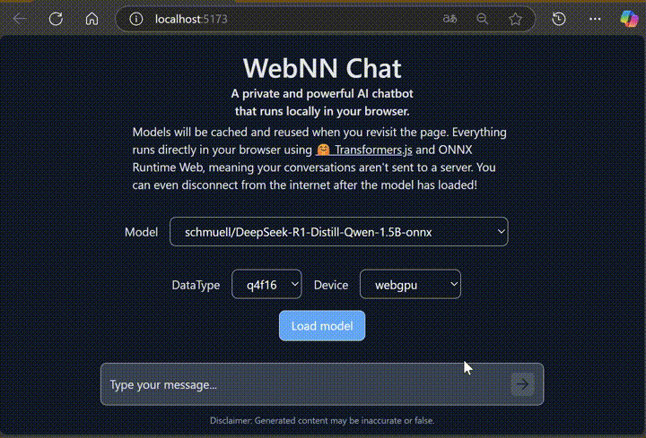
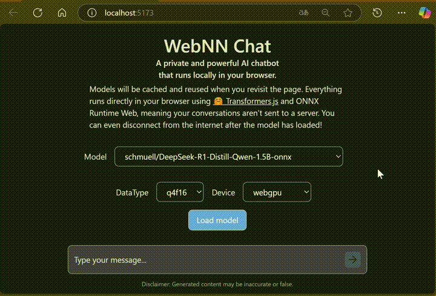
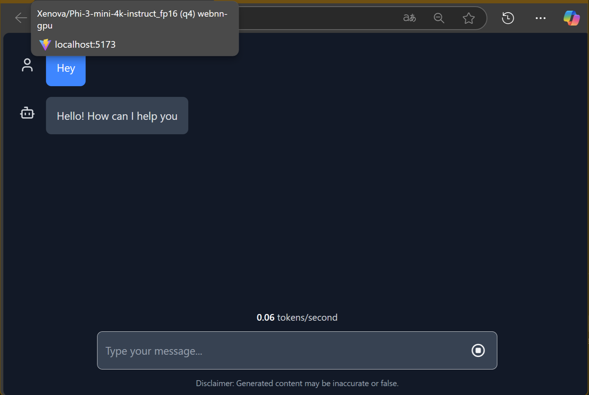
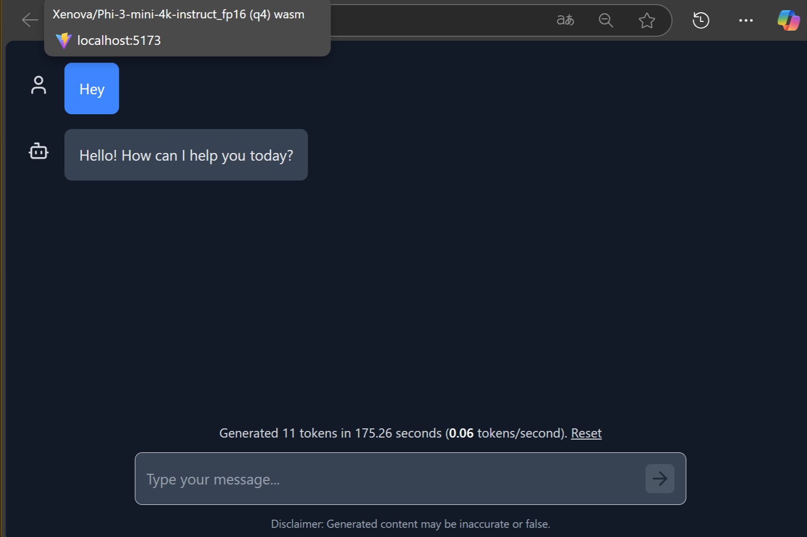

# ブラウザ上でも DeepSeek-R1 を動かしたい（WebAssembly/WebGPU/WebNN）

[DeepSeek-R1](https://huggingface.co/deepseek-ai/DeepSeek-R1)、話題ですよね。オープンソースで OpenAI o1 に迫る性能を見せる、開発コストも低いとの噂で業界の内外を問わず激震が走りました。[Qwen2.5](https://huggingface.co/collections/Qwen/qwen25-66e81a666513e518adb90d9e) で蒸留された DeepSeek-R1-Distill-Qwen-32B も OpenAI-o1-mini を上回っているという話なので驚きです。

| Model                                    | AIME 2024 pass@1 | AIME 2024 cons@64 | MATH-500 pass@1 | GPQA Diamond pass@1 | LiveCodeBench pass@1 | CodeForces rating |
|------------------------------------------|------------------|-------------------|-----------------|----------------------|----------------------|-------------------|
| GPT-4o-0513                          | 9.3              | 13.4              | 74.6            | 49.9                 | 32.9                 | 759               |
| Claude-3.5-Sonnet-1022             | 16.0             | 26.7                 | 78.3            | 65.0                 | 38.9                 | 717               |
| o1-mini                              | 63.6             | 80.0              | 90.0            | 60.0                 | 53.8                 | **1820**          |
| DeepSeek-R1-Distill-Qwen-1.5B       | 28.9             | 52.7              | 83.9            | 33.8                 | 16.9                 | 954               |

[^1]

[^1]: <https://huggingface.co/deepseek-ai/DeepSeek-R1> より引用・改変。

せっかくオープンソースなので面白い派生モデルの出現を期待していたところ、さっそく [Microsoft から ONNX モデルとして移植した](https://blogs.windows.com/windowsdeveloper/2025/01/29/running-distilled-deepseek-r1-models-locally-on-copilot-pcs-powered-by-windows-copilot-runtime/)という発表がありました。Hugging Face で Microsoft のモデルは公開されていないものの、ONNX Community やそのメンバーである schmuell 氏のバージョンがあることに気が付きました。

* [onnx-community/DeepSeek-R1-Distill-Qwen-1.5B-ONNX](https://huggingface.co/onnx-community/DeepSeek-R1-Distill-Qwen-1.5B-ONNX)
* [schmuell/DeepSeek-R1-Distill-Qwen-1.5B-onnx](https://huggingface.co/schmuell/DeepSeek-R1-Distill-Qwen-1.5B-onnx)

さて、ONNX モデルであれば [huggingface/transformers.js](https://github.com/huggingface/transformers.js) を活用してブラウザ上で動かす事もできるはずです。transformers.js は WebAssembly や WebGPU、WebNN といった様々な技術をサポートし、ブラウザ上で ONNX モデルを動作させます。ということは、ブラウザ上でも DeepSeek-R1 を動かせるはずです。

## ブラウザ上でも DeepSeek-R1-Distill-Qwen-1.5B を動かしてみる

できました。



なにやら英語・中国語混じりで答えているので DeepL に訳してもらいました：

> さて、「拜访」は日本語でどういう意味か考えている。英語では、「近づく」、「知り合う」、「通り過ぎる」、「話しかける」、「交流する」という意味の動詞であることは知っている。日本語では「拜访」は口語的な表現として使われることが多く、「インタビュー」や「電話を入れる」に似ている。
> 日本語の「拜访」や「取次」は、英語が分からない人と話すときに使う言葉だと思います。日本語で言えば、「調子はどうですか」とか「何をしていますか」と言うようなものだ。この言葉は 「intake 」よりも正式に使われ、コスト的にも安価である。
> フォーマルな場では 「interview 」や 「call in 」を使った方がいい。しかし、日常会話では 「拜访 」でも構わない。また、経済や金融の文脈では「call in」などが使われるように記憶しているが、「拜访」の用法としては「interview」の方が一般的なので、そちらがデフォルトなのかもしれない。
> 話し手のフォーマル度によって使い方に違いがあるかどうか、確認しておく必要がある。拜访」がカジュアルなのに対して、「面接」はビジネスや政府など、よりフォーマルな場面で使われることもある。
> もうひとつ： 拜访 「は 」intake 「とは異なり、あまり一般的に使われないので、もしかしたらユーザーは間違って 」intake "と言っているのかもしれない。彼らが疑問に思うかもしれないので、はっきりさせておく必要がある。
> まとめると、「拜访」は日本語のインフォーマル用語で、「インタビュー」や「コール・イン」に相当するが、その用法は意図するフォーマルな場によって異なる。会話がどのように受け取られるかによって、正しい表現を選ぶことが大切です。
> 拜访(インタビュー)は、日本語のインフォーマルな用語で、相手が言葉を理解するかしないかのやりとりを指すのに使われます。対話の中で自己紹介や話の流れを作るときによく使われる。経済的な文脈では「呼びかけ」の方が標準的なので、日常的なカジュアルな会話では「インタビュー」が使われます。常に意図するトーンに沿った形を選びましょう。

R1 らしく、一応思考っぽいことをしている様子が伺えます（？）。このデモは [huggingface/transformers.js/examples/webgpu-chat](https://github.com/huggingface/transformers.js/tree/main/examples/webgpu-chat) を元にモデルとデバイスの選択機能を追加したものです。[^2]

[^2]: その他 TypeScript 化と依存ライブラリの更新も行いました。ついでのつもりでしたが、型をつける過程で transformers.js の仕様理解が進んだのでやってよかったですね。

```typescript
class TextGenerationPipeline {
  static model_id: string;
  static model: Promise<PreTrainedModel>;
  static tokenizer: Promise<PreTrainedTokenizer>;
  static streamer = null;

  static async getInstance(config: Config, progress_callback?: ProgressCallback) {

    this.model_id = config.modelName;

    this.tokenizer ??= AutoTokenizer.from_pretrained(
      this.model_id,
      {
        legacy: true,
        progress_callback
      }
    );

    this.model ??= AutoModelForCausalLM.from_pretrained(
      this.model_id,
      {
        dtype: config.dtype,
        device: config.device,
        use_external_data_format: true,
        progress_callback
      }
    );

    return Promise.all([
      this.tokenizer,
      this.model
    ]);
  }
}
```

```typescript
const modelNames = [
    "onnx-community/DeepSeek-R1-Distill-Qwen-1.5B-ONNX",
    "onnx-community/Llama-3.2-3B-Instruct-onnx-web",
    "onnx-community/Phi-3.5-mini-instruct-onnx-web",
    "Xenova/Phi-3-mini-4k-instruct_fp16",
    "Xenova/Phi-3-mini-4k-instruct",
    "schmuell/DeepSeek-R1-Distill-Qwen-1.5B-onnx",
] as const;

const dtypes = [
    "auto", // Auto-detect based on environment
    "fp16",
    "q4",
    "q4f16", // fp16 model with int4 block weight quantization
] as const;

const devices = [
    "auto", // Auto-detect based on device and environment
    "gpu", // Auto-detect GPU
    "cpu", // CPU
    "wasm", // WebAssembly
    "webgpu", // WebGPU
    "webnn", // WebNN (default)
    "webnn-npu", // WebNN NPU
    "webnn-gpu", // WebNN GPU
    "webnn-cpu", // WebNN CPU
] as const;

type Config = { 
    modelName: (typeof modelNames)[number]; 
    dtype: (typeof dtypes)[number];
    device: (typeof devices)[number]; 
}
```

そのため、Phi-3.5-mini を WebGPU 上で動かすこともできますし…：



Phi-3-mini を WebNN 上で動かすこともできます：



もちろん、WebAssembly でも：



WebNN や WebGPU は黎明的・実験的な段階にありますが、WebAssembly なら利用できる環境も多いでしょう。選択肢が多いのは助かりますね。ただし、手元の環境だと WebNN および WebAssembly 上では満足する速度が出ませんでした。

## まとめ

というわけで、transformers.js がモデルのダウンロードから推論の実行まで一気通貫で行ってくれたおかげでサクっと構築できました。ブラウザ上の動作であればサーバサイドで計算資源を調達しなくて済みますし、うまく活用すれば低コストで生成 AI を活用した Web アプリケーションを提供できる可能性がありますね。

## 参考リンク

* [huggingface/transformers.js: State-of-the-art Machine Learning for the web. Run 🤗 Transformers directly in your browser, with no need for a server!](https://github.com/huggingface/transformers.js)
* [Transformers.js](https://huggingface.github.io/transformers.js/)
* [onnx-community/DeepSeek-R1-Distill-Qwen-1.5B-ONNX](https://huggingface.co/onnx-community/DeepSeek-R1-Distill-Qwen-1.5B-ONNX)
* [schmuell/DeepSeek-R1-Distill-Qwen-1.5B-onnx](https://huggingface.co/schmuell/DeepSeek-R1-Distill-Qwen-1.5B-onnx)
* [DeepSeek-R1がNPU上で動作できるようMicrosoftが移植 - PC Watch](https://pc.watch.impress.co.jp/docs/news/1658778.html)
* [Running Distilled DeepSeek R1 models locally on Copilot+ PCs, powered by Windows Copilot Runtime - Windows Developer Blog](https://blogs.windows.com/windowsdeveloper/2025/01/29/running-distilled-deepseek-r1-models-locally-on-copilot-pcs-powered-by-windows-copilot-runtime/)
* [WebNN チュートリアル | Microsoft Learn](https://learn.microsoft.com/ja-jp/windows/ai/directml/webnn-tutorial)
* [WebNN Samples | Web Machine Learning](https://webmachinelearning.github.io/webnn-samples-intro/)
* [WebNN Developer Preview](https://microsoft.github.io/webnn-developer-preview/)
