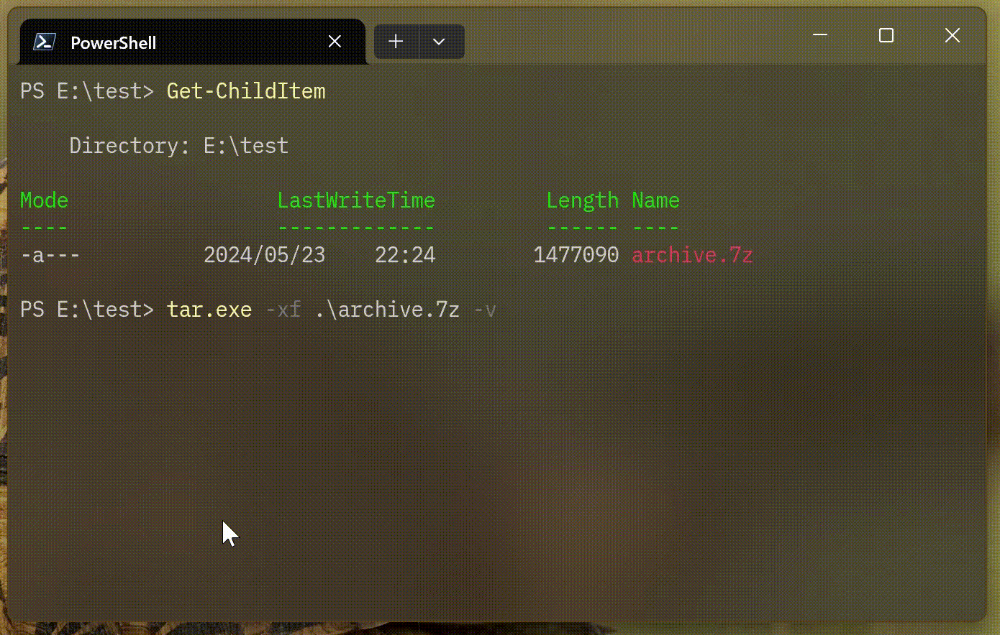

# Windows 11 では 7z をコマンドラインでも圧縮・解凍できるようになっていた

Windows 11 23H2 以降、[エクスプローラーが 7z、tar などの解凍に対応](https://blogs.windows.com/windowsdeveloper/2023/05/23/bringing-the-power-of-ai-to-windows-11-unlocking-a-new-era-of-productivity-for-customers-and-developers-with-windows-copilot-and-dev-home/)しました。さらに、[Build 25992 では圧縮も可能となった](https://blogs.windows.com/windows-insider/2023/11/08/announcing-windows-11-insider-preview-build-25992-canary-channel/)ようです。[7-zip](https://7-zip.opensource.jp/) を追加インストールしなくてもこれらのアーカイブを取り扱えるのは嬉しいですよね。

 [^1]

[^1]: [Announcing Windows 11 Insider Preview Build 25992 (Canary Channel) | Windows Insider Blog](https://blogs.windows.com/windows-insider/2023/11/08/announcing-windows-11-insider-preview-build-25992-canary-channel/)

一方で、PowerShell の `Expand-Archive` コマンドレットは拡張されておらず、ZIP 形式の解凍しかできません。

```powershell
Expand-Archive .\archive.7z .\
```

```log
GAC    Version        Location
---    -------        --------
False  v4.0.30319     C:\Program Files\WindowsApps\Microsoft.PowerShell_7.…
OperationStopped: File 'E:\test\archive.7z' does not appear to be a valid zip archive.
```

せっかく標準機能で 7z が取り扱えるようになったのですから、コマンドラインからも操作してみたいですよね。どうにかできないものか。[^6]

[^6]: 7z のデフォルトアルゴリズムは LZMA ですが、実は Windows 8 以降 [LZMS という似て非なるアルゴリズムは搭載されていたりします](https://qiita.com/yokra9/items/20f65b27851ce52158ff)。

## Windows 11 に同梱されている bsdtar (libarchive) をコマンドラインから利用する

実は、[Windows 10 1803 以降には tar コマンドが同梱されています](https://techcommunity.microsoft.com/t5/containers/tar-and-curl-come-to-windows/ba-p/382409)。この tar コマンドは [GNU tar](https://www.gnu.org/software/tar/) ではなく、[FreeBSD 版 tar (libarchive)](https://www.libarchive.org/) です：

```powershell
tar.exe --help
```

```log
tar.exe(bsdtar): manipulate archive files
First option must be a mode specifier:
  -c Create  -r Add/Replace  -t List  -u Update  -x Extract
Common Options:
  -b #  Use # 512-byte records per I/O block
  -f <filename>  Location of archive (default \\.\tape0)
  -v    Verbose
  -w    Interactive
Create: tar.exe -c [options] [<file> | <dir> | @<archive> | -C <dir> ]
  <file>, <dir>  add these items to archive
  -z, -j, -J, --lzma  Compress archive with gzip/bzip2/xz/lzma
  --format {ustar|pax|cpio|shar}  Select archive format
  --exclude <pattern>  Skip files that match pattern
  -C <dir>  Change to <dir> before processing remaining files
  @<archive>  Add entries from <archive> to output
List: tar.exe -t [options] [<patterns>]
  <patterns>  If specified, list only entries that match
Extract: tar.exe -x [options] [<patterns>]
  <patterns>  If specified, extract only entries that match
  -k    Keep (don't overwrite) existing files
  -m    Don't restore modification times
  -O    Write entries to stdout, don't restore to disk
  -p    Restore permissions (including ACLs, owner, file flags)
bsdtar 3.6.2 - libarchive 3.6.2 zlib/1.2.5.f-ipp liblzma/5.2.5 bz2lib/1.0.8 libzstd/1.5.4
```

そのため、`tar -c` を実行しても GNU tar でおなじみの `空のアーカイブ作成はご容赦願います` という独特な表現を見ることはできません：

```bash:Ubuntu 上の GNU tar v1.34
tar -c
```

```log
tar: 空のアーカイブ作成はご容赦願います
より詳しい情報は 'tar --help' または 'tar --usage' で.
```

```bash:Ubuntu 上の FreeBSD 版 tar v3.6.0
bsdtar -c
```

```log
bsdtar: no files or directories specified
```

```powershell:Windows 11 に付属の FreeBSD 版 tar v3.6.2
tar.exe -c
```

```log
tar.exe: no files or directories specified
```

FreeBSD 版 tar は、tar や gz はもちろん、7z 等の多様なアーカイブ形式に対応しています：

```markdown
## Supported Formats

Currently, the library automatically detects and reads the following formats:

  * Old V7 tar archives
  * POSIX ustar
  * GNU tar format (including GNU long filenames, long link names, and sparse files)
  * Solaris 9 extended tar format (including ACLs)
  * POSIX pax interchange format
  * POSIX octet-oriented cpio
  * SVR4 ASCII cpio
  * Binary cpio (big-endian or little-endian)
  * PWB binary cpio
  * ISO9660 CD-ROM images (with optional Rockridge or Joliet extensions)
  * ZIP archives (with uncompressed or "deflate" compressed entries, including support for encrypted Zip archives)
  * ZIPX archives (with support for bzip2, ppmd8, lzma and xz compressed entries)
  * GNU and BSD 'ar' archives
  * 'mtree' format
  * 7-Zip archives
  * Microsoft CAB format
  * LHA and LZH archives
  * RAR and RAR 5.0 archives (with some limitations due to RAR's proprietary status)
  * XAR archives

The library also detects and handles any of the following before evaluating the archive:

  * uuencoded files
  * files with RPM wrapper
  * gzip compression
  * bzip2 compression
  * compress/LZW compression
  * lzma, lzip, and xz compression
  * lz4 compression
  * lzop compression
  * zstandard compression

The library can create archives in any of the following formats:

  * POSIX ustar
  * POSIX pax interchange format
  * "restricted" pax format, which will create ustar archives except for entries that require pax extensions (for long filenames, ACLs, etc).
  * Old GNU tar format
  * Old V7 tar format
  * POSIX octet-oriented cpio
  * SVR4 "newc" cpio
  * Binary cpio (little-endian)
  * PWB binary cpio
  * shar archives
  * ZIP archives (with uncompressed or "deflate" compressed entries)
  * GNU and BSD 'ar' archives
  * 'mtree' format
  * ISO9660 format
  * 7-Zip archives
  * XAR archives

When creating archives, the result can be filtered with any of the following:

  * uuencode
  * gzip compression
  * bzip2 compression
  * compress/LZW compression
  * lzma, lzip, and xz compression
  * lz4 compression
  * lzop compression
  * zstandard compression
```

[^2]

[^2]: <https://github.com/libarchive/libarchive/blob/v3.6.2/README.md>

というわけで、`tar.exe` を叩くだけでコマンドラインから 7z を圧縮・解凍できてしまうのです：



[エクスプローラの 7z 対応も libarchive を利用している](https://blogs.windows.com/windowsdeveloper/2023/05/23/bringing-the-power-of-ai-to-windows-11-unlocking-a-new-era-of-productivity-for-customers-and-developers-with-windows-copilot-and-dev-home/)ため、順序としてはコマンドラインで先に取り込んでいたことになります。私も Windows 10 の頃から `tar.exe` が同梱されていたことは知っていたのですが、それが FreeBSD 版 tar で、ここまで広範囲をカバーできるものとは認識していませんでした。[^3] [^4]

[^3]: 実際、Windows 10 の `tar.exe` では 7z を解凍しようとしても `LZMA codec is unsupported` となってしまうようです。`tar.exe --help` の結果からも、`liblzma` が含まれていないことが確認できます。

[^4]: Windows 11 に同梱されている libarchive のファイル名は `archiveint.dll`です。 

とはいえ、開発者にとって嬉しいのは Linux との相互運用性という意味で tar および gz、bzip2 への対応でしょう。[^5] 本件に限らず、[最近の Windows の開発者への寄り添い具合](https://forest.watch.impress.co.jp/docs/news/1593848.html)には目を見張るものがあります。この調子で開発者フレンドリーな姿勢を継続してほしいですね。

[^5]: ちなみに `.tgz` と `.tbz2` はエクスプローラーで開けましたが、 `.tbz` は非対応でした。

## 参考リンク

* [Windows 11がRARや7-zipなどの解凍にネイティブ対応。libarchiveライブラリ利用 | テクノエッジ TechnoEdge](https://www.techno-edge.net/article/2023/05/25/1337.html)
* [Bringing the power of AI to Windows 11 - unlocking a new era of productivity for customers and developers with Windows Copilot and Dev Home - Windows Developer Blog](https://blogs.windows.com/windowsdeveloper/2023/05/23/bringing-the-power-of-ai-to-windows-11-unlocking-a-new-era-of-productivity-for-customers-and-developers-with-windows-copilot-and-dev-home/)
* [Expand-Archive (Microsoft.PowerShell.Archive) - PowerShell | Microsoft Learn](https://learn.microsoft.com/ja-jp/powershell/module/microsoft.powershell.archive/expand-archive?view=powershell-7.4)
* [Tar and Curl Come to Windows! - Microsoft Community Hub](https://techcommunity.microsoft.com/t5/containers/tar-and-curl-come-to-windows/ba-p/382409)
* [「エクスプローラー」に「Git」を統合 ～アプリ開発者のためのWindowsシェル改善 - 窓の杜](https://forest.watch.impress.co.jp/docs/news/1593848.html)
* [【windows10】tarファイルをコマンドプロンプトで解凍できる](https://qiita.com/rodeeeen/items/ebf2d328b88d1fc7381a)
* [Windowsのtarコマンドで tar.gzファイルをtarファイルにする](https://qiita.com/n_sato/items/5bee756165dbcc1a84c5)
* [bsdtarをUbuntuで使う](https://zenn.dev/yoichi/articles/freebsd-tar-on-ubuntu-linux)
* [FreeBSD の tar がすごい](https://qiita.com/s_mitu/items/b61b227d55e1d8bf9fc5)
* [Linux コマンドの多言語対応 ~ tar の「空のアーカイブ作成はご容赦願います」の謎に迫る~](https://www.kimullaa.com/posts/202001251000/)
* [libarchive](https://libarchive.org/)
* [libarchive/libarchive: Multi-format archive and compression library](https://github.com/libarchive/libarchive)
* [Release Libarchive 3.6.2 · libarchive/libarchive](https://github.com/libarchive/libarchive/releases/tag/v3.6.2)
* [bsdtar(1) - FreeBSD Manual Pages](https://man.freebsd.org/cgi/man.cgi?query=bsdtar&sektion=1&format=html)
* [Windows 11 Compression Features Pose libarchive Security Threats](https://gbhackers.com/libarchive-security-threats/)
