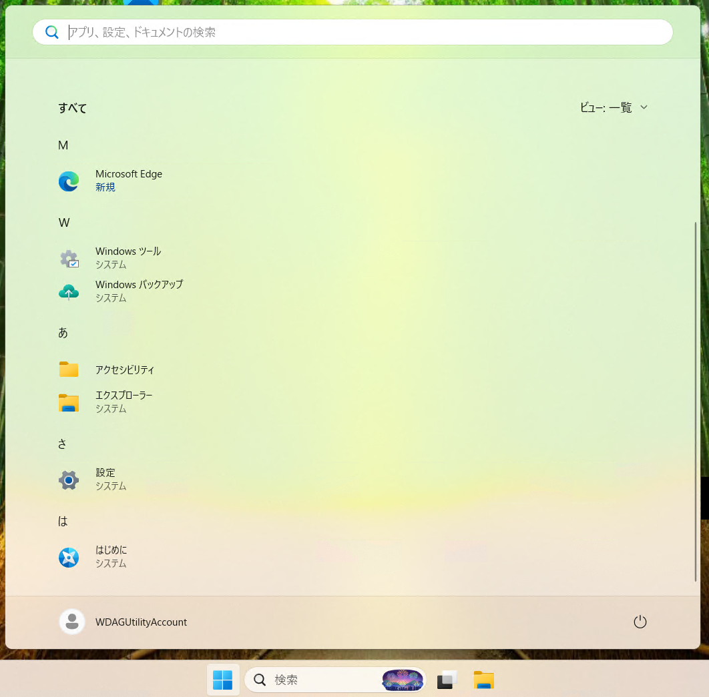
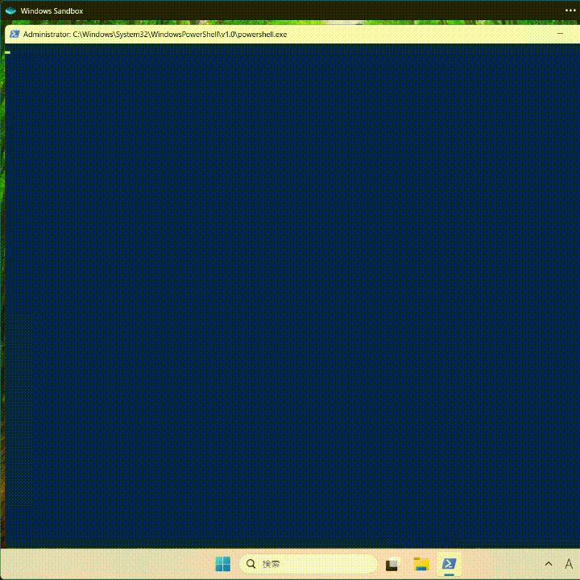
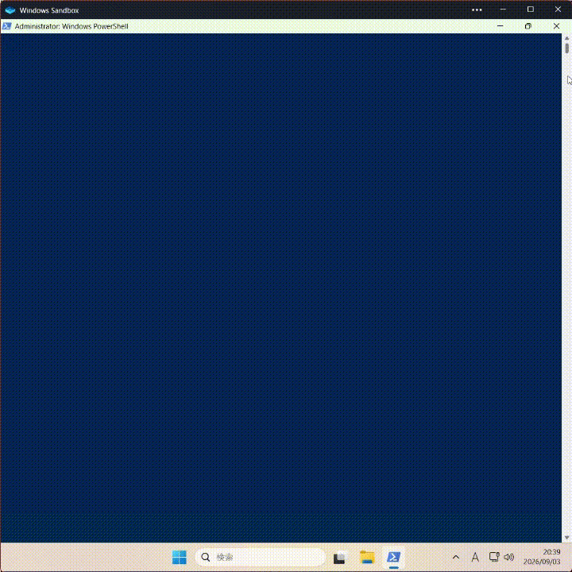

# Windows Sandbox にメモ帳や Windows Terminal を自動でインストールする

[Windows Sandbox](https://learn.microsoft.com/ja-jp/windows/security/application-security/application-isolation/windows-sandbox/)、便利ですよね。わずか数秒でライセンス的にクリーンな Windows VM を起動でき、検証・実験用途にぴったりです。私も Qiita 用のスクリーンショット は Windows Sandbox で用意したクリーンなデスクトップ環境で撮影することが多いです。[^1]

[^1]: 直近の [Windows Terminal で使用できる OSC の一覧](https://qiita.com/yokra9/items/a69e257161c640bf9ef4#osc-0-2--%E3%82%BF%E3%83%96%E5%90%8D%E3%82%92%E5%A4%89%E6%9B%B4%E3%81%99%E3%82%8Bseticonandwindowtitlesetwindowiconsetwindowtitle)でも相当重用しました。

ところが、いつの間にか Windows Sandbox で立ち上げたデスクトップ環境にメモ帳（Windows Notepad / `notepad.exe`）がプリインストールされなくなってしまいました。メモ帳は検証時のちょっとした設定ファイルの変更にも使用しますから、これでは不便すぎますね。

[メモ帳は Microsoft Store 経由で配信されるようになった](https://forest.watch.impress.co.jp/docs/news/1201990.html)ものの、御覧の通り Microsoft Store もプリインストールされなくなっています。



[Notepad++](https://github.com/notepad-plus-plus/notepad-plus-plus) 等のテキストエディタを導入するのであれば、母艦からインストーラをコピー&ペーストする、Edge や PowerShell でインストーラをダウンロードする、などの対応が可能です。あるいは、[Windows Sandbox 構成ファイル](https://learn.microsoft.com/ja-jp/windows/security/application-security/application-isolation/windows-sandbox/windows-sandbox-configure-using-wsb-file)（`.wsb`）を用意してダウンロードからインストールまでを自動化してもよいでしょう。[^2]

[^2]: ここで PowerShell を駆使してインストーラをダウンロード・起動しているのは、WinGet もプリインストールされていないためです。

```xml:Notepad++.wsb
<?xml version="1.0" encoding="UTF-8"?>
<Configuration>
    <LogonCommand>
        <Command>CMD /S /C "start powershell -c "cd $env:TEMP; $release = Invoke-RestMethod "https://api.github.com/repos/notepad-plus-plus/notepad-plus-plus/releases/latest"; $asset = $release.assets | Where-Object { $_.name -like '*Installer.exe' }; Invoke-WebRequest $asset.browser_download_url -OutFile Installer.exe; .\Installer.exe /S /V/QN""</Command>
    </LogonCommand>
</Configuration>
```



しかし、せっかく「クリーンなデスクトップ環境」なのですから Microsoft 謹製のメモ帳にこだわりたいのも自然な発想です。どうにかできないものか。

## Microsoft Store と WinGet からアプリを自動でインストールする Windows Sandbox 構成ファイル

ありがたいことに、[ThioJoe/Windows-Sandbox-Tools](https://github.com/ThioJoe/Windows-Sandbox-Tools/)  にて Microsoft Store と WinGet を導入する PowerShell スクリプトが配布されています。今回はこちらを活用し、Microsoft Store からメモ帳を、WinGet から Windows Terminal と PowerShell 7 を自動インストールしてみましょう。[^3][^4]

[^3]: Windows Terminal は Windows 11 22H2 以降デフォルトのターミナルになっているので、もはやメモ帳同様「インストールされていて自然」な部類のアプリと言えるでしょう。
[^4]: 参照先は固定コミットとしていますが、外部スクリプトの自動実行は自己責任でお願いします。サンドボックス環境とはいえ、ホストのフォルダをマウントしていればセキュリティ上の懸念は生じるためです。

```xml:mywsb.wsb
<?xml version="1.0" encoding="UTF-8"?>
<Configuration>
    <LogonCommand>
        <Command>CMD /S /C "start powershell -ExecutionPolicy Bypass -c "cd $env:TEMP; $scripts = @('https://raw.githubusercontent.com/ThioJoe/Windows-Sandbox-Tools/b812ff980cbf996f16f06a2fecc51258aa76dde0/Installer%20Scripts/Install-Microsoft-Store.ps1','https://raw.githubusercontent.com/ThioJoe/Windows-Sandbox-Tools/b812ff980cbf996f16f06a2fecc51258aa76dde0/Installer%20Scripts/Install-Winget.ps1') | %{ Start-Job -ArgumentList $_ { param($url); cd $env:TEMP; $path = Split-Path -Leaf $url; Invoke-WebRequest -Uri $url -OutFile $path } }; Wait-Job $scripts; .\Install-Microsoft-Store.ps1; .\Install-Winget.ps1; $storeApps = @('9msmlrh6lzf3') | %{ Start-Job -ArgumentList $_ { param($id); store install $id } }; Wait-Job $storeApps; $wingetApps = @('Microsoft.WindowsTerminal','Microsoft.PowerShell') | %{ Start-Job -ArgumentList $_ { param($id); winget install -e --id $id --source winget } }; Wait-Job $wingetApps;""</Command>
    </LogonCommand>
</Configuration>
```



### Microsoft Store アプリを導入する

変数 `$storeApps` で指定された Microsoft Store アプリを `store install` で導入します。指定する Product ID は `store search` コマンドで調べられます。

```powershell
store search "Windows Notepad"
```

なお、Product ID は Microsoft Store 上の URL（例: <https://apps.microsoft.com/detail/9msmlrh6lzf3>）にも含まれています。

### WinGet パッケージを導入する

変数 `$wingetApps` で指定された WinGet パッケージを `winget install` で導入します。指定するパッケージ IDは [winget.run](https://winget.run/) や `winget search` コマンドで調べられます。

```powershell
winget search "Windows Terminal" --source winget
```

ちなみに、`winget install` も Microsoft Store アプリのインストールに対応しています。

```powershell
winget install -e --id 9MSMLRH6LZF3 --source msstore

# or
winget install -e --name "Windows Notepad" --source msstore
```

Windows Terminal と PowerShell 7 は Microsoft Store でも配布されていますが、私は新しいバージョンが早く展開されがちな WinGet から導入しています。

## 参考リンク

* [GitHub - ThioJoe/Windows-Sandbox-Tools: Various useful scripts for use within Windows Sandbox · GitHub](https://github.com/ThioJoe/Windows-Sandbox-Tools/)
* [「Microsoft Store CLI」が登場、ターミナルでストアのアプリを検索・導入・更新 - 窓の杜](https://forest.watch.impress.co.jp/docs/news/2086112.html)
* [winget が使える状態で Windows Sandbox を起動する | Aqua Ware つぶやきブログ](https://aquasoftware.net/blog/?p=2279)
