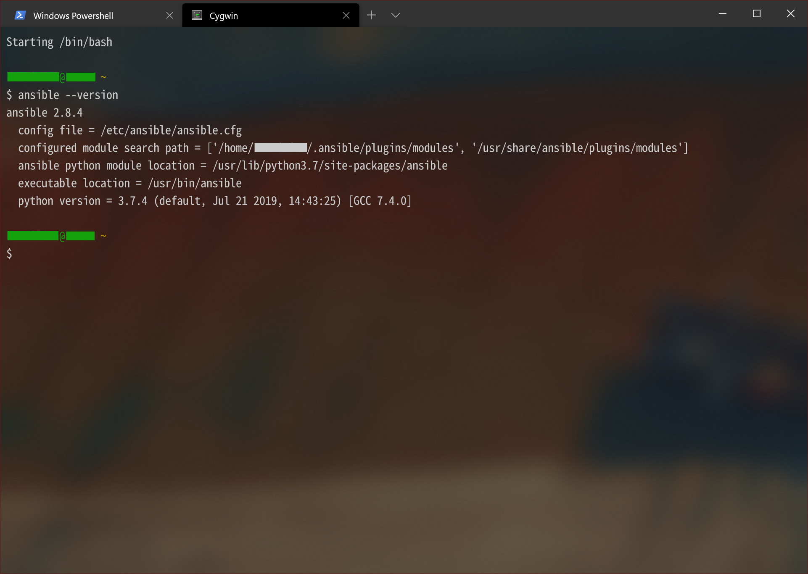
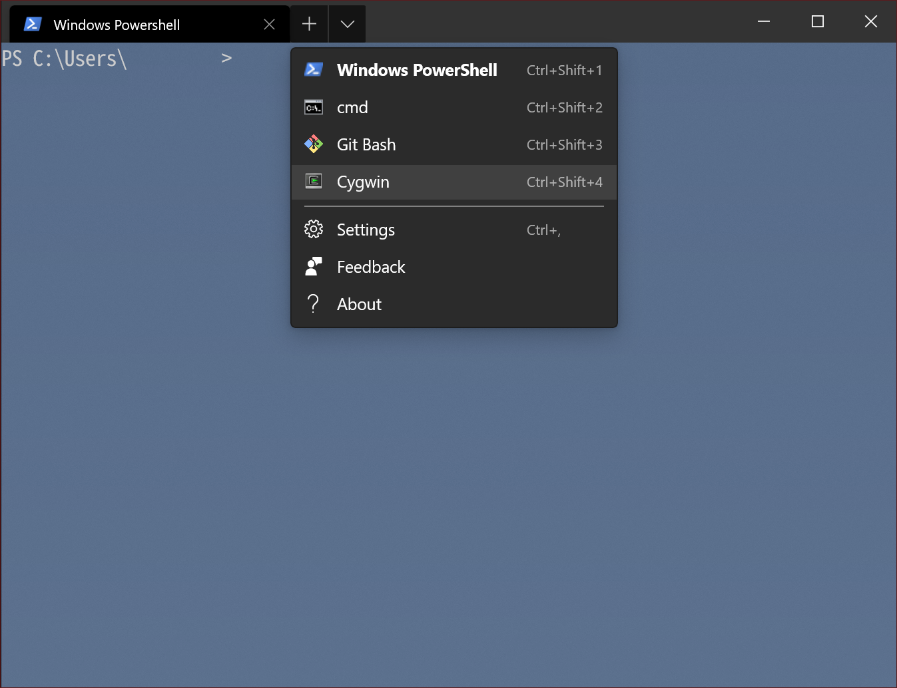

# Windows Terminal で Cygwin Bash を表示したい


[Windows Terminal](https://github.com/microsoft/terminal) は Build 2019 で発表された Windows 向けの新たなターミナルです。マルチタブが導入されており、複数の PowerShell やコマンドプロンプトなどを切り替えながら利用できます。また、Windows10 v1809 から UNIX / Linux 互換の擬似コンソール [ConPTY](https://devblogs.microsoft.com/commandline/windows-command-line-introducing-the-windows-pseudo-console-conpty/) が導入されたため Bash on Ubuntu on WSL などの Linux シェルを表示することも可能です。せっかくなので [Cygwin](https://www.cygwin.com/) も利用できるように設定してみました。[^1]




[^1]: ちなみに Ansible は Python-pip 導入後に pip からインストールできるほか、`setup-x86_46.exe` からでもインストール可能です。

## 設定手順

### Cygwin での準備

`setup-x86_46.exe` もしくは `apt-cyg` を利用して Cygwin に `chere` をインストールします。Mintty で `chere -h` を実行できればOKです：

```shell
$ chere -h
/usr/bin/chere version 1.4

Usage:
/usr/bin/chere -<iuxlrhv> [-lracnmpf12] [-t <term>] [-s <shell>]
        [-d <display> ] [-o <options>] [-e <menutext>]

Adds the stated terminal/shell combination to the folder context menu
This allows you to right click a folder in Windows Explorer and open
a Cygwin shell in that folder.

Options:
  i - Install
  u - Uninstall
  x - Freshen eXisting entries
  l - List currently installed chere items
  r - Read all chere registry entries to stdout
  a - All users
  c - Current user only
  n - Be Nice and provide Control Panel uninstall option (Default)
  m - Minimal, no Control Panel uninstall
  p - Print regtool commands to stdout rather than running them
  f - Force write (overwrite existing, ignore missing files)
  1 - Start using registry one-liners. This doesn\'t work with ash,
      tcsh or network shares.
  2 - Start via bash script. Relies on windows to change directory,
      and login scripts avoiding doing a cd /home/<username>
  h - Help
  v - Version

  t <term> - Use terminal term. Supported terminals are:
        cmd rxvt mintty xterm urxvt

  s <shell> - Use the named shell. Supported shells are:
        ash bash cmd dash fish mksh pdksh posh tcsh zsh passwd

  d <display> - DISPLAY to use (xterm, urxvt). Defaults to :0.
      Set to env to use the runtime environment variable.

  o <options> - Add <options> to the terminal startup command.
      If more than one option is specified, they should all be
      contained within a single set of quotes.

  e <menutext> - Use <menutext> as the context menu text.

See the man page for more detail.
```

読んでの通り、特定のフォルダで Cygwin ターミナルを開始するためのユーティリティです。`bash.exe` を起動するだけでは Cygwin の機能を利用できないため、このツールをインストールしています。

### Windows Terminal での設定

1. PowerShell を起動して適当な GUID を取得します。

```powershell
    [guid]::NewGuid()
```
<br>
2. Windows Terminal を起動し、[ Settings ] から `settings.json` を開きます。
3. `"profiles" : [ { ... } ]` の末尾に以下のオブジェクトを追記して保存します。`"guid"` の値は先ほど取得した GUID に差し替えてください:

```json:settings.json
{
    "guid": "{22cbae05-ab97-4c97-a2ea-6feaa2494f7a}",
    "name": "Cygwin",
    "suppressApplicationTitle": true,
    "commandline": "C:\\cygwin64\\bin\\bash.exe /bin/xhere /bin/bash ~",
    "icon": "C:\\cygwin64\\Cygwin-Terminal.ico",
    "useAcrylic" : true,
    "acrylicOpacity" : 0.6
}
```
<br>
4. 新規タブの選択肢に `Cygwin` が追加されました！



※ここでは[同様の手順で Git Bash も 追加](https://qiita.com/yokra9/items/bdd0882268b308cf22ca)しています。

# 参考リンク

* [Windows で VS Code の integrated terminal を cygwin64 の bash にする](http://dynamicsoar.hatenablog.com/entry/2018/09/02/065456)
* [Windows Terminalでもmsys2を使おう](https://qiita.com/yumetodo/items/4aa03d1eb3d887bca1a8)
* [Windows Terminal で Git Bash を表示する](https://qiita.com/yokra9/items/bdd0882268b308cf22ca)
