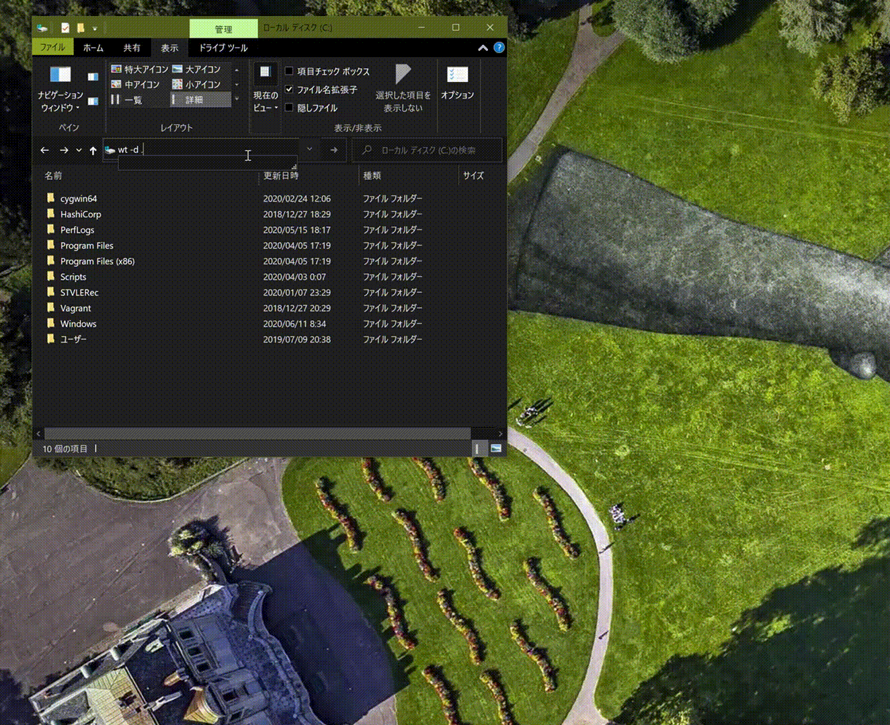

# Windows Terminal でエクスプローラーのカレントディレクトリを開く

アドレスバーに以下の文字列を入力して、[Enter] キーを押下するだけです：

```bat
wt -d .
```



Visual Studio Code のターミナル（PowerShell）からも同様に開くことができます<del>が、表現を少し変えましょう。バックグラウンドプロセスとして起動した方が便利だからです</del>。いつの間にかバックグラウンドプロセスであることを明示しなくてもターミナルへ戻るようになっていましたが、参考までに記載を残します：

```powershell
Start-Process wt -ArgumentList "-d ."
```

## コンテキストメニューから開く

[Add a context menu entry to "Open Windows Terminal here"](https://github.com/microsoft/terminal/pull/6100) という PR が Preview v1.1.1671 にてマージされています。
<del>問題が無ければ無印でも利用できるようになるでしょう</del>。[v1.4.3141.0](https://github.com/microsoft/terminal/releases/tag/v1.4.3141.0)で正式に利用可能になりました。

## 参考リンク

* [Windows ターミナルに対するコマンド ライン引数を使用する](https://docs.microsoft.com/ja-jp/windows/terminal/command-line-arguments?tabs=windows)
