# Windows Terminal で使用できる OSC の一覧（2026 年 8 月版）

[Operating System Command (OSC)](https://www.terminfo.dev/osc) はエスケープシーケンスの一種です。CLI アプリから `Operating System`（この場合はターミナルアプリのこと）に対してコマンドを送信する際に利用します。OSC には標準化団体などが存在せず、各ターミナルアプリで自由に実装が進められています。

```txt:OSC の構文
ESC ] Ps ; Pt ST
```

`ESC ]` が OSC 開始を指すエスケープシーケンス、`Ps` が ID、`Pt` が引数、`ST`（`ESC \` もしくは `BEL`）が終端です。

本記事では Windows Terminal で実装されている OSC を中心に、一部蘊蓄を交えながらご紹介するものです。なお、サンプルとして提示する PowerShell は全て 7.x を前提としており、 `ESC`（エスケープ文字）として `` `e `` を、`BEL`（アラート文字）として `` `a `` を使用します。

||概要|実装バージョン|実装PR|
|:----|:----|:----|:----|
|OSC 0|タブ名を変更する|Initial Release|-|
|OSC 1|タブ名を変更する|Initial Release|-|
|OSC 2|タブ名を変更する|Initial Release|-|
|OSC 4|カラーパレットを変更する|Initial Release|-|
|OSC 7|現在の作業ディレクトリを通知する|-|[#20019](https://github.com/microsoft/terminal/pull/20019)|
|OSC 8|ハイパーリンクを表示する|[v1.4.2652.0](https://github.com/microsoft/terminal/releases/tag/v1.4.2652.0)|[#7251](https://github.com/microsoft/terminal/pull/7251)|
|OSC 9|ConEmu 拡張|-|-|
|OSC 9;4|進捗状況を表示する|[v1.6.10272.0](https://github.com/microsoft/terminal/releases/tag/v1.6.10272.0)|[#8055](https://github.com/microsoft/terminal/pull/8055)|
|OSC 9;9|現在の作業ディレクトリを通知|[v1.6.10272.0](https://github.com/microsoft/terminal/releases/tag/v1.6.10272.0)|[#8330](https://github.com/microsoft/terminal/pull/8330)|
|OSC 9;12|コマンド開始位置マーカー|[v1.18.1421.0](https://github.com/microsoft/terminal/releases/tag/v1.18.1421.0)|[#14807](https://github.com/microsoft/terminal/pull/14807)|
|OSC 10|文字色を変更する|[v0.2](https://github.com/microsoft/terminal/releases/tag/v0.2.1715.0)|[#891](https://github.com/microsoft/terminal/pull/891)|
|OSC 11|背景色を変更する|[v0.2](https://github.com/microsoft/terminal/releases/tag/v0.2.1715.0)|[#891](https://github.com/microsoft/terminal/pull/891)|
|OSC 12|カーソル色を変更する|Initial Release|-|
|OSC 17|ハイライト色を変更する|[v1.22.2362.0](https://github.com/microsoft/terminal/releases/tag/v1.22.2362.0)|[#17742](https://github.com/microsoft/terminal/pull/17742)|
|OSC 21|タブ名を変更する|[v1.21.1272.0](https://github.com/microsoft/terminal/releases/tag/v1.21.1272.0)|[#16804](https://github.com/microsoft/terminal/pull/16804)|
|OSC 52|クリップボード|[v1.2.2022.0](https://github.com/microsoft/terminal/releases/tag/v1.2.2022.0)|[#5823](https://github.com/microsoft/terminal/pull/5823)|
|OSC 104|カラーパレットをリセットする|[v1.23.11132.0](https://github.com/microsoft/terminal/releases/tag/v1.23.11132.0)|[#18767](https://github.com/microsoft/terminal/pull/18767)|
|OSC 110|文字色をリセットする|[v1.23.11132.0](https://github.com/microsoft/terminal/releases/tag/v1.23.11132.0)|[#18767](https://github.com/microsoft/terminal/pull/18767)|
|OSC 111|背景色をリセットする|[v1.23.11132.0](https://github.com/microsoft/terminal/releases/tag/v1.23.11132.0)|[#18767](https://github.com/microsoft/terminal/pull/18767)|
|OSC 112|カーソル色をリセットする|[v1.23.11132.0](https://github.com/microsoft/terminal/releases/tag/v1.23.11132.0)|[#18767](https://github.com/microsoft/terminal/pull/18767)|
|OSC 117|ハイライト色をリセットする|[v1.23.11132.0](https://github.com/microsoft/terminal/releases/tag/v1.23.11132.0)|[#18767](https://github.com/microsoft/terminal/pull/18767)|
|OSC 133|セマンティックインフォメーション（Final Term 拡張）|-|-|
|OSC 133;A|プロンプト開始位置マーカー|[v1.15.186](https://github.com/microsoft/terminal/releases/tag/v1.15.1862.0)|[#13163](https://github.com/microsoft/terminal/pull/13163)|
|OSC 133;B|コマンド開始位置マーカー|[v1.17.1023](https://github.com/microsoft/terminal/releases/tag/v1.17.1023)|[#14341](https://github.com/microsoft/terminal/pull/14341)|
|OSC 133;C|出力開始位置マーカー|[v1.17.1023](https://github.com/microsoft/terminal/releases/tag/v1.17.1023)|[#14341](https://github.com/microsoft/terminal/pull/14341)|
|OSC 133;D|出力終了位置マーカー|[v1.17.1023](https://github.com/microsoft/terminal/releases/tag/v1.17.1023)|[#14341](https://github.com/microsoft/terminal/pull/14341)|
|OSC 633|VSCode 拡張|-|-|
|OSC 633;Completions|シェル補完|[v1.19.2682.0](https://github.com/microsoft/terminal/releases/tag/v1.19.2682.0)|[#14938](https://github.com/microsoft/terminal/pull/14938)|
|OSC 777|urxvt 拡張|-|-|
|OSC 777;notify|デスクトップ通知|-|[#20012](https://github.com/microsoft/terminal/pull/20012)|
|OSC 1337|iTerm2 拡張|-|-|
|OSC 1337;SetMark|スクロールバーにマーク|[v1.15.186](https://github.com/microsoft/terminal/releases/tag/v1.15.1862.0)|[#12948](https://github.com/microsoft/terminal/pull/12948)|
|OSC 9001|コマンドが見つからないことを通知（Windows Terminal 拡張）|[v1.22.2362.0](https://github.com/microsoft/terminal/releases/tag/v1.22.2362.0)|[#16848](https://github.com/microsoft/terminal/pull/16848)|

## OSC 0-2 : タブ名を変更する（`SetIconAndWindowTitle`/`SetWindowIcon`/`SetWindowTitle`）

元来はウィンドウタイトル（およびアイコン）を変更する OSC ですが、Windows Terminal ではタブ名の変更に相当します。

```powershell
# タブ名を「タブ名」に変更
Write-Host -NoNewline "`e]0;タブ名`a"

# or
Write-Host -NoNewline "`e]1;タブ名`a"

# or
Write-Host -NoNewline "`e]2;タブ名`a"
```

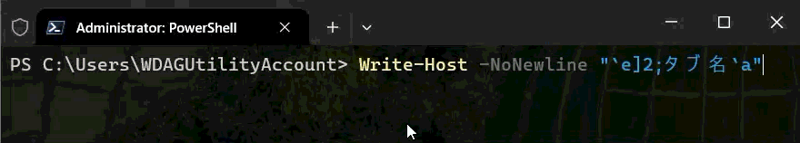

### OSC 21 : タブ名を変更する（`DECSWT_SetWindowTitle`）

こちらもタブ名の変更に相当します。[DEC VT520 の DECSWT](https://vt100.net/dec/ek-vt520-rm.pdf#page=310) がこの仕様だったことに由来します。

```powershell
# タブ名を「タブ名」に変更
Write-Host -NoNewline "`e]21;タブ名`a"
```

## OSC 4 : カラーパレットを変更する（`SetColor`）

カラーパレットを変更します。色は [X11 RGB Device String](https://xorg.freedesktop.org/releases/X11R7.6/doc/libX11/specs/libX11/libX11.html#RGB_Device_String_Specification) 形式や [X11 の色名称](https://ja.wikipedia.org/wiki/X11%E3%81%AE%E8%89%B2%E5%90%8D%E7%A7%B0) で指定します。

```powershell
# カラーパレット 1 番の色を ff/ff/00 に変更
Write-Host -NoNewline "`e]4;1;rgb:ff/ff/00`a"

# or
Write-Host -NoNewline "`e]4;1;Yellow`a"

# 1 番の色で出力（CSI 38）
Write-Host "`e[38;5;1mこれは何色に見える？`e[0m"
```

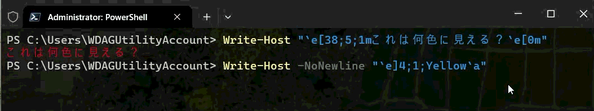

### OSC 104 : カラーパレットをリセットする（`ResetColor`）

カラーパレットの変更をリセットします。

```powershell
# カラーパレット 1 番の変更をリセット
Write-Host -NoNewline "`e]104;1`a"

# 全カラーパレットの変更をリセット
Write-Host -NoNewline "`e]104`a"
```

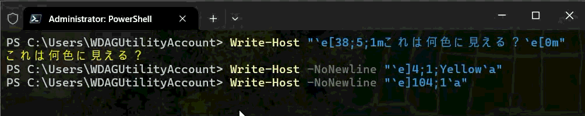

## OSC 7 : 現在の作業ディレクトリを通知する（`CurrentWorkingDirectory`）

<https://github.com/microsoft/terminal/pull/20019>

OSC 9;9に類するものですが、現在はリバートされた状態です。

<https://github.com/microsoft/terminal/pull/20116>

## OSC 8 : ハイパーリンクを表示する（`HyperLink`）

ハイパーリンクを表示します。

```powershell
# [リンクテキスト](https://example.com)
Write-Host -NoNewline "`e]8;;https://example.com`aリンクテキスト`e]8;;`a"
```


## OSC 9（`ConEmuAction`）

[ConEmu に由来する OSC](https://conemu.github.io/en/AnsiEscapeCodes.html#OSC_Operating_system_commands) が 3 種実装されています。

### OSC 9;4 : 進捗状況を表示する

タブアイコンにプログレスリングを、タスクバーにプログレスバーを表示します。

```powershell
# 40 %
Write-Host -NoNewline "`e]9;4;1;40`a"

# 60 % （警告）
Write-Host -NoNewline "`e]9;4;4;60`a"

# 80 % （エラー）
Write-Host -NoNewline "`e]9;4;2;80`a"

# リセット
Write-Host -NoNewline "`e]9;4;0`a"
```


Microsoft Learn の [Windows ターミナルで進行状況バーを設定する](https://learn.microsoft.com/ja-jp/windows/terminal/tutorials/progress-bar-sequences) でも解説されています。

### OSC 9;9 : 現在の作業ディレクトリを通知

現在の作業ディレクトリ（CWD）をターミナルに伝えます。

```powershell
Write-Host -NoNewline "`e]9;`"C:\Path`"`a"
```

PowerShell プロファイル の `prompt` 関数で OSC 9;9 を使用すると、「タブを複製する」機能で現在の作業ディレクトリを引き継げます。

```powershell:Profile.ps1
function prompt {
  $cwd = $($executionContext.SessionState.Path.CurrentLocation);

  # OSC 9;9 で CWD を通知
  $out += "`e]9;9;`"$cwd`"`a";

  # プロンプトを設定（デフォルトと同値）
  $out += "PS $cwd$('>' * ($nestedPromptLevel + 1)) ";

  return $out
}
```

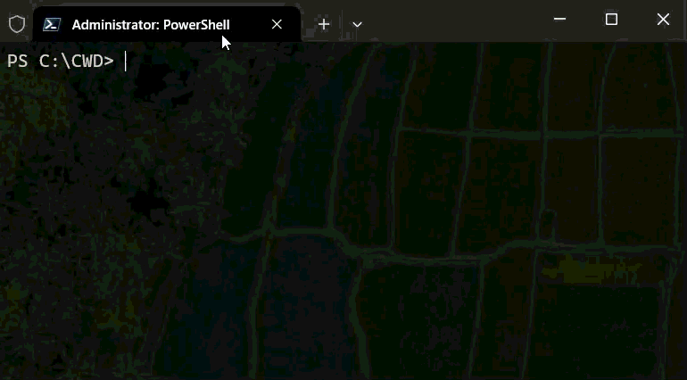

### OSC 9;12 : コマンド開始位置マーカー

ターミナルにコマンドの開始位置を知らせます。OSC 133;B と同じです。

```powershell
Write-Host -NoNewline "`e]9;12`a"
```

PowerShell プロファイル の `prompt` 関数で OSC 133;A （プロンプト開始位置マーカー）と組み合わせることで、ターミナルにプロンプトとコマンドの区切りを伝えられます。

```powershell:Profile.ps1
function prompt {
  # プロンプト開始位置マーカー
  $out += "`e]133;A`a";

  # デフォルトプロンプトと同値を設定
  $out += "PS $($ExecutionContext.SessionState.Path.CurrentLocation)$('>' * ($NestedPromptLevel + 1)) ";

  # コマンド開始位置マーカー
  $out += "`e]9;12`a";

  return $out
}
```

これにより、`selectCommand` アクションでコマンド範囲を選択できるようになります。

```json:settings.json
{
  "actions": [
    {
      "command": {
        "action": "selectCommand",
        "direction": "prev"
      },
      "id": "User.selectCommand.prev"
    },
    {
      "command": {
        "action": "selectCommand",
        "direction": "next"
      },
      "id": "User.selectCommand.next"
    },
  ],
  "keybindings": [
    {
      "id": "User.selectCommand.prev",
      "keys": "ctrl+shift+left"
    },
    {
      "id": "User.selectCommand.next",
      "keys": "ctrl+shift+right"
    },
  ]
}
```

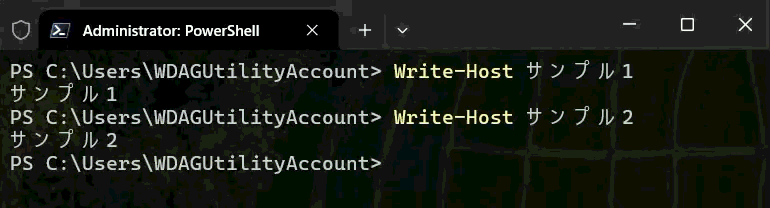

## OSC 10 : 文字色を変更する（`SetForegroundColor`）

文字色（フォアグラウンドカラー）を変更します。色は [X11 RGB Device String](https://xorg.freedesktop.org/releases/X11R7.6/doc/libX11/specs/libX11/libX11.html#RGB_Device_String_Specification) 形式や [X11 の色名称](https://ja.wikipedia.org/wiki/X11%E3%81%AE%E8%89%B2%E5%90%8D%E7%A7%B0) で指定します。

```powershell
# 文字色をシアンに設定
Write-Host -NoNewline "`e]10;rgb:00/ff/ff`a"

# or
Write-Host -NoNewline "`e]10;Cyan`a"
```

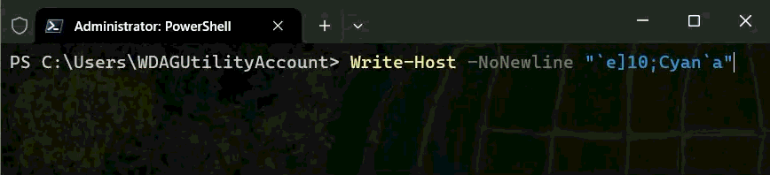

### OSC 110 : 文字色をリセットする（`ResetForegroundColor`）

文字色（フォアグラウンドカラー）の変更をリセットします。

```powershell
# 文字色の変更をリセット
Write-Host -NoNewline "`e]110`a"
```

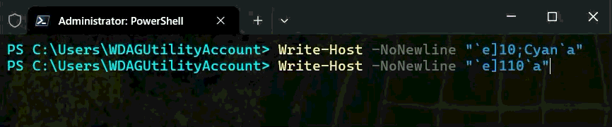

## OSC 11 : 背景色を変更する（`SetBackgroundColor`）

背景色（バックグラウンドカラー）を変更します。色は [X11 RGB Device String](https://xorg.freedesktop.org/releases/X11R7.6/doc/libX11/specs/libX11/libX11.html#RGB_Device_String_Specification) 形式や [X11 の色名称](https://ja.wikipedia.org/wiki/X11%E3%81%AE%E8%89%B2%E5%90%8D%E7%A7%B0) で指定します。

```powershell
# 背景色をマゼンタに設定
Write-Host -NoNewline "`e]11;rgb:ff/00/ff`a"

# or
Write-Host -NoNewline "`e]11;Magenta`a"
```

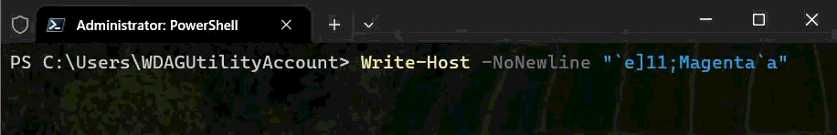

### OSC 111 : 背景色をリセットする（`ResetBackgroundColor`）

背景色（バックグラウンドカラー）の変更をリセットします。

```powershell
# 背景色の変更をリセット
Write-Host -NoNewline "`e]111`a"
```

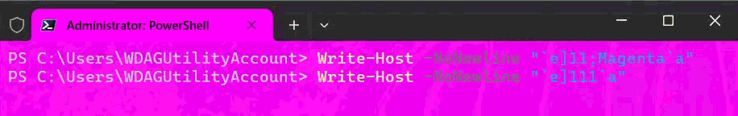

## OSC 12 : カーソル色を変更する（`SetCursorColor`）

カーソル色を変更します。色は [X11 RGB Device String](https://xorg.freedesktop.org/releases/X11R7.6/doc/libX11/specs/libX11/libX11.html#RGB_Device_String_Specification) 形式や [X11 の色名称](https://ja.wikipedia.org/wiki/X11%E3%81%AE%E8%89%B2%E5%90%8D%E7%A7%B0) で指定します。

```powershell
# カーソル色をライムに設定
Write-Host -NoNewline "`e]12;rgb:00/ff/00`a"

# or
Write-Host -NoNewline "`e]12;Lime`a"
```

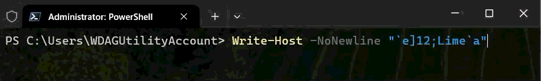

### OSC 112 : カーソル色をリセットする（`ResetCursorColor`）

カーソル色の変更をリセットします。

```powershell
# カーソル色の変更をリセット
Write-Host -NoNewline "`e]112`a"
```

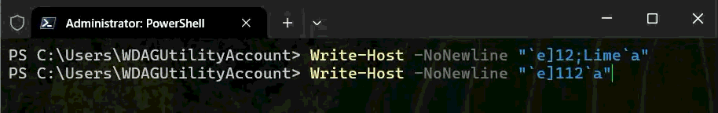

## OSC 17 : ハイライト色を変更する（`SetHighlightColor`）

ハイライト色（選択された箇所の色）を変更します。色は [X11 RGB Device String](https://xorg.freedesktop.org/releases/X11R7.6/doc/libX11/specs/libX11/libX11.html#RGB_Device_String_Specification) 形式や [X11 の色名称](https://ja.wikipedia.org/wiki/X11%E3%81%AE%E8%89%B2%E5%90%8D%E7%A7%B0) で指定します。

```powershell
# ハイライト色を赤に設定
Write-Host -NoNewline "`e]17;rgb:ff/00/00`a"

# or
Write-Host -NoNewline "`e]17;Red`a"
```

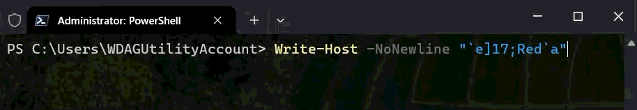

### OSC 117 : ハイライト色をリセットする（`ResetHighlightColor`）

ハイライト色の変更をリセットします。

```powershell
# ハイライト色の変更をリセット
Write-Host -NoNewline "`e]117`a"
```

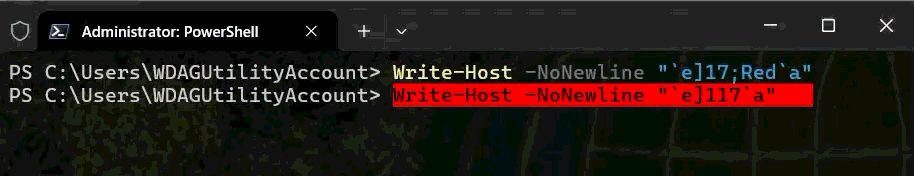

## OSC 52 : クリップボード（`SetClipboard`）

クリップボードにテキストをコピーします。テキストは Base64 エンコードされている必要があります。

```powershell
$Text = 'クリップボードにコピーしたいテキスト'
$EncodedText = [Convert]::ToBase64String([System.Text.Encoding]::UTF8.GetBytes($Text))

# クリップボードにテキストをコピーする
Write-Host -NoNewline "`e]52;c;$EncodedText`a"
```


Windows Terminal では[セキュリティ上の理由からクリップボードの読み取りを許可していません](https://github.com/microsoft/terminal/issues/2946)が、VSCode の統合ターミナルには実装されていたりします。

```powershell
# クリップボードからテキストを読み取る（Windows Terminal 未実装）
$ClipboardData = "`e]52;c;?`a".Split(";")
```

## OSC 133 : セマンティックインフォメーション（Final Term拡張）

[Final Term](https://github.com/p-e-w/finalterm) に由来する OSC が 4 種実装されています。Final Term は [Finally terminated](https://worldwidemann.com/finally-terminated/) ですが、CUI をマークアップする精神は [iTerm2](https://iterm2.com/documentation-escape-codes.html) に引き継がれ、Windows Terminal にも取り込まれました。

```txt:構造化されたテキスト出力の概念図
[FTCS_PROMPT] PS C:\> [FTCS_COMMAND_START] Write-Host "Hello Bob!"
[FTCS_COMMAND_EXECUTED] Hello Bob! [FTCS_COMMAND_FINISHED]
[FTCS_PROMPT] PS C:\> [FTCS_COMMAND_START] Write-Host "Hello Alice!"
[FTCS_COMMAND_EXECUTED] Hello Alice! [FTCS_COMMAND_FINISHED]
```

リポジトリに[関連機能の仕様書](https://raw.githubusercontent.com/microsoft/terminal/refs/tags/v1.25.1912.0/doc/specs/%2311000%20-%20Marks/Shell-Integration-Marks.md)があるほか、Microsoft Learn の [Windows ターミナルのシェル統合](https://learn.microsoft.com/ja-jp/windows/terminal/tutorials/shell-integration) でも解説されています。

### OSC 133;A : プロンプト開始位置マーカー（`FTCS_PROMPT`）

ターミナルにプロンプトの開始位置を知らせます。

```powershell
# プロンプト開始位置マーカー
Write-Host -NoNewline "`e]133;A`a"
```

PowerShell プロファイル の `prompt` 関数で使用することで、ターミナルにプロンプトの開始位置を伝えられます。

```powershell:Profile.ps1
function prompt {
  # プロンプト開始位置マーカー
  $out += "`e]133;A`a";

  # デフォルトプロンプトと同値を設定
  $out += "PS $($ExecutionContext.SessionState.Path.CurrentLocation)$('>' * ($NestedPromptLevel + 1)) ";

  return $out
}
```

これにより、`selectOutput` アクションで出力範囲を選択できるようになります。

```json:settings.json
{
  "actions": [
    {
      "command": {
        "action": "selectOutput",
        "direction": "prev"
      },
      "id": "User.selectOutput.prev"
    },
    {
      "command": {
        "action": "selectOutput",
        "direction": "next"
      },
      "id": "User.selectOutput.next"
    },
  ],
  "keybindings": [
    {
      "id": "User.selectOutput.prev",
      "keys": "ctrl+shift+up"
    },
    {
      "id": "User.selectOutput.next",
      "keys": "ctrl+shift+down"
    },
  ]
}
```

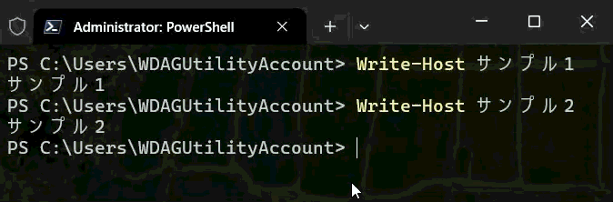

### OSC 133;B : コマンド開始位置マーカー（`FTCS_COMMAND_START`）

ターミナルにコマンドの開始位置を知らせます。

```powershell
# コマンド開始位置マーカー
Write-Host -NoNewline "`e]133;B`a"
```

PowerShell プロファイル の `prompt` 関数で OSC 133;A （プロンプト開始位置マーカー）と組み合わせることで、ターミナルにプロンプトとコマンドの区切りを伝えられます。

```powershell:Profile.ps1
function prompt {
  # プロンプト開始位置マーカー
  $out += "`e]133;A`a";

  # デフォルトプロンプトと同値を設定
  $out += "PS $($ExecutionContext.SessionState.Path.CurrentLocation)$('>' * ($NestedPromptLevel + 1)) ";

  # コマンド開始位置マーカー
  $out += "`e]133;B`a";

  return $out
}
```

これにより、`selectCommand` アクションでコマンド範囲を選択できるようになります。

```json:settings.json
{
  "actions": [
    {
      "command": {
        "action": "selectCommand",
        "direction": "prev"
      },
      "id": "User.selectCommand.prev"
    },
    {
      "command": {
        "action": "selectCommand",
        "direction": "next"
      },
      "id": "User.selectCommand.next"
    },
  ],
  "keybindings": [
    {
      "id": "User.selectCommand.prev",
      "keys": "ctrl+shift+left"
    },
    {
      "id": "User.selectCommand.next",
      "keys": "ctrl+shift+right"
    },
  ]
}
```


### OSC 133;C : 出力開始位置マーカー（`FTCS_COMMAND_EXECUTED`）

ターミナルに出力の開始位置を知らせます。

```powershell
# 出力開始位置マーカー
Write-Host -NoNewline "`e]133;C`a"
```

### OSC 133;D : 出力終了位置マーカー（`FTCS_COMMAND_FINISHED`）

ターミナルに出力の終了位置と終了コードを知らせます。

```powershell
# 出力終了位置マーカー
Write-Host -NoNewline "`e]133;D`a"
```

PowerShell プロファイル の `prompt` 関数で使用することで、ターミナルに出力の終了位置と終了コードを伝えられます。

```powershell:Profile.ps1
# 前回プロンプト表示時の履歴 ID を保持するグローバル変数
$Global:__LastHistoryId = -1;

function prompt {
  # 最後のコマンドが成功した場合は True
  $isLastCommandSuccess = $?;

  # 現時点で最新の履歴 ID
  $lastHistoryEntry = Get-History -Count 1;

  # 最初のコマンドが実行されていない場合はスキップ
  if ($Global:__LastHistoryId -ne -1) {
    # 前回プロンプト表示時から履歴 ID が変わっていない（例: Ctrl+C）なら、終了コードなしで出力終了位置マーカーを出力する
    if ($lastHistoryEntry.Id -eq $Global:__LastHistoryId) {
      $out += "`e]133;D`a";
    }
    else {
      # 前回分の終了コードを取得
      if ($isLastCommandSuccess) { $Ps = 0 }
      elseif ($Error[0].InvocationInfo.HistoryId -eq $lastHistoryEntry.Id) { $Ps = -1 }
      else { $Ps = $LASTEXITCODE }
      
      # 出力終了位置マーカーを出力
      $out += "`e]133;D;$Ps`a"
    }
  }

  # 履歴 ID を更新
  $Global:__LastHistoryId = $lastHistoryEntry.Id

  # デフォルトプロンプトと同値を設定
  $out += "PS $($ExecutionContext.SessionState.Path.CurrentLocation)$('>' * ($NestedPromptLevel + 1)) ";

  return $out
}
```

これにより、スクロールバーにマークを表示できます。マークの色は終了コードに応じて変化します。

```json:settings.json
{
  "profiles": [
    {
      "defaults": 
      {
        "showMarksOnScrollbar": true,
      }
    }
  ]
}
```

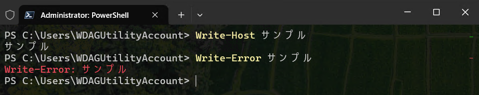

## OSC 633 : VSCode 拡張（`VsCodeAction`）

VSCode が [OSC 133 にインスパイアされて実装した](https://github.com/microsoft/vscode/blob/1.129.1/src/vs/platform/terminal/common/xterm/shellIntegrationAddon.ts) OSC で、OSC 133 に [;E および ;P](https://code.visualstudio.com/docs/terminal/shell-integration#_supported-escape-sequences) を追加したスーパーセットになっています。

### OSC 633;Completions : シェル補完

[OSC 633;Completions](https://github.com/microsoft/vscode/pull/171648) は VSCode の統合ターミナル上で PowerShell のオートコンプリートを実現するためのものでしたが、[組込のシェル補完機能](https://learn.microsoft.com/ja-jp/powershell/scripting/learn/shell/tab-completion?view=powershell-7.6)に移行して廃止されました。[^1] Windows Terminal では記事執筆時点においてまだ廃止されていませんが、あえて紙幅は費やしません。

[^1]: <https://github.com/microsoft/vscode/issues/154662#issuecomment-2531546828>

## OSC 777 : urxvt 拡張（`UrxvtAction`）

[rxvt-unicode (urxvt)](https://pod.tst.eu/http://cvs.schmorp.de/rxvt-unicode/doc/rxvt.1.pod) に由来する OSC です。urxvt は [rxvt](https://rxvt.sourceforge.net/) の Unicode 対応版ですが、[Perl 拡張](https://pod.tst.eu/http://cvs.schmorp.de/rxvt-unicode/src/urxvt.pm)サポートも追加されています。Perl 拡張用に[様々なフック](https://pod.tst.eu/http://cvs.schmorp.de/rxvt-unicode/src/urxvt.pm#Hooks_CONTENT)が用意されていますが、そのうち `on_osc_seq_perl` フックは `` `e]777;<拡張機能名>;<パラメタ>`a `` を受信した際に呼び出されます。つまり、urxvt ではユーザが自由に OSC 777 を拡張できるということです。Windows Terminal ではこのうち 1 種が実装されています。

### OSC 777;notify : デスクトップ通知

デスクトップ通知を送信します。

```powershell
# 一時停止中に Windows Terminal からフォーカスを外すと通知が送信される
Start-Sleep 2; Write-Host -NoNewline "`e]777;notify;タイトル;本文`a" 
```

源流は 2012 年に [Yoran Brault 氏が公開した urxvt 用 Perl 拡張](https://web.archive.org/web/20140616114425/http://artisan.karma-lab.net/ajouter-notification-a-urxvt) です。これを [phyks 氏が改良](https://web.archive.org/web/20140618191223/http://phyks.me/contact.html)した後、[Enlightenment Terminology](https://www.enlightenment.org/about-terminology) のバグトラッカーに [OSC 777;notify のサポートを求める Task](https://web.archive.org/web/20210809024917/https://phab.enlightenment.org/T1765) を建てました。この Task を契機として [Terminology に OSC 777;notify が実装](https://git.enlightenment.org/enlightenment/terminology/commit/87d653ea4d2718038e1094542072143cc9704a71)されたのが 2015 年のことです。

同年、GNOME Bugzilla の [Notifications for long-running commands](https://gitlab.gnome.org/GNOME/gnome-terminal/-/work_items/7378) という Issue で Terminology での実装が紹介されます。この Issue に投稿されたパッチは [GNOME vte](https://gitlab.gnome.org/GNOME/vte) の [Fedora 版フォーク](https://src.fedoraproject.org/rpms/vte291/blob/f22/f/vte291-command-notify.patch)で取り込まれました。これはやがてダウンストリームの [CentOS 7.4.1708](https://vault.centos.org/7.4.1708/os/Source/SPackages/) にも取り込まれメジャーどころとなります。

その後 [foot](https://codeberg.org/dnkl/foot/pulls/236) では 2020 年に、 [ghostty](https://github.com/ghostty-org/ghostty/issues/612) では 2023 年に実装され、[#20012](https://github.com/microsoft/terminal/pull/20012) で Windows Terminal にも実装されることになります。記事執筆時点では Nightly Build で下記設定を有効化した場合に利用可能となります。

```json:settings.json
{
    "profiles":
    {
        "defaults": {
            "compatibility.allowOSC777": true
        },
    }
}
```

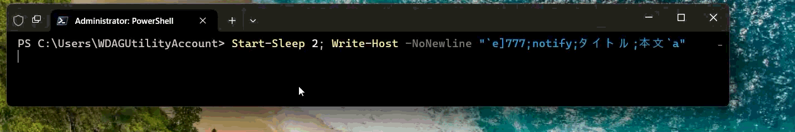

普及の背景としては [Claude Code のような CLI ベースの AI エージェントからデスクトップ通知を送る方法として知られるようになった](https://code.claude.com/docs/en/hooks#emit-terminal-notifications)ことが関係しそうです。

## OSC 1337 : iTerm2 拡張（`ITerm2Action`）

[iTerm2 に由来する OSC](https://iterm2.com/documentation-escape-codes.html) が 1 種実装されています。

### OSC 1337;SetMark : スクロールマークを追加する

現在の位置にスクロールマークをつけます。

```powershell
# スクロールマーク
Write-Host -NoNewline "`e]1337;SetMark`a"
```

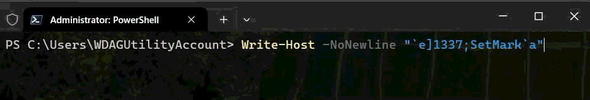

サンプルとしては前後に改行を出力した方がわかりやすいですね。

```powershell
Write-Host "`n`n`n`t`t`t`t`t`t`t`t`t`t`t`t`t`tここ`e]1337;SetMark`a`n`n`n"
```


## OSC 9001 : コマンドが見つからないことを通知（`WTAction`）

最後は Windows Terminal 自身による拡張です。ターミナルは以下の OSC を受け取ると、左端に Quick Fix が表示されるということです。

```txt
OSC 9001; SuggestInput; <cmd>; <description>
```

[関連 PR](https://github.com/microsoft/terminal/pull/16848) は v1.22 でマージされているものの、[Spec](https://github.com/microsoft/terminal/blob/main/doc/specs/%2316599%20-%20Quick%20Fix/%2316599%20-%20Quick%20Fix.md) に掲載されているスクリーンショットはモックのままとなっており、手元の環境でも表示されなかったためです。


## 参考リンク

* [窓辺の小石(65) The OSC Project | マイナビニュース](https://news.mynavi.jp/article/pebble_in_the_window-65/)
* [VT Sequence Reference - Terminal API (VT)](https://ghostty.org/docs/vt/reference)
* [OSC Sequences | vtdn▒](https://vtdn.dev/docs/category/osc-sequences)
* [Terminfo.dev — Can Your Terminal Do That? | Terminfo.dev](https://www.terminfo.dev/osc)
* [コンソール仮想ターミナル シーケンス - Windows Console | Microsoft Learn](https://learn.microsoft.com/ja-jp/windows/console/console-virtual-terminal-sequences)
* [about_ANSI_Terminals - PowerShell | Microsoft Learn](https://learn.microsoft.com/ja-jp/powershell/module/microsoft.powershell.core/about/about_ansi_terminals?view=powershell-7.6)
* [about_Special_Characters - PowerShell | Microsoft Learn](https://learn.microsoft.com/ja-jp/powershell/module/microsoft.powershell.core/about/about_special_characters?view=powershell-7.6)
* [terminal/src/terminal/parser/OutputStateMachineEngine.cpp at main · microsoft/terminal](https://github.com/microsoft/terminal/blob/main/src/terminal/parser/OutputStateMachineEngine.cpp)
* [terminal/src/terminal/adapter/adaptDispatch.cpp at main · microsoft/terminal](https://github.com/microsoft/terminal/blob/main/src/terminal/adapter/adaptDispatch.cpp)
