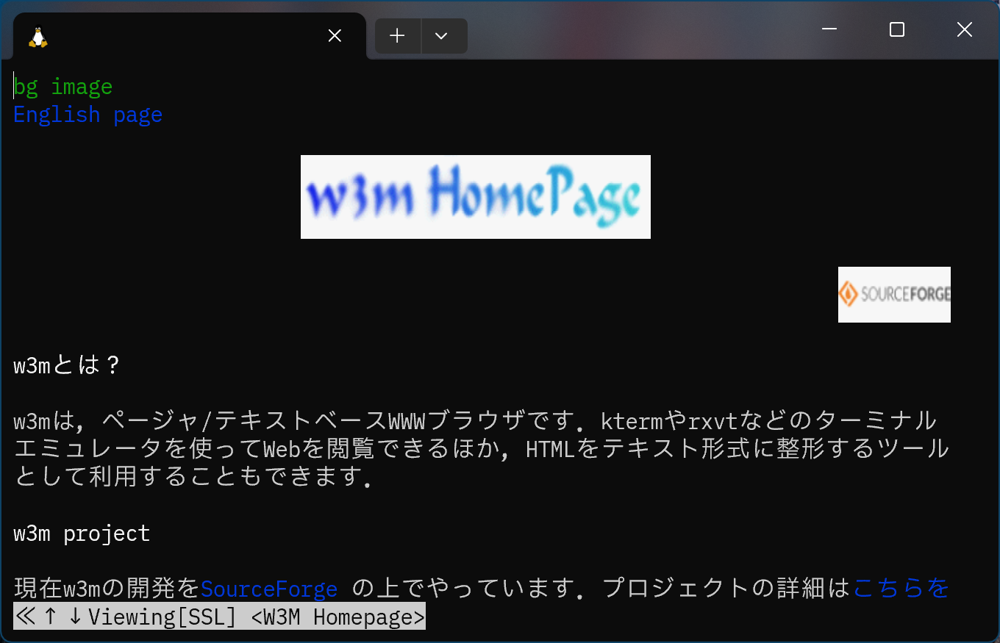
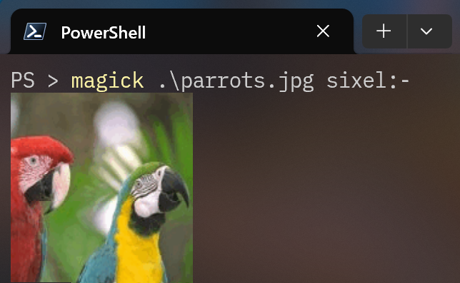
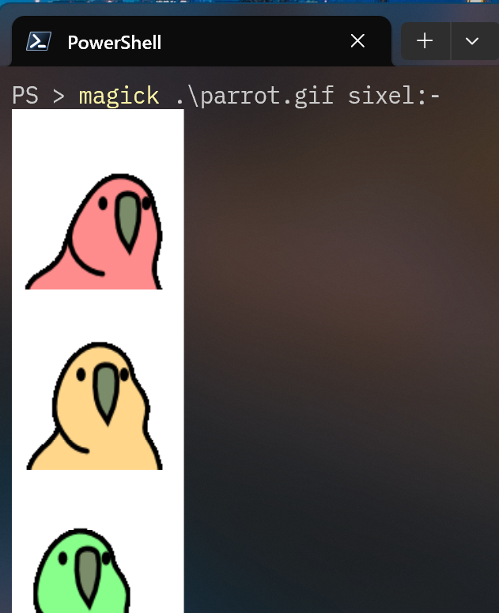
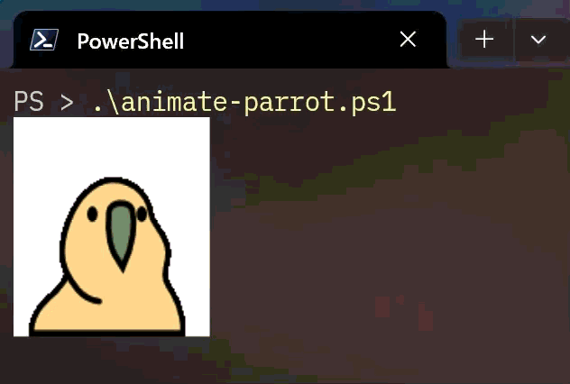
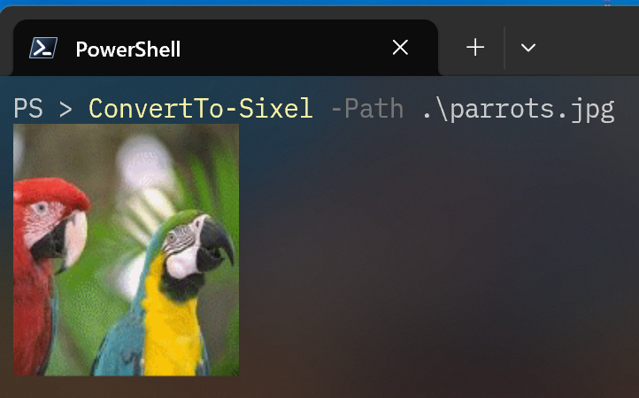
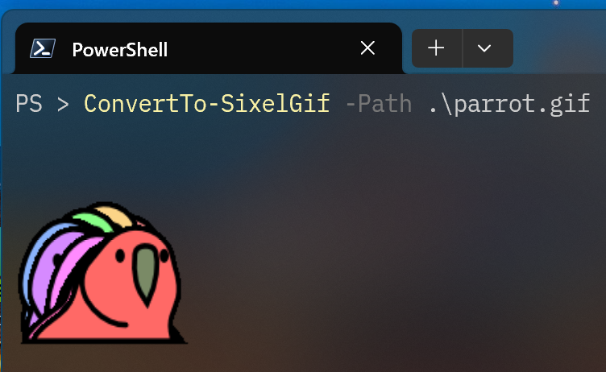
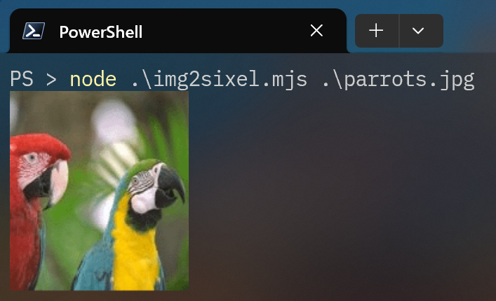

# Windows Terminal 内で画像を表示してみたい without WSL

## TL;DR

[ImageMagick](https://imagemagick.org/) が利用できる環境なら、以下のコマンドを叩くだけです。

```powershell
magick image.png sixel:-
```

PowerShell Gallery から [Sixel](https://www.powershellgallery.com/packages/Sixel/) モジュールを導入して、`ConvertTo-Sixel` コマンドレットを利用する方法もあります。

```powershell
ConvertTo-Sixel -Path image.png
```

## Sixel 画像とは

Windows Terminal は v1.22 以降 [Sixel 画像](https://en.wikipedia.org/wiki/Sixel) をサポートしています。Sixel はターミナル画面内で画像を表示する際に利用されるフォーマットで、Windows Terminal は受信した Sixel をターミナル画面内にグラフィックとして描画してくれます。

Sixel の歴史は古く、DEC 社のドットプリンタ用エスケープシーケンスが源流とされています：

1. `[ESC]Pq` でグラフィックモードに入る
2. グラフィックモード中は受信した文字の各ビットをドットパターンの ON / OFF に反映して印刷
3. `[ESC]\` でグラフィックモードを抜ける

現在の Sixel も上記の基本構造を踏襲しつつ、カラー表示に対応するなどの改良が施されて今に至ります。例えば、この画像  を Sixel で表現すると以下のようになります。

```sixel
[ESC]P0;0;0q"1;1;18;18#0;2;91;4;4#1;2;95;2;1#2;2;95;2;2#3;2;99;0;0#4;2;100;0;0#5;2;100;23;22#6;2;100;23;22#7;2;100;23;23#8;2;100;24;24#9;2;100;24;24#10;2;100;25;24#11;2;100;24;25#12;2;96;26;25#13;2;100;40;40#14;2;100;40;40#15;2;100;42;41#16;2;100;42;41#17;2;100;43;42#18;2;100;43;43#19;2;100;43;43#10___OG!8FGO___$#12OOO?F!8?F?OOO$#15GGGF#0O!8?O#15FGGG$#18CCF#5_?!8G?_#18FFF$#17BB#13?G#2_?O?O?O?O#13?G$#1!5?O?O?O?O?_$#4!5?!8_-#10~~~#5~#2~#4!8~#1~#5~#10~~~-@@@AC!8wCA@@@$#12AAA?w!8?w?AAA$#15CCCw#0A!8?A#15wCCC$#18www#5@?!8C?@#18www$#13???C#2@?A?A?A?A#13?C$#1!5?A?A?A?A?@$#4!5?!8@-[ESC]\
```

おおよそ 40 年選手のフォーマットが現役で活躍している姿にはロマンがありますね。

## Windows Terminal で *nix 環境の Sixel を表示してみる

たとえば、WSL2 上の Debian を Windows Terminal で開いて [w3m](https://github.com/tats/w3m) を `-sixel` オプション付きで実行するとこんな感じになります。



このように Sixel をうまく活用すれば、X11 転送 や Waypipe が使用できないサーバでもちょっとしたグラフィックス機能を利用できて便利です。例えば [lsix](https://github.com/hackerb9/lsix) は指定したディレクトリ内の画像をサムネイル付きでリストできます。

他にも Linux / BSD 向けには [Sixel をサポートしたツールが多数あります](https://github.com/saitoha/libsixel?tab=readme-ov-file#related-projects)が、Windows 向けには多くはありません。たとえば [gnuplot](http://gnuplot.info/) のようにクロスプラットフォームなツールでは Windows 版でも [Sixel がサポート](http://gnuplot.info/docs/loc22742.html)されていたりします。


そもそも Windows はローカル利用・リモートアクセス問わず GUI が基本ですし、Sixel をサポートするツールが少ないのも当然といえば当然ですね。しかし、そこをあえてやってみるのがロマンというものです。

## Windows ネイティブでも Sixel を使ってみたい

といっても、大げさな準備は必要ありません。冒頭に記載した通り ImageMagick が Sixel をサポートしているため、Windows Terminal で PowerShell や Cmd を開き以下を実行すれば画像が表示されます。

```powershell
# winget で ImageMagick を導入
winget install ImageMagick.ImageMagick

magick .\parrots.jpg sixel:-
```



単純に `magick` コマンドを実行するだけということで、既存スクリプトへの組み込みも簡単です。夢が広がりますね。

ImageMagick はアニメーション GIF も取り扱えますが、標準出力に流すと各フレームが連結されたような形で見えてしまいます。

```powershell
magick .\parrot.gif -coalesce sixel:-
```



しかし、ちょっとしたスクリプトを用意すればアニメーション再生も難しくはありません。[^1][^2]

[^1]: ここでは最初のフレームの遅延時間を全フレームに適用していますが、仕様上はフレームごとに遅延時間を設定できます。
[^2]: 正規表現による一致でなく `magick .\parrot.gif[0] sixel:-` のように 1 枚ずつ取得するアプローチも可能です。その場合は `magick identify -format "%n" .\parrot.gif[0]` でフレーム数を取得してループを回す形になるでしょう。

```powershell
$filename = ".\parrot.gif"

# アニメーション GIF の遅延時間を取得
$delay = [Int](magick identify -format "%T" "$filename[0]")

# アニメーション GIF を連結された SIXEL 形式の文字列に変換する
$output = magick $filename -coalesce sixel:-

# 正規表現で [ESC]P で始まり [ESC]\ で終わるブロック（SIXEL化された各フレーム）を抽出
$sixels = [regex]::Matches($output, '(?s)\x1bP.*?\x1b\\')

# 初期のカーソル位置を保持する
$cursorTop = [Console]::CursorTop

# 全フレームを順番に描画
foreach ($sixel in $sixels) {
    # 描画前にカーソル位置を初期に戻す
    [Console]::SetCursorPosition(0, $cursorTop)
    # Sixel を出力
    Write-Output $sixel.Value
    Start-Sleep -Milliseconds ($delay * 10)
}
```



また、`ConvertTo-Sixel` コマンドレットを導入すれば PowerShell ライクに呼び出すことも可能です。

```powershell
# PowerShell Gallery から Sixel モジュールを導入
Install-Module -Name Sixel -RequiredVersion 0.7.0

ConvertTo-Sixel -Path image.png
```



ただし、`ConvertTo-Sixel` にアニメーション GIF を渡しても 1 フレーム目のみが表示されます。アニメーション再生したい場合は、`ConvertTo-SixelGif` を使用します。

```powershell
ConvertTo-SixelGif -Path image.gif
```



なお、Sixel パッケージは ImageMagick や [libsixel](https://github.com/saitoha/libsixel) に依存せず、[独力で変換している](https://github.com/trackd/Sixel/blob/main/src/Sixel/Protocols/Sixel.cs) ようです。

## Node.js でも Sixel を使ってみたい

「Windows 用にちょっとしたスクリプトを書くにも PowerShell より Node.js 派なんだよな」というあなたにおすすめなのが [node-sixel](https://www.npmjs.com/package/sixel) です。こちらも、非常にシンプルなコードで画像データを Sixel 化できます。

```powershell
npm i sixel canvas
```

```javascript:img2sixel.mjs
import { loadImage, createCanvas } from 'canvas';
import { image2sixel } from 'sixel/lib/index.js';

const main = async () => {
    const filename = process.argv[2];
    try {
        // Canvas 経由でファイルを読み込み
        const img = await loadImage(filename);
        const canvas = createCanvas(img.width, img.height);
        const ctx = canvas.getContext('2d');
        ctx.drawImage(img, 0, 0);
        const data = ctx.getImageData(0, 0, img.width, img.height).data;

        // 画像データを Sixel に変換
        const sixel = image2sixel(data, img.width, img.height, 256, 0);

        // Sixel を出力
        console.log(sixel);
    } catch (err) {
        console.error(err);
    }
};

main();
```



こちらも[外部ライブラリに頼らず独自で変換](https://github.com/jerch/node-sixel/blob/master/src/SixelEncoder.ts)しています。

ちなみに、同じく「ちょっとしたスクリプト」に利用されがちな Python にも [PySixel](https://pypi.org/project/PySixel/) がありますが、[termios](https://docs.python.org/ja/3/library/termios.html) モジュールに依存するため Windows では利用できません。

## まとめ

というわけで、Windows の CLI から Sixel を取り扱う方法のご紹介でした。*nix でも Windows でも、ターミナル内で画像を表示して友達や家族を怖がらせましょう！

…と書きましたが、[Windows Terminal が OS 既定のターミナルになっている](https://forest.watch.impress.co.jp/docs/news/1449110.html)ことを踏まえると、Windows 向けツールに Sixel 出力を取り込むことの実用性もあながちありそうです。本記事がそのような挑戦をされる方の参考になれば幸いです。

## 参考リンク

* [Windows上のターミナル内で画像を表示する(Sixel Graphics)](https://qiita.com/murasuke/items/5957cd228d5209eea5f9)
* [ターミナルで画像を表示する Sixel Graphics について](https://zenn.dev/sankantsu/articles/e629c978b02806)
* [Sixel Graphicsを活用したアプリケーションの御紹介](https://qiita.com/arakiken/items/3e4bc9a6e43af0198e46)
* [Windows TerminalがSixel画像表示をサポート。ターミナル画面内で精細なグラフなど表示可能に](https://www.publickey1.jp/blog/24/windows_terminalsixel.html)
* [dec :: printer :: la50 :: EK-0LA50-TM-001 LA50 Printer Technical Manual : Free Download, Borrow, and Streaming : Internet Archive](https://archive.org/details/bitsavers_decprinter0PrinterTechnicalManual_2139766/page/n87/mode/1up)
* [VT330/VT340 Programmer Reference Manual: Chapter 14](https://vt100.net/docs/vt3xx-gp/chapter14.html)
* [長編まとめ・Sixel Graphics復活への動き(1) - posfie](https://posfie.com/@kefir_/p/UWG40pu)
