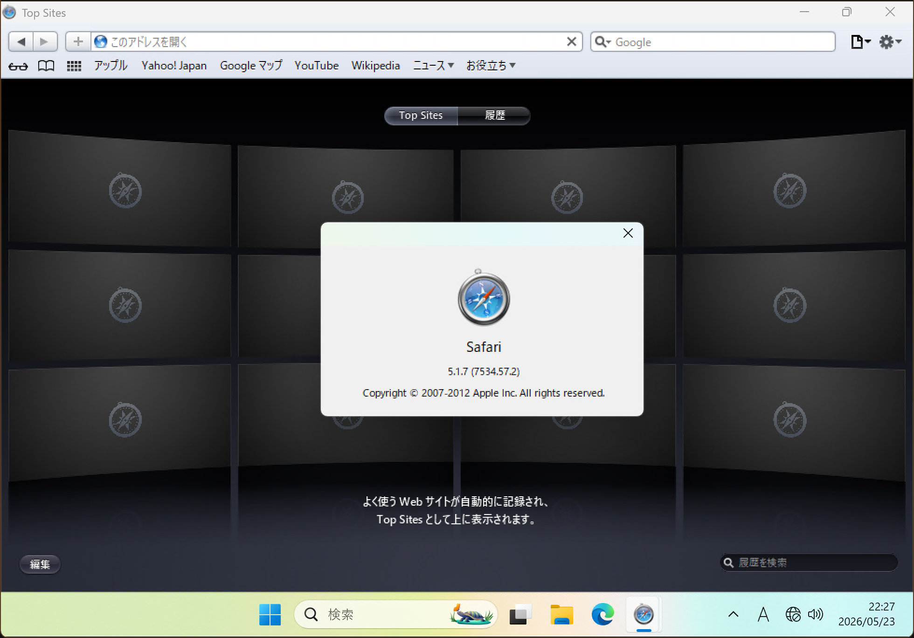
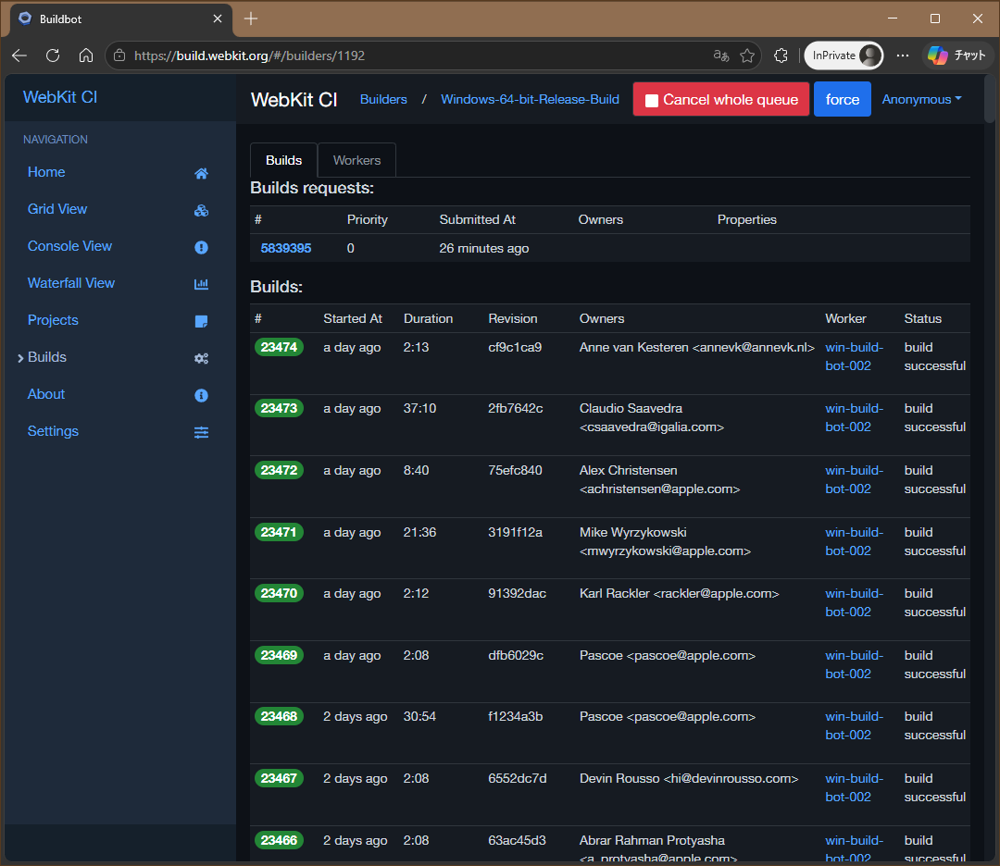
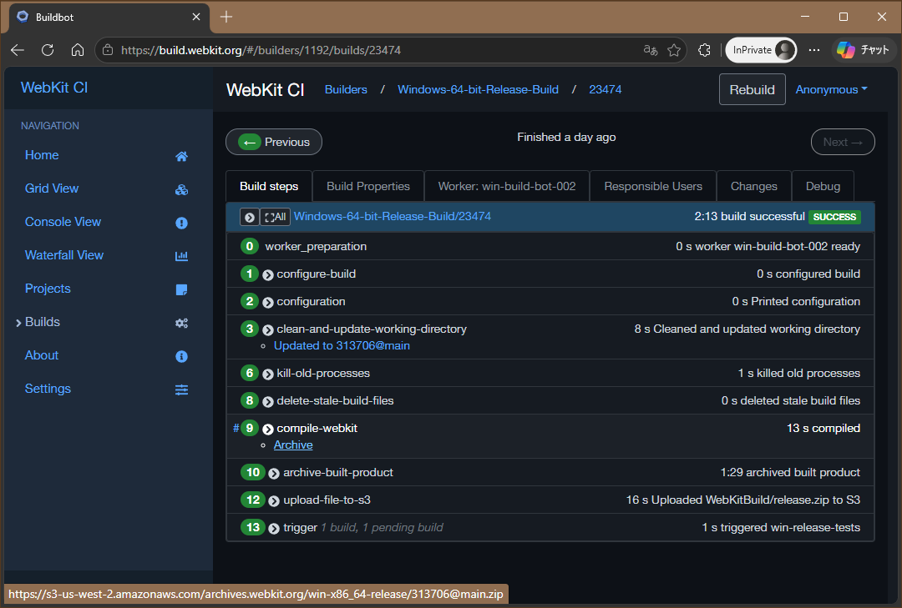
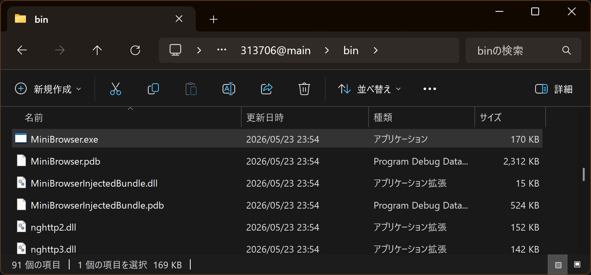
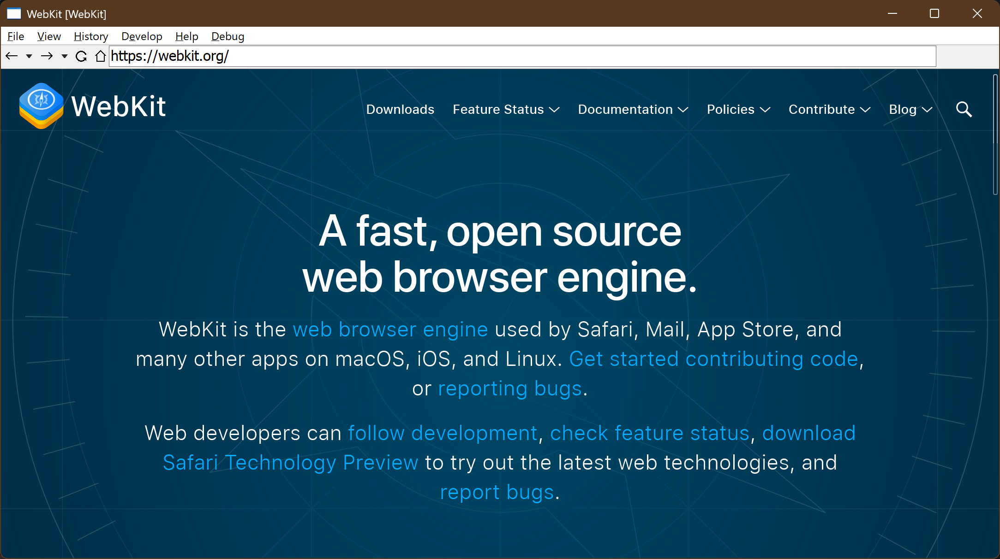
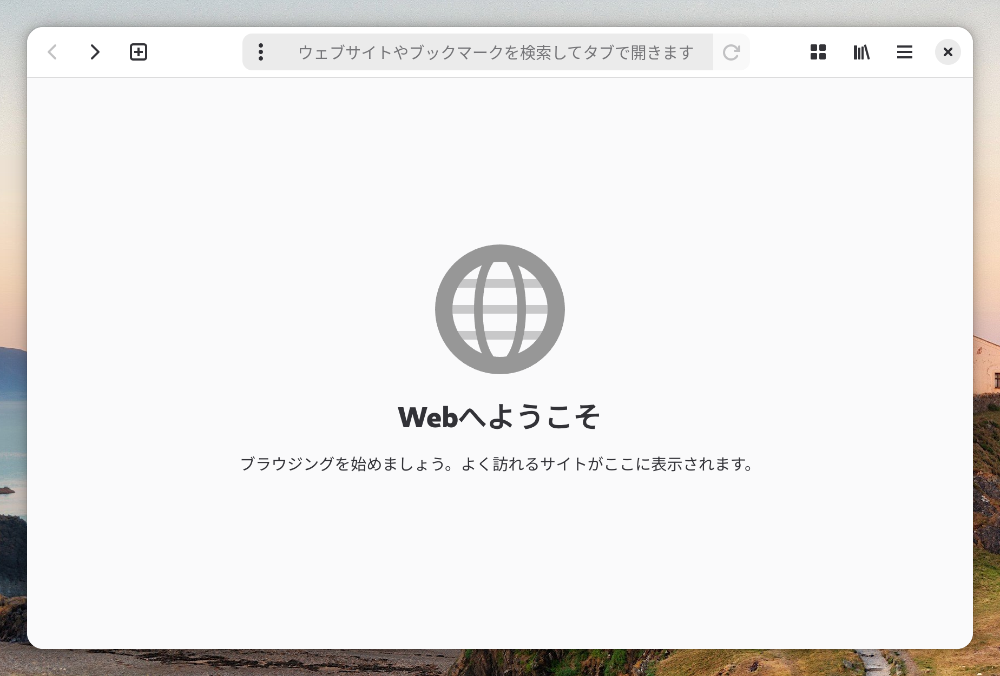
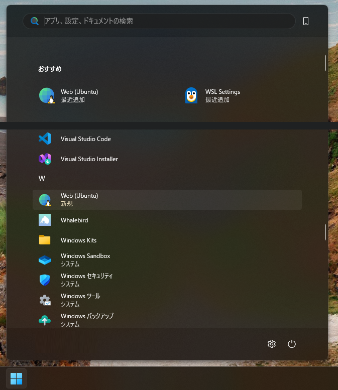
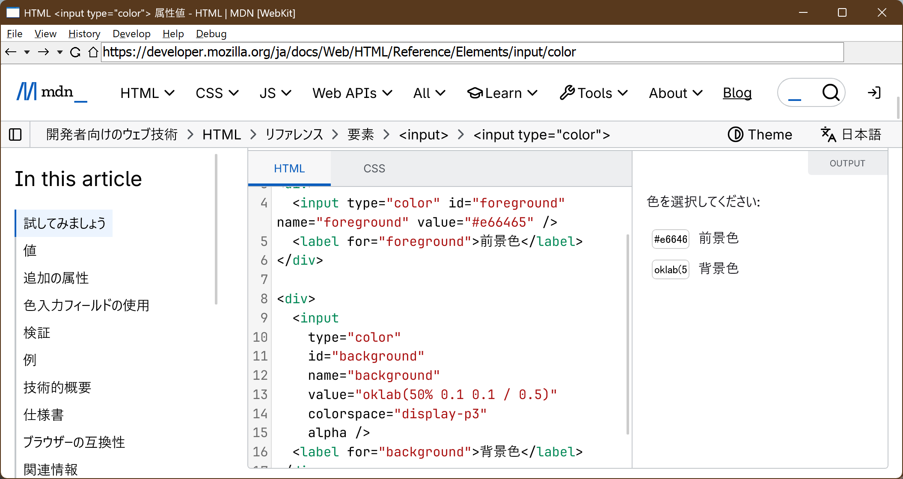
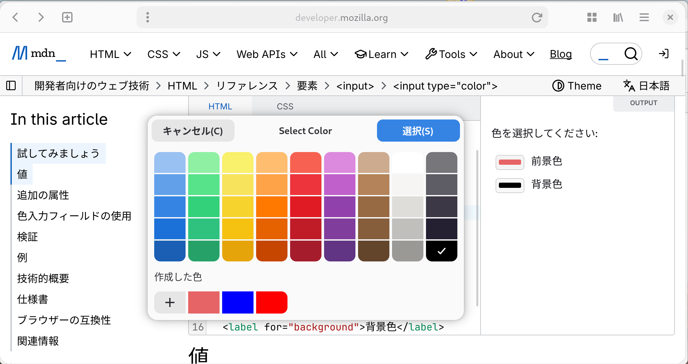
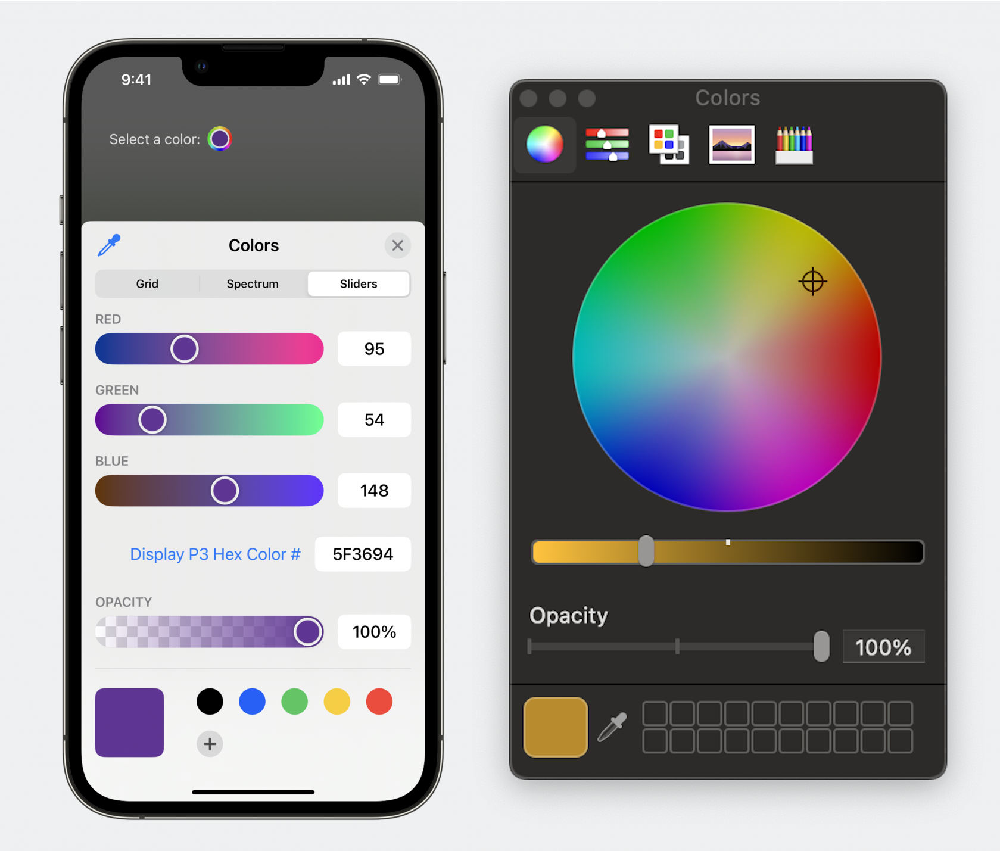

# Windows でも Safari の表示を確認、したくてもできないので WebKit で試す

Mac を持っていない人でも、Web サイトがデスクトップ用の [Safari](https://www.apple.com/jp/safari/) でどう見えるのか気になる事ってありますよね。

かつては Safari for Windows が提供されていましたが、2012 年 5 月 12 日リリースの 5.1.7 を以て終了となってしまいました。Safari for Windows は Windows 11 でも起動するものの、[リモートからローカルファイルを読み取り可能な脆弱性](https://jvndb.jvn.jp/ja/contents/2012/JVNDB-2012-000088.html)が報告されており、使用すべきではありません。そもそも 14 年前のバージョンでは表示を確認する用途としても不適当ですしね。

 [^1]

[^1]: 隔離環境上の Windows 11 で動作する Safari 5.1.7。Top Sites のデザインに当時の Apple テイストが感じられますね。

[EC2 の Mac インスタンス](https://aws.amazon.com/jp/ec2/instance-types/mac/) や [macincloud](https://www.macincloud.com/) で Safari を実行する方法もありますが、もっと気軽に、手元の Windows PC で確認する方法はないものでしょうか。

## WebKit の開発ビルドを Windows で実行してみる

[WebKit](https://webkit.org/) とは Safari のコアとなる HTML レンダリングエンジンです[^2]。Safari 本体とは異なり OSS で、[プロジェクトは GitHub でホストされています](https://github.com/WebKit/WebKit)。

このうち、[Windows ポート](https://docs.webkit.org/Ports/WindowsPort.html)は「Windows を使った WebKit の開発とテストを容易にする」[^3]もので、現在も本流リポジトリでメンテナンスが継続されています。

[^2]: 当初は Chrome (Chromium) も WebKit を採用していましたが、現在は WebKit をフォークした [Blink](https://www.chromium.org/blink/) に移行しています。

[^3]: <https://docs.webkit.org/Ports/Introduction.html>

Webkit には MiniBrowser と呼ばれるサンプルアプリが付属しています。WebKit CI の [Windows-64-bit-Release-Build](https://build.webkit.org/#/builders/1192) からビルド成果物をダウンロードし、MiniBrowser を実行してみましょう。

1. ビルド一覧から最新の成功ビルドのページを開く

    

2. `compile-webkit` ステップの `Archive` リンクからビルド成果物をダウンロードする

    

3. Zip を解凍し、`.\bin\MiniBrowser.exe` を実行する

    

4. MiniBrowser が表示されました！

    

ちなみに [Playwright](https://playwright.dev/docs/browsers#webkit) で WebKit を導入すると、`%LocalAppData%\ms-playwright\webkit-<\d+>` に WebKit が格納されます。こちらに同梱されている MiniBrowser を使用してもよいでしょう。

```powershell
npx playwright install webkit
```

MiniBrowser はあくまでサンプルアプリなので、セキュリティ対策が通常のブラウザ製品ほど万全ではない可能性があります。利用は動作確認程度に留め、信頼できるコンテンツのみを閲覧しましょう。

では、正式に製品として提供されている WebKit 搭載ブラウザを Windows で動かす方法はあるのでしょうか。

## GNOME Web (Epiphany) を Ubuntu on WSL2 で実行してみる

動きます。そう、[Epiphany](https://apps.gnome.org/ja/Epiphany/)ならね。

Epiphany は [GNOME](https://www.gnome.org/ja/) 向けのウェブブラウザです。WebKit の GTK ポートをレンダリングエンジンとして採用しています。[WebKit のドキュメント](https://docs.webkit.org/index.html#trying-the-latest) でも最新の WebKit を試せる環境として Safari TP と並んで Epiphany TP が紹介されています。WebKit を試す、という用途にはもってこいですね。

[WSLg](https://learn.microsoft.com/ja-jp/windows/wsl/tutorials/gui-apps) が有効な環境であれば、Epiphany を起動・表示することも簡単です。[Epiphany の README](https://gitlab.gnome.org/GNOME/epiphany/-/blob/main/README.md?ref_type=heads) に従い、Flathub から Ubuntu on WSL2 にインストールしてみましょう。

```bash
# Flatpak のインストール
sudo apt install flatpak

# Flathub レポジトリを Flatpak に追加する
sudo flatpak remote-add --if-not-exists flathub https://dl.flathub.org/repo/flathub.flatpakrepo

# Epiphany のインストール
sudo flatpak install flathub org.gnome.Epiphany

# Epiphany の起動
flatpak run org.gnome.Epiphany
```



WSLg で動作するアプリケーションは Windows のスタートメニューに登録されるので、こちらからも起動できます。



Epiphany は正式に提供されている製品なので、アップデートさえ怠らなければ常用も可能ですが、Windows ネイティブアプリほど軽快ではありません。あくまで WebKit の表示確認用に留めるのが賢明でしょう。

## Safari との表示差異について

ここまでご紹介してきた方法は、どちらも WebKit（Windows / GTK ポート）を搭載したブラウザを Windows で動作させる方法でした。WebKit はあくまでレンダリングエンジンであり、Safari そのものではありません。そのため、Safari（および macOS / iOS）が表示している UI 要素の確認には使用できません。

たとえば `<input type="color">` で表示される入力域やカラーピッカーがそれに該当します。MiniBrowser ではカラーピッカーが表示されず、Epiphany では [GTK のカラーピッカー](https://docs.gtk.org/gtk4/class.ColorChooserDialog.html)が表示されます。一方、Safari では macOS の、Safari for iOS では iOS のカラーピッカーが表示されます。`<input type="color" colorspace="display-p3" alpha>` とした場合にピッカー上でアルファの指定ができるのも Safari だけです。





 [^4] [^5]

[^4]: <https://webkit.org/blog/16900/p3-and-alpha-color-pickers/>

[^5]: <https://webkit.org/blog/16574/webkit-features-in-safari-18-4/>

UI 部品だけでなく、メディアの部分でも異なる可能性があります。[Playwright ドキュメントの WebKit 部分](https://playwright.dev/docs/browsers#webkit)では以下のように記載されています。

> プラットフォームによって大きく依存する特定の機能の利用可能性は、オペレーティングシステムによって異なる場合があります。例えば、利用可能なメディアコーデックはLinux、macOS、Windowsで大きく異なります。Linux上でWebKitを動かすのが通常最も手頃な選択肢ですが、Safariに最も近い体験を求めるなら、例えば動画再生を行う場合はMacでWebKitを使うべきです。

というわけで、「Windows でも Safari の表示を確認したい！」と考えても、本稿でご案内した方法は十分でないケースも少なくないでしょう。そんなときは素直に Mac を実機 or クラウドで手配することをお勧めします。

## 参考リンク

* [Running the Latest Safari WebKit on Windows - DEV Community](https://dev.to/dustinbrett/running-the-latest-safari-webkit-on-windows-33pb)
* [Windows で開発しているときに webkit ブラウザで表示確認をする](https://zenn.dev/sterashima78/articles/55f4231c116f6b)
* [Windows10/11上のWSL2/WSLg環境でWebKitをビルド、実行する](https://qiita.com/TakayukiToyoda/items/0835ef9458717efe9ab0)
* [Color Input Compared Cross-Browser • Chris LaChance](https://chrislachance.com/color-input-compared-cross-browser/)
* [The Color Input & The Color Picker – Frontend Masters Blog](https://frontendmasters.com/blog/the-color-input-the-color-picker/)
