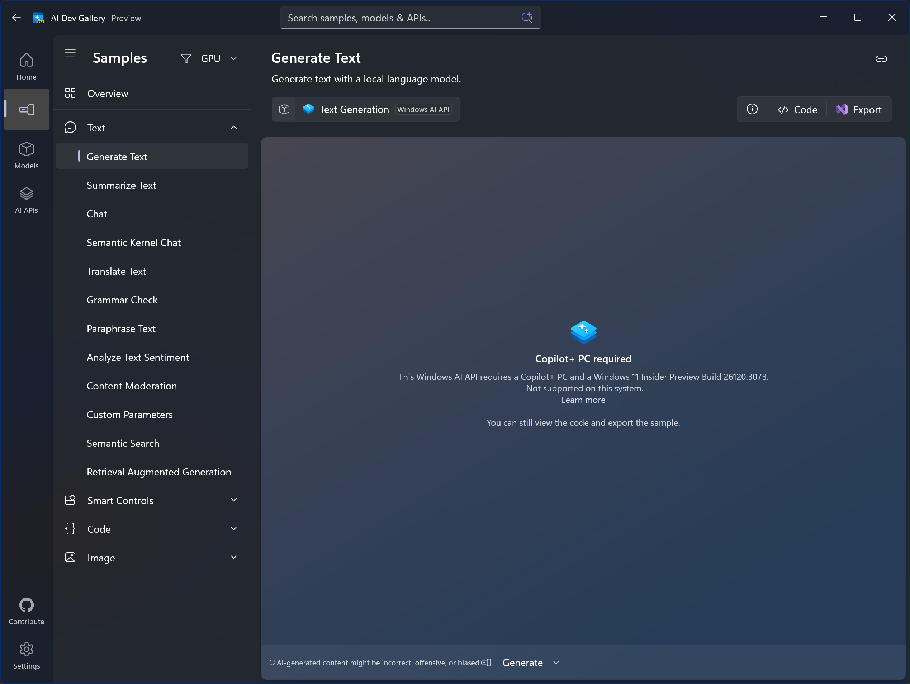
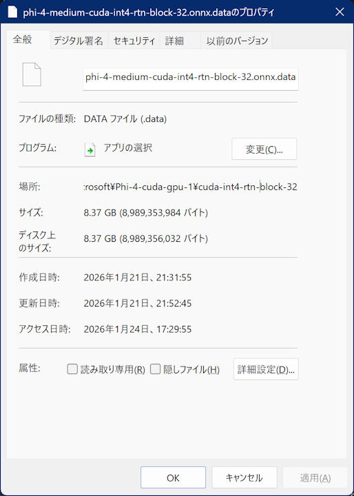

# Windows で手軽にローカル LLM をホストできる Foundry Local を PowerShell から叩いてみる

2025 年 11 月に開催された Microsoft Ignite 2025 で [Windows AI API](https://learn.microsoft.com/ja-jp/windows/ai/overview) の拡充が発表されました。

過去にも[ブラウザに内蔵された生成 AI を呼び出した](https://qiita.com/yokra9/items/a14e67cdee800b5e1611)り、[ブラウザ上で DeepSeek-R1 を動かした](https://qiita.com/yokra9/items/6d245b3460e5bfa13130)りした私としては色々試してみたいところだったのですが、重大な問題に直面しました。Windows AI API は Copilot+ PC が必要要件なのに、私の手元にはないのです。実際、[AI Dev Gallery](https://learn.microsoft.com/ja-jp/windows/ai/ai-dev-gallery/) でも `Copilot+ PC Required` と言われてしまい、Windows AI API の機能を試すことはできませんでした。



せっかく手軽に試せそうだったのにと悲嘆にくれていたところ、同年 5 月に開催された Microsoft Build 2025 で発表された [Foundry Local](https://learn.microsoft.com/ja-jp/azure/ai-foundry/foundry-local/what-is-foundry-local?view=foundry-classic) の存在を思い出したのです。というわけで、本記事は [2025 年、生成 AI を使ってみてどうだった？](https://qiita.com/official-events/df853677df3984f82556)のキャンペーンに寄せ、Foundry Local をPowerShell 経由で使ってみた様子をご紹介するものです。

## Windows におけるローカル LLM の選択肢

まず、Windows 上でローカル LLM を扱う Microsoft 提供の手段を比較してみます。

| 技術 | 特徴 | 実行環境 |
| --- | --- | --- |
| [Windows AI API](https://learn.microsoft.com/ja-jp/windows/ai/apis/) | Copilot+ PC に組み込まれた AI 機能を手軽に利用できる API。Windows App SDK / WinRT を通じて C#、C++、Rust 等から使用可能。 | NPU |
| [Foundry Local](https://learn.microsoft.com/ja-jp/windows/ai/foundry-local/get-started) | Microsoft がホストする ONNX モデルや任意の ONNX モデルを Windows PC 上で実行する CLI ツール。OpenAI 互換の REST API と、それと連携する Python、JavaScript、C# 向け SDK を提供。[^1] | CPU、GPU、 NPU |
| [Windows ML](https://learn.microsoft.com/ja-jp/windows/ai/new-windows-ml/overview) | 任意の ONNX モデルを Windows PC 上で実行するフレームワーク。Windows App SDK / WinRT を通じて C#、C++、Rust 等から使用可能。 | CPU、GPU、NPU |

[^1]: ただし、現在の C# 用 SDKは CLI ツールが提供する REST API に依存しない自己完結型です。

この中で Copilot+ PC を持っていない私が今すぐ手軽に試せるのは、やはり Foundry Local になりそうですね。[^2]

[^2]: ローカル LLM を導入したいだけなら [Ollama](https://github.com/ollama/ollama) が一般的ですが、今回はあえて Foundry Local を試してみます。

## Foundry Local の導入

インストールは `winget` でサクッと終わります。

```powershell
winget install Microsoft.FoundryLocal
```

インストールが完了したら、利用可能なモデルを確認してみましょう。

```powershell
foundry model ls
```

```log
🟢 Service is Started on http://127.0.0.1:57311/, PID 19816!
🕛 Downloading complete!...
Successfully downloaded and registered the following EPs: NvTensorRTRTXExecutionProvider, CUDAExecutionProvider.
Valid EPs: CPUExecutionProvider, WebGpuExecutionProvider, CUDAExecutionProvider
Alias                          Device     Task           File Size    License      Model ID
-----------------------------------------------------------------------------------------------
phi-4                          GPU        chat           8.37 GB      MIT          Phi-4-cuda-gpu:1
                               GPU        chat           8.37 GB      MIT          Phi-4-generic-gpu:1
                               CPU        chat           10.16 GB     MIT          Phi-4-generic-cpu:1
----------------------------------------------------------------------------------------------------------
...（後略）
```

私の環境では以下のモデルが利用可能でした。

* Phi
  * phi-4: 14B
  * phi-4-mini: 3.8B
  * phi-4-mini-reasoning: 3.8B
  * phi-3.5-mini: 3.8B
  * phi-3-mini-128k: 3.8B
  * phi-3-mini-4k: 3.8B
* Qwen
  * qwen2.5: 0.5B, 1.5B, 7B, 14B
  * qwen2.5-coder: 0.5B, 1.5B, 7B, 14B
* DeepSeek
  * deepseek-r1: 7B, 14B
* Mistral
  * mistral-7b-v0.2: 7B
* GPT-OSS
  * gpt-oss-20b: 20B

GPU が利用可能な環境であれば、`cuda` 版のモデルが選択できます。今回は `Phi-4-cuda-gpu:1` を使ってみることにしました。

## Foundry Local を対話モードで使用する

まずは CLI の対話モードで動作を確認します。

```powershell
foundry model run Phi-4-cuda-gpu:1
```

モデルの初回実行時には自動でダウンロードが開始され、完了すると入力待ちとなります。

```log
Downloading Phi-4-cuda-gpu:1...
[####################################] 100.00 % [Time remaining: about 0s]         6.9 MB/s
🕔 Loading model...
🟢 Model Phi-4-cuda-gpu:1 loaded successfully

Model Phi-4-cuda-gpu:1 was found in the local cache.

Interactive Chat. Enter /? or /help for help.
Press Ctrl+C to cancel generation. Type /exit to leave the chat.

Interactive mode, please enter your prompt
> こんにちはと鳴く犬、こんにチワワ
🧠 Thinking...
🤖 こんにちは！あなたのユーモラスな言及を楽しんでいます。「こんにちはと鳴く犬、こんにチワワ」は、チワワが「こんにちは」と言うときに、その愛らしい性格と特徴的な鳴き声を指しているようですね。チワワは、その小さなサイズと大きな性格で知られており、彼らの鳴き声はしばしば「ワンワン」というよりも「ワフワフ」という音に似ていると言われています。何か他に質問があれば、お気軽にどうぞ！
```

導入成功です！

ダウンロードしたモデルの保存先は CLI から確認できます。

```powershell
foundry cache location
```

```log
💾 Cache directory path: C:\Users\<ユーザー名>\.foundry\cache\models
```

`Phi-4-cuda-gpu:1` の場合、公称通り 8.37 GB ありました。



## Foundry Local を REST API として利用する

Foundry Local サービスは起動中 OpenAI API 互換のローカルサーバーを稼働しており、ステータスを確認するとポート番号が表示されます。

```powershell
foundry service status
```

```log
🟢 Model management service is running on http://127.0.0.1:49587/openai/status
EP autoregistration status: Successfully downloaded and registered the following EPs: NvTensorRTRTXExecutionProvider, CUDAExecutionProvider.
Valid EPs: CPUExecutionProvider, WebGpuExecutionProvider, CUDAExecutionProvider
```

この例では `http://127.0.0.1:52487` で待ち受けているようです。`curl.exe` でリクエストを投げ、レスポンスからメッセージ部分を取り出してみましょう。

```powershell
curl.exe -s http://127.0.0.1:52487/v1/chat/completions -H "Content-Type: application/json" -d '{ "model": "Phi-4-cuda-gpu:1", "messages": [{"role": "user", "content": "こんにちはと鳴く犬、こんにチワワ"}] }' | ConvertFrom-Json | % { $_.choices[0].message.content }
```

```log
こんにちは！あなたのユーモラスな言及を楽しんでいます。「こんにちはと鳴く犬、こんにチワワ」は、チワワが「こんにちは」と言うときに、その愛らしい性格と特徴的な鳴き声を指しているようですね。チワワは、その小さなサイズと大きな性格で知られており、彼らの鳴き声はしばしば「ワンワン」というよりも「ワフワフ」という音に似ていると言われています。何か他に質問があれば、お気軽にどうぞ！
```

さきほどと同じプロンプトを送信したところ、全く同じ応答が返ってきています。あくまで挙動からの推測ですが、Foundry Local では [Top K](https://docs.aws.amazon.com/ja_jp/bedrock/latest/userguide/inference-parameters.html) はデフォルトで `1` となっているようです。[^3] たとえば、`"top_k" : 2` と指定してやると生成 AI らしい揺らぎを持った回答になります。

[^3]: Temperature や Top P を調整しても挙動に影響せず、（[英語版ドキュメント](https://learn.microsoft.com/en-us/azure/ai-foundry/foundry-local/reference/reference-rest?view=foundry-classic)にはひっそり掲載されていた）Top K を調整したときのみ回答が変化しました。リソースに制約のあるローカル推論という性質上、トークンの絞り込みをデフォルトで強くしている可能性が考えられます。

```powershell
curl.exe -s http://127.0.0.1:49587/v1/chat/completions -H "Content-Type: application/json" -d '{ "model": "Phi-4-cuda-gpu:1", "top_k" : 2, "messages": [{"role": "user", "content": "こんにちはと鳴く犬、こんにチワワ"}] }' | ConvertFrom-Json | % { $_.choices[0].message.content 
```

```log
こんにちは！このフレーズは、犬が「こんにちは」と言うときの可愛らしさを表現しているようですね。特にチワワのような小さくて愛らしい犬種は、鳴き声が特徴的で、人々を楽しませます。チワワの「こんにちは」は、その小さくてかわいらしい姿と相まって、多くの人に愛されています。犬との触れ合いは、心を和ませる素晴らしい体験ですね。
```

```log
こんにちは、と鳴く犬は、その明るく元気な様子で、人々を温かく迎えます。特に、その声を特徴的な小さなチワワは、愛くるしい鳴き声で「こんにちわ」と挨拶するように聞こえます。この表現は、犬の愛らしさと、人間と動物との間の親しみやすい関係を象徴しているかもしれません。チワワのような犬は、そのサイズに反して、大きな個性と愛らしい性格を持ってお
```

## Foundry Local を PowerShell らしく呼び出す

REST API サーバーとして振る舞ってくれるなら、PowerShell からの呼び出しも容易に行えそうです。上記のように `curl.exe` の出力をパースしてもよいですし、`curl` = `Invoke-WebRequest` や `Invoke-RestMethod` を使用してもよいでしょう。

ただし、実用にあたってはいくつかの問題が考えられます。

* Foundry Local のポート番号が起動ごとに変わる
  * API を呼び出す前に `foundry service status` で現在の値を確認する必要があります。

  ```log
  PS C:\> foundry service start
  🟢 Service is Started on http://127.0.0.1:58238/, PID 32984!
  PS C:\> foundry service stop
  🔴 Service is stopped.
  PS C:\> foundry service start
  🟢 Service is Started on http://127.0.0.1:58241/, PID 30968!
  ```

* 会話履歴を引き継ぐのが手間
  * 前回の会話に追加で応答するには、リクエストの `messages` パラメータに会話履歴を含めておく必要があります。
  * これを PowerShell ライクな手法で実現できれば、他のコマンドレットとスマートに連携できます。

自動でポート番号を特定しつつ、会話履歴をパイプラインで入出力できる関数があれば便利になるでしょう。というわけで、実際に作ってみました。

```powershell:FoundryLocal.ps1
function Get-Completions {
    [CmdletBinding()]
    param (
        [Parameter(Mandatory = $true, Position = 0)]
        [string]$Message,

        [Parameter(Mandatory = $false, ValueFromPipeline = $true)]
        [System.Collections.ArrayList]$History,

        [Parameter(Mandatory = $false)]
        [string]$Model = "Phi-4-cuda-gpu:1",

        [Parameter(Mandatory = $false)]
        [Double]$Temperature = 0.8,

        [Parameter(Mandatory = $false)]
        [int]$TopK = 50,

        [Parameter(Mandatory = $false)]
        [Double]$TopP = 1,

        [Parameter(Mandatory = $false)]
        [int]$MaxCompletionTokens = 1000
    )

    # Foundry Local を見つける
    $status = foundry service status 2>&1 | Out-String
    if ($status -match "(http://127\.0\.0\.1:\d+)") {
        $baseUrl = $Matches[1]
    }
    else {
        Write-Error "Foundry Local サービスが見つかりませんでした。foundry service start でサービスを起動してください。"
        return
    }
    $apiUrl = "$baseUrl/v1/chat/completions"

    # 会話履歴の準備
    if ($null -eq $History) {
        $History = [System.Collections.ArrayList]::new()
    }

    $userMessage = @{ 
        role    = "user"
        content = $Message 
    }
    [void]$History.Add($userMessage)

    # Foundry Local にリクエスト
    $payload = @{
        model                 = $Model
        messages              = $History
        temperature           = $Temperature
        top_p                 = $TopP
        top_k                 = $TopK
        max_completion_tokens = $MaxCompletionTokens
    } | ConvertTo-Json -Depth 10

    try {
        $result = Invoke-RestMethod -Uri $apiUrl -Method Post -ContentType "application/json; charset=utf-8" -Body $payload
        
        $content = $result.choices[0].message.content

        $assistantMessage = @{ 
            role    = "assistant"
            content = $content
        }
        [void]$History.Add($assistantMessage)

        return , $History
    }
    catch {
        Write-Error "Foundry Local へのリクエスト中に例外が発生しました: $_"
    }
}
```

これで、PowerShell から手軽に Foundry Local を呼び出せるようになりました。

```powershell
. .\FoundryLocal.ps1

Get-Completions "チワワを使ったダジャレを一言で" | % { $_[-1].content }
```

```log
チワワになったら、小柄な問題になっちゃう！
```

会話履歴をパイプラインで引き回せるので、続けてメッセージを送信できます。

```powershell
Get-Completions "チワワを使ったダジャレを一言で"  | Get-Completions "そのおもしろさを解説して" | % { $_ | % { "[$($_.role)] $($_.content)" } }
```

```log
[user] チワワを使ったダジャレを一言で
[assistant] チワワっていいですね、あっちゅう間にかわいさが伝わります！
[user] そのおもしろさを解説して
[assistant] 「チワワっていいですね、あっちゅう間にかわいさが伝わります！」というダジャレのおもしろさは、いくつかの要素によって生まれています。
...（後略）
```

他コマンドレットとの連携もスマートに可能です。

```powershell:最新のエラーログを診断させる
Get-EventLog System -EntryType Error -n 1 | % { Get-Completions "このエラーの解決策を簡潔に教えて: $($_.Source) - $($_.Message)" } | % { $_[-1].content }
```

```log
エラー 0x80073d02 は、更新やプログラムをインストールできないことを示しており、通常はシステムファイルとの競合や権限の問題が原因です。この問題を解決するためには、以下のステップを実行してください：

### 解決策 1: 管理者として更新マネージャーを実行
1. **Windows Update Troubleshooter** を実行します:
   - **設定** > **更新とセキュリティ** > **トラブルシューティング** に移動します。
   - **Windows Update** トラブルシューティングを選択し、指示に従って実行します。
...（後略）
```

```powershell:クリップボードの中身を和訳
# Run AI models locally with the power of Microsoft's Azure AI technology.
Get-Clipboard | Out-String | % { Get-Completions "自然な日本語に翻訳して: $_" } | % { $_[-1].content }
```

```log
マイクロソフトのAzure AIテクノロジーの力を使って、ローカルでAIモデルを実行してください。
```

## まとめと感想

Copilot+ PC がなくても、Foundry Local を使って Windows 環境で簡単にローカル LLM サーバーを立てることができました。実用的には [Ollama](https://github.com/ollama/ollama) が一般的ですので、あえて Foundry Local を選ぶケースは少ないでしょうが、上記コードは他の OpenAI API 互換サーバーでも大半を流用できるはずです。PowerShell と LLM の接続するケースの参考になれば幸いです。

## 参考リンク

* [microsoft/Foundry-Local](https://github.com/microsoft/Foundry-Local)
* [ローカルAIを使用するMicrosoft Foundry on Windows | Microsoft Learn](https://learn.microsoft.com/ja-jp/windows/ai/overview)
* [Foundry Local REST API reference | Microsoft Learn](https://learn.microsoft.com/en-us/azure/ai-foundry/foundry-local/reference/reference-rest)
* [Foundry Local でローカルAI推論をやってみる](https://qiita.com/miyaura/items/903e2b4577611e6174ed)
