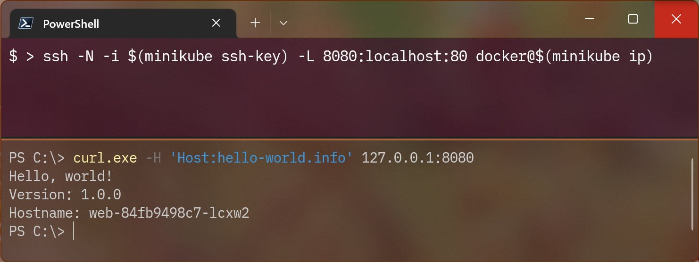
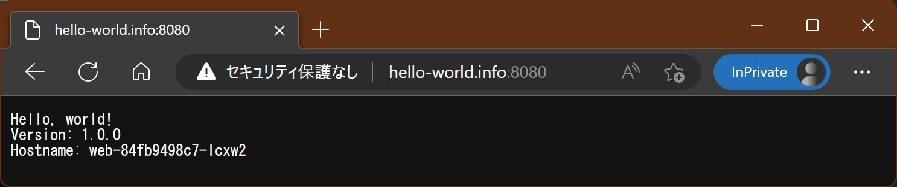

# minikube on docker on WSL2 の Ingress に Windows からアクセスする

minikube を使うと WSL2 上の docker 環境などをバックエンドとして開発用クラスタが構築できて便利ですよね。nginx Ingress コントローラーのセットアップだって簡単です：

```bash
# minikube クラスタを開始する
minikube start

# minikube クラスタで nginx Ingress コントローラーを有効化する
minikube addons enable ingress

# サンプルアプリと Ingress をデプロイする
kubectl create deployment web --image=gcr.io/google-samples/hello-app:1.0
kubectl expose deployment web --type=ClusterIP --port=8080
kubectl apply -f https://kubernetes.io/examples/service/networking/example-ingress.yaml

# ADDRESS 欄に IP アドレスが表示されるのを待つ
kubectl get ingress -w

#NAME              CLASS   HOSTS              ADDRESS   PORTS   AGE
#example-ingress   nginx   hello-world.info             80      5s
#example-ingress   nginx   hello-world.info   192.168.49.2   80      26s

# WSL2 内で Host ヘッダを指定してアクセスすると期待したレスポンスが表示される
curl -H 'Host:hello-world.info' http://192.168.49.2/
```

さて、Ingress は利用可能になりましたが、この状態では Windows 上のブラウザから表示できません。たとえば、NodePort なサービスをデプロイしている場合なら Windows 上のブラウザからでもアクセスできます。WSL2 のポート `N` がリッスンしている時にブラウザで `http://127.0.0.1:N` にアクセスすると、Windows が良しなに解釈して WSL2 側に通してくれるからです。しかし Ingress の場合、上記のように minukube machine を指す WSL2 上のローカル IP アドレス（`$(minikube ip)`）にアクセスしたいため勝手が違います。

## ポートフォワードで minikube machine にアクセスする

要は `$(minikube ip):80`（https の場合は `$(minikube ip):443`）を `127.0.0.1` にポートフォワードできればいいわけです。手段としては iptables でも何でもいいのですが、ここではお手軽（？）な SSH ポートフォワードを使ってみましょう：

```bash
# minikube machine の 80 番ポートを、WSL2 の 8080 番にローカルポートフォワードする
ssh -N -i $(minikube ssh-key) -L 8080:localhost:80 docker@$(minikube ip)

# 特権ポートの場合は sudo が必要
sudo ssh -N -i $(minikube ssh-key) -L 80:localhost:80 docker@$(minikube ip)
```



ブラウザの代わりに `curl.exe` でアクセスしましたが、問題なさそうですね。hosts ファイルを編集すれば、ブラウザからもアクセスできます：



## 参考リンク

* [Minikube上でNGINX Ingressコントローラーを使用してIngressをセットアップする](https://kubernetes.io/ja/docs/tasks/access-application-cluster/ingress-minikube/)
* [curlコマンドでHTTPヘッダを扱うレシピ](https://qiita.com/youcune/items/45271a32dccb7498033f)
* [iptablesを使ってWebサーバをポートフォワーディング](https://qiita.com/showchan33/items/407bde52c44d1d8e1a6d)
* [Linuxがほぼそのまま動くようになった「WSL2」のネットワーク機能](https://atmarkit.itmedia.co.jp/ait/articles/1909/09/news020.html)
* [WSL2 上のアプリケーションに別ホストからアクセスする方法（管理者権限なし）](https://qiita.com/yokra9/items/cc81b2869ec1e9bda950)
