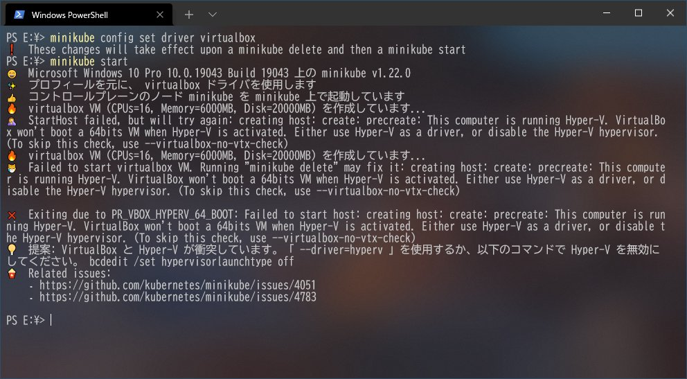
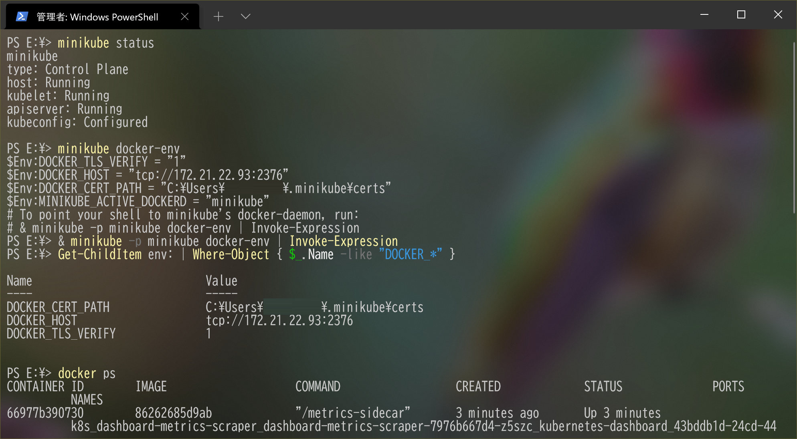

# minikube を利用して Docker と Kubernetes が入った開発環境を一発で構築する for Windows / Hyper-V

[既報](https://www.docker.com/blog/updating-product-subscriptions/)の通り、Docker Desktop が一部の条件を除き有償化されました。個人的には、これは長年に渡る Docker 開発の主導と無償提供でコミュニティを支えてくださった Docker 社にとって[当然の報酬・対価](https://qiita.com/e99h2121/items/088e25ab66535836c05c)だと感じます。

他方、商用の開発環境で Docker Desktop を利用していたユーザにとっては、予算の事情などで有償化されると利用が難しくなることもあるでしょう。

Docker Desktop for Windows には、GUI 管理ツールであると同時に、Docker と Kubernetes を一発で構築してくれる利点がありました。本記事では後者の代替ツールとして [minikube](https://minikube.sigs.k8s.io/) を利用する方法をご紹介します。

## おことわり: この手法の将来性について

[Kubernetes は v1.20 以降、コンテナランタイムとして Docker を非推奨としています](https://kubernetes.io/blog/2020/12/02/dont-panic-kubernetes-and-docker/)。Docker は CRI と呼ばれるコンテナランタイムの標準に準拠していないため、Kubernetes との通信に Dockershim と呼ばれる機構を利用していました。そして、Kubernetes v1.23 からは Dockershim が削除され、コンテナランタイムとして Docker を選択できなくなります。

[inductor](https://twitter.com/_inductor_) さんがコントリビュータである [Anders Björklund](https://github.com/afbjorklund) さんに確認したところ、minikube も来年には [containerd](https://containerd.io/) に切り替える予定だとされています。Docker ランタイムは残るとのコメントもありますが、本稿でご紹介するような使い方が使い続けられるかは不透明です。

<https://twitter.com/_inductor_/status/1435140614094348289>

inductor さん、貴重な情報のご提供ありがとうございました。

## minikube で導入した docker engine を Windows から呼び出す

衝突を避けるため、事前に Docker Desktop をアンインストールしてください。また、以降の作業では、Windows 用のパッケージマネージャである [chocolatey](https://community.chocolatey.org/) を利用しますので、未導入の方はインストールしてください。

まず、chocolatey で minikube と Docker CLI を導入します[^1]。

[^1]: chocolatey でインストールできる Docker CLI はコミュニティ版のバイナリです。公式のバイナリは[こちら](https://download.docker.com/win/static/stable/x86_64/)から取得できます。ただし、[ドキュメント](https://docs.docker.com/engine/install/binaries/) から Windows 版バイナリへの動線が削除されているため、今後も継続的に入手できるかは不明ですし、適用されるライセンスが明記されていません。なお、choco は[このレポジトリ](https://github.com/StefanScherer/docker-cli-builder) からバイナリを取得しており、リリースページからバイナリを手動ダウンロードできます。

```powershell
# 管理者権限が必要です
choco install minikube
choco install docker-cli
```

インストールが完了したら、 minikube に Kubernetes クラスタを作成させます。

```powershell
# 管理者権限が必要です
minikube start --vm-driver=hyperv
```

このとき、バックエンドとして Hyper-V のほかに VirtualBox や VMware Workstation が利用できます。[WHP により Hyper-V と他の仮想化ソフトウェアが共存できます](https://qiita.com/matarillo/items/ca1eecf8f9a3cd76f9ce#windows-%E3%83%8F%E3%82%A4%E3%83%91%E3%83%BC%E3%83%90%E3%82%A4%E3%82%B6%E3%83%BC-%E3%83%97%E3%83%A9%E3%83%83%E3%83%88%E3%83%95%E3%82%A9%E3%83%BC%E3%83%A0)が、minikube 側がエラーを吐くため Hyper-V ユーザは他のバックエンドを利用できません。



さて、Hyper-V 上にシングルノードなクラスタが構築できたら、 `minikube docker-env` で minikube が作成したバックエンドの情報を取得します。これらの情報を環境変数に設定すると、 Docker CLI がノード上の Docker Engine と通信できるようになります。



なお、現在の PowerShell セッション以外でも環境変数を維持したい場合は、ユーザ環境変数に保存しておきましょう。

```powershell
SETX DOCKER_TLS_VERIFY 1
SETX DOCKER_HOST tcp://192.168.1.55:2376
SETX DOCKER_CERT_PATH C:\Users\emanon\.minikube\certs
```

ここまで 30 分もかからないので、Docker Desktop 的オールインワン導入のお手軽さを実現できますね。

### （参考）WSL2 上の docker engine を Windows から呼び出す

WSL2 の場合も minikube と同様に TCP 経由の呼び出しを許可することで呼び出し可能となります：

```json:/etc/docker/daemon.json
{
  "hosts": [
          "tcp://localhost:2375",
          "unix:///var/run/docker.sock"
  ]
}
```

```powershell
SETX DOCKER_HOST tcp://localhost:2375
```

## Visual Studio Code の Dev Container で利用する

構築がお手軽な一方で、この環境を VS Code と連携させるには手間がかかるので、[素直に WSL2 上の docker を利用する](https://uncaughtexception.hatenablog.com/entry/2021/09/02/193132)ことをお勧めしますが、参考のために記述を残します。

minikube で構築したノード上で Dev Container を稼働させるため、VS Code の公式ドキュメントにある[リモートホスト上の docker を利用する方法](https://code.visualstudio.com/docs/remote/containers-advanced#_developing-inside-a-container-on-a-remote-docker-host)を利用します。

この際、Windows 上のワークスペースをコンテナから見られるようにしなければなりません。`minikube delete` で簡単に消えてしまう環境に大事なデータを置きたくありませんからね。

minikube では、ホストのディレクトリをノード上にマウントできます。事前に Hyper-V マネージャで外部仮想スイッチを作成し、以下のように指定します。

```powershell
# ノードの作成時にマウント
minikube start --vm-driver=hyperv --hyperv-virtual-switch=Minikube --mount-string="E:\workspace:/home/docker/workspace" --mount

# 後からマウント
minikube mount "E:\workspace:/home/docker/workspace"
```

ただし、実験してみた範囲だと、Windows からネットワーク越しにマウントしたディレクトリをコンテナへマウントすると、作業中にマウントが外れるなど安定して動作しませんでした[^2]。そのため、多段マウントではなく rsync を利用し手動で同期を取ってみます。

[^2]: いわゆる「おま環」の可能性はあります。

まず、rsync でノードと通信するため、秘密鍵の場所を確認します。

```powershell
minikube ssh-key
```

この秘密鍵のアクセス権限等を変更すると通常の動作に支障をきたすので、別の適当な場所にコピーします。以下のように、コピーした鍵ファイルで ssh ログインできれば問題ありません：

```powershell
ssh -i <秘密鍵の場所> docker@<DOCKER_HOST> 
```

続いて、chocolatey で [cwRsync](https://www.itefix.net/cwrsync) をインストールします。

```powershell
# 管理者権限が必要です
choco install rsync
```

cwRync で初回の同期を行います。

```powershell
rsync -av -e '/cygdrive/c/ProgramData/chocolatey/lib/rsync/tools/bin/ssh.exe -i <秘密鍵へのCygwinパス>' <同期元へのCygwinパス> docker@<DOCKER_HOST>:<同期先>

# 例）cygwin上で動作するため、パス指定時に意識が必要です。
rsync -av -e '/cygdrive/c/ProgramData/chocolatey/lib/rsync/tools/bin/ssh.exe -i /cygdrive/e/id_rsa' /cygdrive/e/workspace/ docker@192.168.1.58:~/workspace/
```

最後に VS Code で同期元のディレクトリを開き、`devcontainer.json` を編集します。Code が docker の `--mount` オプションに渡す値を指定し、同期先のディレクトリをマウントするように設定します。

```json:devcontainer.json
{
  "workspaceMount": "source=/home/docker/workspace/,target=/workspaces/,type=bind",
  "workspaceFolder": "/workspaces/"
}
```

この状態で `Reopen in Container` することで、Dev Container がノード上の docker で稼働します。

## 参考リンク

* [Minikube で無料で商用利用できる Docker 開発環境をつくる](https://zenn.dev/sasasin/articles/43a1b79a4cfdc1): Mac での事例です。この記事を書く動機となりました。
* [Developing inside a container on a remote Docker host](https://code.visualstudio.com/docs/remote/containers-advanced#_developing-inside-a-container-on-a-remote-docker-host)
* [VS Code Development Using Docker Containers on Remote Host](https://leimao.github.io/blog/VS-Code-Development-Remote-Host-Docker/)
