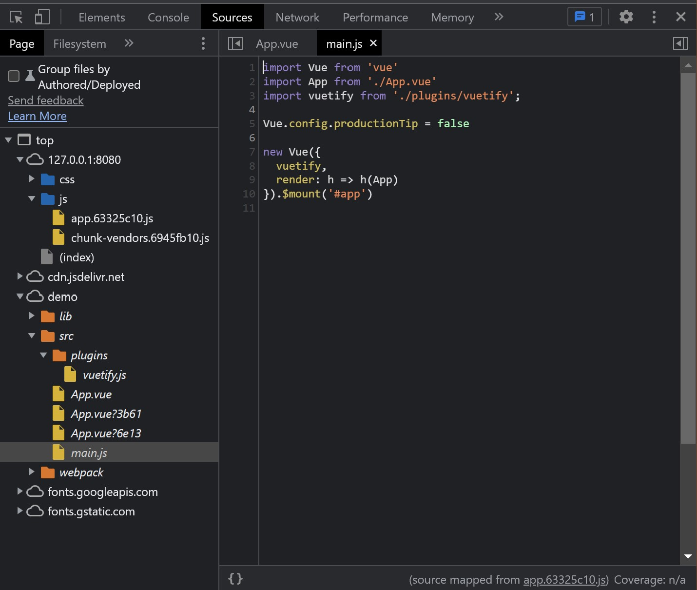

# えっ!? コンパイル済の JavaScript にも Source Map を適用する方法があるんですか!?

イマドキのフロントエンド開発だと、TypeScript からのトランスパイルや圧縮をかけられた「コンパイル済」の JavaScript が成果物となっている場合が多いのではないでしょうか。著名なフレームワークが TypeScript をサポートするようになったり、デフォルトのビルド設定で圧縮が適用されていたりするからです。

一方、[webpack-dev-server](https://webpack.js.org/configuration/dev-server/) などの開発用サーバを利用していると、ブラウザの開発者ツールがコンパイル前の状態（ソースコード・フォルダ構成）を認識していることに気が付きます。これは、開発用サーバが [Source Map](https://docs.google.com/document/d/1U1RGAehQwRypUTovF1KRlpiOFze0b-_2gc6fAH0KY0k/edit#) を自動生成し、ブラウザに参照させているためです。

プロダクションビルドの場合、意識的に設定しなければ Source Map を生成しない状態になっていると思われます[^1]。しかし、コンパイル済のコードのみがデプロイされている状況だと、本番環境でしか発生しない問題をブレークポイントを仕込んで確認したいときに困っちゃいますよね。もちろん、そんな必要がないようにすべきではありますが…。

[^1]: https://webpack.js.org/configuration/devtool/#production

## Source Map を生成する

何はともあれ、Source Map を生成しないと始まりません。Webpack の場合、`webpack.config.js` などのビルド設定ファイルに `devtool` を指定することで Source Map を生成できます：

```javascript
{
  // devtool: '[inline-|hidden-|eval-][nosources-][cheap-[module-]]source-map' | false
  devtool: 'hidden-source-map'
}
```

`hidden-*` の場合、成果物の末尾に `//@ sourceMappingURL=min.js.map` のような Source Map への参照が付与されません。参照先の Source Map が存在しないと開発者ツールが 404 を出してしまい煩雑ですので、今回の用途でお勧めです。詳しくは[公式のマニュアル](https://webpack.js.org/configuration/devtool/)を参照してください。

## コンパイル済の JavaScript が読込されている状態で Source Map を適用する

Chrome / Edge の場合、開発者ツールでローカルの Source Map を適用できるのですが、需要が少ないからなのか動線があまり分かりやすくありません。以下 Chrome のスクリーンショット付きで説明しますが、Edge の場合は各項目が日本語化されていますので幾分わかりやすいです。

1. 開発者ツールで `Sources` 画面を開き、サイドバーの `Pages` タブでコンパイル済の JavaScript を開きます。

    

2. ここが分かりにくいのですが、**ソースコードが表示されている部分**を右クリックして、コンテキストメニュー内の `Add source map…` をクリックします。

    

3. 表示された小窓に `Source map URL` を指定し、`Add` を押下します。このとき、`file:///` スキームでローカルのファイルも指定できます。

    

4. Source Map が読み込まれ、コンパイル前のソースが表示できました。当然、ブレークポイントの設定やステップ実行も可能です。

    

## 参考リンク

* [Source Map Revision 3 Proposal](https://docs.google.com/document/d/1U1RGAehQwRypUTovF1KRlpiOFze0b-_2gc6fAH0KY0k/edit)
* [SourceMap - HTTP | MDN](https://developer.mozilla.org/ja/docs/Web/HTTP/Headers/SourceMap)
* [Source maps: languages, tools and other info](https://github.com/ryanseddon/source-map/wiki/Source-maps:-languages,-tools-and-other-info)
