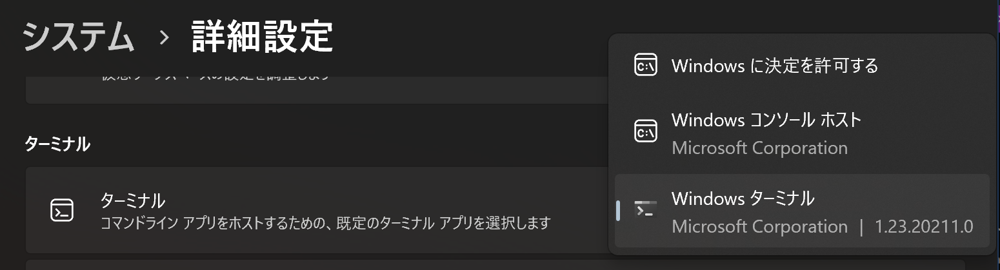
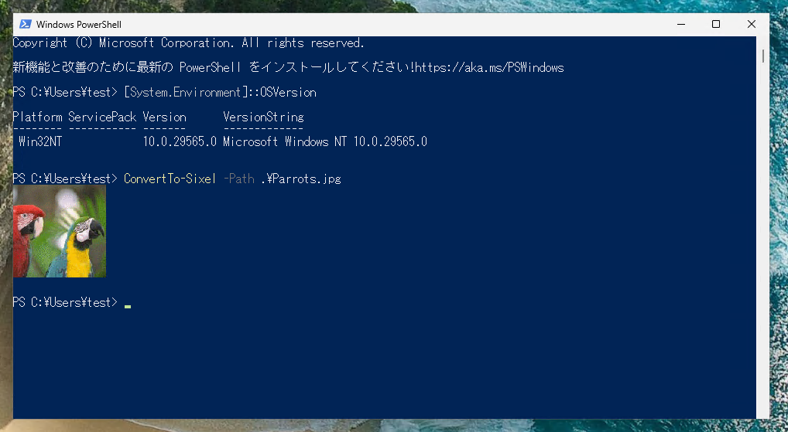
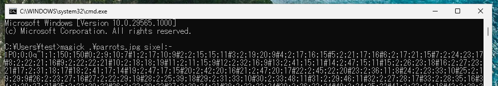
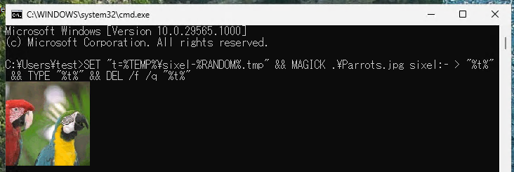
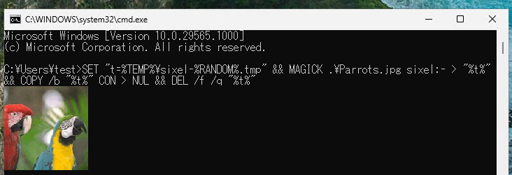
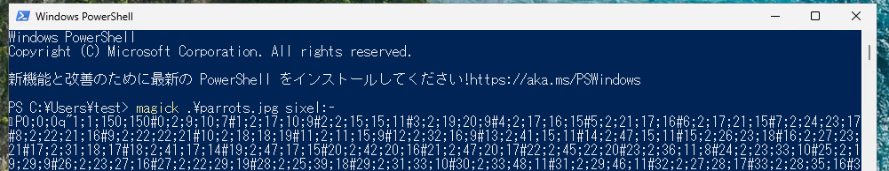
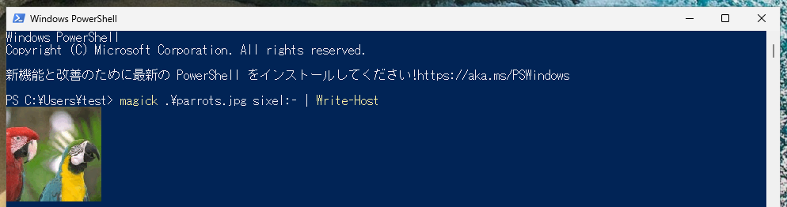

# コマンドラインでも画像を表示してみたい without Windows Terminal

[Windows Terminal 内で画像を表示してみたい without WSL](https://qiita.com/yokra9/items/14373111cc8ee765ff35) という記事を投稿したのが 2026 年 3 月 19 日。そのわずか 11 日後、Windows Blog にて以下のアップデートが[発表](https://blogs.windows.com/windows-insider/2026/03/30/announcing-windows-11-insider-preview-build-for-canary-channel-29558-1000/)されました。

> **What’s new in Canary Build 29558.1000**  
> [Command Line (Console Host) Improvements]  
> Graphical content: adds support for Sixel-based images.  

なんとタイムリーなことに、コンソールホストが Sixel 画像をサポートするというではありませんか。

というわけで、本記事は Windows 11 Insider Preview のコンソールホスト上の PowerShell / コマンドプロンプトで画像を表示する方法についてご紹介するものです。なお、Sixel 画像についての説明は[前回](https://qiita.com/yokra9/items/14373111cc8ee765ff35)投稿をご参照ください。

## コンソールホストって何だ？

コンソールホスト（`conhost.exe`）とはいわゆる「DOS 窓」のことです。PowerShell やコマンドプロンプトなどのコマンドラインアプリをホストする UI であり、Windows コンソール API のサーバでもあります。

Windows 11 22H2 からデフォルトのターミナルとして Windows Terminal が設定されていますが、従来のコンソールホストに切り替えることも可能です。



つまり、デフォルトのターミナルを Windows Terminal に設定していない場合でも PowerShell やコマンドプロンプトで Sixel 画像を表示できるようになる、ということですね。

## コンソールホスト上の PowerShell で画像を表示してみる

とは言っても、準備は Windows 11 Insider Preview の Canary Channel (執筆時点では `29565.1000` でした) の環境を用意するだけです。[^1] あとは前回同様、[Sixel モジュール](https://www.powershellgallery.com/packages/Sixel) を導入すれば Console Host 上の PowerShell で Sixel 画像が表示できます。

[^1]: 「だけ」ではありますが、Insider Preview は開発用の仮想化環境など、トラブルが発生しても問題ない環境に導入しましょう。Insider Preview の ISO は[ここ](https://www.microsoft.com/en-us/software-download/windowsinsiderpreviewiso)からダウンロード可能です。

```powershell
# PowerShell Gallery から Sixel モジュールを導入
Install-Module -Name Sixel -RequiredVersion 0.7.0

ConvertTo-Sixel -Path image.png
```



## コンソールホスト上のコマンドプロンプトで画像を表示してみる

コマンドプロンプトでは `ConvertTo-Sixel` は利用できませんので、[ImageMagick](https://imagemagick.org/) を `winget` でインストールしてみましょう。

```batchfile
REM winget で ImageMagick を導入
WINGET install ImageMagick.ImageMagick
```


[winget も Sixel をサポートするようになった](https://github.com/microsoft/winget-cli/pull/4828)ので、パッケージアイコンやプログレスバーが Sixel として表示されていますね。やはり、Windows 向けツールに Sixel 出力を取り込む場面も徐々に増えていきそうです。

さて、このまま前回同様 `magick <ファイル名> sixel:-` を叩くと、以下のように文字列として表示されてしまいます。コンソールへの出力時に変換が行われているようです。



ここで、Sixel を一時ファイルに保存した後、TYPE コマンドを使い無変換で表示する方法をとってみましょう。

```batchfile
SET "t=%TEMP%\sixel-%RANDOM%.tmp" && MAGICK .\image.png sixel:- > "%t%" && TYPE "%t%" && DEL /f /q "%t%"
```



無事表示されました。

`MAGICK .\image.png sixel:con` とすれば一時ファイルが不要にも思えますが[^2]、[blob.c/OpenBlob](https://github.com/ImageMagick/ImageMagick/blob/main/MagickCore/blob.c#L3310) で `UndefinedStream` としてエラーになります。

[^2]: `CON` はコンソールを表すデバイスファイルです。たとえば `COPY /b image.sixel CON > NUL` としても、同様に画像が表示されます。

```log
magick: unable to open image 'con': Invalid argument @ error/blob.c/OpenBlob/3710.
```

## （おまけ）コンソールホスト上の PowerShell で ImageMagick を使って画像を表示してみる

PowerShell から ImageMagick を呼び出した場合も同様の問題は発生しますが、`Write-Host` コマンドレットで簡単に対処可能です。

```powershell
magick .\image.png sixel:- | Write-Host
```





Windows Terminal でもコンソールホストでも、コマンドラインで画像を表示して友達や家族を怖がらせましょう！

## 参考リンク

* [Announcing Windows 11 Insider Preview Build for Canary Channel 29558.1000 | Windows Insider Blog](https://blogs.windows.com/windows-insider/2026/03/30/announcing-windows-11-insider-preview-build-for-canary-channel-29558-1000/)
* [Windows 11のコマンドラインが大刷新へ ～GPU描画エンジン、正規表現による検索など - 窓の杜](https://forest.watch.impress.co.jp/docs/news/insiderpre/2097859.html)
* [Windows コンソールとターミナルの定義 - Windows Console | Microsoft Learn](https://learn.microsoft.com/ja-jp/windows/console/definitions#console-host)
* [デバイスファイル - Wikipedia](https://ja.wikipedia.org/wiki/%E3%83%87%E3%83%90%E3%82%A4%E3%82%B9%E3%83%95%E3%82%A1%E3%82%A4%E3%83%AB)
