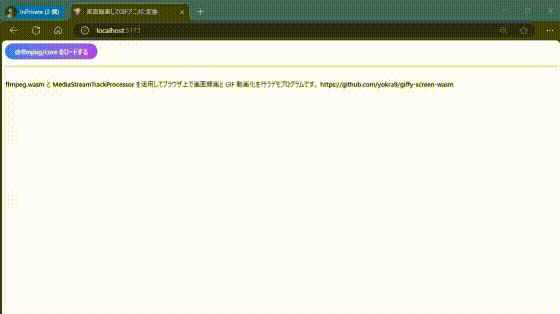
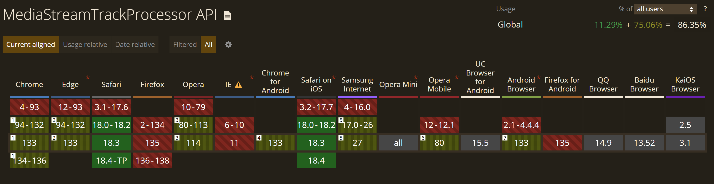

# ブラウザ上でも画面録画 & GIF 動画化してみたい 2025

気温の変化が激しい昨今、皆様はいかがお過ごしでしょうか。私は溢れ出る「ブラウザ上で画面を録画し、そのまま GIF 動画化してみたい!!」という欲求を抑えきれなかったので、[ffmpeg.wasm](https://github.com/ffmpegwasm/ffmpeg.wasm) を活用してそれらを行うデモを作ってみることにしました。以下に成果物の画面を録画した GIF 動画を掲載しますが、これも成果物自身で取得したものです：

 [^1]

[^1]: 表示している動画はおなじみ [Big Buck Bunny](https://en.wikipedia.org/wiki/Big_Buck_Bunny)です。

<https://yokra9.github.io/giffy-screen-wasm/>

なお、ソースコードは[こちらのリポジトリ](https://github.com/yokra9/giffy-screen-wasm)で公開中です。

## 先行事例との差異

ffmpeg.wasm を活用してブラウザ上で画面録画したい、GIF 動画化したいという欲求は人類に遍く存在するようで、パッと探しただけでも容易に日本語事例がヒットします。技術ブログを執筆する上で画面録画の GIF 動画を挿入したいことはよくありますから、当然といえば当然といえるでしょう。

* [ffmpeg.wasmを使ってブラウザ上で画面録画機能を実装した話](https://zenn.dev/wok/articles/0009_ffmpeg-wasm-screen-recorder)
* [ffmpeg.wasm を使ってGIF動画を作れるWebアプリを作って遊んでみた](https://zenn.dev/mryhryki/articles/2020-12-18-ffmepg-wasm)

それぞれ 2021 年の事例となっていまして、4 年も経てば新しいアプローチがとれる箇所もあるだろう、と調査したのが本記事執筆の直接的な動機となります。

### MediaStreamTrackProcessor でキャンバスにディスプレイの内容を表示する

で、実際に新しいアプローチができる箇所を見つけました。それが [MediaStreamTrackProcessor API](https://developer.mozilla.org/en-US/docs/Web/API/MediaStreamTrackProcessor) です。

これは [MediaStreamTrack Insertable Media Processing using Streams](https://www.w3.org/TR/mediacapture-transform/) として公開されている W3C ワーキングドラフトの一部です。Editor's Draft は [w3c/mediacapture-transform](https://github.com/w3c/mediacapture-transform) にあります。[Can I use](https://caniuse.com/mdn-api_mediastreamtrackprocessor) を見ると、Firefox ではサポートされていないものの、86.35 ％ と結構普及している雰囲気です。



MediaStreamTrackProcessor は [MediaStreamTrack](https://developer.mozilla.org/ja/docs/Web/API/MediaStreamTrack) から [VideoFrame](https://developer.mozilla.org/ja/docs/Web/API/VideoFrame) のストリームを生成できるようにしてくれます。ディスプレイの内容は [MediaStream](https://developer.mozilla.org/ja/docs/Web/API/MediaStream) として取得できますが、その MediaStreamTrack からは VideoFrame のストリームを生成できます。Canvas には VideoFrame を描画できるので、これでディスプレイの内容をキャンバスに表示できるというわけです。今回のデモでは TypeScript + React を使用しますので、以下のような書き方ができます[^2]：

[^2]: ffmpeg.wasm を使用すればフロントエンドで完結するので、next.js は使用していません。[create-react-app が deprecated になった](https://github.com/facebook/create-react-app/pull/17003)ので、`npm create vite@latest` でプロジェクトを作成しました。シンプルな構成が好きな筆者としては寂しいこの頃です。

```typescript
const canvasRef = useRef<HTMLCanvasElement>(null);
const inputStreamRef = useRef<MediaStream>(null);

/**
 * キャンバスに ReadableStreamDefaultReader の内容を表示する関数
 */
const readChunk = useCallback(
  async (
    ctx: CanvasRenderingContext2D | null,
    reader: ReadableStreamDefaultReader<VideoFrame>
  ) => {
    const canvas = canvasRef.current;
    if (canvas === null) return;
    if (ctx === null) return;

    const { done, value } = await reader.read();

    if (value === undefined) return;

    ctx.clearRect(0, 0, canvas.width, canvas.height);
    ctx.drawImage(
      value,
      0,
      0,
      value.displayWidth,
      value.displayHeight,
      destX,
      destY,
      value.displayWidth * scale,
      value.displayHeight * scale
    );

    value.close();

    if (!done) {
      await readChunk(ctx, reader);
    }
  },
  [destX, destY, scale]
);

/**
 * 画面選択するときのハンドラ
 */
const selectHandler = useCallback(async () => {
  if (canvasRef.current === null) return;

  // ディスプレイの内容を MediaStream として取得して inputStreamRef に設定
  inputStreamRef.current = await navigator.mediaDevices.getDisplayMedia({
    video: {
      displaySurface: "window",
    },
    audio: false,
  });

  // キャンバスに inputStreamRef から取得した映像を表示する
  const canvas = canvasRef.current;
  const ctx = canvas.getContext("2d");
  const track = inputStreamRef.current.getVideoTracks()[0];
  const processor = new MediaStreamTrackProcessor({ track });
  const reader = processor.readable.getReader();
  await readChunk(ctx, reader);
}, [readChunk]);
```

MediaStreamTrackProcessor がなかった頃は、一度ディスプレイの内容を Video 要素に表示してから、その内容をキャンバスに描画する必要があったようです。ずいぶん処理の流れがすっきりしましたね。

### TypeScript でも MediaStreamTrackProcessor を使用したい

ところで、上記のコードのままだと TypeScript から `TS2304: Cannot find name 'MediaStreamTrackProcessor'` と怒られコンパイルできません。これは、TypeScript に MediaStreamTrackProcessor の型定義が含まれていないためです。[#56353 Add support for MediaStreamTrackProcessor](https://github.com/microsoft/TypeScript/issues/56353) という Issue が立ったものの、2023 年に却下されたまま現在も未実装となっています。

この型定義情報を補うものとして、[@types/dom-mediacapture-transform](https://www.npmjs.com/package/@types/dom-mediacapture-transform) が公開されています。ドラフトのリポジトリ名と同様でわかりやすい命名ですね。

## 参考リンク

* [ffmpegwasm/ffmpeg.wasm](https://github.com/ffmpegwasm/ffmpeg.wasm)
* [ffmpeg.wasm](https://ffmpegwasm.netlify.app/)
* [ffmpeg.wasm を使ってGIF動画を作れるWebアプリを作って遊んでみた](https://zenn.dev/mryhryki/articles/2020-12-18-ffmepg-wasm)
* [ffmpeg.wasmを使ってブラウザ上で画面録画機能を実装した話](https://zenn.dev/wok/articles/0009_ffmpeg-wasm-screen-recorder)
* [MediaDevices: getDisplayMedia() メソッド - Web API | MDN](https://developer.mozilla.org/ja/docs/Web/API/MediaDevices/getDisplayMedia)
* [MediaStreamTrackProcessor - Web APIs | MDN](https://developer.mozilla.org/en-US/docs/Web/API/MediaStreamTrackProcessor)
* [WebCodecs による動画処理  |  Web Platform  |  Chrome for Developers](https://developer.chrome.com/docs/web-platform/best-practices/webcodecs?hl=ja)
* [Is it possible to add a stream as source to an html canvas element as to a html video element? - Stack Overflow](https://stackoverflow.com/questions/56093061/is-it-possible-to-add-a-stream-as-source-to-an-html-canvas-element-as-to-a-html)
* [MediaStreamTrackProcessor API | Can I use... Support tables for HTML5, CSS3, etc](https://caniuse.com/mdn-api_mediastreamtrackprocessor)
* [MediaStreamTrack Insertable Media Processing using Streams](https://www.w3.org/TR/mediacapture-transform/)
* [w3c/mediacapture-transform: MediaStreamTrack Insertable Media Processing using Streams](https://github.com/w3c/mediacapture-transform)
* [Add support for MediaStreamTrackProcessor · Issue #56353 · microsoft/TypeScript](https://github.com/microsoft/TypeScript/issues/56353)
* [Cannot find name "MediaStreamTrackProcessor" "MediaStreamTrackGenerator" というエラーがでて困った時の対処方法](https://qiita.com/generosennin/items/24bdfc2e4c55cefd1bb7)
