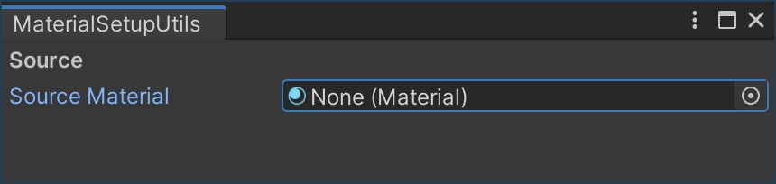
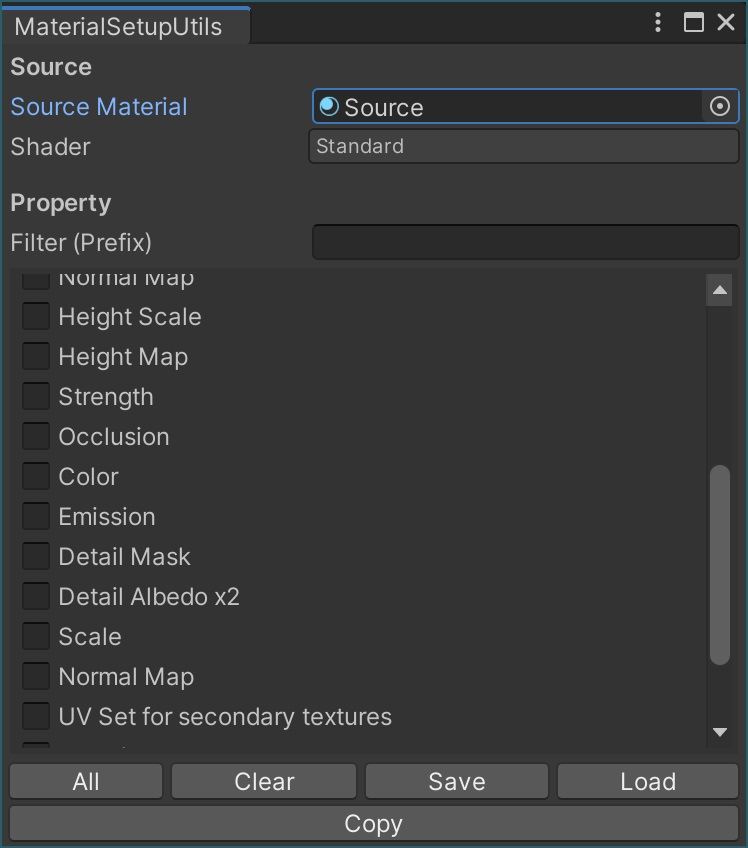
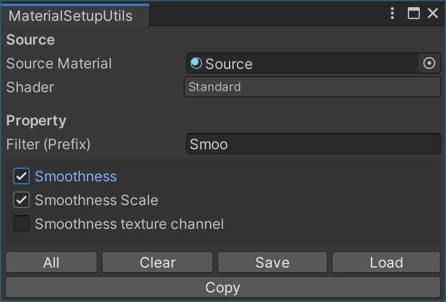
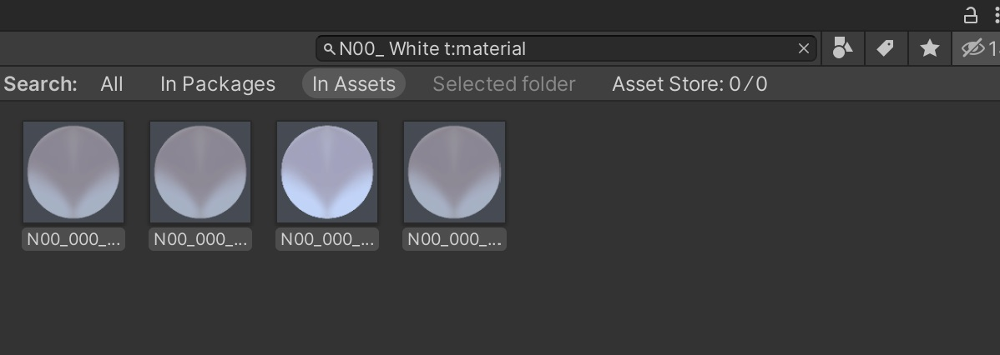

# マテリアル設定を一括コピーして VRoid で生成した VRChat 用アバターのマテリアル再設定を自動化する

私は [VRMConverterForVRChat](https://qiita.com/100/items/7315fe3a7eb75732ae43) を利用して VRoid で生成した VRM 形式のアバターを VRChat に持ち込んでいます。

[VRoidAvatarSetupUtils](https://qiita.com/jirko/items/7f1aaee574675273bc39) を併用すれば VRCSDK パラメータの再設定[^1]やオブジェクトのコピーが自動化できて便利です。それでも、シェーダの変更やシェーダプロパティといったマテリアルの設定は手動で行う必要があります。インポートのたびに繰り返すのは面倒ですよね。

[^1]: [Playable Layers と Expressions をコピーする機能を追加したフォーク版](https://github.com/yokra9/VRoidAvatarSetupUtils/releases)を公開しています。

というわけで、ソースとして指定したマテリアルの設定を取得して複数のマテリアルに一括で適用するツールを作成してみました。

## MaterialSetupUtils の導入方法

1. [Booth](https://yokra.booth.pm/items/3588840) もしくは [GitHub](https://github.com/yokra9/MaterialSetupUtils/releases) から取得した Zip ファイルを展開 (解凍) します。
2. `.unitypackage` ファイルを、Assets にドラッグ&ドロップします。

## MaterialSetupUtils の使い方

1. メニューバーで `[Tools]` - `[MaterialSetupUtils]` を開きます。
   

2. `Source Material` としてパラメータをコピーしたいマテリアルを指定します。
   

3. コピーしたいシェーダプロパティにチェックを入れます。`Filter (Prefix)` でプロパティをフィルタできます（前方一致、大文字と小文字を区別）。また、画面下部でチェックの一括設定やで保存・読込ができます。
   

4. Assets でコピー対象のマテリアルを選択します（複数選択可）。このとき、検索機能で対象を絞り込んだり、`★`で検索条件を保存しておくと便利です。
   

5. 画面下部の `Copy` を押下すると、選択中のマテリアルに対してプロパティのコピー処理が実行されます。

## 不具合報告

[GitHub の Issue](https://github.com/yokra9/MaterialSetupUtils/issues) もしくは [私の Twitter アカウント](https://twitter.com/yokra9)までお気軽にご連絡ください。

## 参考リンク

- [VRM から VRChat へアップロードする流れ](https://qiita.com/100/items/7315fe3a7eb75732ae43)
- [VRoid から生成した VRChat 用アバターのパラメータ再設定（DynamicBone 含む）を自動で行う](https://qiita.com/jirko/items/7f1aaee574675273bc39)
- [Material の Shader プロパティーを表示　その 1（Editor 拡張）](https://karanokan.info/2020/10/22/post-5625/)
- [UnityEngine.Material](https://docs.unity3d.com/ja/2019.4/ScriptReference/Material.html)
- [UnityEngine.Shader](https://docs.unity3d.com/ja/2019.4/ScriptReference/Shader.html)
