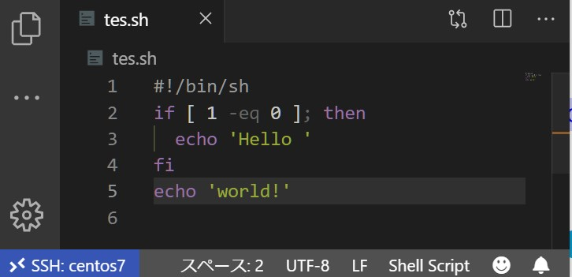
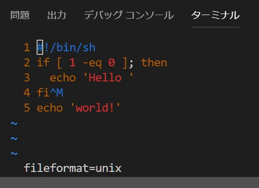

# 絶対に動くはずのシェルスクリプトを実行して「予期しないファイル終了（EOF）」とか「sh: 0: Can't open」とか怒られたときによむページ

## TL;DR

シェルスクリプトを書くときは必ず改行コードを `LF` に統一して保存しようね！

## シェルスクリプトを実行したら `予期しないファイル終了（EOF）` とか `sh: 0: Can't open` とか怒られた

ある昼下がりのことでした。



この画像ほどではないにせよ、同じくらいに何の変哲もないスクリプトを実行したのですが、

```console
./tes.sh: 行 6: 構文エラー: 予期しないファイル終了 (EOF) です
```

……と、なぜか怒られてしまいました。UTF-8だし、改行コードはLFだし、どこに問題があるというのでしょう。vim で確認してみましょう。



改行コードは `unix`（= `LF`）で間違いないようです。4行目の行末に `^M` と表示されていますが、これは `CR` を表す制御コードです。4行目末だけ、なぜか `CRLF` で改行されていることがわかります（いや本当になぜ？）

## なぜ「予期しないファイル終了」なのか

通常、同様のミスを犯していた場合、このようなわかりやすいエラーメッセージが表示されます。

```console
./tes.sh: 行 4: $'\r': コマンドが見つかりません
```

`\r`（= `CR`）をコマンドだと解釈してしまうためです。


一方、`予期しないファイル終了 (EOF) です` は、 `if ~ fi` ブロックが閉じられていないときなど、シェルスクリプトに構文エラーがあることを知らせるエラーメッセージです。 今回は `fi` の直後に `CR` が挿入されていたため、`if ~ fi` ブロックが壊れてしまっていたようですね。

## 参考リンク

* <https://qiita.com/bezeklik/items/aca37ffb127821311d6b>
* <https://code-examples.net/ja/q/612542>
